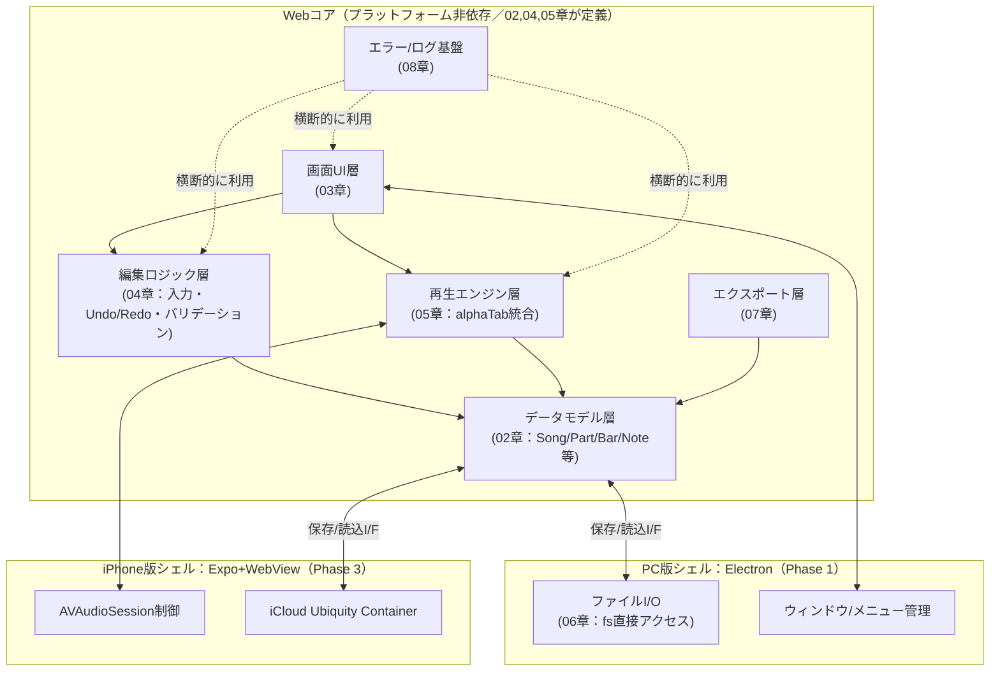

# RiFF-LiNE — 耳コピ用タブ譜作成アプリ 基本設計書 総論

- **作成日**：2026-08-30（初版）
- **ステータス**：**確定（基本設計フェーズ完了、2026-08-31）**。要件定義書v1（2026-08-27改訂、2026-08-31時点でPhase 6追加等の追補あり）を正とする。完了基準チェックの詳細は[[12_traceability.md#5]]参照。**2026-09-01より詳細設計フェーズに着手**（[[15_development_process.md#1.2]]、`detailed_design/`フォルダ）。**2026-09-02、Phase 1（PC版MVP）の全8作業パッケージの詳細設計が完了**（0.9節）。**同日、基本設計とのトレーサビリティ・内容矛盾を対象とした別視点セルフレビューを実施し、是正済み**（0.10節）。**同日、Phase 2（エクスポート・印刷）の詳細設計が完了**（0.11節）。**同日、全27文書の再点検、および本人の指摘を受けたPhase 3着手前提の再検証を実施**（0.12節）。**同日、本人の指摘を受けたバージョニング方針の是正を実施**（0.13節）。**同日、[[15_development_process.md]]に設計思想の説明を加筆する再整理を実施**（0.14節）。**同日、本人の指摘を受け、同書から「一人・隙間時間開発に耐える軽さ」という考え方を撤回する是正を実施**（0.15節）。**同日、品質はKPIで一元管理する方針へ移行し、[[11_test_strategy.md]]に品質KPI一覧を新設**（0.16節）。
- **入力文書**：`tab_app_requirements.md`（要件定義書）
- **対象読者**：本人（開発者兼利用者）、および実装支援を行うClaude Code

---

## 0. 基本設計フェーズの完了について（2026-08-31）

[[12_traceability.md#5]]の完了基準チェックリストに基づき、本基本設計フェーズを完了とする。残っている項目は未決事項#3（iCloud Drive／Google Driveの実機でのfsアクセス検証）のみであり、これは要件定義書9章Phase 0で当初から「PC実機での技術検証」と位置づけられていた項目のため、基本設計の完了条件には含めない（Phase 0着手時に検証する）。

以降の工程はV字モデル（[[15_development_process.md#1.1]]）に従い、作業パッケージ単位の**詳細設計**フェーズへ進む。作業パッケージの実施順序は[[13_design_decision_points.md#3]]B11で確定済み（Webコア基盤構築→データモデル・永続化→エラー/ログ基盤→タブ譜編集コア→パート・チューニング管理→表示モード→再生エンジン統合→画面群・ナビゲーション）。詳細設計書は`detailed_design/<作業パッケージの英語スラッグ>.md`として、着手する作業パッケージごとに順次作成する（[[15_development_process.md#1.2]]）。

**0.1 詳細設計フェーズの進捗（2026-09-01更新）**：第1回「Webコア基盤構築」に着手し、[[../detailed_design/web-core-foundation.md]]を作成した。着手にあたり、実機を要さない範囲でalphaTab公式ドキュメントを調査し、[[13_design_decision_points.md#2]]のカテゴリA未検証事項のうちA1（部分解決）・A2・A3を解決した（詳細は同書、および[[02_data_model.md#3.2]]・[[07_export_print.md#1]]・[[11_test_strategy.md#3]]・[[01_architecture.md#7]]の改訂箇所を参照）。

**0.2 詳細設計フェーズの進捗（2026-09-02更新）**：第2回「データモデル・永続化」に着手し、[[../detailed_design/data-model-persistence.md]]を作成した。あわせて、詳細設計の過程で判明した[[02_data_model.md]]の軽微な誤記（`schemaVersion`の型がER図でintと表記されていた点、4.2節の定義=stringに統一）を修正した。

**0.3 詳細設計フェーズの進捗（2026-09-02更新）**：第3回「エラー・ログ基盤」（Sサイズ2件を合わせて実施）に着手し、[[../detailed_design/error-logging-foundation.md]]を作成した。前2パッケージが暫定処理としていたエラーハンドリング箇所を`NotificationCenter`経由に置き換える方針も本書で確定し、[[08_error_logging.md]]に参照を追記した。

**0.4 詳細設計フェーズの進捗（2026-09-02更新）**：第4回「タブ譜編集コア」（XLサイズ、サブ機能単位に分割せず単一の詳細設計書として作成する方針とした）に着手し、[[../detailed_design/editing-core.md]]を作成した。[[13_design_decision_points.md#2]]A1の残課題だった「安全な変更操作の切り分け」を解決し（コマンド実行のたびに対象トラックのみ一律再描画する方式に確定）、新たに性能検証待ちのA8を追加した。また、`CommandHistory`のスコープに関する既存記述の誤り（「アプリ全体で1つ」→正しくは「編集ウィンドウ（曲）ごとに1つ」）を発見し[[04_editing_core.md#8.2]]を修正した。

**0.5 詳細設計フェーズの進捗（2026-09-02更新）**：第5回「パート・チューニング管理」に着手し、[[../detailed_design/part-tuning-management.md]]を作成した。チューニングプリセット適用時の弦数同期ロジック（B15）、カポの数値範囲0〜12（B14）を新たに確定し、`ValidationService`へパート数上限（8）の非破壊拡張（`EDIT-005`〜`EDIT-007`）を行った。

**0.6 詳細設計フェーズの進捗（2026-09-02更新）**：第6回「表示モード」に着手し、[[../detailed_design/view-modes.md]]を作成した。[[09_nonfunctional.md#2]]に`⚠要検証`のまま残っていた全体スクロールビューの描画方式を、暫定方針＋フォールバック付きでA9として正式に検証待ち事項へ編入した。ズームレベルを表示モードごとに独立保持する方針（B16）も新たに確定した。

**0.7 詳細設計フェーズの進捗（2026-09-02更新）**：第7回「再生エンジン統合」に着手し、[[../detailed_design/playback-integration.md]]を作成した。再生中の編集反映ルール（画面即時・音は境界まで遅延）をループ再生に限らず通常再生にも一般化（B17）、カポの運指→実音変換の計算式（B18）を新たに確定した。またA4（部分差し替え対応の要否）を`AudioSyncStrategy`の2実装として構造化し、実機検証結果を設計変更なしに反映できる形にした。あわせて`CommandHistory`に他パッケージ向けの`onCommandApplied`購読チャンネルを非破壊追加した（[[../detailed_design/editing-core.md#6.2]]）。

**0.8 横断リファレンスの作成（2026-09-02更新）**：パッケージ8「画面群・ナビゲーション」着手に先立ち、本人の指示により、用語・インターフェース・エラーコード等、複数の詳細設計書・パッケージ・技術要素をまたぐ情報を集約する横断リファレンス[[../detailed_design/00_reference.md]]を新規作成した。作成の過程で、[[../detailed_design/playback-integration.md#4.4]]が参照していた`SetTempoCommand`が[[../detailed_design/editing-core.md#6.4]]に実際には定義されていなかった欠落を発見し、修正した。以降、[[../detailed_design/00_reference.md#8]]の運用ルールに従い、新しい詳細設計書の作成・既存インターフェースの拡張のたびに当該書も更新する。

**0.9 詳細設計フェーズの完了（2026-09-02更新）**：第8回（最終回）「画面群・ナビゲーション」に着手し、[[../detailed_design/screens-navigation.md]]を作成した。これによりPhase 1（PC版MVP）の全8作業パッケージの詳細設計が完了した。作成の過程で3件の横断的な見落としを発見・是正した：(1)設定ダイアログ項目の一部（項目1〜8・11）の格納先が未定義だったため`AppPreferencesService`を新設、(2)[[data-model-persistence.md#11]]が表示モードパッケージへ申し送っていたサムネイル生成が実際には[[view-modes.md]]に実装されていなかったため本パッケージが引き取って実装、(3)`TagStore`のメソッド契約が未定義だったため確定。あわせてタグ数・曲数上限のエラーコード（`TAG-001`／`SONG-001`）を新規登録し、エクスポート／印刷ダイアログのPhase 1でのスコープ境界（UIシェルのみ実装、実処理はPhase 2）をB19として確定した。詳細は[[../detailed_design/00_reference.md]]（3.8節・4節・5節・8.1節・9.4〜9.6節）に反映済み。次のマイルストーンはPhase 0/1の実機技術検証、またはPhase 2（エクスポート・印刷）の詳細設計である。

**0.10 セルフレビューの実施と是正（2026-09-02更新）**：Phase 1全8パッケージの詳細設計完了を受け、本人の依頼（[[15_development_process.md#6]]C6運用）により基本設計とのトレーサビリティ・内容矛盾を対象とした別視点セルフレビューを実施した（4件の独立レビューを並行実施）。重大な指摘3件（Warning/Errorレベルの運用矛盾、playback-integration.mdへの申し送り未実施、editing-core.mdの誤ったリンク）を含む計約15件の指摘のうち、設計判断を要するもの（B20：エラーレベルの再分類）を含め主要な指摘を是正した。詳細は[[13_design_decision_points.md#3]]B20、[[../detailed_design/00_reference.md#9]]を参照。

**0.11 Phase 2詳細設計の完了（2026-09-02更新）**：セルフレビュー是正の完了を受け、Phase 2（エクスポート・印刷）の詳細設計に着手し、[[../detailed_design/export-print.md]]を作成した（「書き出し機能」「印刷プレビュー」の2作業パッケージ〈いずれもMサイズ〉を、PDF生成パイプラインを共有するため1文書に統合。実施順序は[[15_development_process.md#4.1.1]]で新規確定）。設計にあたり工学判断3件を新規確定した：`PrintLayoutRenderHost`を既存`ScoreRenderHost`の拡張ではなく独立クラスとした判断（B21）、OSネイティブの保存ダイアログを採用しPhase 1で実装済みのエクスポートダイアログUIシェルを変更しない判断（B22）、エクスポート対象を`SongRepository`からの再読込ではなく編集ウィンドウのメモリ上のライブ`SongDocument`とする判断（B23、自動保存の遅延によるデータの陳腐化を回避するため）。あわせて、[[playback-integration.md#3.2]]のカポ運指→実音変換ロジック（B18）を共有純粋関数`computeRealMidiPitch`として抽出し、`PlaybackService`・新設`MidiExportService`の双方から呼び出す形に非破壊リファクタリングした。新規エラーコード`EXPORT-001`・`EXPORT-002`（いずれもError）は、0.10節のセルフレビューで発見されたB20の教訓（エラーレベルと実際の挙動の一致確認）を踏まえ、登録前に挙動との整合を個別に確認した。大曲でのエクスポート・PDF生成の所要時間はA10として新規に検証待ち事項へ追加した。詳細は[[13_design_decision_points.md#3]]B21〜B23・A10、[[../detailed_design/00_reference.md#9]]9.12節を参照。次のマイルストーンはPhase 0/1の実機技術検証、Phase 3（iPhone版）の詳細設計、または実装フェーズの開始である。

**0.12 全27文書の再点検とPhase 3着手前提の再検証（2026-09-02更新）**：本人より「ドキュメント体系を全容から詳細まで本当に把握できているか」との確認依頼を受け、要件定義書・基本設計書16冊・詳細設計書8冊＋横断リファレンスの全27文書を通読するセルフ監査を実施した。発見・是正した不具合は2件：(1) [[14_visual_design_system.md]]がMarkdownの改行をリテラルな`\n`文字列のまま保存していた描画不具合（[[15_development_process.md#4.1]]で既に自己修正済みだった同種の不具合が本書のみ見落とされていた）を、全文実際の改行で書き直して是正、(2) [[07_export_print.md#5]]のPhase 2向け申し送りが、Phase 2詳細設計完了後もその旨反映されず古いままだった点を6節新設で是正した。あわせて、本監査完了後にPhase 3（iPhone版）の詳細設計を次候補として挙げたところ、本人より「Phase 3をその重要度でこの時点の候補に挙げるのはおかしくないか、要件からのトレーサビリティを確認してほしい」との指摘を受けた。これを受けて[[12_traceability.md#3]]3.13節の通り再点検した結果、要件書8章リスク#1（WebView内音声のAVAudioSession継承）が他の実機依存リスクと異なりカテゴリAの技術検証待ち事項として正式登録されていなかった欠落を発見した。実機を要さない範囲の公開情報調査（WebKit公式バグトラッカー、react-native-webviewのissue／discussion等）により、WKWebViewがホストアプリのAVAudioSessionカテゴリ設定を無視するという長期未解決の既知の制約が複数の独立した情報源から確認されたため、[[13_design_decision_points.md#2]]A11として新規登録し、[[10_extensibility_future.md#4.1]]にも重要度の再評価を反映した。この結果を踏まえ、**Phase 3の詳細設計はA11の実機スパイク検証（または実機がない場合のフォールバック候補の絞り込み）を先行させるべき**と結論し、次のマイルストーンの選定を本人と相談することとした。

**0.13 バージョニング方針の是正（2026-09-02更新）**：本人より「PC版先行・iPhone版はいつか対応という構成にしているのに、バージョン管理の説明がその前提を踏まえていないのではないか」との指摘を受けた。当時の[[15_development_process.md#8]]は、PC版・iPhone版を単一の製品バージョンとして扱い、両プラットフォームの節目（正式運用開始等）をまとめて1つのセマンティックバージョンで管理する記述になっていたが、これは要件定義書3章および[[01_architecture.md#3]]AD-5が明記する「PC版はiPhone版のための踏み台ではなく、単独で使い続ける本格プロダクト」という方針と矛盾していた。再点検の結果、`apps/desktop`・`apps/mobile`はAD-5のモノレポ構成上もともと独立したアプリパッケージであるため、バージョンもプラットフォームごとに独立させるべきと判断し、新たに[[13_design_decision_points.md#3]]B24として登録した上で、[[15_development_process.md#8]]を「各アプリが自身の`package.json`で独立にバージョンを刻み、PC版はiPhone版の着手状況に関わらず自身の完成度に応じてv1.0.0へ到達できる」方針に書き直した。

**0.14 開発プロセス設計書の再整理・設計思想の明文化（2026-09-02更新）**：本人より「Claude Codeの運用系ファイルとか開発の進め方を再整理してほしい」「正直現状レビューできていないので、設計の思想からちゃんと説明を入れてほしい」との依頼を受け、[[15_development_process.md]]を全面的に加筆した。新設した0節（本書の設計思想と全体像）では、本書全体を貫く「手戻りを防ぐ厳密さ」と「一人・隙間時間開発に耐える軽さ」という緊張関係、およびClaude Codeとの協働特有の設計原則（判断の理由を会話ではなく文書に置く）を明文化した上で、各節が「ヒアリングで確定済みの方針」か「私の実務判断（要レビュー）」かを一覧化した。さらに1〜9節の末尾に、各方針を採用した理由・検討した代替案・トレードオフを説明する小節（1.3、2.1、3.3、4.3、5.1、6.4、7.1）を追加した。**他文書からの相互参照を壊さないよう、既存の見出し番号（1.1、4.1、4.1.1、4.2、6、8等）は一切変更せず、新設した節番号のみを追加する形にした**——これは0.13節の反省（PC先行という既存方針を踏まえずにバージョニング方針を単一視してしまった「近視眼的なミス」の指摘）を受け、変更前に他文書への影響範囲を確認する運用を実際に適用した結果でもある。

**0.15 「一人・隙間時間開発に耐える軽さ」の撤回（2026-09-02更新）**：0.14節で導入した「手戻りを防ぐ厳密さ」と「一人・隙間時間開発に耐える軽さ」を同格に扱うフレームについて、本人より「品質改悪にしか働かない、考え直せ」との指摘を受けた。再検討の結果、Git hookでの強制なし・セルフレビュー対象をL/XLサイズに限定、といった旧方針は、いずれも**Claude Codeや自動化ツールが実行する工程を「一人開発・隙間時間開発だから」という理由で緩めていた**点に誤りがあったと判断した。これらの工程は本人の可処分時間を一切消費しないため、規模や儀式化を理由に緩める根拠が成立しない——「隙間時間開発」の制約が本来効くのは、本人自身が時間を割く工程（全差分の手動レビュー等）に対してだけである。この区別に基づき[[15_development_process.md]]0節を全面的に書き直し、2節（Lint/型チェック/FormatをGit hookとCIの両方で常時強制、CIをマージのゲートに新設）、3.2節（コミット規約をcommitlintで機械的に強制）、6節（セルフレビュー対象をL/XL限定から全ての作業パッケージへ拡大）、7節（DoD基準4をこれに合わせて更新）を是正した。5節（テスト後書きの区切り粒度）についても、L/XLサイズはサブ機能単位でテストを追加する運用に改め、未検証コードが積み上がる期間を短縮した。見出し番号は今回も変更していない。

**0.16 品質KPIによる一元管理への移行（2026-09-02更新）**：本人よりさらに「テストも設計も、一人だからとかは関係なく品質だけが優先。KPIを設定してそれに準ずる形にするのが一番」との方針が示された。これは0.15節の原則（自動化された工程は緩めない）の延長線上にあるが、それだけでは「厳密にやる」という言葉が達成度の判定基準になっておらず曖昧だった。そこで[[11_test_strategy.md]]に新設した0節（品質KPIと本書の位置づけ）に、テストKPI（カバレッジ、Lint、コミット規約）と性能・メモリKPI（[[09_nonfunctional.md]]から集約）に加え、従来KPIとして明文化されていなかった設計側の指標（要件トレーサビリティ充足率100%、設計分岐点の未決着件数0件）を横断的に一覧化し、目標値・定義元・実際にチェックが行われる場所（ゲート）を一つの表にまとめた。運用原則として「目標値そのものは一人開発・隙間時間開発を理由に下げない、未達なら見直すのは設計・実装の側」と明記した。あわせて、[[11_test_strategy.md#10]]（継続的インテグレーション）が旧来「一人開発だから大規模なCI基盤は組まない」としていた記述を、[[15_development_process.md#2]]で新設したCI方針と整合する形に是正した（0.15節の是正時に見落としていたクロスドキュメントの不整合であり、本節でまとめて修正した）。[[15_development_process.md]]側は7節のDefinition of Doneから同KPI一覧を参照する形にリンクした。

**0.17 実装フェーズ着手 — 作業パッケージ1「Webコア基盤構築」（2026-09-07）**：設計フェーズ（要件→基本設計→詳細設計）完了を受け、[[15_development_process.md#4.1]]の実施順序に従い実装フェーズに着手した。第1回は[[../detailed_design/web-core-foundation.md]]に対応する`feature/web-core-foundation`ブランチ。pnpmモノレポの雛形（`pnpm-workspace.yaml`・`tsconfig.base.json`・ESLintフラットコンフィグ・`packages/core`・`packages/shared-types`・`apps/desktop`のElectron main/preload/renderer）を実体化し、`ScoreRenderHost`（alphaTabファサード）・`FileSystemAdapter`最小契約・`ElectronFileSystemAdapter`・fs:* IPC契約を実装した。`pnpm typecheck`/`pnpm lint`/`pnpm test`（単体・結合 40 pass / 1 skip）/`pnpm build`が緑。あわせてリポジトリをGit管理下に置き（初回コミット）、`.claude/`にAI運用ファイル一式（`settings.meta.json`・`docs/`・`rules/`・`agents/`〈sdlc-plan/design/design-review/impl/impl-review〉・`workflows/orchestrate.js`・`commands/`・`skills/phase-gate`）を`~/dev-templates/claude-project-template`を土台に本プロジェクトのV字プロセス・詳細設計書運用・文書同時改訂の原則・6ステップワークフロー・DoDへ適応して構成した。実装時の方針確定（`electron-vite`採用、ESLint 10のフラットコンフィグ、`no-restricted-imports`によるレイヤー依存規則、TypeScript 5.9系固定、alphaTabアセットのコピー方式）は[[../detailed_design/web-core-foundation.md#6]]・[[../detailed_design/web-core-foundation.md#7]]に反映済み。`ScoreRenderHost`への非破壊追加（`on`/`off`/`isInitialized`/`parseAlphaTex`）は[[../detailed_design/00_reference.md#3.1]]・[[../detailed_design/00_reference.md#4]]に反映済み。あわせて、ルート直下に起動用ランチャー`run-app.cmd`（唯一のエントリポイント）を追加した。

**0.18 パッケージ1のDoD基準5で発見した不具合の是正 — alphaTab描画がCSPと衝突（2026-09-07）**：0.17の起動確認（DoD基準5、手動シナリオ）を本人が実施したところ、`ScoreRenderHost`がサンプルalphaTexを読み込んだあと「rendering」で停止しSVGが描画されなかった。原因は、alphaTabが既定でレンダリングを委譲するWeb Workerの自動生成が、レンダラーの厳格CSP（要件5.1〈外部CDN禁止・完全オフライン〉に基づく`script-src 'self'`。`blob:`ワーカー不可）と衝突し`renderFinished`が返らないこと。CSPを緩めるのは方針に反するため、`ScoreRenderHost`内部でalphaTabを`core.useWorkers: false`（メインスレッド同期描画）＋`core.enableLazyLoading: false`に確定した（[[13_design_decision_points.md#3]]B30、[[../detailed_design/web-core-foundation.md#3.1]]「描画実行方式」・§6・§7、[[../detailed_design/00_reference.md#3.1]]・[[../detailed_design/00_reference.md#9]]9.17節）。公開シグネチャの変更はなく、大曲向けの非同期描画（専用ワーカースクリプト同梱）への移行はA9の対策として切替のみで導入できる。対応するUT（`ScoreRenderHost`の設定検証）に両フラグのassertionを追加（`pnpm test` 40 pass / 1 skip）。修正後、production ビルドをChrome DevTools Protocol経由でヘッドレス起動し、`renderFinished`発火・`<svg>`生成・サンプル譜面の描画内容を確認した（ウィンドウ内の最終目視は本人環境で`run-app.cmd`により実施）。この事象は、typecheck/lint/test/buildの自動ゲートをすり抜けた実挙動の不具合をDoD基準5が捕捉した最初の事例。

**0.20 実装フェーズ第2回 — 作業パッケージ2「データモデル・永続化」着手（2026-09-07）**：[[15_development_process.md#4.1]]実施順2に従い`feature/data-model-persistence`ブランチで着手した。読み合わせ（[[02_data_model.md]]・[[06_file_io_persistence.md]]・[[../detailed_design/data-model-persistence.md]]・[[../detailed_design/00_reference.md]]§3〜§8.1・[[13_design_decision_points.md]]）の結果、既知ギャップG13〜G18は全て解消済み・未決着のカテゴリB／C事項は0件で着手条件を満たすことを確認。着手時に1件の実装レベル構造判断を確定した：詳細設計の`FileSystemAdapterFactory`（複数ルート同時アクセス）を単一ルート前提のIPC契約（実施順1で確定）の上で実現する方式を、既存5チャンネル不変のままルート指定付き`fs:*At`／`appconfig:*`チャンネルの非破壊追加＋レンダラー側`IpcFileSystemAdapter`／`IpcFileSystemAdapterFactory`（`window.riffLineApi`のみに依存）に確定（[[13_design_decision_points.md#3]]B31、[[../detailed_design/data-model-persistence.md#3.3.1]][[../detailed_design/data-model-persistence.md#9.7]]、[[../detailed_design/00_reference.md#4]]・9.19節）。

**0.19 パッケージ1のセルフレビュー是正（2026-09-07、DoD基準4）**：実装との対話履歴を持たない独立レビュー（[[15_development_process.md#6]]）を実施し、ブロッキング2件を是正した。(1) `BrowserWindow`の`sandbox: true`が未明示でElectron既定値に暗黙依存していた（`.claude/rules/electron.rule.md`の「変更禁止」既定値）→ 明示追加＋`will-navigate`拒否ハンドラも追加。(2) `ElectronFileSystemAdapter`の読み取り系（`readFile`／`listDirectory`）が非ENOENTの生Nodeエラー（EACCES/EISDIR等）を境界外へ漏らしていた（書き込み系が`FileWriteError`に正規化しているのと非対称）→ 対称の軽量クラス`FileReadError`を新設して正規化、対応UT追加。詳細は[[../detailed_design/00_reference.md#9]]9.18節、[[../detailed_design/web-core-foundation.md#3.3]]・[[../detailed_design/web-core-foundation.md#3.2]]。再レビューでブロッキングなしを確認し、指摘された非ブロッキング（ドキュメントdrift〈ESLint設定名・`platform/`のファイル列挙・コメント齟齬〉、`errorCode`ヘルパーのC1補強、ナビゲーション拒否の全フレーム化）も同ターンで是正した。自動ゲート（typecheck/lint/test 49 pass / 1 skip、build）は緑。

**0.21 実装フェーズ第3回 — 作業パッケージ3「エラー・ログ基盤」着手（2026-09-08）**：[[15_development_process.md#4.1]]実施順3に従い`feature/error-logging-foundation`ブランチで着手した。読み合わせ（[[08_error_logging.md]]・[[06_file_io_persistence.md]]§3・[[../detailed_design/error-logging-foundation.md]]・[[../detailed_design/00_reference.md]]§3〜§8.1・§9・[[13_design_decision_points.md]]）の結果、未解消の関連ギャップなし（G1はパッケージ4〜8分のみ、G13/G17/G20は解消済み）・未決着のカテゴリB／C事項は0件で着手条件を満たすことを確認。`packages/core/src/errors`（`NotificationCenter`／`ErrorCodeRegistry`／`LEVEL_TO_CHANNEL`／`renderMessageTemplate`／`Logger`／コア8コード＋共有シングルトン）、main プロセスの`CrashRecoveryController`／`LogRingBuffer`、renderer の`errorLoggingBootstrap`と最小シェルへの通知一覧表示を実装。1件の実装レベル構造判断を確定した：`NotificationCenter`（renderer=Webコア内シングルトン）と`Logger`（main プロセス、`FileSystemAdapter`注入・起動時`enforceQuota`）のプロセス配置を、非破壊追加の`log:append`／`crash:getRecoveryState` IPCで結線する方式に確定（[[13_design_decision_points.md#3]]B32、[[../detailed_design/error-logging-foundation.md#2.4]]、[[../detailed_design/00_reference.md#3.3]]・§4・9.20節）。前2パッケージの暫定処理（`ScoreRenderHost`の`renderError`購読、`AutoSaveScheduler`／`MirrorSyncService`／`SchemaMigrator`／`SongRepository.load`）を`RENDER-001`／`FILE-001`／`FILE-005`／`FILE-004`／`FILE-002`の`report()`へ置換（`FILE-003`はコード登録のみ、配線はパッケージ8へ申し送り）。`pnpm typecheck`／`pnpm lint`／`pnpm test`（271 pass / 1 skip）／`pnpm build`が緑。

## 1. この文書群の位置づけ

要件定義書で確定した「何を作るか（What）」を受けて、本基本設計書群は「どう作るか（How）」を、実装に着手できる粒度まで具体化する。詳細設計（クラス設計・関数シグネチャ・具体的なコード）の一歩手前、すなわち以下を確定させることを目的とする。

- システムを構成するモジュール／レイヤーとその責務分担
- モジュール間のインターフェース（データの受け渡し方・呼び出し方）
- 永続化されるデータの構造（スキーマ）
- 画面の構成・遷移・操作方法（特にPC版は要件定義書で未定義だったため、本設計書群で新規に確定する）
- 主要機能の処理フロー・状態遷移
- 非機能要件を満たすための具体的な設計方針

**方針**：要件定義書3章の方針転換（PC版先行のマルチプラットフォーム構成）を踏襲し、基本設計もPC版（Phase 1 MVP）を最優先・最詳細で設計する。同時に、要件定義書5.5節「保守性・移植性」で明示された疎結合方針（Webコアはプラットフォーム非依存、ラッパー層は薄く保つ）を基本設計レベルでも徹底し、iPhone版（Phase 3）・v2以降（ドラム対応等）が後から手戻りなく載せられるアーキテクチャとする。したがって本設計書群は「PC版の詳細設計」と「全フェーズを貫く共通アーキテクチャの設計」の二層構造を持つ。

**品質方針**：要件定義書に列挙された機能要件は、原則としてすべて本設計書群のいずれかに反映する。転記漏れを防ぐため、12番の文書（未決事項・要件トレーサビリティ表）で要件項目と設計文書の対応を突き合わせる。品質の達成水準そのものは[[11_test_strategy.md#0]]の品質KPI一覧に数値として集約する（2026-09-02、0.16節）。

**開発モデル（本セッションで確定）**：本プロジェクトは要件定義→基本設計→詳細設計→実装をV字モデルに沿って進める。本書群は「基本設計」段階の成果物であり、この次の段階として、作業パッケージ単位の**詳細設計書**（`detailed_design/`フォルダ、実装着手時に順次作成）が続く。V字モデルの各工程とテストレベルの対応関係は[[15_development_process.md#1.1]]、詳細設計工程の運用は[[15_development_process.md#1.2]]を参照。

## 2. ドキュメント一覧

| # | ファイル | タイトル | 主な内容 |
|---|---|---|---|
| 00 | `00_overview.md` | 総論（本書） | 位置づけ、ドキュメント一覧、全体構成図、用語集、表記規約 |
| 01 | `01_architecture.md` | アーキテクチャ設計書 | レイヤー構成、モジュール分割、Webコア/ラッパーI/F、技術選定の確定 |
| 02 | `02_data_model.md` | データモデル設計書 | ER図、エンティティ定義、ファイルフォーマット、スキーマバージョニング |
| 03 | `03_screens_ui_pc.md` | PC版画面設計書 | 画面インベントリ、画面遷移、メニュー/レイアウト、操作パターン（新規策定） |
| 04 | `04_editing_core.md` | タブ譜編集コア機能設計書 | 入力方式、奏法記号、Undo/Redo、バリデーション |
| 05 | `05_playback_audio.md` | 再生・オーディオエンジン設計書 | alphaTab連携、合奏/ループ/ソロ再生、ミキサー、メトロノーム |
| 06 | `06_file_io_persistence.md` | ファイルI/O・永続化設計書 | 自動保存、iCloud Drive連携、ゴミ箱、複数ウィンドウ |
| 07 | `07_export_print.md` | エクスポート・印刷設計書 | PDF/alphaTex/MIDI出力、印刷プレビュー、段組み |
| 08 | `08_error_logging.md` | エラー・ログ基盤設計書 | 4段階メッセージ方式、クラッシュ復旧、ログローテーション |
| 09 | `09_nonfunctional.md` | 非機能設計書 | パフォーマンス、メモリ、キャパシティ上限の実現方式 |
| 10 | `10_extensibility_future.md` | 拡張性・将来フェーズ設計書 | ドラム対応、iPhone版、v2以降、外部ファイル取込、外部DAWとのリアルタイムMIDI連携の拡張ポイント |
| 11 | `11_test_strategy.md` | テスト方針設計書 | 品質KPI一覧（テスト・性能・メモリ・トレーサビリティ・設計分岐点を横断した数値目標、2026-09-02追加）、テストレベル構成（単体→結合→システム→運用）、単体テストのC0/C1/C2カバレッジ基準、UIエラー方針のテスト可能性、負荷テスト計画 |
| 12 | `12_traceability.md` | 未決事項トレーサビリティ表 | 要件⇔設計の対応表、未決事項の解決状況 |
| 13 | `13_design_decision_points.md` | 設計分岐点カタログ | 要件から複数実装が可能な分岐点の分類（技術検証待ち／工学判断／ヒアリング確定）と採用方針 |
| 14 | `14_visual_design_system.md` | ビジュアルデザインシステム | 配色トークン、タイポグラフィ、余白・角丸・影のルール、コンポーネントの見た目、レスポンシブ原則、アプリアイコン・ブランディング方針 |
| 15 | `15_development_process.md` | 開発プロセス・開発方針設計書 | 開発モデル（V字モデル）、詳細設計工程の運用、ブランチ運用、Claude Codeとの協働サイクル、作業パッケージの実施順序、テスト/セルフレビューのタイミング、Definition of Done、リリース運用 |

各文書は独立して読めるよう配慮しつつ、相互参照する箇所は `[[01_architecture.md#2.2]]` のような形式でファイル名＋章番号を明示する。

**詳細設計書シリーズ（`detailed_design/`、2026-09-01より作成開始、2026-09-02にPhase 1分完了、同日Phase 2分完了）**：基本設計フェーズの完了後、作業パッケージ着手ごとに`detailed_design/<作業パッケージの英語スラッグ>.md`として詳細設計書を追加していった（[[15_development_process.md#1.2]]）。本表（および0節の進捗ログ）は、**作業パッケージの完成順・進捗の記録**として`detailed_design/`シリーズの索引を兼ねる。Phase 1（PC版MVP）の全8パッケージ分、およびPhase 2（エクスポート・印刷）の1パッケージ分は以下の通り作成済み（作成順）。

**2026-09-02追記**：これとは別に、複数の詳細設計書・パッケージ・技術要素をまたぐ用語・インターフェース・エラーコード等を集約する横断リファレンス[[../detailed_design/00_reference.md]]を新設した（0.8節）。**「どのパッケージがいつ完了したか」は本表、「あるクラス・インターフェースの現行シグネチャ・拡張履歴・命名規約はどうなっているか」は[[../detailed_design/00_reference.md]]**、という役割分担で運用する。

| # | ファイル | 対応する作業パッケージ | ステータス |
|---|---|---|---|
| 1 | `detailed_design/web-core-foundation.md` | Webコア基盤構築（Phase 1実施順序1） | 作成済み（2026-09-01） |
| 2 | `detailed_design/data-model-persistence.md` | データモデル・永続化（Phase 1実施順序2） | 作成済み（2026-09-02） |
| 3 | `detailed_design/error-logging-foundation.md` | エラー・警告基盤／ログ基盤（Phase 1実施順序3） | 作成済み（2026-09-02） |
| 4 | `detailed_design/editing-core.md` | タブ譜編集コア（Phase 1実施順序4、単一文書として作成） | 作成済み（2026-09-02） |
| 5 | `detailed_design/part-tuning-management.md` | パート・チューニング管理（Phase 1実施順序5） | 作成済み（2026-09-02） |
| 6 | `detailed_design/view-modes.md` | 表示モード（Phase 1実施順序6） | 作成済み（2026-09-02） |
| 7 | `detailed_design/playback-integration.md` | 再生エンジン統合（Phase 1実施順序7） | 作成済み（2026-09-02） |
| 8 | `detailed_design/screens-navigation.md` | 画面群・ナビゲーション（Phase 1実施順序8、Phase 1最終パッケージ） | 作成済み（2026-09-02） |
| 9 | `detailed_design/export-print.md` | 書き出し機能・印刷プレビュー（Phase 2実施順序1・2、[[15_development_process.md#4.1.1]]、単一文書に統合） | 作成済み（2026-09-02） |

（横断リファレンス`detailed_design/00_reference.md`は特定の作業パッケージに対応しないため、本表には含めない。0.8節・上記追記を参照）

Phase 1（PC版MVP）およびPhase 2（エクスポート・印刷）の詳細設計はこれで完了した（0.9節・0.11節）。0.10節のセルフレビューによる是正も完了している。**2026-09-02追記（0.12節）**：次候補として挙げたPhase 3（iPhone版）の詳細設計は、着手前にA11（[[13_design_decision_points.md#2]]、WebView音声セッション継承リスク）の実機スパイク検証またはフォールバック絞り込みを先行させるべきと結論した。次の段階は、Phase 0/1の実機技術検証（[[13_design_decision_points.md#2]]カテゴリA各項目、A10までを含む）、A11の検証・再検討、あるいは実装フェーズそのものであり、いずれに進むかは本人と相談のうえ選択する。

## 3. 全体構成図（概観）

## 4. 用語集

| 用語 | 定義 |
|---|---|
| Webコア | プラットフォーム非依存のHTML/JS/CSS実装部分。編集UI・データモデル・再生ロジックを含む本アプリの中核 |
| ラッパー層 | Webコアを各プラットフォームで動かすための薄い橋渡し層（PC版＝Electron、iPhone版＝Expo+WebView） |
| Song（曲） | 1つのタブ譜プロジェクト全体を表す最上位エンティティ。複数のPartを持つ |
| Part（パート） | 曲内の1つの楽器トラック（例：エレキギター1、ベース）。チューニング・音色・音量等を個別に持つ |
| Bar（小節） | Part内の1小節。拍子・テンポの変更点になりうる |
| Beat（拍） | alphaTabの用語に準拠。1小節内の1つの音価単位（和音を含みうる） |
| Note（音符） | Beat内の1本の弦上の1音。フレット番号・奏法記号を持つ |
| コマンド（Command） | Undo/Redo単位となる、データモデルへの1つの変更操作 |
| セクション | イントロ/Aメロ/サビ等、曲構造を表すマーカー。ループ再生の単位にもなる |
| alphaTab | 譜面レンダリング・編集UI基盤・SoundFont2シンセを提供するJSライブラリ（MPL-2.0） |
| フォーカスビュー | 数小節に絞った編集向け表示モード |
| スコア表示 | 全パートを縦に並べた確認・合奏再生向け表示モード |
| MVP | Minimum Viable Product。本設計ではPhase 1＝PC版フル機能を指す（要件定義書3.1節参照、機能を削ったものではない点に注意） |

（クラス・インターフェース名レベルの技術用語・設計パターンは[[../detailed_design/00_reference.md#2]]に集約している。本表はビジネスレベルの用語のみを扱う）

## 5. 表記規約

- 各設計書内の項目には、対応する要件定義書の章番号を `要件4.1` のように付記し、要件との対応を追跡できるようにする。
- 未確定・要検証事項には `⚠要検証` を付記し、12番の文書に集約する。
- 図はMermaid記法を基本とし、GitHub/claude.ai双方でレンダリング可能な範囲の構文に留める。
- 表内の「対応方針」列は「確定」「方針確定（詳細は実装時）」「⚠要検証」の3段階で状態を明示する。

## 6. 前提・非対象

- 本基本設計書群はPhase 1（PC版MVP）を最詳細に扱う。Phase 2（エクスポート・印刷）・Phase 3（iPhone版）・Phase 4/5/6・v2以降は、10章にて拡張ポイントとインターフェース契約のみを定義し、実装詳細は各フェーズ着手時に別途詳細設計を行う。
- UI設計（03章）はワイヤーフレームレベルの構造・配置・操作フローを定義するものである。ビジュアルデザイン（配色トークンの具体値、タイポグラフィ、余白・角丸・影のルール、コンポーネントの見た目）は当初「詳細設計・実装時に確定する」としていたが、本人の要望により基本設計段階でサンプルUIを用いた方向性確認を行い、**14番の文書（ビジュアルデザインシステム）として基本設計に含めることに変更した**。ただし実際のalphaTabレンダリング結果に依存する部分（譜面自体の描画色等）は引き続きPhase 0〜1での確認・微調整を要する（[[14_visual_design_system.md#1]]参照）。
- 開発の進め方（ブランチ運用、Claude Codeとの協働サイクル、テスト・レビューのタイミング等）も同様に、当初は実装フェーズで都度決める想定だったが、本人の要望により基本設計段階で**15番の文書（開発プロセス・開発方針設計書）**として確定した。
- テスト方針（11章）についても、当初の「自動テスト対象」「手動テスト」「負荷テスト」という区分に加え、本人の要望によりテストレベル構成（単体→結合→システム→運用）と単体テストのコードカバレッジ基準（C0/C1全数、重要ロジックはC2）を基本設計段階で具体的に確定した。さらに2026-09-02、テスト・性能・設計を横断する品質KPI一覧として11章0節に集約した（0.16節）。
- 開発モデルについては、本人より**V字モデルに厳密に沿う**ことが明示され、基本設計と実装の間に独立した「詳細設計」工程（作業パッケージ単位の詳細設計書、`detailed_design/`）を置く方針を15章1節で確定した。本書群（`basic_design/`）はあくまでV字モデルの「基本設計」段階の成果物であり、クラス構成・メソッドシグネチャ等の詳細設計はこれに含めず、次段階の文書群に委ねる。
- 将来対応（Phase候補）として、外部DAWとのリアルタイムMIDI連携（アプリのVST化ではなくMIDI出力による疎結合連携）をPhase 6として10章に追加した（本人からの「VST連携できたりする？」という質問を受けての検討、2026-08-31）。
- Phase 0（技術検証スパイク）はPC実機での実行・計測を要するため、本セッション（PC非接続環境）では着手できない。基本設計クローズ後は、PCが使える環境でPhase 0に着手するか、先に詳細設計フェーズの文書作成を進めるかを状況に応じて選択する（2026-08-31、本人との合意）。**2026-09-01追記**：この合意に従い、PC非接続環境のまま詳細設計フェーズ（`detailed_design/`）に着手した。ただし技術検証待ち事項（[[13_design_decision_points.md#2]]）のうち、実機を要さずドキュメント調査で解消できるものは詳細設計着手時に先行して調査し、A1（部分）・A2・A3を解決した（0.1節）。**2026-09-02追記**：詳細設計フェーズはPhase 1の全8パッケージ分を完了した（0.9節）。実機技術検証（カテゴリA、A4〜A9）は引き続きPCが使える環境でのPhase 0/1着手を待つ。**同日追記**：Phase 1完了を受け、基本設計とのトレーサビリティ・内容矛盾を対象とした別視点セルフレビューを実施し、是正した（0.10節）。**2026-09-02追記（続き）**：セルフレビュー是正後、Phase 2（エクスポート・印刷）の詳細設計も完了した（0.11節）。大曲でのエクスポート・PDF生成性能をA10として新たに検証待ち事項へ追加したため、実機技術検証はA4〜A10が対象となる。**2026-09-02追記（さらに続き、0.12節）**：全27文書の再点検の過程で、本人からの指摘を受けてPhase 3着手前提を再検証した結果、A11（WebView音声セッション継承リスク）を新たに実機技術検証待ち事項へ追加した。実機を要さない公開情報調査により、A11は他のカテゴリA項目より深刻度が高い可能性が示唆されており、Phase 3の詳細設計はA11の検証・再検討を先行させるべきと判断した。
</content>
