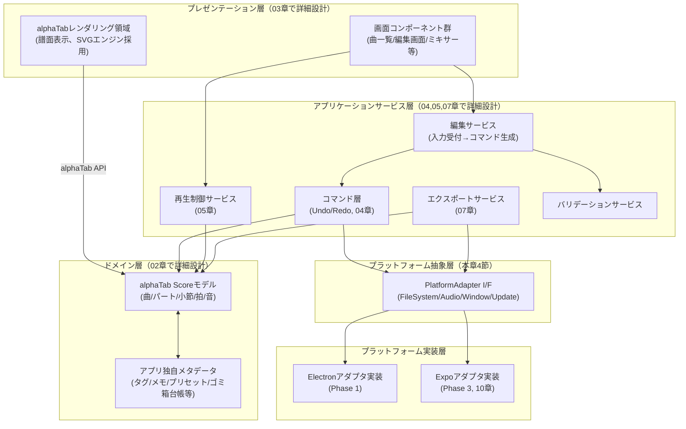
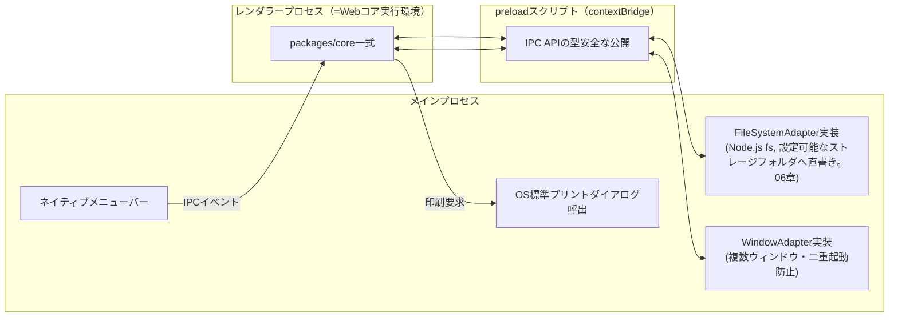

# アーキテクチャ設計書

対応要件：要件定義書 3章（スコープ・方針転換）、5.5節（保守性・移植性）、6章（システム構成）、8章リスク#8

## 1. 目的

Webコア（プラットフォーム非依存）とプラットフォームラッパー（Electron／将来Expo）の境界を明確に定義し、「PC版開発中にElectron依存コードがWebコアに紛れ込む」（要件書リスク#8）を構造的に防止する。あわせて、実装言語・フレームワーク・パッケージ構成という、要件定義書では未確定だった技術選定を基本設計として確定する。

**本書の記述レベルについて**：本書はV字モデル（[[15_development_process.md#1.1]]）における「基本設計」段階の成果物であり、モジュール／レイヤーの責務分担と外部インターフェース契約（何を受け取り、何を返すか、という概念レベルの取り決め）までを扱う。具体的なメソッドシグネチャ（引数・戻り値の型、例外仕様等）やクラス構成は詳細設計段階（[[15_development_process.md#1.2]]、作業パッケージ単位の`detailed_design/`文書）で確定する（[[13_design_decision_points.md#3]]B13）。

## 2. 全体レイヤー構成



**層ごとの許可される依存方向**：上位層は下位層に依存してよいが、逆方向の依存（L3がL1を知る等）は禁止。L1〜L3を「Webコア」、L4を境界、L5を「ラッパー層」と呼ぶ（要件書6章の呼称に対応）。この依存規則をESLintで機械的に強制し、リスク#8（Electron依存混入）をレビュー任せにしない（具体的なルール構成は[[../detailed_design/web-core-foundation.md#6]]で確定）。

## 3. 主要アーキテクチャ決定（AD）

### AD-1：ドメインモデルはalphaTabのScoreモデルを基盤とし、アプリ独自メタデータは並行ストアで管理する

alphaTabは譜面レンダリング・合奏再生に加え、Guitar Pro形式相当の豊富なデータモデル（`Score > Track > Staff > Bar > Voice > Beat > Note`、チューニング・カポ・拍子/テンポ変更・章立て（Section）・繰り返し記号・各種奏法エフェクトを内包）を標準で持つ。これを自前で再定義するとPDF/alphaTex/MIDIエクスポートや再生でのモデル変換コストが二重に発生するため、**Score系オブジェクトをそのままアプリの永続化対象データモデルの中核として採用する**。

一方、alphaTabのモデルが持たない、あるいは本アプリ固有の情報（曲一覧のタグ・小節メモ・チューニングプリセット・ゴミ箱台帳・パート別UI設定・ウィンドウ位置等）は、Score本体を汚さず**「サイドカーメタデータ」**として別JSON領域に保持する（詳細は02章）。この分離により、alphaTab側のバージョンアップでScore構造が変わってもサイドカー部分は影響を受けにくい。

- 影響：02章（データモデル）、07章（エクスポート）、05章（再生）
- 対応方針：確定

### AD-2：編集操作はすべてコマンドパターンを介してScoreモデルを変更する

要件書4.5節「Undo/Redoは全パート横断の単一操作履歴」「セッション内無制限」を満たすため、UIから直接Scoreモデルを変更することを禁止し、必ず「コマンドオブジェクト（実行操作と、それを打ち消す取り消し操作の対を持つもの）」を介する。コマンド層はUIにもalphaTabにも依存しない純粋ロジックとし、自動テスト対象の中心に据える（11章）。具体的なコマンドの型・メソッド構成は詳細設計（04章の詳細設計書）で確定する。**2026-09-01追記**：alphaTab自体には専用の編集コマンドAPIが存在しないことを確認した（[[13_design_decision_points.md#2]]A1解決）。コマンドはScoreモデルを直接操作したのち、alphaTabの再描画API（`AlphaTabApi.renderScore()`相当）を呼び出す実装になる。将来Apple Pencil等の新しい入力手段を追加する場合も、UIがコマンドを生成する経路さえ用意すれば済むため、この分離が拡張性の要となる（[[10_extensibility_future.md#4.4]]参照）。

- 影響：04章（編集コア）で詳細設計
- 対応方針：確定

### AD-3：プラットフォーム差異はPlatformAdapterインターフェースで吸収する

ファイルI/O・オーディオセッション制御・ウィンドウ管理・自動更新チェックの4系統について、Webコアからは抽象インターフェースのみを参照し、具象実装（ElectronアダプタまたはExpoアダプタ）は起動時に注入する（依存性逆転）。各アダプタの責務は以下の通り。具体的なメソッドシグネチャ（引数・戻り値の型、非同期／同期の別、エラー時の扱い）は各アダプタが対応する作業パッケージの詳細設計書で確定する（[[13_design_decision_points.md#3]]B13）。

| Adapter | 責務（概念レベル） | 主に関わる要件・章 |
|---|---|---|
| FileSystemAdapter | 曲データの読み込み・アトミック書き込み（06章の一時ファイル→リネーム方式に従う）・一覧取得・ゴミ箱への移動、および現在の保存先ルートの取得・保存先の移行を担う。保存先はローカル/iCloud Drive/Google Drive等の中から設定可能な「フォルダパス」として扱い、Adapter自体はどの実体にも依存しない（06章、要件変更対応） | 06章 |
| AudioSessionAdapter | バックグラウンド音楽アプリとの音声共存設定を担う。PC版はno-op実装、iPhone版のみ実処理を持つ（要件3.2） | 05章、10章 |
| WindowAdapter | 曲ウィンドウのオープン、既存ウィンドウの前面化（同一曲の二重起動防止、要件5.6）を担う | 03章 |
| UpdateCheckAdapter | 更新確認を担う。現時点はダミー実装（要件5.6） | 10章 |

- 影響：06章、08章、10章
- 対応方針：確定。これにより「不要」と判定された機能（自動更新のサーバー配信、認証層等）も、アダプタの差し替えのみで将来追加できる（要件書4.5節・5.6節の横断的設計原則に対応）

### AD-4：実装言語・UI技術スタック

| 項目 | 選定 | 理由 |
|---|---|---|
| 言語 | TypeScript | データモデル・コマンド層の複雑性に対し型安全性が保守性に直結する。alphaTab自体もTypeScript製でAPI型定義が充実 |
| UIフレームワーク | React | Electron同梱を前提としたエコシステムの厚み、コンポーネント単位での画面分割（03章の画面群）との相性、Claude Codeでの実装支援の受けやすさ |
| 状態管理 | 軽量ストア（Zustand相当）＋コマンド層は独自実装 | Redux的なボイラープレートを避けつつ、Undo/Redo対象（Scoreモデル）とUI状態（選択範囲・表示モード等）を明確に分離管理する |
| ビルドツール | Vite（Electron向けテンプレート） | 開発時のホットリロード速度、Claude Codeでの設定変更のしやすさ |
| alphaTabパッケージ | `@coderline/alphatab`（npm） | 公式配布パッケージ。SoundFontはローカル同梱（要件5.1：外部CDN禁止） |

対応方針：方針確定（レンダリングエンジンはSVGを採用、[[13_design_decision_points.md#2]]A2で2026-09-01確定。8章リスク#3〈メモリ使用量〉の実測結果次第で微調整の余地は残す）

### AD-5：パッケージ構成（モノレポ）

```
tab-app/
├─ packages/
│  ├─ core/              … Webコア本体（L1〜L3）。プラットフォーム固有APIへの直接参照を禁止
│  │  ├─ ui/              画面コンポーネント（03章）
│  │  ├─ editing/         編集サービス・コマンド層（04章）
│  │  ├─ playback/        再生制御（05章）
│  │  ├─ domain/          Scoreラッパー・メタデータモデル（02章）
│  │  ├─ export/          PDF/alphaTex/MIDI（07章）
│  │  ├─ errors/          エラー/ログ基盤（08章）
│  │  └─ platform/        PlatformAdapterのインターフェース定義（実装は含まない）
│  └─ shared-types/       … coreと各ラッパーが共有する型定義のみのパッケージ
├─ apps/
│  ├─ desktop/            … Electronラッパー（Phase 1）。main/preload/rendererでAdapter実装
│  └─ mobile/             … Expo+WebViewラッパー（Phase 3、雛形のみ先行作成も可）
└─ tools/                 … 開発用サンプルデータ生成スクリプト等（要件9章「開発用サンプルデータ」）
```

`packages/core` から `electron` や `expo-*` を直接importした時点でビルドが失敗する構成（パッケージの依存関係定義＋lintルール）とし、リスク#8を仕組みで防止する。

## 4. Electronプロセス構成（PC版・Phase 1）



- **セキュリティ既定値**：`contextIsolation: true` / `nodeIntegration: false` を維持し、Webコア（レンダラー）からNode.js APIへは必ずpreload経由のIPCでアクセスする（Webコアのプラットフォーム非依存性を物理的に担保する意味も持つ）。
- **クラッシュ検知**：メインプロセスが`renderer-process-gone`イベントを監視し、検知時は直前の自動保存データからレンダラーを再読み込みする（08章で詳細化、要件5.4対応）。
- **右クリックメニュー／ネイティブメニューバー**：メインプロセスの`Menu`/`Menu.buildFromTemplate`で構築し、選択結果はIPCでWebコアへ伝達する（03章で項目を確定）。

## 5. 依存ライブラリと方針

| ライブラリ | 用途 | ライセンス | 備考 |
|---|---|---|---|
| alphaTab | 譜面レンダリング／編集用データモデル／合奏再生シンセ | MPL-2.0 | 要件書リスク#2。Phase 0でライセンスファイルを直接確認 |
| 同梱SoundFont | 楽器音源 | Apache-2.0由来と推定 | Phase 0で最終確認、必要なら代替調達 |
| Electron | PC版シェル | MIT | 6章の選定理由を継承 |
| React | UIフレームワーク | MIT | AD-4 |
| （専用PDFライブラリ、フォールバック用） | PDFエクスポート | 未使用（現状不要） | PDF生成はElectron `webContents.printToPDF()`で確定済み（B6）。alphaTexエクスポートもalphaTabネイティブAPIで確定済み（[[13_design_decision_points.md#2]]A3、2026-09-01）。専用ライブラリはB6のフォールバック条件に該当した場合のみ追加検討する |

第三者ライブラリ・アセット採用のたびにライセンス条項を確認する原則（要件4.5節横断原則）を、本設計でも踏襲し、`10_extensibility_future.md`のクレジット画面設計と連動させる。

## 6. 非機能要件との対応関係

| 非機能要件（要件5.2/5.5） | 本アーキテクチャでの対応 |
|---|---|
| 起動3秒以内 | Electronの遅延初期化（alphaTabの初期化を起動シーケンスの後段に回す）、詳細は09章 |
| メモリ目標（アイドル150MB等） | レンダラープロセス1つに極力集約し、不要な子プロセス・BrowserWindowの多重生成を避ける。09章で実測計画 |
| 100小節超での性能維持 | alphaTabの仮想化されたレンダリング機構に極力依存し、独自の全小節同時DOM描画を避ける（09章） |
| 保守性・移植性（Webコア非依存） | 本章AD-3のPlatformAdapter、AD-5のパッケージ境界で担保 |

## 7. 今後の検証事項（Phase 0連動）

- **2026-09-01更新**：alphaTabのAPIが「編集」（ノートの追加・削除・移動）を一次サポートしているかを公式ドキュメント調査で確認した（[[13_design_decision_points.md#2]]A1解決）。専用の編集コマンドAPIは存在せず、アプリ側でScoreオブジェクトを直接操作しモデル更新後に再レンダリングを呼ぶ方式（04章の想定通り）で確定した。ただし「どのプロパティ変更が安全か」の切り分けは04章の詳細設計で扱う残課題である。
- **2026-09-01更新**：alphaTabのレンダリングがCanvasベースかSVGベースかを公式ドキュメント調査で確認した（[[13_design_decision_points.md#2]]A2解決）。実行時に切替可能で、Web環境（Electronレンダラー）では既定でSVGが使われる。本アーキテクチャはSVGエンジンの採用を前提とする。
- 上記2件は実機を要さない文書調査で解消できたため、Phase 0（PC実機での技術検証）に残るのはライセンス確認・メモリ実測・fsアクセス検証等の実機依存項目のみとなった（[[13_design_decision_points.md#2]]参照）。
