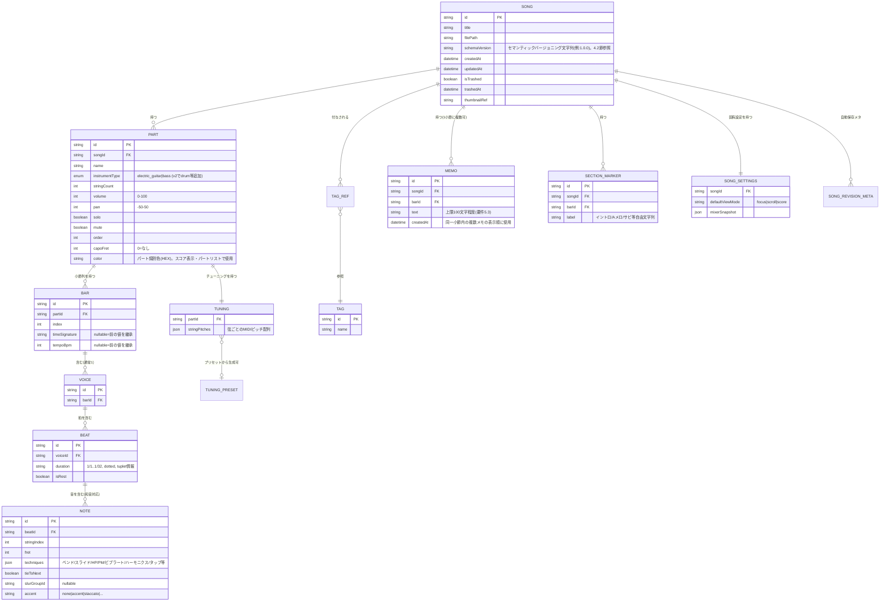

# データモデル設計書

対応要件：要件定義書4.1〜4.4章、5.3節（キャパシティ上限）、5.5節（スキーマ変更方針）

## 1. 設計方針

[[01_architecture.md]] AD-1のとおり、実行時のドメインオブジェクトはalphaTabのScore系モデル（`Score/Track/Staff/Bar/Voice/Beat/Note`）を基盤とする。ただし**永続化フォーマットはalphaTexへの都度変換ではなく、自前で定義・バージョン管理する構造化JSON（スナップショット形式）とする**。理由：

1. alphaTexはテキスト形式であり、数秒間隔の自動保存（要件5.2）のたびにScore⇔テキストの相互変換を行うのは大曲（2048小節、要件5.3）でパフォーマンスリスクが大きい。
2. 要件5.5節「後方互換性を壊さない設計（新フィールドは常にオプショナル）」「自動マイグレーションスクリプト」を実現するには、自前スキーマとして`schemaVersion`を持つ構造の方が制御しやすい。
3. alphaTex書き出し（要件4.4）は「エクスポート操作時にのみ、保存済みJSONから変換生成する」1機能として位置づける（07章）。**2026-09-01追記**：alphaTab v1.7.0以降が持つ`AlphaTexExporter`（[[13_design_decision_points.md#2]]A3で解決）を用いてこの変換を行う。

この方針により、**保存ファイル＝内部データモデルの構造化JSON**、**alphaTex＝エクスポート成果物の一つ**という関係になる。要件4.4「alphaTex形式（内部データそのまま）」という表現は、変換ロスがない（可逆的に近い）ことを指すものとして扱い、07章で変換の完全性を検証する。

## 2. ER図（論理構造）



**注**：alphaTabの実際のクラス設計（`Score`直下の構造、`MasterBar`と`Bar`の分離等）とは項目名を一部意訳している。実装時はalphaTab公式APIリファレンスに合わせて詳細設計（クラスマッピング表）を別途起こす。ここでは「アプリが管理すべき情報の網羅性」を優先した論理モデルとする。

## 3. エンティティ詳細と要件対応

### 3.1 Song（曲）

| フィールド | 型 | 要件対応 | 備考 |
|---|---|---|---|
| id | UUID | - | ファイル名にも使用（06章） |
| title | string | 4.5「エクスポートファイル名自動生成」 | 曲名＋日付から自動生成、編集可 |
| tags | Tag[] | 4.5「タグ付け・カテゴリ分け」 | 多対多。総数上限50（要件5.3） |
| thumbnailRef | string | 4.5「曲一覧サムネイル」 | alphaTabレイアウトでの最初の1段を軽量レンダリングしキャッシュ画像として保持（[[13_design_decision_points.md#3]]B7で確定。生成タイミングは06章） |
| isTrashed/trashedAt | bool/datetime | 4.5「ゴミ箱機能」 | 保持期間30日後に完全削除（06章、[[13_design_decision_points.md#3]]B9で確定） |
| schemaVersion | string | 5.5「後方互換性」 | セマンティックバージョニング文字列（4.2節）。読み込み時にマイグレーション判定に使用。**2026-09-02修正**：本表・2節ER図はかつて`int`と誤記していたが、4.2節の定義に合わせて`string`に統一した |

### 3.2 Part（パート）

| フィールド | 型 | 要件対応 |
|---|---|---|
| instrumentType | enum | 4.2「MVPはエレキギター・ベースの2種」。**enumはv2のドラム追加を見据え抽象化**（10章） |
| stringCount, tuning | int, StringPitch[] | 4.1「弦本数・チューニング自由設定」 |
| volume, pan, solo, mute | number/bool | 4.3「専用ミキサー画面」 |
| capoFret | int | 4.1「カポ」。**表示は運指基準、実音変換は再生時のみ**（05章で実装） |
| order | int | 4.2「パート並べ替え」 |
| color | string(HEX) | 4.5「譜面のパート別色分け表示」（**本基本設計フェーズで必要と決定**）。スコア表示モード・パートリストでの識別色として使用 |

**パート別色分け表示（新規決定）**：要件定義書で複数回未回答だった項目だが、本基本設計で「必要」と決定した。新規パート追加時は既存パートと重複しない色を8色程度の既定パレットから自動割当し、パート管理パネル（[[03_screens_ui_pc.md#10]]）から手動変更も可能にする。**実装方式（2026-09-01確定、[[13_design_decision_points.md#2]]A2解決を受けて）**：alphaTabのレンダリングエンジンはSVGを採用する（Web環境での既定値）。alphaTabのTrackオブジェクトが色属性を持つ場合はそれを利用しつつ、持たない・表現力が不足する場合は、SVGとして出力されたレンダリング結果のDOM要素（該当パートに属するノード群）へCSSスタイル（`stroke`/`fill`）を直接適用してオーバーレイする。SVGは全プラットフォーム（PC版・将来のiPhone版）で共通のため、この着色方式はPhase 3でもそのまま再利用できる。対象要素の特定方法（トラックインデックスとDOM要素の対応付け）は[[../detailed_design/view-modes.md#4.3]]で確定した（`ScoreRenderHost`のSVG出力へ`data-track-index`属性を付与し、CSSセレクタでの着色を可能にする方式）。**2026-09-02修正**：当初「[[04_editing_core.md]]・03章の詳細設計で確定する」としていたが、実際には[[../detailed_design/editing-core.md]]に該当内容がなく、表示モードパッケージの`ScoreRenderHost`拡張が正しい所在だったため申し送り先を訂正した（セルフレビューで発見）。

パート数上限8（要件5.3）は`Song.parts.length <= 8`をコマンド層（04章）のバリデーションで強制する。

### 3.3 Bar / Voice / Beat / Note（小節〜音符階層）

alphaTabの標準階層をそのまま採用する理由は、拍子・テンポの小節単位変更（要件4.1）、32分音符・連符（要件4.1）、付点・タイ・スラーの区別（要件4.1）をすべてこの階層のプロパティとして表現可能なため。

| フィールド | 要件対応 |
|---|---|
| Bar.timeSignature / tempoBpm（nullable＝直前値継承） | 4.1「拍子・テンポの曲途中変更」。小節の挿入・削除時の継承チェーンの扱いは[[04_editing_core.md#10]]（[[13_design_decision_points.md#3]]B5）で規定 |
| Beat.duration（分数＋付点フラグ＋連符情報） | 4.1「32分音符・3連符等」 |
| Beat.isRest | 4.1「休符：暗黙的休符を基本＋明示編集も可能」→ 音を置かない小節位置は自動的に`isRest=true`のBeatとして生成し、UIからも明示編集可能にする |
| Note.tieToNext（bool） / Note.slurGroupId（string） | 4.1「タイ／スラーを別々の記号として区別」 |
| Note.techniques | 4.1「奏法記号フルセット」（下記3.4で詳細） |
| Note.accent | 4.1「アーティキュレーション記号（アクセント・スタッカート等）」 |

**重複配置チェック**（要件4.1）：同一Beat内で`stringIndex`が重複するNoteの追加をコマンド層バリデーション（04章）で拒否する。

### 3.4 Note.techniques の構造（奏法記号）

```json
{
  "bend": { "type": "full|half|oneAndHalf|custom", "curve": [0, 50, 100] },
  "slide": { "type": "shiftSlide|legatoSlide|slideOutDown|slideOutUp" },
  "hammerOnPullOff": true,
  "palmMute": { "range": "note|toNext" },
  "vibrato": true,
  "harmonic": { "type": "natural|artificial|pinch" },
  "tapping": { "type": "tap|slap|pop" }
}
```
要件4.1の一覧（チョーキング／スライド／ハンマリング・プリング／パームミュート／ビブラート／ハーモニクス3種／タッピング・スラップ・ポップ）を全て網羅。UIでの確定方式（自動候補＋長押し補正）は04章で扱う。

### 3.5 SectionMarker（セクションマーカー）

要件4.1「リピート記号／セクションマーカー」「セクションループ再生」に対応。`Bar`への参照で位置を持ち、ループ再生（05章）はこのマーカー区間を再生範囲として利用する。繰り返し記号（リピート）自体はalphaTabのMasterBar属性（開始/終了リピート、リピート回数）をそのまま利用する。追加・編集・削除を行う具象Commandは[[../detailed_design/editing-core.md#6.4]]の`AddSectionMarkerCommand`／`EditSectionMarkerCommand`／`DeleteSectionMarkerCommand`で確定した（**2026-09-02追記**、セルフレビューで発見された未定義コマンドの是正）。

### 3.6 Memo（小節メモ）

要件4.1「小節メモ／注釈」、4.5「テキストのみ対応」「文字数上限100文字程度」に対応。**1小節に複数メモを許容する**方針で確定した（[[13_design_decision_points.md#3]]B1）。データ構造はもともと配列（`SONG ||--o{ MEMO`、MEMOはbarIdで小節を参照するのみで一意制約を設けない）であるため実装コスト差はほぼゼロであり、耳コピ作業では同じ小節に日を跨いで複数の気づきを残すケースが十分想定されるため、上書きより蓄積型を採用する。`createdAt`を追加し、小節メモ一覧パネル（[[03_screens_ui_pc.md#3]]）では作成日時順に表示する。追加・編集・削除を行う具象Commandは[[../detailed_design/editing-core.md#6.4]]の`AddMemoCommand`／`EditMemoCommand`／`DeleteMemoCommand`で確定した（**2026-09-02追記**、セルフレビューで発見された未定義コマンドの是正）。

### 3.7 TuningPreset（チューニングプリセット、Song非依存のグローバルデータ）

要件4.1「定番プリセット標準搭載＋ユーザー独自プリセット追加」に対応。アプリ全体で共有する独立エンティティとし、Partは`presetId`（任意）＋実値のスナップショットを持つ（プリセット削除後も既存曲のチューニングは壊れないようにするため、参照ではなく値のコピー＋出自記録とする）。

```json
{ "id": "preset-drop-d", "name": "ドロップD", "builtin": true, "stringPitches": [38,45,50,55,59,64] }
```

## 4. ファイルフォーマット仕様

### 4.1 保存ファイル構造（1曲＝1ファイル）

```json
{
  "schemaVersion": "1.0.0",
  "song": { "...Song本体（Part/Bar/Voice/Beat/Note含む階層データ）" },
  "appMeta": {
    "tags": ["..."],
    "memos": ["..."],
    "sectionMarkers": ["..."],
    "settings": { "defaultViewMode": "focus", "mixerSnapshot": {} },
    "thumbnail": { "encoding": "base64-png", "data": "..." }
  },
  "integrity": { "savedAtMonotonic": 1234567890, "checksum": "sha256:..." }
}
```

- `checksum`：アトミック書き込み（06章）の検証や、クラッシュ復旧時に破損ファイルを検知するために付与する。ハッシュ対象の厳密な定義（`integrity`ブロックを除く`{schemaVersion, song, appMeta}`）は[[../detailed_design/data-model-persistence.md#3.2]]で確定した。
- ファイル拡張子：`.tabapp`（独自形式であることを明示。OS標準ファイル関連付け対応は要件5.6参照、07章で拡張子とMIME的な扱いを確定）。

### 4.2 スキーマバージョニング・マイグレーション方針（要件5.5対応）

| ルール | 内容 |
|---|---|
| バージョン形式 | `schemaVersion`はセマンティックバージョニング文字列（アプリ自体のバージョニングと同期させる必要はなく独立管理） |
| 後方互換の基本方針 | 新フィールドは常にオプショナル＋読み込み時デフォルト値補完。既存フィールドの意味変更・削除は原則行わない |
| マイグレーション実行タイミング | 曲ファイルの読み込み時に`schemaVersion`を検査し、現行バージョンより古ければマイグレーション関数チェーン（`v1→v2→v3...`の逐次適用）を実行してからメモリ上に展開する |
| 保存タイミング | マイグレーション後、次回自動保存時に現行`schemaVersion`で上書き保存される（明示的な一括変換バッチは持たない＝開いた曲から順次更新） |
| 大規模変更時 | 逐次マイグレーション関数で対応しきれない場合のみ専用マイグレーションスクリプトを用意する方針（要件5.5に明記の通り） |

### 4.3 キャパシティ上限の実装への反映（要件5.3）

| 上限 | 実装箇所 |
|---|---|
| 曲数1000程度 | 曲一覧読み込み時のインデックスファイル（06章）でO(1)近く一覧取得できるようにし、上限到達時はUIで警告（08章Warning） |
| 小節数2048 | Bar配列の上限としてコマンド層バリデーションで強制 |
| タグ50個 | Tagエンティティ作成コマンドでバリデーション |
| 小節メモ100文字 | Memo.text入力コンポーネントでのクライアント側バリデーション＋保存時二重チェック（1小節あたりのメモ件数自体には上限を設けない） |
| パート8 | 3.2節参照 |
| フレット24 | Note.fret入力コンポーネントのバリデーション |

## 5. 曲一覧用インデックス（別ファイル）

1000曲規模でも起動時間3秒以内（要件5.2）を満たすため、各曲ファイルをフルパースせずに一覧表示できる軽量インデックス`index.json`を別途保持する（`SongSummary`：id/title/updatedAt/tags/thumbnailRefのみ）。詳細は06章、および具体的な読み書きロジックは[[../detailed_design/data-model-persistence.md#3.2]]の`SongIndexService`で定義する。
