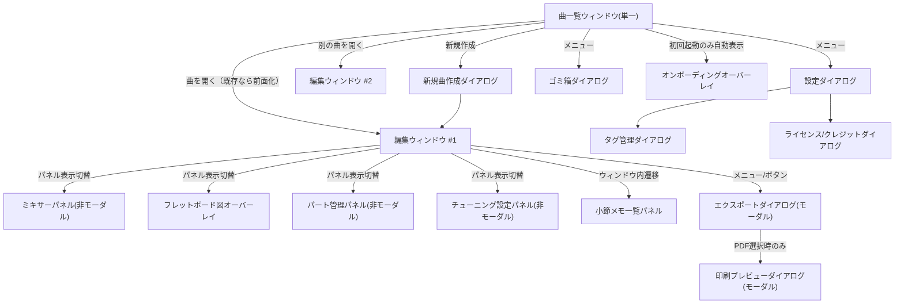

# PC版画面設計書（新規策定）

対応要件：要件定義書7章「【最優先】PC版のUI／操作仕様が未定義」への回答。4.5／4.6節（iPhone版仕様）はタッチ操作前提のため転用せず、本書でマウス・キーボード操作に適した独自仕様を新規に定義する。本書は画面の構造・配置・操作フロー（ワイヤーフレームレベル）を扱う。配色・タイポグラフィ・角丸・影・コンポーネントの見た目といったビジュアルデザインの詳細は[[14_visual_design_system.md]]を参照。

## 1. 設計方針

要件定義書4.5節の「設計原則（横断的・その0）」＝*単一の操作方法に絞らず複数パターンに対応、コスト増する場合は主経路＋補正/エスケープハッチ*を、PC版でも踏襲する。iPhone版の「親指操作前提の下部ツールバー＋ボトムシート」は、PC版では以下のように翻訳する。

| iPhone版の概念（4.5/4.6節） | PC版での翻訳 |
|---|---|
| 下部ツールバー＋カテゴリタブ切替 | 常時表示のドッキングツールバー（画面下部固定）＋キーボードショートカット併用。カテゴリ切替はタブではなく全カテゴリを1つのツールバーに収め、画面幅不足時のみ折り畳み矢印で追加項目を表示 |
| ボトムシート（軽量調整系） | **非モーダルのドッキングパネル**（表示/非表示トグル可能、他操作をブロックしない）。例：ミキサー、パート管理、チューニング設定 |
| フルスクリーンモーダル（重い/複数ステップ系） | **モーダルダイアログ**（OS標準のウィンドウ内ダイアログ）。例：エクスポート、印刷プレビュー、新規曲作成フロー |
| スワイプダウンで閉じる | ダイアログ右上の閉じるボタン／Escキー |
| タップ／長押し | クリック／右クリック（コンテキストメニュー） |
| ピンチズーム | Ctrl+マウスホイール／ズームスライダー（ステータスバー） |
| ドロップダウン／リストでのパート切替 | メインウィンドウ左側のパートリストパネル（常時表示、クリックで切替） |
| 常時表示のタブバーを持たない（ボタン遷移） | メニューバー＋ツールバーを常設。ウィンドウ内遷移はダイアログ／パネルの開閉で表現し、画面全体の「遷移」は最小限にする（曲一覧⇔編集画面のみが画面遷移相当） |

## 2. ウィンドウ構成・複数ウィンドウ方針（要件5.6）

- アプリ起動時は**曲一覧ウィンドウ**（ランチャー的な単一ウィンドウ）を表示する。
- 曲を開くと**編集ウィンドウ**を新規に開く（曲一覧ウィンドウとは別ウィンドウ）。複数の曲を見比べる用途（要件5.6）のため、編集ウィンドウは複数同時に開ける。
- **同一曲の二重起動防止**：曲を開く操作時、`WindowAdapter.focusExistingWindow(songId)`（[[01_architecture.md#3]]AD-3）を先に呼び出し、既に開いていればそのウィンドウを前面化して新規ウィンドウは生成しない。
- ウィンドウサイズ：最小800×600、最大はモニタサイズに追従（要件5.6）。この範囲内でのレイアウト崩れ防止・パネルの縮退方針は[[14_visual_design_system.md#8]]を参照。
- 設定画面・タグ管理・ゴミ箱・ライセンス画面は曲一覧ウィンドウから開くモーダルダイアログとする（複数ウィンドウにする必要性が薄いため）。



## 3. 画面（ウィンドウ／パネル／ダイアログ）インベントリ

| # | 画面 | PC版での種別 | 開き方 |
|---|---|---|---|
| 1 | 曲一覧ウィンドウ | ルートウィンドウ | アプリ起動時 |
| 2 | 新規曲作成ダイアログ | モーダルダイアログ（複数ステップ＝ウィザード形式） | 曲一覧の「新規作成」ボタン／Ctrl+N |
| 3 | タブ譜編集ウィンドウ | メインウィンドウ（複数可） | 曲一覧から開く |
| 4 | ミキサーパネル | 非モーダル・ドッキング/フローティング切替可能パネル | 編集ウィンドウのツールバー／表示メニュー |
| 5 | フレットボード図 | オーバーレイ（編集ウィンドウ内、右下固定） | ツールバートグル |
| 6 | パート管理パネル | 非モーダルパネル | 編集ウィンドウのツールバー／表示メニュー |
| 7 | チューニング設定パネル | 非モーダルパネル | パート管理パネルから、またはパート右クリック |
| 8 | セクションマーカー | 譜面上インライン表示・編集（モーダル不要、iPhone版と同様の方針を維持） | 譜面上で直接操作 |
| 9 | 小節メモ一覧パネル | 非モーダルパネル（サイドパネルまたは下部パネル） | 編集ウィンドウのツールバー |
| 10 | エクスポートダイアログ | モーダルダイアログ | Ctrl+E／ファイルメニュー |
| 11 | 印刷プレビューダイアログ | モーダルダイアログ | エクスポートでPDF選択時、またはCtrl+P |
| 12 | 設定ダイアログ | モーダルダイアログ | 曲一覧の設定ボタン／メニュー |
| 13 | タグ管理ダイアログ | モーダルダイアログ（設定の子） | 設定ダイアログから |
| 14 | ゴミ箱ダイアログ | モーダルダイアログ | 曲一覧のボタン／メニュー |
| 15 | ライセンス／クレジットダイアログ | モーダルダイアログ | 設定ダイアログから |
| 16 | オンボーディングオーバーレイ（新規決定） | 非モーダルの簡易コーチマーク型オーバーレイ | 初回起動時に曲一覧ウィンドウ上へ自動表示。12節参照 |

**方針の根拠**：iPhone版の「ボトムシート＝軽い調整系／フルスクリーンモーダル＝重い系」という重さによる使い分け原則（要件4.5）を維持しつつ、PC版では「軽い系＝非モーダル（他操作と並行可能）」「重い系＝モーダル」という**モーダル性による使い分け**に翻訳している。これはマウス操作ではウィンドウ間の並行参照（例：ミキサーを見ながら譜面編集）が自然であるため。

## 4. 曲一覧ウィンドウ レイアウト

```
┌─────────────────────────────────────────────────────────┐
│ ファイル  編集  表示  ヘルプ                                │ ← メニューバー
├─────────────────────────────────────────────────────────┤
│ [新規作成] [検索/タグ絞込......] [グリッド|リスト切替] [設定]│ ← ツールバー
├─────────────────────────────────────────────────────────┤
│  ┌────┐ ┌────┐ ┌────┐ ┌────┐                          │
│  │サムネ│ │サムネ│ │サムネ│ │サムネ│   （グリッド表示例）      │
│  │曲名A │ │曲名B │ │曲名C │ │曲名D │                          │
│  │タグ  │ │タグ  │ │タグ  │ │タグ  │                          │
│  └────┘ └────┘ └────┘ └────┘                          │
│  （右クリック：開く/名前変更/タグ編集/ゴミ箱へ移動/複製）        │
├─────────────────────────────────────────────────────────┤
│ 曲数: 42/1000   [ゴミ箱]                                    │
└─────────────────────────────────────────────────────────┘
```

- グリッド／リスト表示切替は設定画面ではなくツールバーからも直接切替可能とする（要件4.5「設定画面で切替可能」の要件を満たしつつ、頻度の高い操作のため導線を追加）。
- 並べ替え（作成日／更新日／曲名）はツールバーのドロップダウンで選択。
- 検索・タグ絞り込みUIは要件上「今後対応」だが、検索ボックスの器（無効化 or 簡易フィルタのみ有効）は先行配置しておく（データ構造は既に用意済み、[[02_data_model.md#3.1]]）。
- 右クリックコンテキストメニュー：開く／名前を変更／タグを編集／ゴミ箱へ移動／複製（要件上「不要」だがファイルコピーで実現できるため導線としては残し、実処理は06章のファイルコピーのみで実装）。

## 5. タブ譜編集ウィンドウ レイアウト

```
┌───────────────────────────────────────────────────────────────┐
│ ファイル 編集 表示 再生 パート ツール ヘルプ                        │ ← メニューバー
├───────────────────────────────────────────────────────────────┤
│ [保存●] [Undo][Redo] | [再生][停止][ループ][メトロノーム] | [ミキサー][パート][チューニング][フレットボード][メモ一覧] │ ← ツールバー
├───────────┬───────────────────────────────────────────────────┤
│ パートリスト │  表示モード: [フォーカス|全体|スコア]  ズーム:[-|====|+] │
│ ▶🟦Gt1 🔊🎚 │──────────────────────────────────────────────────│
│  🟧Gt2 🔊🎚 │                                                    │
│  🟩Bs1 🔊🎚 │        （alphaTabレンダリング領域：タブ譜表示）        │
│ [+パート追加]│        セクションマーカーはここに直接インライン表示       │
│           │                                                    │
│           │                                                    │
├───────────┴───────────────────────────────────────────────────┤
│ [音価パレット: ♩♪♬...] [フレット: 0-12クイック|テンキー] [奏法記号▾]│ ← 入力ツールバー（下部固定）
├───────────────────────────────────────────────────────────────┤
│ 小節12/64  拍子4/4  テンポ120  カポ0  [Info/Warning/Errorトースト表示域] │ ← ステータスバー
└───────────────────────────────────────────────────────────────┘
```

- **左パネル（パートリスト）**：常時表示。各行の先頭に[[02_data_model.md#3.2]]で決定したパート識別色のスウォッチ（🟦🟧🟩等の色丸）を表示し、ミュート／ソロの簡易トグルと音量ミニスライダーを配置（詳細な調整は非モーダルの「ミキサーパネル」で行う二段構え。要件4.3「専用ミキサー画面」を満たしつつ、日常操作の摩擦を減らす）。**ウィンドウ幅に応じてアイコンのみへ自動的に縮退させることはしない**（[[13_design_decision_points.md#3]]B10で確定）。パート名はアイコンだけでは判別できず、自動縮退は誤操作リスクを増やすため、対応ウィンドウ幅（800px〜）の範囲では常にラベル付き表示を維持する。画面領域を広げたい場合は、パネル境界のドラッグによる手動リサイズ（最小幅目安120px、識別色スウォッチとミュート/ソロアイコンが判読できる下限）で対応する。
- **中央（譜面表示領域）**：表示モード切替（フォーカス／全体スクロール／スコア、要件4.1）はタブ状のセグメントコントロールで即時切替。ズームは要件4.5同様「全曲俯瞰〜1音符単位」をスライダー＋Ctrl+ホイールの両対応とする。**スコア表示モード（全パート縦並び）では各パートの譜表・符頭をパート識別色で着色し、パート判別を容易にする**（新規決定、[[02_data_model.md#3.2]]参照）。フォーカスビュー（1パートずつ表示）では単色表示のままとし、色分けの効果が出る場面（合奏確認時）に限定する。
- **下部（入力ツールバー）**：iPhone版の「カテゴリタブ切替」に代えて、PC版は画面幅に余裕があるため**音価・フレット入力・奏法記号を横並びで同時表示**する。画面幅が狭い場合のみ折り畳む（要件4.5の複数操作パターン対応の原則、はみ出し防止の具体的な折り返しルールは[[14_visual_design_system.md#8.2]]参照）。フレット入力は要件4.1の「クイック選択バー（0〜12）＋テンキー展開のハイブリッド」をそのまま採用。
- **ステータスバー**：小節位置／拍子／テンポ／カポの常時表示に加え、08章で定義するInfo/Warningトーストの表示領域とする（Error/Criticalは譜面上ハイライトやモーダルのため別途）。数値表示の書体は[[14_visual_design_system.md#4]]の等幅フォントルールに従う。

## 6. メニューバー構成

| メニュー | 主な項目 |
|---|---|
| ファイル | 新規曲作成／開く／保存／名前を付けて保存／エクスポート(Ctrl+E)／印刷(Ctrl+P)／閉じる |
| 編集 | 元に戻す(Ctrl+Z)／やり直す(Ctrl+Y)／切り取り／コピー／貼り付け／削除／全選択／選択モード切替 |
| 表示 | フォーカスビュー／全体スクロールビュー／スコア表示／ズームイン・アウト／フレットボード図表示切替 |
| 再生 | 再生/停止(Space)／区間ループ設定／セクションループ／ソロ再生／減速再生／メトロノームON-OFF／カウントインON-OFF／タップテンポ |
| パート | パート追加／削除／並べ替え／チューニング設定／パート管理パネルを開く |
| ツール | ミキサー／小節メモ一覧／セクションマーカー管理／設定 |
| ヘルプ | ライセンス／クレジット／バージョン情報 |

メニューバー自体はOS標準（Windowsのアプリケーションメニュー相当）のテキストメニューとし、装飾を加えず視認性を最優先する（[[14_visual_design_system.md#7.1]]）。ツールバーのアイコングループ分け・アイコン密度の視覚的な扱いも[[14_visual_design_system.md#7.2]]を参照。

## 7. キーボードショートカット一覧（要件5.6「標準的なOS慣習」）

| 操作 | ショートカット |
|---|---|
| 元に戻す／やり直す | Ctrl+Z／Ctrl+Y（Ctrl+Shift+Zも許容） |
| コピー／切り取り／貼り付け | Ctrl+C／Ctrl+X／Ctrl+V |
| 保存 | Ctrl+S（自動保存と併用、明示保存は即時フラッシュのトリガーとして機能） |
| 新規作成 | Ctrl+N |
| エクスポート | Ctrl+E（3節「エクスポートダイアログ」・6節メニューバー「ファイル」に対応、2026-09-06追加） |
| 印刷 | Ctrl+P（3節「印刷プレビューダイアログ」・6節メニューバー「ファイル」に対応。エクスポートダイアログでPDF選択時の遷移とは別に、直接印刷プレビューを開く導線、2026-09-06追加） |
| 再生／停止 | Space |
| カーソル移動 | 矢印キー（左右＝拍単位、上下＝弦単位） |
| 音符削除 | Delete／Backspace |
| ズーム | Ctrl+ホイール／Ctrl+ +／Ctrl+ - |
| 全選択 | Ctrl+A（現在パート内） |
| フレット数値入力 | 0-9キー直接入力（テンキー展開なしでも常時受付） |
| 選択モード切替 | Shift+クリックで範囲選択開始（トグルモードも併設） |

**2026-09-06追記（レビュー是正、[[../review/design_review_2026-09-04.md]]B-2）**：3節「画面インベントリ」・6節「メニューバー構成」にはエクスポート(Ctrl+E)・印刷(Ctrl+P)のショートカットが既に記載されていたが、本表への反映が漏れていた。上表に2行追加して解消した。

## 8. マウス操作パターンの使い分け方針

要件7章で問われていた「クリック／ホバー／右クリックの使い分け」を以下に確定する。

| 操作 | 用途 |
|---|---|
| 左クリック（単発） | カーソル位置決め、パレット上の値選択、ボタン操作 |
| 左クリック＋ドラッグ | 音符の移動、範囲選択（選択モード時）、ミキサースライダー操作 |
| ダブルクリック | 音符の詳細編集ポップオーバー表示（奏法記号の手動補正＝iPhone版の「長押し」に相当する操作をPC版ではダブルクリックに割り当てる） |
| 右クリック | コンテキストメニュー（コピー／切り取り／削除／奏法記号候補一覧／小節メモ追加 等、要件5.6「右クリックメニュー対応」） |
| ホバー | ツールチップ表示（コード名候補、奏法記号名、ショートカットヒント） |
| ホイール | 縦スクロール（全体スクロールビュー）。Ctrl+ホイールでズーム |

奏法記号の確定方式（要件4.1「自動候補表示＋長押しでの手動補正のハイブリッド」）はPC版では「自動候補表示（入力直後にポップオーバーでハイライト）＋右クリックまたはダブルクリックでの手動補正」に翻訳する。

## 9. 誤削除対策・視覚的フィードバック（要件4.5）

- 音符配置時のハイライトアニメーション（配置直後0.2秒程度、色はテーマトークンで定義、[[14_visual_design_system.md#3]]の配色トークンと統一）。
- ゴミ箱機能：曲単位（要件4.5）に加え、譜面上の削除操作もUndo（Ctrl+Z）でカバーされるため、譜面内の個別ノート用ゴミ箱は設けない（曲一覧のゴミ箱と、セッション内Undo履歴の二重構造で誤削除に対応する）。

## 10. その他画面の要点

| 画面 | PC版での要点 |
|---|---|
| 新規曲作成ダイアログ | ウィザード形式（要件4.5「最初に全パート構成を決めてから編集開始」）。ステップ1：パート数・楽器、ステップ2：各パートのチューニング（既存パートのチューニングをコピーする選択肢を含む、要件4.5）。**パート識別色は既定パレットから自動割当し、このステップで一覧確認・変更も可能にする** |
| ミキサーパネル | 全パートを横並びのチャンネルストリップで表示。音量／パン／ソロ／ミュートのみ（EQ等なし、要件4.5）。各チャンネルの見出しにパート識別色を表示 |
| エクスポートダイアログ | 形式選択（PDF/alphaTex/MIDI）、ファイル名編集可能フィールド（自動生成値をプレースホルダー表示、要件4.1） |
| 印刷プレビューダイアログ | A4段組みプレビュー＋OS標準プリントダイアログ呼び出しボタン（要件4.5） |
| ゴミ箱ダイアログ | 一覧＋復元／完全削除ボタン、復元可能期間（既定30日、設定ダイアログで変更可）の残り日数表示 |

### 設定ダイアログ（最終確定：12項目、[[13_design_decision_points.md#4]]C3）

要件4.5の候補項目に、保存先の複数バックエンド対応（[[06_file_io_persistence.md]]）で追加された項目を加え、以下の12項目で最終確定した。タブ形式（例：「編集」「再生」「保存先」「その他」の4カテゴリにグルーピング）で整理する。

| # | 項目 | 補足 |
|---|---|---|
| 1 | チューニング/音色の初期値 | 新規パート作成時のデフォルト |
| 2 | メトロノーム音量・音色 | 音色は複数プリセットから選択（[[05_playback_audio.md#6]]、[[13_design_decision_points.md#4]]C1） |
| 3 | 譜面のデフォルトズームレベル | 各表示モード（フォーカス/全体スクロール/スコア表示）ごとに独立保持されるズーム値（[[../detailed_design/view-modes.md#3.2]]、B16）の初期スケールに対する倍率調整（既定100%）。モードごとの目安値そのものを1つの数値に統合するものではない（**2026-09-02修正**：単一ズーム値という当初の含意とB16のモード別独立保持方針との矛盾をセルフレビューで発見し是正） |
| 4 | カウントインの長さ | 既定＝現在の拍子1小節分。1小節／2小節を選択可能（[[13_design_decision_points.md#4]]C2） |
| 5 | タップテンポの感度 | |
| 6 | パート別デフォルト音量 | |
| 7 | タグ管理 | タグ管理ダイアログへの導線（永続化対象の設定値は持たない） |
| 8 | アプリ情報 | バージョン、ログフォルダを開く、オンボーディング再表示（12節） |
| 9 | 保存先設定 | ローカル／iCloud Drive／Google Driveの選択・切替（[[06_file_io_persistence.md#2]]） |
| 10 | ミラー先設定 | 追加のバックアップ先フォルダの設定（[[06_file_io_persistence.md#4]]） |
| 11 | 曲一覧の表示方式既定値 | グリッド／リストのデフォルト |
| 12 | ゴミ箱保持期間 | 既定30日、変更可能（[[06_file_io_persistence.md#7]]） |

## 11. エラー表示のUI配置（詳細は08章）

| レベル | PC版での配置 |
|---|---|
| Info | ステータスバー付近に自動消滅トースト |
| Warning | 同トースト＋アイコン、操作継続可 |
| Error | 譜面上の該当箇所を赤枠ハイライト＋ステータスバーにメッセージ（モーダルなし） |
| Critical | モーダルダイアログ（確認必須） |

## 12. 初回起動オンボーディング（新規決定）

要件定義書7章の未決事項「初回起動時のチュートリアル／操作説明の要否」について、**簡易なものを用意する**方針とする（本人開発・本人利用のアプリのため、詳細なチュートリアルUIは過剰と判断）。

| 項目 | 設計 |
|---|---|
| 形式 | 曲一覧ウィンドウ上に重ねる非モーダルのコーチマーク型オーバーレイ（数ステップ、矢印＋短文で主要導線を示す） |
| 提示内容 | ①新規曲作成ボタンの場所、②曲を開く操作、③設定・ゴミ箱の場所、程度の最小限 |
| 表示条件 | 初回起動時のみ自動表示。「スキップ」「次へ」ボタンで進行し、いつでも中断可能 |
| 再表示 | 設定ダイアログの「アプリ情報」タブから手動で再表示できるようにする（一度スキップしても後から見返せる） |
| 実装コスト方針 | 編集画面（タブ譜編集ウィンドウ）内の詳細操作までは対象にせず、曲一覧レベルの導線提示に留めることで実装コストを抑える |
