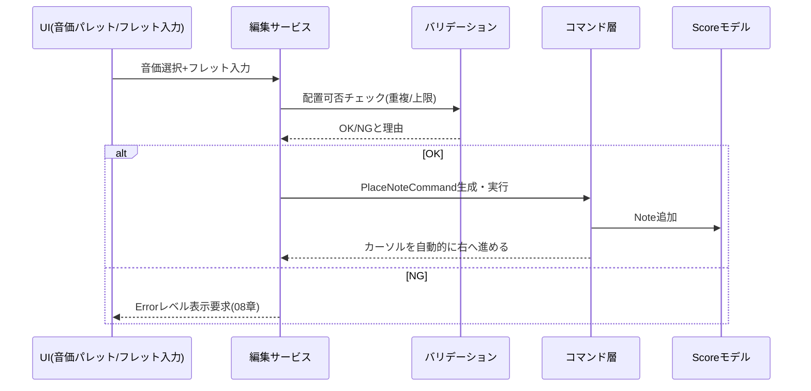

# タブ譜編集コア機能設計書

対応要件：要件定義書4.1節（タブ譜編集）全般、4.5節の一部（誤削除対策・視覚的フィードバック）

## 1. 全体像：カーソルとコマンドの2軸モデル

編集操作は「**カーソル（現在の入力位置＝パート・小節・拍）**」と「**コマンド（Undo/Redo可能な単位変更）**」の2軸で設計する。UIイベント（クリック・キー入力）は必ずカーソル更新またはコマンド発行のいずれかに帰着させ、UIコンポーネントがドメインモデル（[[02_data_model.md]]）を直接書き換えることを禁止する（[[01_architecture.md]] AD-2）。

## 2. ステップ入力フロー（要件4.1）

1. 音価パレットで音価（例：8分音符）を選択 → 「現在の入力音価」状態を更新（コマンド化不要、UI状態）。
2. フレット入力（クイック選択バーまたはテンキー）で弦・フレットを指定 → `PlaceNoteCommand`発行。
3. コマンド実行成功後、カーソルは現在の音価分だけ自動的に右（次の拍）へ進む。
4. 同一カーソル位置のまま追加でフレットを指定した場合は「和音入力」（3節）として扱う。

**休符の扱い**：カーソルを進めるだけで何も配置しない操作（音価選択→「休符」ボタン、またはEnter/矢印キーでの明示スキップ）は`InsertRestCommand`として明示的にBeat.isRest=trueを生成する。何も操作せず単に音を置かなかった位置は、Bar生成時点でデフォルトで暗黙的休符（isRest=true）として初期化されているため、追加操作は不要（要件4.1「音を置かない＝暗黙的な休符を基本」）。

## 3. 和音入力（要件4.1）

同一カーソル位置（同一Beat）に対する複数回の弦タップは、`PlaceNoteCommand`をBeat内Note配列への追加として扱う。カーソルは和音入力完了（次の音価選択操作、または明示的な確定操作）まで進めない。

## 4. 重複配置チェック（バリデーション）

`PlaceNoteCommand`実行前に以下を検証する（[[02_data_model.md#4.3]]のバリデーション表と対）。

| チェック内容 | 違反時の扱い |
|---|---|
| 同一Beat内で同一stringIndexへの重複配置 | Errorレベル（08章）。配置を拒否し該当弦をハイライト |
| フレット番号が0〜24の範囲外 | Errorレベル。入力自体を受け付けない |
| 小節数が2048を超える追加 | Errorレベルで追加を拒否（**2026-09-02修正**：Warning本来の「操作継続可」の定義と矛盾していたため、[[13_design_decision_points.md#3]]B20によりErrorへ再分類。セルフレビューで発見） |
| パート数が8を超える追加 | Errorレベルで追加を拒否（同上、B20） |

## 5. タイ／スラーの入力（要件4.1「別々の記号として区別」）

- **タイ**：直前と同ピッチの音符を連続配置する際に自動候補として提示し、確定すると`Note.tieToNext = true`をセットする`SetTieCommand`を発行。
- **スラー**：範囲選択（6節）した複数Beatに対し「スラー付与」操作を行うと、対象Note群に共通の`slurGroupId`を付与する`SetSlurCommand`を発行。タイとは別コマンド・別データ属性のため、UI上でも別ボタン／別ショートカットとして提供する。

## 6. 奏法記号・アーティキュレーションの確定方式（要件4.1「自動候補＋長押し/手動補正のハイブリッド」）

### 6.1 自動候補ロジック（機械的に推定可能なもの）

「タイミングが密接」等の曖昧な表現ではなく、[[13_design_decision_points.md#3]]B4で確定した具体的なしきい値を採用する（実装時に微調整可能な定数として持つ）。

| パターン | 判定条件（既定しきい値） | 自動候補 |
|---|---|---|
| 同一弦・連続するBeatでフレット番号が変化 | 直前Beatとの間隔が1拍以内、かつフレット差が1〜4 | スライド候補を自動提示 |
| 同一弦・連続するBeatでフレット番号が上がる | 直前Beatとの間隔が1拍以内、かつフレット差が1〜4 | ハンマリング候補 |
| 同一弦・連続するBeatでフレット番号が下がる | 直前Beatとの間隔が1拍以内、かつフレット差が1〜4 | プリング候補 |
| 直後に無音（休符）が続く短い音価 | 音価が8分音符以下、かつ次のBeatがisRest=true | スタッカート候補 |

フレット差が4を超える、または間隔が1拍を超える場合は自動候補を出さない（大きな跳躍は単なる別音である可能性が高く、誤検出ノイズになりやすいため）。これらはあくまで「候補提示」であり、確定は自動で行わない。ユーザーが候補をワンクリック承認するか、無視して他の記号を手動選択する。この判定は複数条件の組み合わせ（間隔×フレット差）であるため、[[11_test_strategy.md#2]]の方針によりC2（条件網羅）まで単体テストで検証する対象とする（[[11_test_strategy.md#3]]）。

### 6.2 手動指定のみのもの（推定不可能なもの）

チョーキングの幅（1音／半音／1音半／カスタム）、ハーモニクスの種別（自然／人工／ピンチ）、パームミュートの範囲、タッピング／スラップ／ポップの種別は演奏者の意図に依存し機械推定できないため、常に手動選択UI（PC版：右クリックメニューまたはダブルクリックのポップオーバー、[[03_screens_ui_pc.md#8]]）から明示指定する。

いずれの場合も内部的には`SetTechniqueCommand(noteId, techniquePatch)`という単一コマンド形状に統一し、[[02_data_model.md#3.4]]のNote.techniques構造を部分更新する。

## 7. コードネーム表示（要件4.1）

1. Beat内のNote群（和音）が確定するたびに、`ChordDetectionService`が構成音（弦のチューニング＋フレットから実音を算出）からルート音・コード品質（メジャー/マイナー/7th等）を推定する。
2. 推定は既知コードフォームの辞書照合＋構成音からの一般的な和声解析（転回形対応）のハイブリッドとし、複数候補がある場合は最も一般的なもの（開放的な形、テンションを含まない解釈）を既定候補として提示する。具体的なアルゴリズム（辞書のカバー範囲、転回形の優先順位付けルール等）は詳細設計で確定してよい実装詳細と位置づける（常に手動修正の逃げ道があり、誤検出の影響が小さいため基本設計では意図的に確定させない）。
3. 提示された候補は`Beat.chordNameOverride`（nullなら自動表示、値があれば手動値を優先表示）として保持し、ユーザーが手動修正すると`SetChordNameCommand`でoverrideを設定する。
4. コードダイアグラム（指板図）は要件により不要。テキスト表示のみ。

## 8. Undo/Redoコマンド設計（要件4.1「全パート横断」。保持件数の方針は2026-09-03改訂、8.2節参照）

### 8.1 コマンドの責務（概念レベル）

編集操作は共通して「**コマンド**」という単位に集約する。個々のコマンド（`PlaceNoteCommand`、`SetTechniqueCommand`等、本章各節で言及したもの）は以下の責務を持つ概念として設計する。具体的なインターフェース定義（メソッドシグネチャ・型）は詳細設計書（[[15_development_process.md#1.2]]、`detailed_design/`）で確定する（[[13_design_decision_points.md#3]]B13）。

| 責務 | 内容 |
|---|---|
| 識別・表示 | Undo/Redo履歴上でユーザーに提示するための識別情報とラベル（例：「音符を配置」）を持つ |
| 実行 | Scoreモデルに対する変更を適用する |
| 取り消し | 実行内容を打ち消し、変更前の状態へ戻す（execute/undoの対称性を保証する） |
| 結合可否判定 | ドラッグ中のプレビュー操作等、連続する同種の細かい操作を1つの履歴エントリへまとめられるかを判定する（任意。すべてのコマンドが対応する必要はない） |
| 結合 | 結合可能と判定された2つのコマンドを1つにまとめる（任意） |

### 8.2 履歴管理

- **`CommandHistory`は編集ウィンドウ（＝開いている曲）ごとに1つのインスタンスを持つ**（各インスタンスの中で全パート横断、[[01_architecture.md]]の編集サービス層に所属）。**2026-09-02修正**：旧版では「アプリ全体で1つ」と記載していたが、[[03_screens_ui_pc.md#2]]で複数の編集ウィンドウ（異なる曲）を同時に開ける方針が確定しているため、文字通りアプリプロセス全体で単一インスタンスにすると、異なる曲を編集中のUndo/Redoが互いのスタックを壊す不整合を起こす。正しくは「1つの曲（＝1つの編集ウィンドウ）の中では全パートが1つの`CommandHistory`を共有する」という意味であり、ウィンドウ単位のインスタンスに訂正する。詳細は[[../detailed_design/editing-core.md#6.2]]参照（**2026-09-02再修正**：本行は当初存在しない`part-tuning-management.md#3.5`を指していたが、正しい参照先である`editing-core.md#6.2`に訂正した。セルフレビューで発見）。
- 新規コマンド実行時、`redoStack`はクリアする（標準的なUndo/Redoの挙動）。
- **差分保持の原則と例外**：各コマンドは原則として差分（パッチ）のみを保持し、Scoreモデル全体のスナップショットを複製しない（09章のメモリ目標に対応）。ただし`RemovePartCommand`（パート削除のUndo）は復元のためパート全体（最大2048小節分）を保持する必要があり、この原則の例外となる。この例外的な大容量コマンドが「セッション内無制限」の保持要件と組み合わさるとメモリを際限なく圧迫するリスクがあるため（[[../review/design_review_2026-09-03.md]]B-2で指摘）、以下の予算制へ改訂した。
- **上限方針（2026-09-03改訂）**：要件4.1の「セッション内無制限」は、[[13_design_decision_points.md#5]]C11の是正により「セッション内、メモリ予算に基づく実務上十分な深さ」へ変更した（要件変更履歴は[[../tab_app_requirements.md#10]]#12参照）。通常編集（音符配置等）のコマンドは数百バイト程度であり予算をほぼ消費しないため、実際に予算を圧迫するのは`RemovePartCommand`や全パート横断の`DeleteBarCommand`のような大容量コマンドのみである。ハイブリッド方式（予算制＋下限保証＋最古エントリからの破棄）で、通常利用時の体感を変えないまま上限を設ける。
  - **メモリ予算**：`CommandHistory`インスタンス1つ（＝編集ウィンドウ1つ）あたり、undoStack・redoStackの推定サイズ合計で**80MB**を予算とする。
  - **下限保証**：予算を超過していても、直近**200件**のエントリは必ず保持する（巨大な削除の直後でも、通常の小さな取り消し操作が効くようにするための安全弁）。
  - **破棄（エビクション）**：新規コマンドのpush時に推定合計サイズが予算を超え、かつ下限（200件）を満たしている場合、undoStack側の最も古いエントリから順に破棄し、予算以内または下限件数まで縮小する。
  - **単一コマンドが予算超過する場合**：1件のコマンドの推定サイズだけで予算全体を超える場合でも、そのコマンドの実行自体は拒否しない。代わりに他の古いエントリを可能な限り破棄して領域を確保する。
  - **通知**：セッション中に実際にエビクションが発生し履歴が破棄された最初の1回のみ、Infoレベルの通知（`EDIT-008`、[[08_error_logging.md#3]]の分類に従いトースト表示）をユーザーに提示する。2回目以降の破棄は再通知しない（頻発する通知による煩わしさを避けるため）。
- **複合操作（ペースト・小節挿入等）** は複数の`Command`を`CompositeCommand`としてまとめ、1回のUndoで全体が戻るようにする（`CompositeCommand`の推定サイズは内包する各Commandの合計として予算計算に含める）。

各Commandのexecute/undoの対称性は、Undo/Redoの信頼性が要件上の必須事項であるため[[11_test_strategy.md#2]]の方針によりC2（条件網羅）まで単体テストで検証する対象とする（[[11_test_strategy.md#3]]）。予算制・下限保証・エビクション・通知の各分岐も同様にC2まで検証対象とする。

### 8.3 セッション境界

要件5.6「Undo/Redo履歴の永続化はセッション限定」に対応し、`CommandHistory`はアプリプロセス内メモリのみに保持し、ファイルには一切書き出さない（ウィンドウを閉じればそのウィンドウの`CommandHistory`も破棄される）。曲データ自体は各コマンド実行後の自動保存（06章）で保護される。

## 9. 範囲選択・コピー＆ペースト（要件4.1、4.5）

- 選択モード：トグル方式（開始位置クリック→終了位置クリックで範囲確定、[[03_screens_ui_pc.md#8]]ではShift+クリックでも可）。
- **選択対象範囲は単一パート内のみ**（要件4.5、複数パートをまたいだ選択は不可）。
- コピー：選択範囲のBeat/Note群をクリップボード内部形式（アプリ内メモリ、OSクリップボード連携は任意）としてシリアライズ。
- ペースト：**貼り付け先は選択元と異なるパートでもよい**。貼り付け時は`PasteCommand`（`CompositeCommand`）が、貼り付け先パートの弦本数・チューニングとの整合性チェックを行った上でBeat/Noteを複製する。弦数の過不足について、[[13_design_decision_points.md#3]]B3で非対称なルールに確定した：
  - 貼り付け先の弦数が**不足**する場合：超過する弦のNoteは警告（Warning）付きで破棄する。
  - 貼り付け先の弦数が**多い**場合：単に余った弦を使用しないだけであり、データが失われるわけではないため警告は出さない。

## 10. 小節の挿入・削除（要件4.1）

- `InsertBarCommand`／`DeleteBarCommand`は対象パートのみでなく、**曲全体（全パート）の小節構造を同期して変更する**（小節番号のズレを防ぐため）。挿入位置以降の全パートのBarインデックスを再採番する`CompositeCommand`として実装する。
- **拍子／テンポの継承チェーンの扱い**（[[13_design_decision_points.md#3]]B5で確定）：
  - 挿入：新規小節の`timeSignature`/`tempoBpm`は常に`null`（＝直前の値を継承）で初期化する。直前の実値をコピーして固定値化しない。こうすることで、後から挿入位置より前の拍子・テンポを変更した場合にも新規小節へ自動的に反映される。
  - 削除：`null`（継承）は「値そのもの」ではなく「継承するという参照方向の指定」であるため、前後の小節が持つ継承チェーンは削除によって変化しない。追加の再計算処理は不要。
  - この2点は複合条件（挿入位置・継承方向の組み合わせ）を含むため、[[11_test_strategy.md#2]]の方針によりC2まで含めて[[11_test_strategy.md#3]]の自動テスト対象に含める。
- セクションマーカー・小節メモは対応するBarへの参照を保持しているため、Bar削除時は関連するSectionMarker/Memoの扱いをユーザーに確認する（Criticalダイアログ、08章）。選択肢は「削除する」「直前の小節へ移動する」の2つとし、**既定（フォーカス）ボタンは「直前の小節へ移動する」に確定した**（[[13_design_decision_points.md#3]]B2）。誤ってEnterキー等で確定操作をしてしまっても情報が失われない、安全側の既定とするため。

## 11. バリデーションサービス一覧（まとめ）

| 検証項目 | 発生タイミング | エラーレベル |
|---|---|---|
| 弦・タイミング重複 | ノート配置時 | Error |
| フレット範囲外(0-24) | 入力時 | Error |
| 小節数上限(2048) | 小節挿入時 | Error（**2026-09-02修正**、B20） |
| パート数上限(8) | パート追加時 | Error（同上、B20） |
| メモ文字数上限(100字) | メモ入力時 | Warning（入力自体はブロックしない。保存時に先頭100字までへ切り詰めて永続化する。**2026-09-03明確化**、[[13_design_decision_points.md#5]]C13） |
| タグ総数上限(50) | タグ新規作成時 | Error（同上、B20） |
| 曲数が上限の90%(900件)に到達 | 新規曲作成時 | Warning（追加自体は継続可能な予告的警告） |
| 曲数上限(1000件)到達 | 新規曲作成時 | Error（新規作成を拒否。**2026-09-03追記**、[[13_design_decision_points.md#5]]C12、`SONG-002`） |

**2026-09-02追記（セルフレビューでの是正）**：小節数・パート数・タグ数の3件はいずれもハードキャップ（超過時に操作自体を拒否する）であるため、Warning（操作継続可）ではなくErrorへ再分類した（[[13_design_decision_points.md#3]]B20）。曲数上限のみ「90%到達時点の予告」という性質のため、追加自体は継続可能なWarningのまま据え置く。

**2026-09-03追記（レビュー是正）**：曲数上限（1000件）到達時の挙動が未定義だった点を是正し、他のハードキャップ（小節数・パート数・タグ数）と同様に新規作成を拒否するErrorとして確定した（[[13_design_decision_points.md#5]]C12、`SONG-002`）。あわせて、メモ文字数上限の「入力継続は可」と「上限で打ち切り」の併記が二義的だった点も是正し、「入力自体はブロックしないが、保存される内容は先頭100字に切り詰める」という一義的な挙動に確定した（同C13）。

本節の各検証項目は[[11_test_strategy.md#2]]の方針によりC2（条件網羅）まで単体テストで検証する対象である（[[11_test_strategy.md#3]]）。
