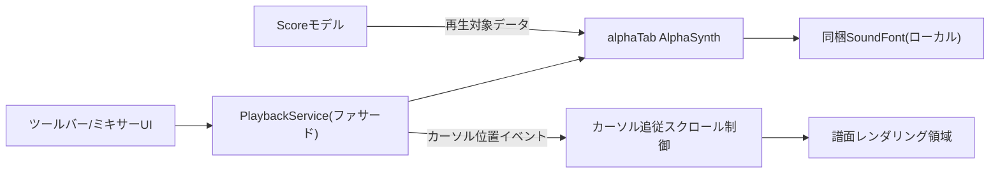
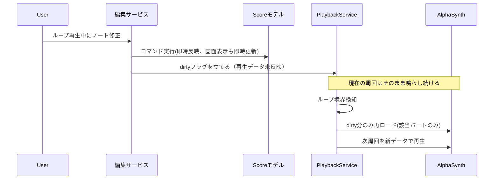

# 再生・オーディオエンジン設計書

対応要件：要件定義書4.3節（再生機能）、5.2節（パフォーマンス目標）、8章リスク#1・#7

## 1. 全体構成

alphaTab同梱の音源エンジン（AlphaSynth、SoundFont2ベース）をそのまま採用し、独自シンセは実装しない。再生制御サービス（[[01_architecture.md]]L2層）はalphaTabの再生APIを呼び出す薄いファサードとして設計し、UIからは「再生」「停止」「シーク」「ループ範囲設定」「テンポ倍率」「パート別ミュート／ソロ」「音量／パン」という抽象操作のみを公開する。

## 2. 合奏再生・パート別ソロ再生（要件4.3）

- 既定は全パート合奏再生。PlaybackServiceがパート単位のミュート／ソロ状態を切り替えるAPIを公開し、UI（ミキサーパネル）からパート単位でON/OFFを指定できるようにする（具体的なメソッドシグネチャは詳細設計書［[[15_development_process.md#1.2]]、`detailed_design/`］で確定する）。
- ソロ指定パートが1つ以上ある場合、AlphaSynth側の対応するトラックチャンネルのみをアクティブにし、それ以外は内部的にミュート扱いとする（ミュートとソロが同時指定された場合はソロを優先）。
- ミキサーパネル（[[03_screens_ui_pc.md#10]]）の音量・パンは各パートのMIDIチャンネルのControl Change（Volume/Pan）へ即時反映する。

## 3. 区間ループ再生・セクションループ（要件4.3、リスク#7）

### 3.1 基本ループ

- ループ範囲は「小節番号の開始・終了」で指定する（区間ループ）。セクションマーカー（[[02_data_model.md#3.5]]）を選択した場合は、そのマーカーが示す小節範囲を自動的にループ範囲として設定する（要件4.1「セクションループ再生」）。
- ループ境界に到達したら、再生位置を開始小節の先頭にシークし直して再生を継続する。

### 3.2 ループ再生中の同時編集（リスク#7：最重要の技術的難所）

**方針**：ループ再生中の編集操作（ノート追加・修正）は、通常時と同じコマンド層（[[04_editing_core.md#8]]）を経由してScoreモデルへ即時反映するが、**再生中のAlphaSynthへの反映はループ境界（次周回の先頭）まで遅延させる**。理由：再生中の1小節の途中で発音データを書き換えると、シンセ内部の発音キュー不整合やノイズ（クリック音）の原因になりやすいため。

- **画面表示（譜面）は即時反映**し、ユーザーは編集結果をすぐ視認できる（要件の「その場で修正」というUX意図を損なわない）。「音」の反映のみループ境界まで遅延する点をUI上インジケーター（例：小節に「変更待ち」マーク）で明示する。
- 変更対象パートのみを部分的に再ロードすることで、大曲でも境界での遅延を最小化する（09章のパフォーマンス目標と連動）。
- カテゴリA（技術検証待ち）の分岐点：alphaTabのAlphaSynth APIが「再生中の部分差し替え」をどこまでサポートするかはPhase 1でのプロトタイプ検証が必要（要件書リスク#7、[[13_design_decision_points.md#2]]A4）。サポートが薄い場合の代替案：ループ境界で一旦停止し即座に新データで再開する（境界での数十msの空白は許容するフォールバック）。

## 4. 減速再生（要件4.3）

alphaTabはMIDIベースのシンセ再生であり、テンポ変更は音声の時間伸縮（タイムストレッチ）ではなく**再生テンポ数値そのものを変更**することで実現するため、ピッチ変化やアーティファクトは発生しない。PlaybackServiceが再生テンポの倍率を指定するAPIを公開し、Barの基準テンポに対する倍率として再生する（具体的なメソッドシグネチャは詳細設計書で確定する）。

## 5. カーソル自動追従スクロール（要件4.3）

alphaTabの再生位置イベント（Beat単位で発火）を購読し、現在フォーカスビュー外に再生カーソルが出た場合のみスクロール位置を更新する（過剰な自動スクロールによるちらつきを避けるため、カーソルが表示領域内にある間はスクロールしない）。

## 6. メトロノーム・カウントイン・タップテンポ（要件4.1、4.3）

未決事項#5・[[13_design_decision_points.md#4]]C1/C2で以下の通り確定した。

| 機能 | 設計 |
|---|---|
| メトロノーム音色 | **複数音色プリセットを用意し、設定画面（[[03_screens_ui_pc.md#10]]）から選択可能にする**。MVPでは最低でもアコースティック系（木質的なクリック音）1種＋電子系（電子的なビープ音）1種を同梱する。いずれの音色でも、1拍目の強調は共通してピッチを上げる方向で実装する（アクセント用に別途高いピッチのワンショットサンプルまたは合成音を用意） |
| カウントイン | 再生開始前に、**現在の拍子の1小節分**のクリック音を鳴らしてから再生を開始する`CountInController`を既定動作とする。設定画面で「1小節分／2小節分」の倍率を選択できるようにする |
| タップテンポ | UIボタンの連続クリック間隔（直近3〜4回の平均）からBPMを算出し、`Bar.tempoBpm`更新コマンドを発行 |
| 設定項目 | メトロノーム音量・音色、カウントインの長さ（倍率）、タップテンポの感度は設定ダイアログ（[[03_screens_ui_pc.md#10]]）で調整可能にする |

## 7. ミキサー実装（要件4.3「専用ミキサー画面」）

ミキサーパネルの音量／パン／ソロ／ミュートは、[[02_data_model.md#3.2]]のPartエンティティに永続化される値をそのままAlphaSynthのチャンネル制御へバインドする単方向データフローとする（UI操作→コマンド→モデル更新→AlphaSynthへ反映、の順で必ずモデルを経由し、UIから直接シンセを操作しない）。

## 8. バックグラウンド音楽アプリとの共存（要件4.3、3.2節）

- **PC版**：OS標準で複数アプリの音声が同時に鳴らせるため、本設計上は特別な対応を行わない（要件どおり）。
- **iPhone版（Phase 3）**：AudioSessionAdapter（[[01_architecture.md]]AD-3）がiPhone版ラッパーでのみ実処理を持ち、AVAudioSessionの`mixWithOthers`オプションを設定する。WebView内の音声がこの設定を継承するかは未検証（要件書リスク#1）であり、10章で拡張設計時に詳細化する。

## 9. パフォーマンス目標との対応（要件5.2）

| 目標 | 対応 |
|---|---|
| 再生開始レイテンシ200ms以内 | AlphaSynthの初期化はアプリ起動直後に先行して行い（曲を開くタイミングではなく）、曲を開いた時点では音源の初期化待ちが発生しないようにする |
| ノート入力反応100ms以内 | 3.2節のとおり、画面反映とシンセ反映を分離し、画面反映（体感速度に直結）を優先して即時実行する |
