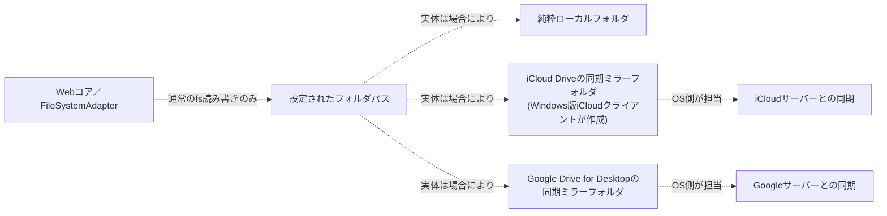
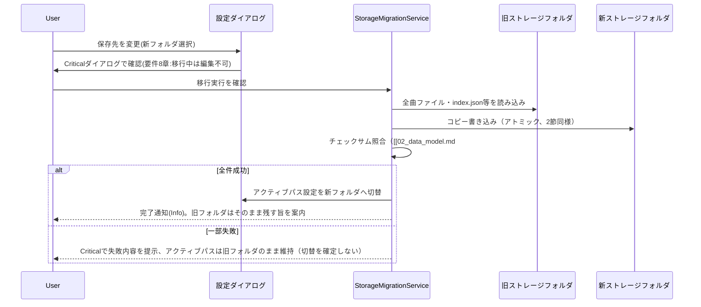
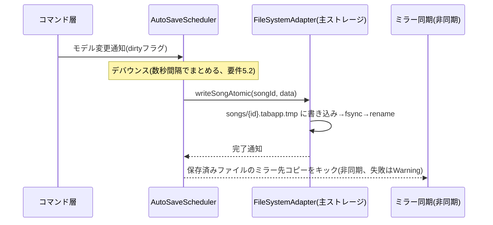

# ファイルI/O・永続化設計書

対応要件：要件定義書4.4節、4.5節（保存先）、5.1節（iCloud同期）、5.4節（信頼性）、5.6節（複数ウィンドウ）、8章リスク#6

> **本セッションでの要件変更（重要）**：要件定義書4.5節は当初「保存先はアプリ専用領域（iCloud経由の同期領域含む）に固定。ユーザーによる任意フォルダ選択は不要」としていたが、ヒアリングの結果、**保存先をローカル／iCloud Drive／Google Driveから選択可能にし、設定画面から変更でき、複数の保存先を組み合わせられるようにする**方針に変更された。本章はこの変更後の方針で再設計する（旧方針との差分は[[12_traceability.md#3]]に記録）。

## 1. 設計方針：ストレージバックエンドの抽象化

要件変更を受け、[[01_architecture.md#3]]AD-3の`FileSystemAdapter`は「iCloud Driveへの固定書き込み」ではなく、**「設定可能なローカルフォルダパスへの読み書き」**として汎用化する。

**重要な設計判断**：iCloud Drive・Google Driveのいずれも、アプリが直接クラウドAPIを呼び出すのではなく、**OS側の同期クライアント（Windows版iCloud、Google Drive for Desktop）がローカルに作るミラーフォルダに対して、通常のNode.js `fs`で読み書きする**方式を維持する。これにより：

- クラウドAPI認証・トークン管理・ネットワーク例外処理といった複雑さを一切アプリに持ち込まない。
- 要件5.1「完全オフライン動作」を、どの保存先を選んでも維持できる（アプリ自身は常にローカルファイルI/Oしか行わない。同期はOS側の責務）。
- 「ローカル」「iCloud Drive」「Google Drive」は、アプリから見ればすべて**「単なるフォルダパス」**という同一の抽象で扱える。



## 2. ストレージロケーション設定

### 2.1 設定項目（設定ダイアログ、[[03_screens_ui_pc.md#10]]に追加）

| 項目 | 内容 |
|---|---|
| 主ストレージ（プライマリ） | アプリが実際に読み書きするフォルダ。1つだけ指定可能。既定値は**ローカル**（`%APPDATA%/TabApp/`相当、クラウド依存なしで確実に動く既定） |
| 候補の自動検出 | 起動時／設定画面表示時に、既知のパスパターンでiCloud Drive・Google Drive for Desktopのローカルルートを検出し（例：iCloud Driveは`%USERPROFILE%\iCloudDrive\`、Google Driveは`%USERPROFILE%\Google Drive\`や割当済みドライブレター等、環境により異なるため複数パターンを走査）、見つかればプルダウンの選択肢として提示する。見つからない場合は「カスタムフォルダを選択」で任意のフォルダを指定可能（要件4.5で当初不要とされていた「任意フォルダ選択」は、本要件変更に伴い復活する） |
| ミラー（バックアップ）先 | 主ストレージへの保存が成功するたびに、追加でコピーを作成するフォルダを0個以上設定可能（4節） |

### 2.2 主ストレージの切替（移行）フロー

要件4.5「保存先固定」の撤回に伴い、稼働中に保存先を変更できる必要がある。



- 移行中はすべての編集ウィンドウを一時ロック（保存不可）し、整合性の破綻を防ぐ。
- 旧フォルダのファイルは**自動削除しない**（本人が内容を確認してから手動整理する運用。誤操作での消失を避ける）。

## 3. ディレクトリ構造（主ストレージフォルダ配下）

```
{アクティブなストレージルート}/           … 設定で選択されたフォルダ（ローカル／iCloud Drive／Google Drive／カスタム）
└─ TabApp/
   ├─ songs/{songId}.tabapp
   ├─ trash/{songId}.tabapp
   ├─ trash-index.json           … trash/内エントリの削除日時索引（index.jsonと対称的にTabApp/直下に置く、B29）
   ├─ index.json
   ├─ tuning-presets.json
   ├─ tags.json
   ├─ settings.json              … storageLocation設定・mirrorLocations設定を含む
   └─ logs/
```

`settings.json`はアプリの起動時参照が必要なため、主ストレージが未確定な初回起動時は常にローカル既定パスに配置し、主ストレージが確定した後は「主ストレージが今どこか」を指すポインタ情報のみをローカル既定パスにも複製しておく（クラウドフォルダが同期完了前でも、アプリが自分の設定を見失わないようにするため）。

**2026-09-04追記（C14、監査是正）**：`logs/`はこの通り主ストレージ配下の`TabApp/`ディレクトリに含まれるが、[[13_design_decision_points.md#4]]C14の決定により、`StorageMigrationService`（[[../detailed_design/data-model-persistence.md#5]]）の移行対象には**含めない**。個人開発規模でのログの重要度、および移行対象を増やすことによる移行処理自体の複雑化・失敗リスク増を踏まえた判断であり、移行後は旧保存先の`logs/`がそのまま残置される（アプリ内からは追跡されない）ことを許容する。ログの閲覧手段は引き続き設定ダイアログの「アプリ情報」からOSのエクスプローラーでフォルダを開く方式のみとし、アプリ内ログビューアは新設しない（[[../review/design_review_2026-09-03.md]]B-5、[[../review/design_review_2026-09-03_audit.md]]B-5で反映先のクロスリファレンス誤りが指摘されたため、本節に実体を追記した）。

**2026-09-06追記（レビュー是正、B-1、[[../review/design_review_2026-09-04.md]]）**：上記ディレクトリ構造の`trash/{songId}.tabapp, trash-index.json`という表記が、`trash-index.json`を`trash/`配下・`TabApp/`直下のいずれに置く意図なのか一意に読み取れないという指摘を受けた。実際には`trash-index.json`は`index.json`（`songs/`の内容を追跡する索引）と同じ性質の索引ファイルであり、`SongIndexService`と`TrashService`が対称的な設計（[[../detailed_design/data-model-persistence.md#3.2]]）であることを踏まえ、**`index.json`と同じく`TabApp/`直下に配置する**（`trash/`配下には含めない）ことに確定した（B29、[[13_design_decision_points.md#3]]）。上記の構造表記をこれに合わせて1行1エントリに修正し、`trash/`と`trash-index.json`を別々の行に分けた。あわせて、[[../detailed_design/data-model-persistence.md#5]]の移行対象一覧にも`trash-index.json`を明記した。

## 4. ミラー（複数バックアップ先）設計

「組み合わせ方には可能・不可能がある」というヒアリング指摘を踏まえ、実現可否を整理する。

### 4.1 動作モデル

主ストレージへのアトミック書き込み（5節）が成功した後、**非同期・ベストエフォート**で、設定されたミラー先フォルダそれぞれに同一内容をコピーする。ミラー先への書き込み失敗はWarningレベル（[[08_error_logging.md]]）に留め、主ストレージへの保存自体はブロックしない（ミラーはあくまで保険であり、主機能を犠牲にしない）。

### 4.2 組み合わせパターンの実現可否

| パターン | 可否 | 備考 |
|---|---|---|
| 主＝ローカルのみ（ミラーなし） | 可（既定） | 最もシンプルでオフライン耐性が最も高い |
| 主＝iCloud Driveフォルダ | 可 | 従来案どおり。Windows版iCloudクライアント必須（要件書リスク#6） |
| 主＝Google Driveフォルダ | 可 | Google Drive for Desktop必須。iCloudと同様にオンデマンドダウンロード注意（4.3節） |
| 主＝ローカル＋ミラー＝iCloud Drive | 可（推奨構成の一つ） | 普段の読み書きはローカルで高速・確実、クラウド保管は保険として非同期実行 |
| 主＝ローカル＋ミラー＝iCloud Drive＋ミラー＝Google Drive | 可 | ミラー先は複数設定可能。2系統のクラウドに同時保管したい場合に有効 |
| 主＝iCloud Driveフォルダ＋ミラー＝Google Driveフォルダ | 可だが冗長 | 動作はするが、主ストレージ自体を軽量なローカルにしてミラーへ逃がす構成の方が読み書き速度の面で有利。設定画面でこの組み合わせを選んだ場合は参考情報としてInfoレベルで案内する |
| 同一フォルダを主ストレージとミラー先の両方に指定 | **不可（バリデーションでブロック）** | 意味を持たない設定であり、書き込みの二重化による不整合リスクがあるため拒否する |
| 1つのフォルダを同時にiCloud DriveとGoogle Driveの両方の同期対象にする | **不可（OS/同期クライアント側の制約）** | いずれの同期クライアントも「1フォルダ＝1つの同期ルート」を前提としており、アプリの設計では制御できない。ユーザーが両方のクラウドに保管したい場合は、必ず「別々のフォルダ」をそれぞれの同期対象にし、本設計のミラー機能で使い分ける必要がある（設定UI上、iCloud Drive用フォルダとGoogle Drive用フォルダに同じパスを選ぼうとした場合はError表示） |

### 4.3 マルチデバイス同時編集についての限界（新たな留意事項）

主ストレージにクラウド同期フォルダを使うことで複数端末からのアクセスが可能になるが、本設計は**単一ライター前提**（要件5.6「同一曲を二重に開くことは禁止」は同一マシン内の話であり、別マシンからの同時編集競合は検知・解決しない）。同期フォルダを複数端末で共有する場合、他端末で同時に同じ曲を開いて編集すると同期クライアント側の競合コピー（例：「ファイル名 (競合版).tabapp」）が発生しうる。これは要件定義書のスコープ外（個人が1台のPCで使う前提）だが、将来的にiPhone版（Phase 3）と併用する際に顕在化しうるため、[[10_extensibility_future.md]]に申し送る（Phase 3のiOS側ストレージ実装契約に関する個別のギャップは[[13_design_decision_points.md#2]]A12として別途登録した）。

## 5. 自動保存とアトミック書き込み（要件5.6「一時ファイル書き込み後リネーム」）



- 一時ファイル名は`{id}.tabapp.tmp`とし、書き込み完了後に`rename`でアトミックに本ファイルへ置換する。
- `integrity.checksum`（[[02_data_model.md#4.1]]）を保存時に算出・保存し、読み込み時・移行時に検証する。

## 6. クラウド同期フォルダ利用時の技術的注意（要件5.1、リスク#6の拡張）

| 項目 | 内容 |
|---|---|
| オンデマンドダウンロード対策 | iCloud Drive・Google Drive for Desktopともに、ローカルに実体がない「プレースホルダーファイル」状態になりうる。読み込み時に実体化を待つリトライ処理を挟む（両プロバイダ共通の対策として一般化） |
| 検証範囲 | Phase 1前半でWindows版iCloudクライアントのfsアクセス安定性を検証（要件書リスク#6）。Google Drive for Desktopについても同様の検証をPhase 1前半〜中盤で追加実施する（本要件変更に伴う追加検証項目） |
| オフライン要件との整合 | アプリ自体はクラウドAPIを呼ばずローカルfsのみ操作するため、要件5.1「完全オフライン動作」は保存先の種類に関わらず維持される。ただし同期完了前のファイルをオフライン下で開こうとした場合の挙動（上記オンデマンドダウンロード問題）はデータ保護上の注意点として残る |

## 7. ゴミ箱（要件4.5）

| 項目 | 設計 |
|---|---|
| 削除操作 | `songs/{id}.tabapp`を`trash/{id}.tabapp`へ移動し、`trash-index.json`に削除日時を記録 |
| 復元 | 一覧から選択し`trash/`から`songs/`へ戻す。`index.json`も更新 |
| 保持期間 | **30日間に確定**（[[13_design_decision_points.md#3]]B9）。設定ダイアログ（[[03_screens_ui_pc.md#10]]）から変更可能な値として持つ |
| 完全削除 | 保持期間経過後、アプリ起動時のバックグラウンドタスクで物理削除。手動での即時完全削除もゴミ箱画面から可能 |

## 8. 複数ウィンドウ管理・二重起動防止（要件5.6）

- Electronメインプロセスが`Map<songId, BrowserWindow>`を保持し、`WindowAdapter.openSongWindow(songId)`呼び出し時にこのMapを参照する。
- 既に開いている場合は該当`BrowserWindow.focus()`を呼び、新規ウィンドウは生成しない。

## 9. クラッシュ検知・自動復旧（要件5.4）

- メインプロセスがレンダラークラッシュを検知した場合、該当ウィンドウを再読み込みし、直前の自動保存内容（`songs/{id}.tabapp`、現在の主ストレージ配下）から状態を復元する。
- 復旧後、ユーザーに「直前のクラッシュから復旧しました」旨をWarningレベルで通知する（08章）。

## 10. 曲一覧インデックス更新戦略

- `index.json`は曲の新規作成・削除・タイトル変更・タグ変更・サムネイル更新のタイミングで差分更新する。
- サムネイル生成は自動保存の確定タイミングに合わせて非同期で再生成し、`index.json`の`thumbnailRef`を更新する。「冒頭数小節」という曖昧な範囲指定は、**alphaTabレイアウトでの最初の1段（画面幅相当で自動折返しされる最初のシステム）**と定義して確定した（[[13_design_decision_points.md#3]]B7）。小節数を固定値にしないことで、要件4.6の段組み自動調整の原則と整合させる。

## 11. ファイル関連付け（要件5.6）

- `.tabapp`拡張子をOS標準のファイル関連付けに登録し、エクスプローラーからのダブルクリックで対応する曲の編集ウィンドウを開けるようにする（既に開いていれば前面化、8節と同じロジックを再利用）。

## 12. データ保護のまとめ（要件5.4、要件変更後の全体像）

| リスク | 対策 |
|---|---|
| 保存中のクラッシュによる破損 | 5節のアトミック書き込み |
| 誤削除 | 7節のゴミ箱 |
| アプリ/レンダラークラッシュ | 9節の自動復旧 |
| 単一ストレージ先の障害・消失 | 4節のミラー機能（複数クラウド／ローカルへの分散保管）で緩和 |
| 機種変更・端末紛失 | 主ストレージにクラウド同期フォルダを選んでいれば副次的なバックアップ効果を得られる（本格的な世代管理バックアップは[[12_traceability.md#2]]のヒアリングにより「不要」と確定済み） |
| 保存直前の状態への巻き戻し（実装内部の安全ネット、2026-09-03追記） | `LocalBackupService`によるデバイスローカル1世代バックアップ（[[13_design_decision_points.md#3]]B25、[[../detailed_design/data-model-persistence.md#9]]）。上記「機種変更・端末紛失」の行とは別の話であり、ユーザーが意識して使う世代管理バックアップ機能ではなく、`SongRepository.save()`内部でのみ使う非公開の実装上の安全ネットである。主ストレージ・ミラー先とは別の、OS標準のアプリローカル領域にのみ置くため、上記の「本格的な世代管理バックアップは不要」という決定とは矛盾しない（複数端末間の同期対象に含めないため、マルチデバイス構成に影響を与えない） |
