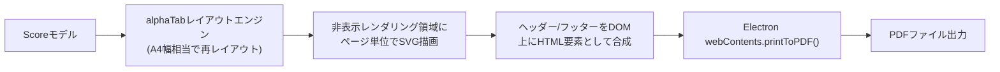

# エクスポート・印刷設計書

対応要件：要件定義書4.1節（エクスポートファイル名）、4.4節（書き出し形式）、4.5節（印刷・PDF出力レイアウト・共有機能）、8章リスク#4、9章Phase 2

## 1. エクスポート対象形式と変換方式

| 形式 | 変換元→先 | 実装方針 |
|---|---|---|
| alphaTex | Scoreモデル → alphaTexテキスト | **【2026-09-01確定、[[13_design_decision_points.md#2]]A3解決】** alphaTab v1.7.0以降が持つネイティブAPI `alphaTab.exporter.AlphaTexExporter`（`exportToString(score, settings)`）を利用する。自前シリアライザは実装しない。要件4.4「内部データそのまま」を満たすため、変換の完全性（技法・タイ/スラー・セクション・繰り返し記号を含む）を検証する（[[11_test_strategy.md#3]]）。ただし検証の主眼は自作ロジックの網羅ではなく、ライブラリのエクスポート結果が要件を満たすか・エクスポート設定オプションを正しく使えているかの確認に変わる |
| MIDI | Scoreモデル → 標準MIDIファイル(SMF) | 要件9章の方針どおり**自前実装**。テンポ・拍子変更、各Noteのピッチ（チューニング+フレットから算出、カポ反映）、ベロシティ、ベンドはピッチベンドCC、パームミュート等は近似的な音色/減衰表現に変換する。パート＝MIDIトラックとして1対1対応させる |
| PDF | Scoreモデル → A4ページ画像群 → PDF | **【設計分岐点B6で決定】** Electronの`webContents.printToPDF()`を第一選択とする。alphaTabのレイアウトエンジンでA4相当にレイアウトした描画結果をそのままPDF化し、ヘッダー・フッター（曲名・ページ番号・日付）の柔軟な配置がこの方式で困難と判明した場合に限り、専用PDF生成ライブラリへの切替を検討する（3節で詳細化、[[13_design_decision_points.md#3]]B6）。**2026-09-01追記**：レンダリングエンジンはSVGを採用する（[[13_design_decision_points.md#2]]A2解決）ため、3.2節の描画結果はSVGベースのベクター出力となる |

## 2. ファイル名生成（要件4.1）

- 自動生成規則：`{曲名}_{YYYYMMDD}.{拡張子}`（例：`千本桜_20260830.pdf`）。
- エクスポートダイアログ（[[03_screens_ui_pc.md#10]]）でこの値をプレースホルダーとして表示し、自由に編集可能にする。
- 曲名に使用不可なファイル名文字（`/ \ : * ? " < > |`）が含まれる場合は自動的に置換する。

## 3. PDF出力・印刷プレビュー（要件4.5）

### 3.1 レイアウト方針

- 用紙サイズはA4固定（要件4.5）。
- 1段あたりの小節数は固定せず、用紙幅に応じて自動調整する（要件4.6「譜面の段組みの共通原則」）。alphaTabの標準レイアウト挙動（画面表示と同一のレイアウトエンジン）をA4幅に合わせたレンダリング設定で流用し、編集画面のフォーカス/全体ビューと実装を分離しない。
- ヘッダー：曲名、フッター：ページ番号（要件4.5）。加えてエクスポート日付を小さく表示する（利便性向上、要件と矛盾しない範囲での追加）。

### 3.2 生成パイプライン（PDF生成方式：設計分岐点B6）

要件書リスク#4（PDF/alphaTexエクスポートAPIの有無未確認）について、[[13_design_decision_points.md#3]]B6・[[13_design_decision_points.md#2]]A3で次の通り確定した。

- **PDF生成の第一選択**：Electron標準APIの`webContents.printToPDF()`を利用する。専用の非表示`BrowserWindow`（またはメインウィンドウ内の印刷用レイアウトDOM）を用意し、alphaTabのレイアウトエンジンでA4幅相当に再レイアウトした描画結果（SVG、[[13_design_decision_points.md#2]]A2で確定）とヘッダー/フッターのHTML要素を配置したうえでこのAPIを呼び出し、直接PDFバイナリを取得する。外部PDFライブラリへの依存を追加せずに済み、ページング処理もChromiumの印刷エンジンに委譲できる利点がある。
- **フォールバック条件**：ヘッダー/フッターのフォント・位置の微調整、既存ページへの追記等、`printToPDF()`のオプションでは実現できない柔軟性が必要と判明した場合に限り、Phase 2でpdf-lib等の専用PDF生成ライブラリへの切替を検討する。この場合、3.1節のページ単位SVG出力を画像化してライブラリに渡す構成に変更する。
- alphaTexエクスポートAPIは2026-09-01の調査で存在を確認済み（1節参照）。これによりPhase 2の技術調査対象（要件書リスク#4）は解消された。

### 3.3 印刷プレビュー画面（要件4.5「アプリ内に専用のプレビュー・印刷画面を用意」）

- PDF生成後、[[03_screens_ui_pc.md#3]]の印刷プレビューダイアログでページめくり表示する。
- 「印刷」ボタン押下でOS標準のプリントダイアログ（プリンタ選択等）を呼び出す（Electronの`webContents.print()`またはネイティブ印刷API経由、実際の印刷処理自体はOSに委譲）。3.2節のPDF生成（`printToPDF()`）とは別のAPI呼び出しだが、同じ印刷用レイアウトDOMを再利用できるため二重実装にはならない。

## 4. 共有機能（要件4.5）

- PC版：エクスプローラーでのファイル表示、既定のメールクライアント起動等、OS標準の共有手段に委ねる（アプリ内に独自の共有UIは持たない）。
- **著作権上の前提**：耳コピしたタブ譜は他者楽曲の転写物であるため、本アプリはエクスポート・共有機能を「少数の知人への私的な共有」を想定した範囲に留め、不特定多数への公開・再配布を前提とした機能（SNS直接投稿、公開リンク発行等）は設計上意図的に持たない。この方針は将来機能追加時にも維持する（要件4.5明記）。

## 5. Phase 2作業への申し送り

- alphaTexネイティブエクスポートAPI（`AlphaTexExporter`）の存在は2026-09-01に確認済み（[[13_design_decision_points.md#2]]A3、1節）。Phase 2ではこのAPIの呼び出しと設定オプションの調整のみで足り、自前シリアライザの実装は不要である。
- PDF生成方式は本書3.2節でElectron `printToPDF()`を第一選択として確定済み（[[13_design_decision_points.md#3]]B6）。Phase 2ではヘッダー/フッター表現がこの方式で十分かを実装しながら検証し、不十分な場合のみ専用ライブラリへの切替を判断する。

## 6. Phase 2詳細設計の完了（2026-09-02追記）

本節5の申し送り事項は、[[../detailed_design/export-print.md]]によってPhase 2の詳細設計として引き取り・具体化された。上記2点の要点は以下のとおり本書の想定通りに確定している。

- alphaTexエクスポートは`AlphaTexExportService`（[[../detailed_design/export-print.md#3.1]]）がネイティブAPI呼び出しのみで実現し、自前シリアライザは実装していない（本書の想定どおり）。
- PDF生成は`PrintLayoutRenderHost`＋`PrintWindowController`（[[../detailed_design/export-print.md#3.2]][[#3.3]]）による`printToPDF()`第一選択の構成で確定しており、フォールバック条件（pdf-lib切替）は実装時未着手のまま据え置かれている（本節・3.2節の想定どおり、B6は変更なし）。

あわせて、[[screens-navigation.md#3.6]]のB19（Phase 1でのエクスポート／印刷ボタン無効化）は、[[../detailed_design/export-print.md#8]]のDefinition of Doneにおいて「本パッケージのサービスに接続され、無効化状態が解除されている」こととして解消条件が明記されている（実際の解除は実装フェーズで行う）。本節以降の詳細は[[../detailed_design/export-print.md]]を正とする。
