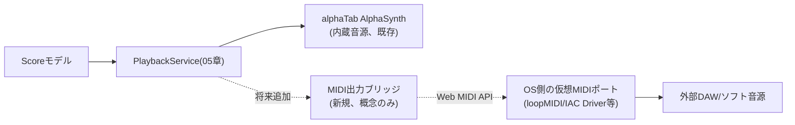

# 拡張性・将来フェーズ設計書

対応要件：要件定義書3.2〜3.4節（v2以降・将来対応）、4.2節（パート抽象化）、5.5〜5.6節の横断的「不要」機能の拡張性方針、6章（マルチプラットフォーム構成）、9章Phase 3〜6、7章未決事項（iPad/Apple Pencil対応・収益化方針）

## 1. 設計原則の再確認

要件定義書全体を貫く「不要」判定機能について、個別列挙ではなく仕組みとして拡張を妨げない設計を徹底する（要件4.5「設計原則（横断的）」）。本書ではPhase 1で確定した設計が、各将来要素をどのフックで受け止めるかを一覧化する。

| 将来要素 | 受け皿となるPhase 1設計 |
|---|---|
| アプリロック（認証） | [[01_architecture.md#3]]AD-3の`PlatformAdapter`に`AuthAdapter`を追加するのみで、既存フローには手を入れない設計とする（Phase 1では未実装のインターフェースとして型だけ用意） |
| 自動アップデート（サーバー配信） | 同AD-3の`UpdateCheckAdapter`。現状はダミー実装、将来は実HTTP問い合わせ実装に差し替えるのみ |
| コード署名 | [[01_architecture.md#5]]のビルドパイプラインをElectron Builder等の疎結合な設定ファイルで管理し、署名ステップを追加してもコア実装に影響しないようにする |
| ダークモード | [[08_error_logging.md#4]]のテーマトークン化により、トークン値の差し替えのみで対応可能 |
| 曲一覧の検索・タグ絞り込みUI | データ構造（Tag、[[02_data_model.md#3.1]]）は先行実装済み。UIの検索ボックスの器も[[03_screens_ui_pc.md#4]]で先行配置済み |
| 複数ストレージバックエンド（ローカル/iCloud/Google Drive） | [[06_file_io_persistence.md]]で実装済み。同じ「フォルダパス抽象」の考え方はDropbox等の追加にもそのまま流用できる |
| 将来の収益化（買い切り課金） | AD-3のアダプタ拡張パターンと、5.6節記載のビルド/配布パイプライン疎結合方針が受け皿となる（9節で詳細化） |
| 外部DAWとのリアルタイムMIDI連携（新規追加） | AD-3のアダプタ拡張パターン（`MidiAdapter`想定）と、05章PlaybackServiceが抽象操作のみを公開するファサード設計が受け皿となる（10節で詳細化） |

## 2. v2：ドラム／パーカッションパート対応

### 2.1 データモデルの拡張ポイント

[[02_data_model.md#3.2]]の`Part.instrumentType`はv1時点で`electric_guitar | bass`のenumとして抽象化済みであり、v2で`drum_kit`等を追加してもPart自体の構造は変わらない。

Note構造（弦・フレット前提）はドラムには適用できないため、v2では**Beatの子要素をポリモーフィックに扱う**設計を見込む。具体的には、Beatが保持する「音イベント」を、種別（弦楽器音／打楽器音）によって内容が異なる集合として抽象化しておき、v1時点では弦楽器音のみを対象とする構造としつつ、種別を区別する属性をあらかじめ持たせておくことで、v2でのドラム種別追加時にBeat側の構造を大きく変更せずに済むようにする。具体的な型定義・データ構造は詳細設計書（[[15_development_process.md#1.2]]、`detailed_design/`）で、02章のデータモデルおよびマイグレーション方針とあわせて確定する（[[13_design_decision_points.md#3]]B13）。

v1実装では音イベントの種別を「弦楽器音」固定として用意しておくことで、v2導入時に既存データのマイグレーション（[[02_data_model.md#4.2]]の後方互換方針）で対応可能にする。

### 2.2 表示・入力の拡張

ドラム譜表記（5線ドラム譜の記号体系）は通常のタブ譜表示（弦とフレット数字の格子）と根本的に異なるため、レンダリング層（03章の譜面表示領域）にドラム専用のレンダリングモードを追加する必要がある。alphaTabがドラム譜表記を標準サポートしているかはv2着手時に技術調査する。

## 3. v2：アコースティックギター等の追加音色

Part.instrumentTypeへの選択肢追加と、対応するSoundFontプログラムチェンジ番号のマッピング追加のみで対応可能（データモデル・UIロジックへの構造変更は不要）。

## 4. Phase 3：iPhone版展開（iPad含む）

### 4.1 ラッパー構成

[[01_architecture.md#3]]AD-3の`PlatformAdapter`実装をExpo版で用意する。

| Adapter | iPhone版実装 |
|---|---|
| FileSystemAdapter | iCloud Ubiquity Container API（[[06_file_io_persistence.md]]のストレージバックエンド抽象化と同様、ローカル/iCloud等をアプリ側設定で選べる構成をiOS側でも踏襲する）。**2026-09-03追記（新しい視点でのレビューによる指摘）**：本行が想定していた実装方式には、iOS実機でのフォルダアクセス実現手段（`UIDocumentPickerViewController`のフォルダピッカーモード＋セキュリティスコープ付きブックマークによる永続化）との間に契約レベルの齟齬がある可能性が、実機を要さない公開情報の調査により判明した。ブックマークの失効（`isStale`）やiCloud Drive／Google DriveのFile Provider方式によるオンデマンド評価・退避、Expoマネージドワークフローではこの永続フォルダピッカーが実現できない（カスタムネイティブモジュールが必要）といった制約を含め、[[13_design_decision_points.md#2]]A12として正式に技術検証待ち事項へ登録した。Phase 3の詳細設計（クラス構成・メソッドシグネチャの確定）に着手する前に、A12の契約再検討を行うことを推奨する |
| AudioSessionAdapter | expo-audioでAVAudioSession `mixWithOthers`設定（要件書リスク#1）。**2026-09-02追記（重要度の再評価）**：本項目は当初「Phase 3最優先でスパイク検証」とだけ記載していたが、本人からの指摘を受けて[[13_design_decision_points.md#2]]A11として正式に技術検証待ち事項へ登録し、実機を要さない範囲で公開情報を調査した。その結果、WKWebView（Expo WebViewの基盤）がホストアプリ側のAVAudioSessionカテゴリ設定を無視するという長期未解決の既知の制約（WebKit公式バグトラッカーで2017年から未解決、react-native-webview等でも同種の報告多数）が確認され、**「継承されない」可能性を「継承される」可能性より高く見積もるべき状況にある**。これは他のPhase 1/2の実機検証待ち事項（A4・A6・A8〜A10）のように「検証すればいずれかの案で解決できる」性質のものではなく、**現行の「Expo＋WebViewの薄いラッパー」構成のままでは要件④（バックグラウンド音楽アプリとの共存）が満たせない可能性があり、その場合Phase 3のアーキテクチャ方針自体の見直し（ネイティブオーディオブリッジの導入等、[[13_design_decision_points.md#2]]A11のフォールバック候補参照）が必要になりうる**、という重みの違いを持つ。このため、Phase 3の詳細設計（クラス構成・メソッドシグネチャの確定）に着手する前に、A11の実機スパイク検証（または実機を持たない場合は少なくともフォールバック候補の絞り込み）を先に行うことを推奨する |
| WindowAdapter | iPhone版はシングルウィンドウのため簡易実装（フォーカス処理は不要） |
| UpdateCheckAdapter | App Store経由の更新に委ねるダミー実装 |

### 4.2 UI再利用方針

要件定義書4.5／4.6節（タッチ操作前提の画面仕様：下部ツールバー、ボトムシート、ピンチズーム等）はPhase 3着手時にそのまま画面設計の起点として使用できる（PC版とは別のUI実装だが、Webコアの編集ロジック・データモデル・再生エンジンはPC版と完全共有）。[[03_screens_ui_pc.md]]で確立したコンポーネント分割（画面／パネル／ダイアログの粒度）をベースに、パネルをボトムシートへ、ダイアログをフルスクリーンモーダルへ差し替えるだけで済むよう、UIコンポーネントは「コンテナ（配置・開閉制御）」と「コンテンツ（ミキサーの中身等）」を分離実装する。

### 4.3 配布

EAS Build（クラウドビルド、Mac不要）でビルドし、TestFlightで配布する。TestFlightのビルド90日失効に注意し、定期的な再ビルド・再配布の運用ルールをPhase 3運用開始時に定める。収益化する場合はここからApp Store正式配布（審査あり）への切替が必要になる（9節参照）。

### 4.4 iPad／Apple Pencil対応の拡張ポイント（新規決定：将来を見据えておく）

要件定義書7章の未決事項について、ヒアリングの結果**「見据えておく」**と確定した（iPad実機対応そのものはPhase 3以降に先送りするが、Phase 1〜3の設計がiPad対応を阻害しないようにする）。

| 観点 | Phase 1〜3で確保しておく余地 |
|---|---|
| 画面レイアウト | 4.2節の「コンテナ／コンテンツ分離」を徹底することで、iPad特有の広い画面幅・Split View等はコンテナ側（配置ロジック）の差し替えだけで対応できるようにする。コンテンツ側（ミキサーの中身、パートリストの中身等）はPC版・iPhone版・iPad版で共通化する |
| Apple Pencilでの手書き入力 | [[01_architecture.md#3]]AD-2「編集操作は必ずコマンド層を介する」設計により、将来Pencilのストローク・ジェスチャーを解釈する`PencilInputAdapter`を追加しても、既存の`PlaceNoteCommand`／`SetTechniqueCommand`等（[[04_editing_core.md]]）をそのまま呼び出す形で統合できる。ドメインロジック側の変更は不要という前提を崩さないことが、この拡張性を保つ唯一の条件である |
| 手書き認識の要否 | 「タブ譜の数字・記号を手書きストロークから認識するか」「あくまでタップ位置の代替ポインタとして使うか」はPhase 3以降の詳細設計課題とし、本基本設計では判断しない（データモデル・コマンド層には影響しないため先送り可能） |
| 検証時期 | iPad対応を正式に行う場合は、Phase 3のiPhone版着手時、またはその後の専用フェーズとして別途スパイク検証を行う |

## 5. Phase 4：Guitar Pro／MusicXML読み込み

alphaTabは標準機能としてGuitar Pro（gp3〜gp7）・MusicXML・Capellaファイルのインポート（Score オブジェクトへの変換）をサポートしている想定であり、これを活用すると自作範囲は小さくなる。

**設計方針**：インポートは「一度きりの変換」として扱う。外部ファイル→alphaTabインポータ→Scoreオブジェクト生成→[[02_data_model.md]]の自前JSONスキーマへシリアライズ→以降は通常の`.tabapp`ファイルと同様に扱う、というワンウェイ変換にする（外部ファイルとの同期・双方向編集は行わない）。ドラッグ&ドロップでのファイル読み込み（要件9章）は、Electronのドロップイベントを受けてこの変換パイプラインを呼び出すのみ。

## 6. Phase 5：外部音源加工（参照音源そのものの加工）

これはタブ譜再生（AlphaSynthによるMIDI合成）とは全く別系統の「音声ファイルプレーヤー」機能であり、新規モジュールとして設計する。

```mermaid
flowchart LR
    AUDIOFILE["外部音源ファイル(mp3/wav等)"] --> LOADER["ReferenceAudioLoader"]
    LOADER --> PLAYER["ReferenceAudioPlayer\n(Web Audio API)"]
    PLAYER -->|再生速度変更(ピッチ維持)| TIMESTRETCH["タイムストレッチ処理\n(専用ライブラリ導入を検討)"]
    PLAYER -->|区間リピート| LOOPCTRL["区間指定ループ制御"]
```

既存のPlaybackService（[[05_playback_audio.md]]）とは独立したモジュールとして追加し、既存の合奏再生ロジックに影響を与えない設計とする（要件書9章「新規の音声処理領域のため不確実性が高い」との評価を踏まえ、既存機能への影響範囲を最小化する）。

## 7. マルチデバイス同時編集の限界（[[06_file_io_persistence.md#4.3]]より申し送り）

主ストレージにクラウド同期フォルダ（iCloud Drive／Google Drive）を選んだ場合、将来iPhone版と併用すると同一曲を複数端末からほぼ同時に編集する状況が起こりうる。本設計は単一ライター前提であり、競合検知・マージは行わない。Phase 3でiPhone版を具体化する際に、少なくとも「他端末で編集中の曲を開こうとした場合の警告」程度の対応要否を再検討する。

**2026-09-03追記（新しい視点でのレビューによる補足）**：新しい視点でのレビューで追加した`LocalBackupService`（[[13_design_decision_points.md#3]]B25、[[../detailed_design/data-model-persistence.md#9]]）は、あくまでデバイスローカルの実装内部安全ネットであり、主ストレージ・ミラー先を含む同期対象フォルダには一切配置しない。したがって本節で述べたマルチデバイス競合リスクには影響しない（悪化させることも改善させることもない、無関係な独立した仕組みである）。また、Phase 3のiOS版における`FileSystemAdapter`の実現方式そのものに関するギャップは、本節の同時編集競合の話とは別の課題として[[13_design_decision_points.md#2]]A12（4.1節参照）に切り分けて管理する。

## 8. クレジット／ライセンス画面の拡張性

第三者ライブラリ・アセット採用のたびに確認するライセンス条項（要件4.5横断原則）を、[[03_screens_ui_pc.md#10]]のライセンス／クレジットダイアログに追記していく運用とする。ダイアログの内容はハードコードではなく、ライブラリ名・ライセンス種別・条項リンクの配列データとして保持し、将来の追加が1エントリの追記で済むようにする。

## 9. 将来の収益化方針（設計分岐点C4）

要件定義書7章未決事項「収益化を具体的に進める場合のApp Store配布可否・審査対応方針」について、ヒアリングの結果を[[13_design_decision_points.md#4]]C4として次の通り確定した。

### 9.1 課金モデル

**買い切り（一括購入）**を採用する。サブスクリプション・投げ銭等は現時点では採用しない。PC版・iPhone版いずれも将来的に有料化したいとの意向があり、両プラットフォームを対象に設計を見据える。

### 9.2 プラットフォーム別の実現方式（方針レベル）

| プラットフォーム | 想定する実現方式 | 備考 |
|---|---|---|
| iPhone版 | App Store経由の買い切りアプリ内課金（StoreKit）、またはApp Store自体の有料アプリとしての配布 | Phase 3でTestFlight配布からApp Store正式配布・審査対応へ移行する際に確定する。要件書5.6節の「iPhone版で収益化する場合はApp Store正式配布（審査あり）が別途必要」を踏襲 |
| PC版 | ライセンスキー方式（アプリ内でキーを入力して機能解放）、または販売プラットフォーム（itch.io・Gumroad等）経由の配布のいずれかを想定。**具体的な実現方式はPhase 3以降、収益化に着手する段階で確定する**（本基本設計の範囲では方式を確定しない） | PC版は現状ストア配布を前提としていない（5.6節、コード署名未導入）ため、決済・ライセンス確認の主体を自前で持つかサードパーティ決済サービスに委ねるかは要検討 |

### 9.3 設計への影響と受け皿

- 本基本設計フェーズでは**課金・ライセンス確認機能の実装は行わない**。Phase 1〜2の設計にも影響を与えない。
- 将来ライセンス確認機能を追加する際は、AD-3（[[01_architecture.md#3]]）の`PlatformAdapter`拡張パターンに倣い、`LicenseAdapter`（ライセンス状態の確認・アクティベーション）のようなインターフェースを追加する形で統合できるようにしておく。これは`AuthAdapter`（アプリロック用、認証の主体が異なる）とは別個のアダプタとして設計する想定であり、既存のコマンド層・データモデルには手を入れない。
- 配布・ビルドパイプラインは要件書5.6節およびAD-3の方針どおり疎結合に保っているため（[[01_architecture.md#5]]）、将来コード署名・ストア審査対応・ライセンスチェック処理を追加する際も、ビルド設定ファイルへの追記で対応でき、コア実装への影響を最小化できる。
- 結論として、収益化の**具体的な実装（決済連携・ライセンスキー発行等）はPhase 3以降（iPhone版具体化時、またはそれ以降の専用フェーズ）で十分**とし、本基本設計では「阻害しない設計になっていること」の確認に留める。

## 10. Phase 6：外部DAWとのリアルタイムMIDI連携（新規追加：2026-08-31）

本人からのヒアリング「（アプリ自体の）VST連携できたりする？既存のDAWソフトとの連携」を受けて検討した結果、以下の方針で将来対応（Phase候補）として要件定義書3.4節・9章Phase 6に登録した。

### 10.1 方式の選定：アプリのVST化ではなくMIDI出力による疎結合連携

**アプリ自体をVSTプラグインとして動作させる**方式は採用しない。VSTはネイティブ（C++等）のプラグイン規格であり、DAWのホストプロセス内でリアルタイムオーディオコールバックを受け取る仕組みのため、[[01_architecture.md#1]]で確定したElectron＋Webコアというアーキテクチャの根本と相性が悪く、事実上別プロダクトを作るのに等しい書き直しが必要になる。個人開発の延長で持続可能な選択肢ではないと判断した。

代わりに、**MIDI出力による疎結合連携**を採用する。既存のMIDIエクスポート機能（要件4.4、Phase 2、ファイルとしての書き出し）とは別に、曲の再生に合わせてMIDIノート情報をリアルタイムにストリーミング出力し、外部のDAW・ソフト音源側で音を鳴らせるようにする。

### 10.2 方向と実現方式

| 方向 | 実現方式 | 前提・制約 |
|---|---|---|
| 出力（本アプリ→DAW） | 再生サービス（[[05_playback_audio.md]]）がalphaTab内部再生と並行して、選択中パートのNote On/Offイベントを外部MIDI出力ポートへ送出する。ポート自体はOS側の仮想MIDIドライバ（Windows：loopMIDI等の追加インストールが前提、Mac：標準搭載のIAC Driver）が作るものを利用し、本アプリはその一覧から出力先を選ぶだけの役割にとどめる | Windowsには標準の仮想MIDIポートが存在しないため、ユーザー側の追加セットアップが前提になる可能性が高い（要件定義書8章リスク#10、[[13_design_decision_points.md#2]]A7） |
| 入力（DAW→本アプリ、将来検討） | DAW側のMIDIクロック・MTCを受信して再生位置を同期させる、外部MIDIキーボード／ギターMIDI変換器からのノート入力を編集操作として取り込む、等が考えられるが、本節では方向性のみ言及にとどめ、具体的な設計はPhase 6着手時に別途検討する | Phase 6の主目的（DAW側の音源を鳴らす）には必須ではないため、初期実装のスコープには含めない |

### 10.3 概念図



内蔵音源（AlphaSynth）による再生とMIDI出力は排他ではなく、設定でどちらか一方または両方を選べる想定とする（両方鳴らすと二重発音になるため、既定では内蔵音源をミュートしてMIDI出力のみにする運用を想定）。

### 10.4 アーキテクチャへの位置づけ

技術的には、ElectronはChromiumを同梱するためWeb MIDI API（`navigator.requestMIDIAccess`相当）をレンダラープロセスから直接呼び出せる可能性が高く、[[01_architecture.md#3]]AD-3の`PlatformAdapter`拡張パターンに倣った新規アダプタ（`MidiAdapter`を想定）で吸収できる見込みである。ただし本書はB13の方針（[[13_design_decision_points.md#3]]）に従い、概念レベルの位置づけの明記に留め、具体的なメソッドシグネチャや実装方式はPhase 6着手時の詳細設計書（`detailed_design/`）で確定する。iPhone版（Phase 3、Expo+WebView）でのWeb MIDI APIサポート状況は別途確認が必要（Phase 6着手時、Phase 3以降の対応）。

### 10.5 スコープ外とする範囲

VSTホスティング（DAW側の音源プラグインを本アプリ内で読み込んで鳴らす）は、ネイティブのVSTホスト層を新規に実装する必要がありハードルが高いため、本節の検討範囲に含めない。将来的に強い需要が生じた場合は、別途要件定義から再検討する（3.5節「完全にスコープ外」に準じた扱い）。
