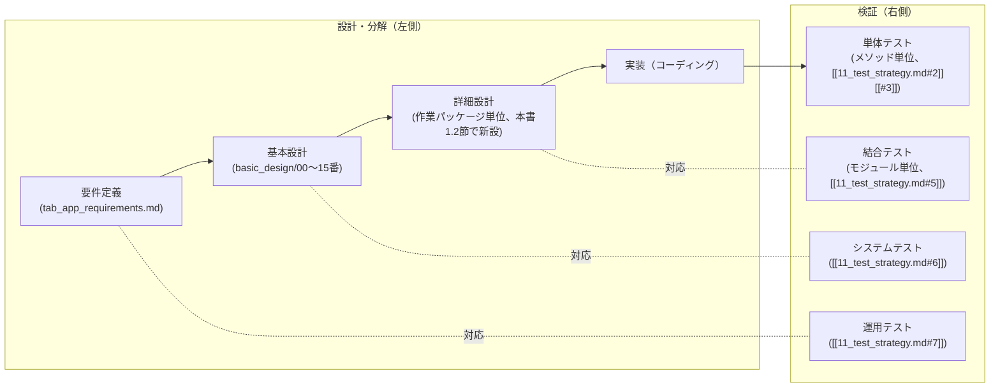

# 開発プロセス・開発方針設計書

対応要件：要件定義書5.5節（テスト方針）、5.6節（開発体制・ペース、バージョニング）、9章（作業パッケージ分解）。[[11_test_strategy.md]]が定義する「何をテストするか」に対し、本書は「どういう手順・体制で作るか」（開発モデル、ブランチ運用、Claude Codeとの協働サイクル、テスト/レビューのタイミング、完了基準、リリース運用）を定義する。

**2026-09-02修正**：本書はセルフレビューで発見された技術的な不具合（Markdownの改行がリテラルな`\n`文字列として保存され、実際の改行として描画されていなかった）を是正し、全文を実際の改行で書き直した（内容自体の変更はない）。

**2026-09-02修正（本人の指摘を受けた是正、バージョニング方針）**：8節のバージョニング方針を、PC版・iPhone版を通じた単一の製品バージョンとして扱う書き方から、プラットフォームごとに独立させる方針に是正した（詳細は8節、[[13_design_decision_points.md#3]]B24を参照）。

**2026-09-02追記（設計思想の明文化）**：本人より「現状レビューできていないので、設計の思想から説明を入れてほしい」との依頼を受け、0節（本書の設計思想と全体像）を新設し、各節の末尾に当該方針を採用した理由・検討した代替案・トレードオフを明記する形で全面的に加筆した。**他文書からの相互参照（`[[15_development_process.md#4.1]]`等）を壊さないよう、既存の見出し番号（1.1、4.1、4.1.1、4.2等）は一切変更していない。新設したのは0節、および各節末尾に追加した新しい小節番号（1.3、2.1、3.3、4.3、5.1、6.4、7.1、9.1）のみである。**

**2026-09-02再修正（本人の指摘を受けた是正、「軽さ」の撤回）**：直上の加筆で導入した「手戻りを防ぐ厳密さ」と「一人・隙間時間開発に耐える軽さ」という2つの力を同格に扱うフレームは、本人より「品質改悪にしか働かない、考え直せ」との指摘を受け、誤りと判断し撤回した。誤りの核心は、Git hookでの強制やセルフレビューの対象範囲を「一人開発・隙間時間開発だから」という理由で緩めていた点にある——これらは**Claude Codeや自動化ツールが実行する工程であり、本人の可処分時間を一切消費しない**。「隙間時間開発」という制約が実際に効くのは、本人自身が時間を割く工程（全差分の手動レビュー等）に対してだけであり、自動化された工程を緩める理由にはならない。この区別に基づき、0節を全面的に書き直し、2節（Lint/Format強制）・3.2節（コミット規約強制）・6節（セルフレビュー対象範囲）・7節（DoD基準4）を是正した。見出し番号は今回も変更していない。

**2026-09-02再々修正（品質KPIによる運用への移行）**：本人より「テストも設計も、一人だからとかは関係なく品質だけが優先。KPIを設定してそれに準ずる形にするのが一番」との方針が示された。これに沿い、[[11_test_strategy.md#0]]に品質KPI一覧（テスト・性能・メモリ・トレーサビリティ・設計分岐点の未決着件数などを一箇所に集約した数値目標表）を新設し、本書7節のDefinition of Doneをその参照へつなげた。詳細は7節・[[11_test_strategy.md#0]]を参照。

## 0. 本書の設計思想と全体像（2026-09-02追加、2回再修正）

### 0.1 本書の原則：厳密さを「誰の時間で」測るか（2026-09-02再修正）

要件定義書5.6節の前提——一人開発、隙間時間開発（まとまった時間が取りにくい）、実装の主な担い手はClaude Code——を理由に、本書は当初、「手戻りを防ぐ厳密さ」と「一人・隙間時間開発に耐える軽さ」という2つの力を同格に扱い、Lint強制の省略やセルフレビュー対象の縮小をこの「軽さ」側の要請として正当化していた。**これは誤りであり、本人の指摘（2026-09-02、「品質改悪にしか働かない」）を受けて考え方自体を改める。**

誤りの核心は、「一人開発・隙間時間開発」という制約が実際には**何のコストを希少資源として扱っているか**を取り違えていた点にある。

- **本人の可処分時間を消費する工程**（例：本人が全差分を読んでレビューする、本人が手動でテストケースを書く）は、要件5.6節の制約が直接効く。だからこそ本書は、レビューをClaude Codeへのセルフレビュー依頼（6節）に、テスト作成をClaude Codeによる実装後の追加（5節）に、それぞれ委ねている——**本人の時間を守るための設計は、ここに集約されている。**
- **自動化された工程・Claude Codeが実行する工程**（Git hookによるLint/型チェック、CIでのビルド・テスト実行、Claude Codeによるセルフレビューセッションそのもの）は、本人の隙間時間を一切消費しない。したがって「一人開発だから」「隙間時間だから」という理由でこれらを緩める根拠は成立しない。レビュアーが存在しないという一人開発の構造的な弱点を埋める手段である以上、**コストがほぼゼロなら、むしろ適用範囲は最大化すべきである。**

旧版はこの区別をせずに「儀式化を避ける」という一言で複数の方針を緩めていた。以下の表の通り是正する。

| 項目 | 旧方針（誤り） | 新方針 | 該当節 |
|---|---|---|---|
| Lint／型チェック／Format | コミット前のローカル実行のみ、Git hookでの強制なし | pre-commit hookで自動強制。加えてCI（GitHub Actions）でPRごとに実行し、失敗時は`main`へマージできないようにする | 2節 |
| コミットメッセージ規約 | 緩やかな目安、厳密な遵守は求めない | commitlint等でpre-commit hookから機械的に強制する | 3.2節 |
| セルフレビュー対象 | 4.1節でL／XLサイズの作業パッケージのみ（S／Mは「儀式化を避ける」ため対象外） | **サイズによらず全ての作業パッケージを対象とする**。セルフレビューはClaude Codeが実行するため本人の時間を消費せず、対象を絞る合理的な理由がない | 6節 |
| Definition of Done 基準4 | 「6節の対象作業パッケージについては」セルフレビュー実施済みであること | 全作業パッケージについてセルフレビュー実施済みであること | 7節 |

一方で、次のものは今回の是正の対象外とする——いずれも「本人の時間を守るための設計」であり、「品質を緩める設計」ではないためである。

- 5節のテスト後書き（TDD不採用）：実装しながら仕様の細部が固まる領域でのテストの二度書きを避けるための判断であり、本人が明示的にヒアリングで確定済みの方針でもある。ただしL／XLサイズの作業パッケージについては、パッケージ全体の完了まで待たずサブ機能の区切りごとにテストを追加していく運用に改めた（5節・5.1節参照）——これはテストの後書き自体をやめるのではなく、後書きの粒度を細かくすることで未検証コードが積み上がる期間を短くする、品質側の強化である。
- 4.2節末尾の「依存関係の薄い小粒な作業は順序を崩してよい」：これは4.1節の実施順序（依存関係）を待つ理由がないという判断であり、セルフレビューやDoDそのものを省略してよいという意味ではないことを4.2節末尾に明記し直した。

この0.1節の是正自体が、0.3節でいう「工学判断（要レビュー）」が実際に本人のレビューによって修正された実例である。異論があれば同じ要領で都度指摘してほしい。

**2026-09-02追記（KPIによる運用への発展）**：本人よりさらに「テストも設計も、一人だからとかは関係なく品質だけが優先。KPIを設定してそれに準ずる形にするのが一番」との方針が示された。これは0.1節の原則（自動化された工程は緩めない）の延長線上にある——「厳密さを言葉で謳う」だけでは達成度が本人にもClaude Codeにも判定しづらいため、達成すべき水準を可能な限り具体的な数値（KPI）として定義し、機械的またはチェックリスト的に判定できる形にする。テスト・性能・メモリ使用量のKPIは元々[[09_nonfunctional.md]]・[[11_test_strategy.md]]に数値目標として存在していたが、設計側（要件トレーサビリティの充足率、設計分岐点の未決着件数）にはKPIに相当するものが明文化されていなかった。そこで[[11_test_strategy.md#0]]に、テストKPIと設計KPIを横断して一覧化した表を新設し、本書のDefinition of Done（7節）からそこを参照する形にした。

### 0.2 Claude Codeとの協働という前提が生む、もう一つの設計原則

人間のチーム開発では、レビュアーの存在やチームの雑談・会議を通じて「なぜその設計にしたか」という暗黙知が自然に蓄積・共有される。一人開発、かつ実装の主な担い手がClaude Codeという体制ではこれが成立しない——Claude Codeのセッションは会話ごとに独立しており、前回のセッションでの判断の経緯を暗黙に引き継ぐことはできない。

この制約に対して本書が一貫して採っている原則は、**「判断の理由を、会話の中ではなく文書の中に置く」**ことである。これは個別の思いつきではなく、本書が定めた複数の運用の共通の土台になっている。

| 運用 | 何を文書化するか | 対応する節 |
|---|---|---|
| [[13_design_decision_points.md]]（設計分岐点カタログ） | 会話の中でその場で下した設計判断を、後から別セッションが参照できる形で保存する | 1.2節、6節、9節から参照 |
| 詳細設計書（`detailed_design/`） | 実装セッションの頭の中にしかない構造上の判断（クラス構成・シグネチャ・状態遷移）を、次のセッションが読める形で残す | 1.2節で新設 |
| 横断リファレンス（[[../detailed_design/00_reference.md]]） | 複数の詳細設計書にまたがるインターフェース契約を1箇所に集約し、矛盾の発生源そのものを減らす | 1.2節・4.2節から参照 |
| セルフレビュー（別セッションへの依頼） | 実装セッションと同じ会話履歴を共有しない状態でPRの差分だけを読ませることで、人間のチームでの第三者レビューが持つ「独立した目」を疑似的に再現する | 6節 |
| 品質KPI一覧（[[11_test_strategy.md#0]]） | 「品質を保つ」という抽象的な意図を、達成できたかどうかを後から誰でも判定できる数値・チェック項目として保存する | 7節から参照（2026-09-02追加） |

裏を返せば、これらの運用のいずれかを省略することは、単に手間を減らすのではなく、**Claude Codeとの協働が構造的に持っている「文脈の断絶」を埋める手段を一つ失う**ことを意味する。0.1節で是正した通り、これらはいずれもClaude Code・自動化ツールが実行する工程であり本人の時間を消費しないため、サイズや儀式化を理由に対象を絞る判断はしない。

### 0.3 節ごとの対応表（何を解決する節か／決定の性質）

以下は、各節がどの問題を解決するためのものかを一覧にしたものである。「決定の性質」列は、本人に既にヒアリング済みで確定している方針（変更にはあなたの再判断が要る）か、私が実務上の判断として決めた方針（レビュー対象として特に見てほしい）かを区別する。後者は各節末尾の「設計思想」小節で理由とトレードオフを明記している。

| 節 | 解決する問題 | 決定の性質 |
|---|---|---|
| 1.1 V字モデル | 要件→設計→実装をどう対応づけ、どのテストで検証するか | ヒアリング確定（本人が明示的に指定） |
| 1.2 詳細設計工程 | 基本設計と実装の間の「構造上の判断」をどこに書き残すか | ヒアリング確定（[[13_design_decision_points.md#4]]C9） |
| 2 リポジトリ・ツールチェーン | パッケージマネージャ・型チェック・Lint／CIの運用強度 | 工学判断（2026-09-02、本人指摘によりGit hook強制なし→pre-commit＋CIでの常時強制へ是正済み） |
| 3 ブランチ運用・コミット規約 | 変更をどう区切り、`main`をどう安全に保つか | 工学判断（2026-09-02、本人指摘によりコミット規約の機械的強制へ是正済み） |
| 4.1／4.1.1 作業パッケージ実施順序 | どの順で作るか（依存関係） | 工学判断（依存関係からの論理的帰結。ただし「1つずつ順番に完了させる」進め方自体はヒアリング確定） |
| 4.2 セッション単位フロー | 1回のClaude Codeセッションで何をどの順にやるか | 工学判断（要レビュー） |
| 5 テスト方針との連動 | いつ自動テストを書くか（TDDか後書きか） | ヒアリング確定＋工学判断（後書き自体はヒアリング確定。ただしL/XLの区切り粒度は2026-09-02にサブ機能単位へ是正済み） |
| 6 セルフレビュー運用 | 一人開発でどう第三者チェックを代替するか | 工学判断（2026-09-02、本人指摘によりL/XL限定→全サイズ対象へ是正済み） |
| 7 Definition of Done | 「完了」をどう判定するか | 工学判断（2026-09-02、6節の是正＋[[11_test_strategy.md#0]]のKPI参照を追加済み） |
| 8 バージョニング・リリース運用 | バージョン番号をどう刻むか | 工学判断（2026-09-02、本人指摘によりB24として是正済み） |
| 9 ドキュメント運用 | 実装後に設計書が古くなるのをどう防ぐか | 工学判断（要レビュー） |

この表と各節末尾の説明を読めば、「ヒアリングで決まったこと」と「私が実務判断で決めて提案していること」の境目が分かるはずである。後者について異論があれば、[[13_design_decision_points.md]]と同じ要領で分岐点として扱い、修正する。

## 1. 位置づけ

要件定義書5.6節の前提（一人開発、Macなし、隙間時間開発、Claude Code活用）を踏まえ、実装フェーズに入る前に「進め方」自体をヒアリングで確定した。開発モデルそのものについては本人より**V字モデルに厳密に沿う**ことが明示的に指定されたため、1.1節・1.2節で確定する。

### 1.1 開発モデル：V字モデル（本セッションで明確化）

本プロジェクトは以下のV字モデルに沿って開発する。左側（設計・分解）の各工程が、右側（検証）のどのテストレベルで検証されるかを対応づける。

| V字モデルの左側工程 | 成果物 | 対応する右側の検証 |
|---|---|---|
| 要件定義 | `tab_app_requirements.md` | 運用テスト（[[11_test_strategy.md#7]]）：実際の耳コピ運用が要件定義書のユースケースを満たすか |
| 基本設計 | `basic_design/00〜15番`（本文書群） | システムテスト（[[11_test_strategy.md#6]]）：アプリ全体のシナリオが基本設計の画面・機能仕様通りに動くか |
| 詳細設計 | 作業パッケージ単位の詳細設計書（1.2節で新設） | 結合テスト（[[11_test_strategy.md#5]]）：モジュール間の連携が詳細設計の想定通りに機能するか |
| 実装（コーディング） | ソースコード | 単体テスト（[[11_test_strategy.md#2]][[#3]]）：メソッド単位でC0/C1（重要ロジックはC2）を満たすか |

[[11_test_strategy.md]]で先に確定していた4段階のテストレベル構成は、このV字モデルの右側にそのまま対応する形になっている。品質KPIの一覧は[[11_test_strategy.md#0]]を参照。

### 1.2 詳細設計工程の扱い（本セッションで確定）

**基本設計と実装の間に、独立した工程として「詳細設計」を置く。** クラス／インターフェース構成、主要メソッドのシグネチャ、状態遷移・シーケンスの確定は、実装セッションの中で暗黙的に行うのではなく、作業パッケージ単位の**詳細設計書**として明示的に残す。

| 項目 | 方針 |
|---|---|
| 単位 | [[15_development_process.md#4]]4.1節の作業パッケージ1つにつき1つの詳細設計書を作成する（XLサイズで3節に基づきサブ機能分割した場合は、サブ機能単位で分けてよい） |
| 格納先 | プロジェクト内に新設する`detailed_design/`フォルダに、`detailed_design/<作業パッケージの英語スラッグ>.md`として格納する（3節のブランチ命名`feature/<スラッグ>`と対応させる） |
| 内容 | 該当作業パッケージが対象とするクラス／インターフェース一覧とその責務、主要メソッドのシグネチャ（引数・返り値・例外/エラー時の挙動）、状態遷移図・シーケンス図（該当する場合）、[[13_design_decision_points.md]]で未解決だった分岐点があればここで実装レベルの解決策を確定する |
| 作成タイミング | 4.2節のセッション単位フローの中で、該当する基本設計書を読み合わせた**直後・実装着手の前**に作成する |
| 基本設計との関係 | 詳細設計書は基本設計書（`basic_design/`）の記載を前提とし、矛盾する内容を含めない。基本設計側の記載を変更する必要が生じた場合は、先に[[13_design_decision_points.md#5]]の運用ルールに従って基本設計側を更新してから詳細設計に進む |
| 実装との関係 | 詳細設計書に定義したシグネチャ・構成と実装が乖離した場合は、実装を詳細設計に合わせるか、詳細設計書を更新するかのいずれかを都度選び、乖離したまま放置しない（9節のドキュメント同期ルールに準ずる） |

この方針は[[13_design_decision_points.md#4]]C9として確定した。

### 1.3 この工程設計の思想（なぜこの形にしたか）

V字モデルを厳密に採用し、かつ基本設計と実装の間に独立した詳細設計工程を挟むという構成は、工程を増やすように見える。それでもこの構成を採った理由は、0.2節で述べた「文脈の断絶」への対策として最も効果が大きいのがこの部分だと判断したためである。

具体的には、次のような代替案を検討し、いずれも採らなかった。

- **代替案A：詳細設計工程を設けず、実装セッションの中でクラス構成やシグネチャをその都度決める**。工程は減るが、次のセッション（あるいは後日レビューする本人）は、実装コードを読み直さない限り「なぜこのクラス構成にしたか」を追えなくなる。過去の詳細設計書（[[../detailed_design/editing-core.md]]等）で実際に発見された食い違い（例：0.9節で発見した`SetTempoCommand`の定義漏れ）は、複数の詳細設計書が独立して存在し、横断的に読み合わせる機会があったからこそ見つかった。実装コードだけでは同種の食い違いは発見しにくい。
- **代替案B：V字モデルではなく、もっと軽量な「基本設計→実装」の2段階に圧縮する**。本人から明示的に「V字モデルに厳密に沿う」という指定があったため採らなかった（1.1節）。

## 2. リポジトリ・ツールチェーン方針

| 項目 | 方針 |
|---|---|
| リポジトリ構成 | [[01_architecture.md#3]]AD-5のモノレポ構成（`packages/core`, `packages/shared-types`, `apps/desktop`, `apps/mobile`, `tools/`）をそのまま単一Gitリポジトリで管理する |
| パッケージマネージャ | pnpm（モノレポのワークスペース管理が標準機能で完結し、Claude Codeでの依存関係操作も一貫したコマンド体系で行える） |
| 言語・型チェック | TypeScript strictモードを有効化（AD-4）。コマンド層・データモデル層は特に型安全性の恩恵が大きいため、`any`の使用は原則禁止しlintで検出する |
| Lint／Format／型チェックの強制（2026-09-02是正） | ESLint（[[01_architecture.md#2]]のレイヤー依存規則を機械的に強制する設定を含む。具体構成は[[../detailed_design/web-core-foundation.md#6]]）＋Prettier＋`tsc --noEmit`。**Husky＋lint-stagedによるpre-commit hookで、コミット対象ファイルに対して自動実行し、違反があればコミット自体をブロックする。** |
| CI（2026-09-02新設） | GitHub Actionsで、PRの作成・更新のたびにLint／型チェック／5節の単体テスト（[[11_test_strategy.md#0]]のKPIを機械的に検証）を自動実行する。ブランチ保護ルールで当該ステータスチェックを必須化し、失敗している間は`main`へマージできないようにする（3.1節のPRベース運用と対応）。ビルド成果物の配布自動化（8節参照）は対象外とし、あくまで品質ゲートとしての最小限のCIとする |
| コミットメッセージの強制 | commitlint（pre-commit hook経由）で3.2節の規約を機械的に強制する |
| Node.jsバージョン | `.nvmrc`等でリポジトリに固定バージョンを明記し、Claude Codeセッション間で環境差異が出ないようにする |

### 2.1 各方針の選定理由（工学判断、2026-09-02一部是正）

本節の各項目は、要件定義書・[[01_architecture.md]]で確定済みの技術選定（AD-5のモノレポ構成、AD-4のTypeScript採用等）を前提に、それを実際に運用する上での具体的な強度を決めたものであり、いずれも私の実務判断である。

- **pnpm**：モノレポのワークスペース管理を標準機能で完結できる点を優先した。npm workspacesでも実現は可能だが、依存関係のインストール速度・ディスク使用量の面でpnpmが有利であり、Claude Codeが依存関係を追加・変更する操作（`pnpm add`等）も単純なコマンド体系で済む。
- **Lint/Format/型チェックをpre-commit hookとCIの両方で強制する（2026-09-02是正）**：旧版はこれを「一人開発だから」「忘れた場合は次のコミットで直せばよい」という理由で緩めていたが、これは誤りだった（0.1節）。hook自体もCIの実行も自動化されたプロセスであり、本人が手を動かして毎回実行するわけではない——コミット・PR作成という操作のたびに裏側で自動的に走るだけである。したがって本人の隙間時間を一切消費しない。強制しない理由がないと判断し、常時強制に是正した。
- **Node.jsバージョンを`.nvmrc`等で固定**：Claude Codeはセッションごとに環境が作り直される可能性があるため、バージョン差異による「動いていたはずのコードが動かない」という手戻りは、放置すると再現性を損なう。固定コストを払う価値があると判断した。

## 3. ブランチ運用・コミット規約

### 3.1 ブランチ運用

ヒアリングの結果、**機能（作業パッケージ）ごとにブランチを切る**方針に確定した。

- 命名規則：`feature/<作業パッケージ名の英語スラッグ>`（例：`feature/data-model`, `feature/editing-core`, `feature/playback-engine`）。9章の作業パッケージ単位を基本の粒度とするが、[[04_editing_core.md]]のようにXLサイズの作業パッケージは、必要に応じてサブ機能単位（例：`feature/editing-core-step-input`）にさらに分割してよい。同じスラッグを1.2節の詳細設計書ファイル名にも使用する。
- `main`ブランチは常にビルド可能・アプリが起動可能な状態を保つ（動作しないコードをマージしない）。
- マージ方法：GitHub上でPull Requestを作成し（一人開発でもレビューの区切りとして活用、6節参照）、2節のCIによるステータスチェックが通った上でSquash mergeで`main`に統合してからfeatureブランチを削除する。これにより`main`の履歴が作業パッケージ単位で追いやすくなる。
- 実験的な変更（技術検証・Phase 0のスパイク等）は`spike/`プレフィックスを使い、`main`にマージしない使い捨てブランチとして扱ってよい。

### 3.2 コミットメッセージ規約（2026-09-02是正：機械的に強制）

Conventional Commits形式（`feat: `, `fix: `, `refactor: `, `test: `, `docs: `, `chore: `）を、2節のcommitlint（pre-commit hook経由）で機械的に強制する。**旧版は「厳密なルール遵守よりも一貫性を優先する」として強制しない方針にしていたが、これは0.1節で是正した通り誤りだった——commitlintのチェックは自動実行され、本人の時間を消費しないため、緩める理由がない。**

### 3.3 この運用の設計思想（なぜPRベースのSquash mergeを一人開発でも使うか）

一人開発ではレビュアーがいないため、PRという仕組み自体が本来持つ「他人のレビューを経てからマージする」という意味は薄れる。それでもPRを作成し、Squash mergeで統合するという運用を採った理由は次の通りである。

- **区切りとしての機能**：PRという単位があることで、「この作業パッケージの変更はここからここまで」という境界がGitHub上に明示され、6節のセルフレビューを依頼する際に「PRの差分」という具体的な受け渡し単位ができる。PRを作らない場合、レビュー依頼のたびに差分の範囲を都度説明し直す必要があり、かえって手間が増える。
- **`main`の履歴の読みやすさ**：Squash mergeにより、`main`のコミット履歴は作業パッケージ単位（＝詳細設計書1つ、ブランチ1つに対応）で1コミットに整理される。後から「あの機能はどのコミットで入ったか」を追う際、詳細設計書のファイル名とコミット履歴が1対1で対応しているため探しやすい。
- **CIのゲートとしての機能（2026-09-02追加）**：PRという単位があることで、2節のCIステータスチェックを「マージ条件」として組み込める。ブランチを切らず`main`に直接コミットする運用では、この自動ゲートを設ける先がなくなる。
- **検討した代替案**：ブランチを切らず`main`に直接コミットしていく方式も検討したが、実験的な変更（3.1節後段の`spike/`ブランチの用途）を`main`から隔離できなくなる点、CIをマージ条件として機能させられなくなる点、および「動作しないコードをマージしない」という原則（3.1節冒頭）を保証する仕組みがなくなる点から採らなかった。

## 4. 作業パッケージの進行順序とClaude Codeとの協働サイクル

ヒアリングの結果、**9章の作業パッケージを1つずつ順番に完了させてから次に進む**運用に確定した。9章の記載順は依存関係を厳密に反映したものではないため、本書で依存関係を踏まえた実施順序を確定する。

### 4.1 Phase 1 実施順序（確定）

| 順序 | 作業パッケージ | 依存する前提 | 備考 |
|---|---|---|---|
| 1 | Webコア基盤構築 | なし（最初の土台） | alphaTab統合、Electron雛形、環境構築を含む |
| 2 | データモデル・永続化 | 1 | Song/Part/Bar等の構造化データと自動保存・保存先切替の基盤。以降のほぼ全作業パッケージが依存する |
| 3 | エラー・警告基盤／ログ基盤 | 1, 2 | [[08_error_logging.md]]の`NotificationCenter`は他の作業パッケージから横断的に呼ばれるため、早期に骨格だけ用意する（Sサイズ2件のため合わせて先に片付ける） |
| 4 | タブ譜編集コア | 2, 3 | 最大サイズ（XL）。コマンド層（Undo/Redo）を含むため、必要に応じてサブ機能単位でブランチを分割する（3節） |
| 5 | パート・チューニング管理 | 2, 4 | Partエンティティの操作は編集コアのコマンド層と密接に関わるため4の直後に着手する |
| 6 | 表示モード | 4 | フォーカス／全体／スコア表示の切替は編集コアのレンダリング結果に依存する |
| 7 | 再生エンジン統合 | 2, 4 | alphaTab／AlphaSynthとの統合。編集コアで作ったデータがある程度再生できる状態になってから着手する方が動作確認しやすい |
| 8 | 画面群・ナビゲーション | 4, 5, 6, 7 | ミキサー・パート管理・チューニング設定・小節メモ一覧・設定・タグ管理・ライセンス・オンボーディングの各画面は、これらが操作対象とするサービス群が揃ってから配線する |
| 9 | 自動テスト基盤 | （継続） | 単発の作業パッケージとしてではなく、5節のタイミングで各作業パッケージに紐づけて実施する |
| 10 | 開発用サンプルデータ | 2 | 2の直後〜4着手前後に用意しておくと、以降の動作確認・負荷テストに使い回せる |

### 4.1.1 Phase 2 実施順序（確定、2026-09-02追加）

[[export-print.md]]（Phase 2：エクスポート・印刷）の詳細設計にあたり、4.1節と同じ考え方（依存関係順・作業パッケージ単位）で実施順序を確定した。

| 順序 | 作業パッケージ | 依存する前提 | 備考 |
|---|---|---|---|
| 1 | 書き出し機能（alphaTex／MIDI／PDF） | Phase 1完了一式（特に2 データモデル・永続化、4 タブ譜編集コア、5 パート・チューニング管理） | `PrintPipelineService`によるPDF生成を含め、変換ロジック一式をこの作業パッケージで先に確立する（[[export-print.md#3.1]]） |
| 2 | 印刷プレビュー | 1 | 1で確立したPDF生成パイプライン（`PrintPipelineService`）をそのまま転用してプレビュー表示・印刷ダイアログを実装するため、1に依存する（[[export-print.md#3.3]]） |

両作業パッケージはいずれもMサイズだが、PDF生成パイプラインを共有し実施順序も直列（1→2）であるため、詳細設計書は9章の作業パッケージ単位とは別に[[export-print.md]]として1つにまとめている（詳細設計書の対象パッケージ一覧は[[00_reference.md#1]]を参照）。

Phase 3以降（iPhone版）の実施順序は、Phase 2完了後に同様の考え方で確定する。

### 4.2 Claude Codeとのセッション単位

1つの作業パッケージ（または3節で分割したサブ機能）を1セッションの主題とし、次の流れを基本とする：

1. 該当する基本設計書の該当章を読み合わせ、実装方針に不明点があれば[[13_design_decision_points.md]]に準じてこの場で解消する。
2. **詳細設計書を作成する**（1.2節）。クラス／インターフェース構成、主要メソッドのシグネチャ、状態遷移・シーケンスをここで確定し、`detailed_design/<スラッグ>.md`として残す。
3. 実装。詳細設計書に定義した構成・シグネチャに従う（乖離が生じた場合は1.2節の運用に従う）。
4. 5節のタイミングで自動テストを追加。
5. 6節に従いセルフレビューを依頼する（2026-09-02是正：サイズによらず全ての作業パッケージが対象）。
6. 7節のDefinition of Doneを満たしたらPRを作成し、2節のCIが通ったことを確認してからマージし、次の作業パッケージへ進む。

依存関係の薄い小粒の作業（バグ修正、ドキュメント更新等）は、4.1節の実施順序を待つ理由がないため、この順序を崩してでも都度対応してよい。**ただしこれは実施順序の融通に限った話であり、6節のセルフレビューや7節のDefinition of Doneを省略してよいという意味ではない（2026-09-02、0.1節の是正に伴い明記）。**既存の詳細設計書に影響する変更であれば該当ファイルを更新する。

### 4.3 このサイクルの設計思想（なぜこの6ステップか）

4.2節のセッション単位フロー（読み合わせ→詳細設計→実装→テスト→セルフレビュー→PR）は、V字モデル（1.1節）と詳細設計工程（1.2節）を、実際に1回のClaude Codeセッションでどう運用するかに落とし込んだものである。ステップの並び自体に次の意図がある。

- **詳細設計を実装より先に置く**：これは1.2節の運用ルール（詳細設計は基本設計を読み合わせた直後・実装着手の前に作成する）をそのままセッションフローに反映したものであり、独立した判断ではない。
- **テスト（ステップ4）を実装（ステップ3）の後に置く**：5節で述べる「テスト後書き」の方針をセッションフローのレベルでも一貫させている。
- **セルフレビュー（ステップ5）をテストの後、PR（ステップ6）の前に置く**：レビューで指摘された修正がテストのやり直しを要する場合があるため、レビュー→修正→（必要なら再テスト）→PRという順にすることで手戻りの往復を最小化している。**2026-09-02是正**：このステップは6節の是正に伴い、サイズによらず全ての作業パッケージで実施する（旧版はL/XLサイズのみを想定していた）。

依存関係の薄い小粒の作業（4.2節末尾）について4.1節の順序を崩してよいとしているのは、依存関係上待つ理由がないという判断であり、セルフレビュー・DoDを省略する趣旨ではない（2026-09-02、0.1節で明記）。

## 5. テスト方針との連動（タイミング・カバレッジ）

ヒアリングの結果、**自動テストは主要ロジックの実装後にまとめて書く**運用に確定した（TDD的に実装前にテストを書く運用は採らない）。

- 各作業パッケージの実装が一区切りついた時点で、[[11_test_strategy.md#3]]の対象一覧のうち該当する項目（例：「タブ譜編集コア」完了時→コマンド層・バリデーションサービスのテスト、「データモデル・永続化」完了時→マイグレーションのテスト）をまとめて追加する。その際、実装した全メソッドについて[[11_test_strategy.md#2]]のカバレッジ基準（C0・C1は全メソッド100%、重要度の高いロジックはC2まで。[[11_test_strategy.md#0]]の品質KPI一覧にも集約）を満たすことを単体テストの完了条件とする。
- **L／XLサイズの作業パッケージについては、パッケージ全体の完了を待たず、3節でブランチを分割する単位に対応するサブ機能が完了するごとにテストを追加する（2026-09-02是正）**。未検証のロジックが積み上がる期間を短くするための是正であり、詳細は5.1節を参照。
- 単体テストが揃った時点で、[[11_test_strategy.md#5]]の結合テスト（モジュール単位）を該当範囲について実施する。作業パッケージ内で完結する結合（例：編集サービス＋コマンド層＋モデル）はこの段階、複数作業パッケージにまたがる結合（例：再生エンジン統合とタブ譜編集コアの組み合わせ）は両方が完了した時点で実施する。結合テストは1.1節のV字対応上、当該作業パッケージの詳細設計書の想定通りに連携できているかの検証でもある。
- 「自動テスト基盤」という単独の作業パッケージは設けず、4.1節の各作業パッケージの完了条件（7節）に組み込む形に変更する。
- システムテスト・運用テスト（[[11_test_strategy.md#6]][[#7]]）、負荷テスト（[[11_test_strategy.md#8]]）はPhase 1後半、主要機能が一通り揃った時点でまとめて実施する方針を維持する。負荷テストで実測する性能・メモリのKPIは[[11_test_strategy.md#0]]を参照。

### 5.1 このタイミング設計の思想（なぜTDDではなく後書きか、2026-09-02一部是正）

自動テストを実装後にまとめて書く方針（TDDを採らない）は、本人からのヒアリングで確定済みの前提である。

- タブ譜編集コアのような領域（[[04_editing_core.md]]）は、実装しながら仕様の細部（バリデーションの境界値、Undo/Redoの対象範囲等）が固まっていく性質が強く、実装前にテストを固定するTDD的な進め方だと、仕様が変わるたびにテストの手戻りが発生しやすい。後書きにすることで、この手戻りをテストの二度書きではなく一度で済ませられる。
- **区切りの粒度（2026-09-02是正）**：旧版は「作業パッケージ完了時点でまとめて書く」という区切りを採用し、その理由を「テストを書く行為自体を儀式化させないため、隙間時間開発との相性」としていた。これは0.1節の是正により撤回する——テストの追加はClaude Codeが実行する工程であり、本人の時間を守るための配慮は不要である。むしろ区切りを大きくしすぎると、XLサイズの作業パッケージ（例：タブ譜編集コア）では完了までの間、量の多いロジックが長期間未検証のまま積み上がるリスクがあった。是正後は、L／XLサイズについては3節のサブ機能単位のブランチが完了するごとにテストを追加し、未検証期間を短く保つ。
- 「自動テスト基盤」という単独の作業パッケージを設けず各作業パッケージのDoD（7節）に組み込んだのは、テストを独立工程として切り出すと後回しにされて最後に積み残る典型的なリスクがあるためであり、これは規模を理由にした緩和ではなく、テストを確実に実行させるための工学判断である。

## 6. セルフレビュー運用（2026-09-02是正：全作業パッケージを対象に）

一人開発でレビュアーが存在しないため、ヒアリングの結果、**主要な作業パッケージ完了時にClaude Codeへセルフレビューを依頼する**運用を導入する。

- **対象**：4.1節・4.1.1節の**全ての作業パッケージ**（サイズによらない）。**2026-09-02是正**：旧版はL／XLサイズの作業パッケージ（データモデル・永続化、タブ譜編集コア、再生エンジン統合、画面群・ナビゲーション）のみを対象とし、S／Mサイズは「儀式化を避ける」という理由で対象外としていた。しかしセルフレビューはClaude Codeが実行する工程であり本人の時間を消費しないため、規模を理由に対象を絞る合理的な根拠がなかった（0.1節）。以降は全ての作業パッケージの完了時にセルフレビューを実施する。
- **依頼方法**：実装セッションとは別の視点を得るため、レビュー専用のセッション（またはサブエージェント）に、実装との対話履歴を前提とせずPRの差分のみを渡してレビューを依頼する。
- **観点**（[[13_design_decision_points.md]]・各設計書の該当章、および[[11_test_strategy.md#0]]の品質KPI一覧と突き合わせる形で確認する）：
  - 要件・基本設計との不整合（例：バリデーションの閾値が[[04_editing_core.md#6.1]]と一致しているか）
  - 詳細設計書（1.2節）と実装の整合性（クラス構成・メソッドシグネチャが乖離していないか）
  - Undo/Redoの非対称性・データ消失につながるエッジケース
  - [[01_architecture.md#2]]のレイヤー依存規則違反（Webコアからプラットフォーム固有APIへの直接参照等）
  - セキュリティ・堅牢性（[[06_file_io_persistence.md]]のアトミック書き込み、[[08_error_logging.md]]のエラーハンドリング漏れ等）
  - [[11_test_strategy.md#2]]のカバレッジ基準（C0/C1全数、対象ロジックのC2）が満たされているか
- レビューで見つかった指摘は、軽微なものはその場で修正、設計方針に関わるものは[[13_design_decision_points.md]]に新規分岐点として追記してから対応する（同書5節の運用ルールに従う）。

### 6.4 なぜ全作業パッケージを対象とし、なぜ別セッションに依頼するか（2026-09-02改訂）

- **なぜサイズで絞らないか**：旧版はセルフレビューをL/XLサイズに限定し、その理由を「一人開発の実行速度を落とさないため」としていた。しかしセルフレビューはClaude Codeが実行する工程であり、本人自身が時間を割いて行うものではない。「実行速度」が落ちるとすればそれはClaude Codeセッション数の増加であって、本人の隙間時間の消費ではない。S/Mサイズの作業パッケージ（パート・チューニング管理など）であっても、バリデーションの閾値の取り違えやレイヤー依存規則違反（本節「観点」参照）は起こりうるため、規模を理由に検査を省く根拠がないと判断し、全作業パッケージを対象にする方針へ是正した。
- **なぜ別セッション（対話履歴を共有しない）に依頼するか**：同じセッション内でレビューを依頼すると、実装時に見落とした前提（「この境界値でよいはず」という思い込み等）をレビュー時にも引きずってしまい、人間のチームでの第三者レビューが本来持つ独立性が得られない。対話履歴を切り離し、PRの差分と関連設計書のみを渡すことで、実装の経緯を知らない読み手として振る舞わせている。
- **検討した代替案**：本人自身が全ての差分をレビューする案も考えられるが、要件定義書5.6節の前提（隙間時間開発）および今回の経緯（「正直現状レビューできていない」という本人の申告）を踏まえると、実装の全差分を都度レビューすることは現実的でない。そのため、Claude Codeによるセルフレビューを一次防波堤とし、本人によるレビューは基本設計・詳細設計・そして本書のような設計文書側に絞る、という役割分担を前提にしている。**この役割分担自体が、本書全体を通じて本人に負ってほしい唯一の継続的な作業であり、その裏返しとして、本書はできる限り「読めば思想まで追える」文書であろうとしている**（0節）。逆に言えば、Claude Code側が担う工程（セルフレビューを含む）を「一人開発だから」という理由で削るのは、この役割分担の前提を掘り崩すことになる（0.1節）。

## 7. Definition of Done（作業パッケージの完了基準）

作業パッケージを「完了」と判定する基準を以下に統一する。**2026-09-02追記**：本表の数値基準は[[11_test_strategy.md#0]]の品質KPI一覧に集約されている。個々の基準の合否判定に迷った場合はそちらを参照する。

| # | 基準 |
|---|---|
| 1 | 該当する基本設計書の記載内容を満たしている（満たせない場合は設計書側を更新するか、[[13_design_decision_points.md]]に新規分岐点として記録する） |
| 2 | 1.2節の詳細設計書（`detailed_design/<スラッグ>.md`）が作成され、実装と整合している |
| 3 | 5節のタイミングで、[[11_test_strategy.md#3]]の該当単体テストが追加され、[[11_test_strategy.md#0]]の品質KPI一覧（カバレッジ基準：全メソッドC0/C1、対象ロジックC2）を満たしてパスしている。該当する範囲の結合テスト（[[11_test_strategy.md#5]]）も実施済みである |
| 4 | 6節のセルフレビューを実施し、指摘事項に対応済みである（**2026-09-02是正**：旧版は「6節の対象作業パッケージ（L／XLサイズのみ）については」としていたが、6節の是正に伴い、全ての作業パッケージについて本基準を適用する） |
| 5 | Claude Codeによる手動シナリオ確認（[[11_test_strategy.md#6]]のシステムテスト観点）を最低1シナリオ実施している |
| 6 | 2節のCIが通っており、`main`ブランチにマージ済みで、アプリが起動・動作する状態を維持している |

### 7.1 この基準の設計思想（なぜこの6項目か）

DoDの6基準は、1節から6節までで確定した各工程（基本設計との整合、詳細設計書の作成、テスト、セルフレビュー、手動シナリオ確認、CI通過と`main`への統合）を、そのまま「完了の定義」として並べ直したものである。独立した基準を新たに考案したわけではなく、**「これまでの節で決めた工程を、実際に全部やったかどうかを確認するチェックリスト」**という位置づけである。

基準5（手動シナリオ確認）だけは他の節から直接導かれておらず、ここで新たに追加した。自動テスト（基準3）はメソッド・モジュール単位の正しさを保証するが、[[11_test_strategy.md#6]]のシステムテスト観点——実際の操作フローとして違和感なく動くか——は自動テストだけではカバーしきれないため、最低1シナリオの手動確認を明文の基準として加えた。

**2026-09-02追記（KPIへの接続）**：本表は「何をやったか」のチェックリストだが、「どこまでやれば十分か」という水準そのものは[[11_test_strategy.md#0]]の品質KPI一覧が定義する。両者を分離しているのは、DoDが作業パッケージ完了時の一過性のチェックであるのに対し、KPI一覧はプロジェクト全体を通じて一定に保つべき水準であり、更新頻度・見直しの単位が異なるためである。

## 8. バージョニング・リリース運用

**2026-09-02修正（本人の指摘を受けた是正）**：本節は当初、PC版・iPhone版を通じた単一の製品バージョンを想定した書き方（「Phase 1完了＝v0.x、正式運用開始時にv1.0.0」）になっていたが、これは要件定義書3章および[[01_architecture.md#3]]AD-5が明確にしている前提——**PC版はiPhone版のための使い捨ての踏み台ではなく、それ自体が作った後も実際に使い続ける本格プロダクトである**——と矛盾していた。iPhone版（Phase 3）がいつ着手されるか、そもそも着手されるかに関わらず、PC版は自身の完成度に応じて独立してv1.0.0に到達できるべきであり、単一のバージョン番号に縛るのは誤りだった（[[13_design_decision_points.md#3]]B24として是正）。本節の位置づけは0.3節の対応表の通り工学判断であり、この是正自体が「工学判断はレビュー対象」という0節の原則の実例になっている。

- **バージョニングの単位はプラットフォーム（アプリ）ごとに独立させる**。[[01_architecture.md#3]]AD-5のモノレポ構成上、`apps/desktop`（PC版）と`apps/mobile`（iPhone版）はもともと別々のアプリパッケージであるため、それぞれが自身の`package.json`でセマンティックバージョニング（x.y.z）を刻む。
  - PC版（`apps/desktop`）：Phase 1（8作業パッケージ）完了時点でv0.x系、実運用（本人が実際の耳コピ作業で使い始める段階）に入った時点でv1.0.0とする。この判定・タイミングはiPhone版の着手状況とは独立に行う。
  - iPhone版（`apps/mobile`）：Phase 3で着手し、TestFlight配布段階はv0.x系、App Store配布（正式運用、9節参照）に入った時点でv1.0.0とする。PC版の当時のバージョン番号とは独立した、iPhone版自身のバージョン系列として管理する（例：PC版がv1.4.0の時点でiPhone版が初めてv1.0.0を迎える、という状態は正常）。
- 作業パッケージ単位のマージはパッチ／マイナーバージョンを機械的には上げず、各アプリのPhase単位の節目でバージョンを切る運用とする（本人利用アプリのため、詳細なリリースノート運用までは設けない）。
- 両アプリから参照される`packages/core`（Webコア）自体は、現時点ではモノレポ内の単一ワークスペースとして扱い、独立した公開APIバージョニング（破壊的変更の管理等）は導入しない。将来的に`packages/core`を別リポジトリへ切り出す、あるいは3つ目以降のプラットフォームが加わるといった事情が生じた場合に改めて検討する。
- ビルド・配布（Electron Builder等によるWindows向けパッケージング）は、コード署名を導入しない現状の方針（要件5.6、[[10_extensibility_future.md#9]]）を踏襲し、都度手元でビルドして利用する運用とする。配布の自動化（CI経由のビルド成果物公開等）は本書のスコープ外とし、必要になった時点で改めて設計する。

## 9. ドキュメント運用（設計書との同期）

- 実装中に基本設計書の記載と異なる判断が必要になった場合は、[[13_design_decision_points.md#5]]の運用ルールに従い、まず同書に分岐点として追記してから該当設計書を更新する。基本設計書を実装後に古いまま放置しない。
- 詳細設計書（`detailed_design/`）も同様に、実装中の判断変更があれば都度更新し、実装完了後に古いまま放置しない（7節DoD基準2）。
- [[12_traceability.md]]の完了基準チェックリストは、Phase 1完了時に実装結果を踏まえて再確認し、必要なら更新する。

### 9.1 なぜこの同期ルールが必要か

[[13_design_decision_points.md#5]]の運用ルールを本書側からも参照する形にしているのは、0.2節の原則（判断の理由を会話ではなく文書に置く）を実装フェーズに入った後も維持するためである。実装中に生じた設計変更を「コードだけ直して終わり」にすると、基本設計書・詳細設計書と実装が乖離し、次にその機能を触るセッション（自分自身も含む）が古い設計書を信じてしまうリスクがある。[[00_overview.md]]0.12節で実際に発生した「Phase 2完了後も[[07_export_print.md#5]]の申し送りが古いままだった」という不具合は、まさにこの同期を怠った結果であり、本節の運用ルールの必要性を裏付ける実例になっている。

## 10. 今後の運用

- 本書の運用（ブランチ粒度、レビュー対象範囲、テストタイミング）は固定的なルールではなく、実装を進める中で不都合が出れば見直してよい。見直した場合は本書を更新し、変更理由を残す。
- V字モデル（1.1節）・詳細設計工程（1.2節）の運用も、実際に第1回（Webコア基盤構築）を回してみて過不足があれば調整する。
- 本書0節で示した「厳密さを誰の時間で測るか」という原則も、この見直し対象に含まれる。実装を進める中で、ある工程が実は想定と異なりClaude Codeだけでは完結せず本人の時間を消費していると分かった場合は、その都度0.1節の区別に立ち返り、当該節を修正する。逆に、「一人開発だから」「隙間時間開発だから」という理由だけで自動化された工程を緩めることは、今後も行わない。
- [[11_test_strategy.md#0]]の品質KPI一覧も同様に固定ではなく、新しい品質観点が確定するたびに追記する。ただし追記は目標値の追加であって、既存の目標値を「一人開発だから」引き下げる方向には使わない（0.1節）。
