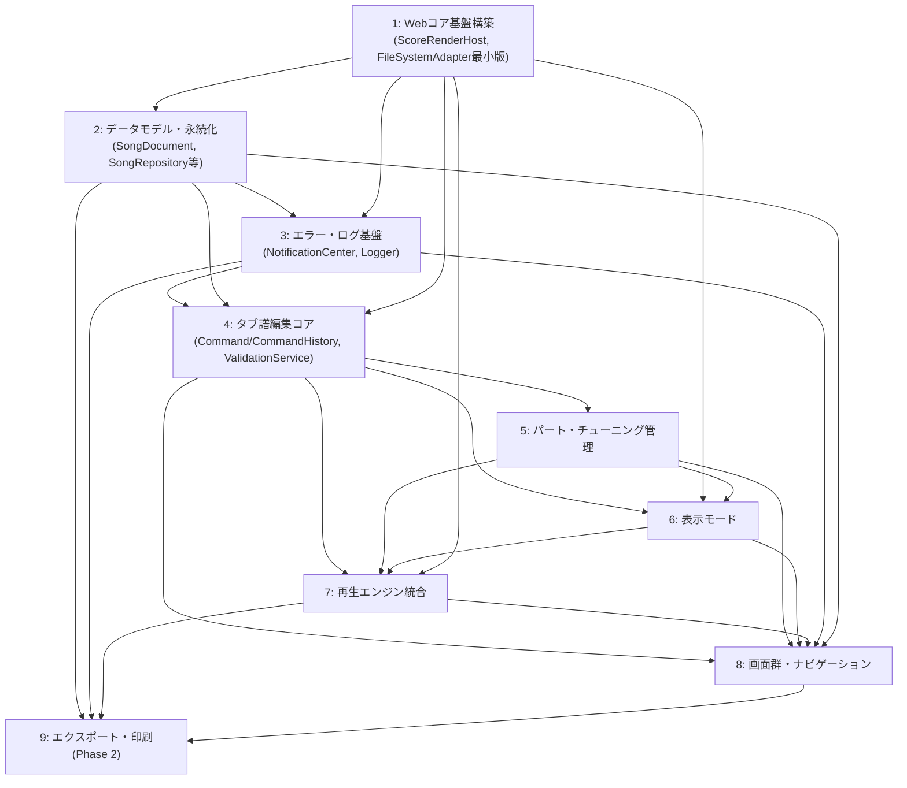

# 詳細設計 横断リファレンス（ご本尊）

- **位置づけ**：本書は特定の作業パッケージに対応する詳細設計書ではなく、[[../basic_design/00_overview.md]]の用語集（ビジネスレベル）とは別に、**複数の詳細設計書・複数パッケージ・複数技術要素をまたぐ情報**（技術用語・設計パターン、クラス/インターフェースの現行シグネチャ、非破壊拡張ポイントの履歴、エラーコード統合表、パッケージ依存関係、命名規約、既知のギャップ）を一箇所に集約する横断リファレンスである。
- **なぜ必要か**：詳細設計書が増えるにつれ、ある詳細設計書が別の詳細設計書のインターフェースを参照する箇所（例：`playback-integration.md`が`editing-core.md`の`ScoreRenderHost.render()`を参照する等）が増えており、参照元の記載が実体と食い違う事故（9.1の`ScoreRenderHost`命名不一致、9.2の`SetTempoCommand`欠落、9.4〜9.6の`screens-navigation.md`作成時の見落とし是正）が実際に複数回発生した。個々の詳細設計書を読むだけでは「どのクラスが今どんなシグネチャを持つか」を横断的に把握できないため、本書がその一次情報源（索引）になる。
- **運用**：[[../basic_design/00_overview.md]]の「詳細設計書シリーズ」表（0節の進捗ログ）は引き続き**パッケージの完成順・進捗の記録**として機能する。本書はそれとは別の**技術・インターフェースの現在状態の索引**であり、新しい詳細設計書の作成、または既存インターフェースの拡張が行われるたびに8節「運用ルール」に従って更新する。

## 1. 対応パッケージ一覧（本書執筆時点）

| # | パッケージ | ドキュメント |
|---|---|---|
| 1 | Webコア基盤構築 | [[web-core-foundation.md]] |
| 2 | データモデル・永続化 | [[data-model-persistence.md]] |
| 3 | エラー・ログ基盤 | [[error-logging-foundation.md]] |
| 4 | タブ譜編集コア | [[editing-core.md]] |
| 5 | パート・チューニング管理 | [[part-tuning-management.md]] |
| 6 | 表示モード | [[view-modes.md]] |
| 7 | 再生エンジン統合 | [[playback-integration.md]] |
| 8 | 画面群・ナビゲーション | [[screens-navigation.md]] |
| 9 | エクスポート・印刷（Phase 2） | [[export-print.md]] |

Phase 1（PC版MVP）の全8パッケージの詳細設計は2026-09-02に完了した。**2026-09-02追記**：Phase 2「エクスポート・印刷」（要件定義書9章の「書き出し機能」「印刷プレビュー」2件を統合）の詳細設計も完了し、パッケージ9として本表に追加した。以降はPhase 3（iPhone版展開）着手時に本表・本書全体を更新する。

## 2. 横断的な用語・設計パターン集

要件定義書・基本設計の用語集（[[../basic_design/00_overview.md#4]]）はビジネスレベルの用語（Song/Part/Bar/Beat/Note等）を扱う。ここでは詳細設計以降で複数パッケージにまたがって繰り返し登場する**設計パターン**を集約する。

| パターン名 | 内容 | 採用箇所（例） |
|---|---|---|
| 非破壊拡張（Non-breaking extension） | 基盤となるインターフェース（`FileSystemAdapter`／`ValidationService`／`CommandHistory`／`ScoreRenderHost`）は、後続パッケージが**既存メソッドのシグネチャを変更せず、新規メソッド追加のみで機能拡張する**。詳細な履歴は4節参照 | 全パッケージ共通の基本方針 |
| 編集ウィンドウ単位スコープ（Per-editing-window instance） | Electronの複数ウィンドウ対応（[[../basic_design/03_screens_ui_pc.md#2]]）により、「開いている曲」ごとに1インスタンスを持つべきクラス群がある。**アプリ全体で単一インスタンスではない**点に注意（`CommandHistory`は当初この誤りがあり訂正した経緯がある、9.3節参照） | `CommandHistory`／`CursorController`／`ViewModeController`／`ZoomController`／`PlaybackService`（3節に一覧） |
| ステートレスな割当処理（Stateless allocation） | インスタンス状態を持たず、呼び出しのたびに現在の対象範囲（対象曲の現在の状態等）を引数として受け取り、決定的に結果を返すだけの処理。「編集ウィンドウ単位スコープ」に当てはまらないクラスについて、そもそもスコープという概念が不要であることを明示するために区別する（`PartColorAllocator`は当初スコープが未記載のまま残っていた見落としがあり、9.13節でステートレスと明記して是正した） | `PartColorAllocator`（[[part-tuning-management.md#4.3]]） |
| 分類しない一律処理（Uniform / don't-classify） | 外部ライブラリ（alphaTab）が「安全な変更」と「安全でない変更」を判別する信頼できる手段を提供しない場面で、個別の分類を試みず常に同じ処理を一律適用する。分類ミスによる静かな不整合よりも、コストがやや高くても正しさを優先する考え方 | [[editing-core.md#3]]（コマンド実行毎に一律`render(affectedTrackIndices)`）／[[view-modes.md#3.1]]（全体スクロールビューはalphaTabネイティブ描画のまま、独自の簡易描画分類をしない）／[[playback-integration.md#4.3]]（`PlaybackMixerBinder`はどのコマンドがミキサー値を変えたか判定せず毎回まるごと再送） |
| dirty集合＋境界フラッシュ | 変更を即座には重い処理へ反映せず、いったん「変更されたもの」の集合として保持し、次の安全な境界（小節境界等）でまとめて反映する | [[playback-integration.md#4.2]] `PlaybackSyncController`（dirtyトラック集合→小節境界でAlphaSynthへ反映） |
| 実機検証待ちを設定切替可能な形に構造化 | 実機がないと確定できない分岐点（カテゴリA）について、複数の実装を共通インターフェースの下に用意しておき、検証結果が出た時点で設計変更なしに設定切替のみで確定できるようにする | `AudioSyncStrategy`（A4、[[playback-integration.md#5]]）／再描画戦略のフォールバックフラグ（A8、[[editing-core.md#3]]）／エクスポート・PDF生成の同期/非同期切替（A10、[[export-print.md#5]]） |
| `affectedTrackIndices`の申告 | すべての`Command`は自身の変更が影響するトラック（パート）のインデックス一覧を申告する契約を持ち、これが再描画・再生同期など複数の下流処理の共通入力になる | [[editing-core.md#6.1]]（`Command`インターフェース）、[[editing-core.md#3]]（再描画）、[[playback-integration.md#4.2]][[#4.3]]（`onCommandApplied`経由でのdirty検知・ミキサー同期） |
| NotificationCenter経由の通知→チャンネル振り分け | ドメイン層は`NotificationCenter.report(code, context)`を呼ぶだけで、実際の表示チャンネル（toast/highlight/modal）はコードから機械的に決まる（`LEVEL_TO_CHANNEL`）。UI層（[[screens-navigation.md#4.5]]の`NotificationUIBinder`）がそれを購読して振り分けるのみで、ドメイン層は自分がどう表示されるかを知らない | [[error-logging-foundation.md#2.1]]（発行側）、[[screens-navigation.md#4.5]]（表示側） |
| 既存の削除パターンの転用（ゴミ箱型の論理削除） | 「即時物理削除」ではなく「論理削除＋期限付き自動パージ＋復元導線」という同一パターンを、性質の異なるエンティティにも使い回す。専用のUndo機構を都度新設するより実装コストが小さく、ユーザーにとっても一貫した体験になる | `TrashService`（曲のゴミ箱、[[data-model-persistence.md#3.2]]）／ユーザー定義チューニングプリセットの論理削除（[[part-tuning-management.md#3.5]]、9.13節） |
| 共有純粋関数への抽出 | 複数パッケージが同じ計算ロジックを必要とする場合、片方の内部実装として埋め込むのではなく、副作用のない純粋関数として共有場所に抽出し、双方から呼び出す（ロジックの重複・drift を防ぐ） | `computeRealMidiPitch`（カポ実音変換式、B18。[[playback-integration.md#3.2]]から抽出し、`PlaybackService`と[[export-print.md#3.1]]の`MidiExportService`の両方が使用、9.12節） |

## 3. クラス／インターフェース登録簿

各詳細設計書が確定した主要クラス・インターフェースを、定義パッケージと現行シグネチャ（または責務レベルの記述）とともに一覧化する。**「シグネチャ」列が「（責務表のみ）」となっているものは、パッケージ1〜3のような具体的なメソッドシグネチャではなく、責務を表形式で記述するに留めている**（8.1節「既知のギャップ」参照）。

### 3.1 パッケージ1：Webコア基盤構築

| クラス/型 | 責務 | シグネチャ |
|---|---|---|
| `ScoreRenderHost` | alphaTabの唯一の窓口 | `initialize(container, options): void`／`loadScore(score): void`／`render(trackIndices?: number[]): void`／`dispose(): void`／`on(event, listener): void`／`off(event, listener): void`／`isInitialized: boolean`（getter）／`static parseAlphaTex(tex: string): unknown`（2026-09-07 実装時に非破壊追加、[[web-core-foundation.md#7]]）／＋パッケージ6・8による非破壊拡張（4節）。**内部方針**：alphaTab を `core.useWorkers: false`（メインスレッド同期描画）で構成する。Web Worker 自動生成が厳格 CSP（`script-src 'self'`）と衝突し `renderFinished` が返らないため（2026-09-07、[[../basic_design/13_design_decision_points.md#3]]B30、9.17節） |
| `RenderHostOptions`（型） | 初期化オプション | `engine: 'svg'`／`fontAssetsBasePath: string`／`soundFontAssetsBasePath: string` |
| `RenderHostEvents`（型） | イベント名列挙 | `'renderStarted' \| 'renderFinished' \| 'renderError'` |
| `FileSystemAdapter`（最小版） | 単一ルート配下のfs I/O | `readFile(path): Promise<Uint8Array>`／`writeFile(path, data): Promise<void>`／`listDirectory(path): Promise<DirEntry[]>`／`ensureDirectory(path): Promise<void>`／`getRootPath(): string` |
| `DirEntry`（型） | ディレクトリ一覧要素 | `name`／`isDirectory`／`sizeBytes`／`modifiedAt` |
| 軽量エラークラス（`packages/core/src/platform/errors.ts`） | Adapter 実装層が Node 固有エラーを正規化する先。アプリのエラーコード体系（5節）外 | `FileNotFoundError`（`code:'FILE_NOT_FOUND'`、不在）／`FileReadError`（`code:'FILE_READ_FAILED'`、EACCES/EISDIR/ENOTDIR 等の読み取り失敗。2026-09-07 実装レビューで追加、9.18節）／`FileWriteError`（`code:'FILE_WRITE_FAILED'`、書き込み失敗）。いずれも `path` を持ち生の Node エラーを境界外に出さない |

### 3.2 パッケージ2：データモデル・永続化

| クラス/型 | 責務 | シグネチャ |
|---|---|---|
| `SongDocument` | 1曲の集約ルート | `id`／`score`／`appMeta`／`schemaVersion`／`createdAt`／`toFileJson(savedAtMonotonic?): SongFileJson`／`static fromFileJson(json): SongDocument`（id はファイル名を最終的な真実とする）／`computeChecksum(): string`。Score⇔JSON は alphaTab `model.JsonConverter`（[[data-model-persistence.md#9.8]]） |
| `AppMetadata` | Score外の付随情報 | `tags`／`memos`／`sectionMarkers`／`settings`／`thumbnail` |
| `SongFileJson`（型） | ファイル形式 | `schemaVersion`／`id`／`createdAt`／`song`／`appMeta`／`integrity`（`id`・`createdAt` は実装時追記、[[data-model-persistence.md#9.8]]） |
| `SongSummary` | 曲一覧用軽量情報 | `id`／`title`／`updatedAt`／`tags`／`thumbnailRef`／`isTrashed` |
| `TuningPreset` | チューニングプリセット | `id`／`name`／`builtin`／`stringPitches` |
| `Tag` | タグマスタ | `id`／`name` |
| `SchemaMigrator` | スキーマ移行 | `register(from, to, fn): void`／`migrate(json, currentVersion): SongFileJson` |
| `ChecksumUtil` | 完全性検証 | `compute(schemaVersion, song, appMeta): string`（対象は`{schemaVersion, song, appMeta}`の決定的JSON文字列化） |
| `SongIndexService` | `index.json`管理 | `load(): Promise<SongSummary[]>`／`upsert(summary): Promise<void>`／`remove(songId): Promise<void>`／`rebuildFromSongsFolder(): Promise<SongSummary[]>` |
| `SongRepository` | 曲の読み書き | `load(songId): Promise<SongDocument>`／`save(document): Promise<void>`（**2026-09-03追記**：保存直前に`LocalBackupService.rotate(songId)`を呼び、旧本体ファイルを端末ローカルの1世代バックアップへ退避してから3.2節のアトミック書き込みへ進む、B25）／`create(setup): Promise<SongDocument>`（パッケージ8の`ThumbnailGenerator`フックが`save()`に非破壊で接続される、3.8節） |
| `AutoSaveScheduler` | 自動保存デバウンス | `notifyDirty(songId): void`／`flush(songId): Promise<void>`／`dispose(songId): void`（デバウンス3秒・最大遅延10秒。コンストラクタは `repo`＋`resolveDocument(songId)`＋`AutoSaveHooks{ onSaved?, onError? }` を受け、`onSaved` に bootstrap が `MirrorSyncService.syncAfterSave` を接続する。リトライ全滅時 `onError`＝FILE-001 相当） |
| `TrashService` | ゴミ箱操作 | `moveToTrash(songId): Promise<void>`／`restore(songId): Promise<void>`／`purgeExpired(retentionDays): Promise<number>`／`permanentlyDelete(songId): Promise<void>` |
| `LocalBackupService`（**2026-09-03新設**） | 整合性エラー復旧用の端末ローカル1世代バックアップ（B25） | `rotate(songId): Promise<void>`（本体ファイルを退避）／`restore(songId): Promise<SongDocument \| null>`（退避先から復元、存在しなければ`null`）。保存先は主ストレージではなく`AppLocalConfigService`と同じ端末ローカル専用領域。ストレージ移行・別端末には引き継がれない |
| `StorageConfigService` | 保存先設定 | `load(): Promise<StorageConfig>`／`save(config): Promise<void>`／`validateMirrorConfig(config): ValidationResult` |
| `StorageMigrationService` | 主ストレージ切替 | `migrate(fromRoot, toRoot, onProgress?): Promise<MigrationResult>` |
| `MirrorSyncService` | 非同期ミラーコピー | `syncAfterSave(songId, mirrorRoots): void`（fire-and-forget）／`awaitPending(timeoutMs): Promise<void>`（**2026-09-03追記**：進行中のミラーコピーをタイムアウト付きで待つ、B26。ウィンドウクローズ時の`AutoSaveScheduler.flush()`後、およびアプリ終了処理から呼ばれる。既定タイムアウト15秒。通常の保存フローはこれまで通りブロックしない） |
| `FileSystemAdapterFactory` | 複数ルート対応 | `createForRoot(absoluteRootPath): FileSystemAdapter`（[[export-print.md#3.4]]がエクスポート先フォルダへの書き込みにも再利用、9.12節） |
| `AppLocalConfigService` | ローカル既定パスのポインタ | `readPointer(): Promise<StorageRootPointer \| null>`／`writePointer(pointer): Promise<void>` |
| `StorageRootPointer`（型） | ポインタ情報 | `rootAbsolutePath`／`storageType` |
| `StorageLocationDetector` | 候補フォルダ自動検出（契約のみ、実装はPhase 1） | `detectCandidates(): Promise<{type, path}[]>` |
| `TagStore` | タグマスタのCRUD（3.2節記載時は未定義だった契約。パッケージ8が確定、3.8節） | `list(): Promise<Tag[]>`／`create(name): Promise<Tag>`／`rename(tagId, name): Promise<void>`／`delete(tagId): Promise<void>` |

### 3.3 パッケージ3：エラー・ログ基盤

**2026-09-08 実装済み（`feature/error-logging-foundation`）**。プロセス配置は B32（[[../basic_design/13_design_decision_points.md#3]]、[[error-logging-foundation.md#2.4]]）：`NotificationCenter` は renderer（Webコア）内シングルトン `notificationCenter`、`Logger` は main プロセス。両者は `log:append` IPC で結線（4節）。

| クラス/型 | 責務 | シグネチャ |
|---|---|---|
| `NotificationCenter` | 4段階メッセージ方式の窓口（`packages/core/src/errors`、Webコア内シングルトン） | `report(code: string, context?: Record<string, unknown>): void`（未登録コードは`UnknownErrorCodeError`）／`subscribe(handler): () => void`／`getRecentBuffer(maxEntries: number): NotificationEvent[]`（`<=0`で空、既定バッファ`DEFAULT_RECENT_BUFFER_SIZE=200`）／`setLogSink(sink: LogSink \| undefined): void`。共有インスタンス`notificationCenter`＋`errorCodeRegistry`（コア8コード登録済み）をエクスポート |
| `NotificationEvent`（型、`@riff-line/shared-types`が真実源） | 発行イベント | `level`／`channel`／`code`／`message`／`context?`／`timestamp` |
| `LogSink`（型、`packages/core/src/errors`） | `NotificationCenter`→永続化の注入口 | `append(entry: LogEntry): void \| Promise<void>`（`Logger`が実装） |
| `ErrorCodeRegistry` | コード→定義の解決 | `register(code, def): void`（後勝ち）／`resolve(code): ErrorCodeDefinition`（未登録は`UnknownErrorCodeError`）／`has(code): boolean` |
| `ErrorCodeDefinition`（型） | コード定義 | `level`／`messageTemplate`（`{context.xxx}`展開は`renderMessageTemplate`、キー欠落はプレースホルダ残置） |
| `LEVEL_TO_CHANNEL`（定数） | レベル→チャンネル対応 | `info→toast, warning→toast, error→highlight, critical→modal` |
| `registerCoreErrorCodes(registry)` / `CORE_ERROR_CODES` | コア8コードの登録 | 5節の登録パッケージ=3の8行 |
| `Logger` | 永続ログ記録（main プロセス、`FileSystemAdapter`注入） | `append(entry: LogEntry): Promise<void>`（内部直列化キューで順序保証）／`flush(): Promise<void>`（キュー掃きだし待ち）／`writeCrashLog(reason: string, recentBuffer: NotificationEvent[]): Promise<void>`／`enforceQuota(maxTotalBytes: number): Promise<void>`（古い`modifiedAt`から削除、`app`/`crash`種別問わず）／`getLogFolderAbsolutePath(): string`。`DEFAULT_LOG_QUOTA_BYTES=10MB`。`implements LogSink` |
| `LogEntry`（型、`@riff-line/shared-types`が真実源） | ログ1行 | `timestamp`／`level`／`code`／`message`／`context?`／`stack?`（Error/Critical時のみ、`toLogEntry`が合成） |
| `CrashRecoveryController`（`apps/desktop/src/main`） | クラッシュ検知・復旧 | `attach(window: BrowserWindow): void`（`render-process-gone`購読。`clean-exit`除外、クラッシュ時`crashCountThisSession`+1・`reload()`・`onCrash`フック）／`consumeRecoveryState(): CrashRecoveryState`（`{recovered, repeatedCrash}`、`recovered`は一度消費、`repeatedCrash`は`>= REPEATED_CRASH_THRESHOLD(3)`）。通知は出さず renderer の `errorLoggingBootstrap` が `SYS-001`/`SYS-002` を発行 |
| `LogRingBuffer`（`apps/desktop/src/main`、新設） | main側の直近`NotificationEvent`履歴（クラッシュログ添付用、renderer消失に備える） | `push(event): void`／`snapshot(): NotificationEvent[]`（コピー）／`size`。`DEFAULT_LOG_RING_SIZE=200` |
| `CrashRecoveryState`（型、`@riff-line/shared-types`） | `crash:getRecoveryState`応答 | `recovered: boolean`／`repeatedCrash: boolean` |

### 3.4 パッケージ4：タブ譜編集コア

| クラス/型 | 責務 | シグネチャ／備考 |
|---|---|---|
| `CursorController` | カーソル位置・入力音価・選択範囲の保持 | （責務表のみ）。編集ウィンドウ単位スコープ |
| `EditingService` | UIイベント→コマンド変換 | （責務表のみ） |
| `Command`（インターフェース） | Undo/Redo単位 | （責務表のみ、詳細は[[editing-core.md#6.1]]）：識別・表示、`affectedTrackIndices`の申告、実行、取り消し、結合可否判定（任意）、結合（任意） |
| `CommandHistory` | コマンド実行・Undo/Redo仲介、メモリ予算管理 | `execute(command): void`／`undo(): void`／`redo(): void`／`canUndo(): boolean`／`canRedo(): boolean`／`subscribe(listener): () => void`／`onCommandApplied(listener): () => void`。**編集ウィンドウ（＝開いている曲）ごとに1インスタンス**。**2026-09-03追記**：undoStack/redoStackの推定合計サイズに**80MB**のメモリ予算、直近**200件**の下限保証、下限を満たした状態での予算超過時は最古エントリからのエビクションを実装する（[[../basic_design/13_design_decision_points.md#4]]C11、要件変更履歴[[../tab_app_requirements.md#10]]#12）。エビクションが実際に発生した最初の1回のみ`EDIT-008`（Info）を発行する |
| `CompositeCommand` | 複数`Command`の束ね | （責務表のみ）。`InsertBarCommand`/`DeleteBarCommand`/`PasteCommand`が採用 |
| `ValidationService` | ノート配置・小節数等の検証、非破壊拡張の受け皿 | （責務表のみ）。拡張：パッケージ5がパート数上限・弦数同期・カポ範囲を追加 |
| `ChordDetectionService` | コードネーム推定 | （責務表のみ） |
| `ClipboardService` | コピー＆ペースト用データ保持 | （責務表のみ） |
| 具象`Command`一覧 | `PlaceNoteCommand`／`InsertRestCommand`／`SetTieCommand`／`SetSlurCommand`／`SetTechniqueCommand`／`SetChordNameCommand`／`SetTempoCommand`／`InsertBarCommand`／`DeleteBarCommand`／`PasteCommand`／`AddMemoCommand`／`EditMemoCommand`／`DeleteMemoCommand`／`AddSectionMarkerCommand`／`EditSectionMarkerCommand`／`DeleteSectionMarkerCommand` | 各責務は[[editing-core.md#6.4]]参照。`SetTempoCommand`は2026-09-02に欠落が発覚し追加（9.2節）。メモ・セクションマーカー系6コマンドも2026-09-02のセルフレビューで欠落が発覚し追加（9.9節） |

### 3.5 パッケージ5：パート・チューニング管理

| クラス/型 | 責務 | シグネチャ／備考 |
|---|---|---|
| `PartManagementService` | パートCRUD・ミキサー系プロパティ変更受付 | （責務表のみ）。初期値は[[screens-navigation.md#3.1]]の`AppPreferencesService`から取得。新規曲作成ウィザード等でのパート一括追加時は、`PartColorAllocator`へ渡す「使用中の色」に同一バッチ内で未実行のコマンドの割当予定色も含める責務を負う（9.13節） |
| `TuningPresetService` | チューニングプリセットのCRUD・適用 | （責務表のみ）。**2026-09-03追記**：ユーザー定義プリセットの削除は即時物理削除ではなく論理削除とし、保持期間7日または件数上限20件のいずれか早いほうで自動パージする（B27、[[part-tuning-management.md#3.5]]）。通常の一覧取得は論理削除分を除外する |
| `PartColorAllocator` | パート識別色の自動割当（固定8色パレット） | （責務表のみ）。**2026-09-03追記**：インスタンス状態を持たない**ステートレスな処理**であり、スコープという概念自体を持たない（[[../basic_design/13_design_decision_points.md#3]]、既存記述の欠落の是正、9.13節）。呼び出し元が「現在使用中の色一覧」を都度渡す契約 |
| `ValidationService`拡張 | パート数上限(8)／弦数同期／カポ範囲(0-12)の検証 | 非破壊拡張。エラーコード`EDIT-005`〜`EDIT-007`。`EDIT-005`は2026-09-02にErrorへ再分類（B20、9.7節） |
| 具象`Command`一覧 | `AddPartCommand`／`RemovePartCommand`／`ReorderPartsCommand`／`SetPartVolumeCommand`／`SetPartPanCommand`／`SetPartSoloCommand`／`SetPartMuteCommand`／`SetPartColorCommand`／`SetCapoFretCommand`／`ApplyTuningPresetCommand`／`SetCustomTuningCommand` | 各責務は[[part-tuning-management.md#5]]参照 |

### 3.6 パッケージ6：表示モード

| クラス/型 | 責務 | シグネチャ／備考 |
|---|---|---|
| `ViewModeController` | 表示モード（focus/scroll/score）の保持・切替、フォーカスビュー表示範囲追従 | （責務表のみ）。編集ウィンドウ単位スコープ |
| `ZoomController` | モードごとのズームレベル保持 | （責務表のみ）。編集ウィンドウ単位スコープ。初期値は[[screens-navigation.md#3.1]]の`AppPreferencesService`から取得 |
| `ScoreRenderHost`拡張 | 表示モード適用・ズーム適用・トラック識別属性の付与 | 非破壊拡張。**具体的なメソッドシグネチャは未確定**（alphaTabレイアウトAPI調査後に実装時確定する意図的な保留、8.1節参照）。トラック識別属性（`data-track-index`）の付与方式のみ[[view-modes.md#4.3]]で確定済み（9.11節） |

### 3.7 パッケージ7：再生エンジン統合

| クラス/型 | 責務 | シグネチャ／備考 |
|---|---|---|
| `PlaybackService` | 再生制御ファサード、先行初期化 | （責務表のみ）：`preWarm()`が主要メソッドとして名指しされている。編集ウィンドウ単位スコープ。カポ実音変換は3.1節（2節）の`computeRealMidiPitch`を呼び出す形に2026-09-02リファクタリング（9.12節、外部シグネチャ・挙動に変更なし） |
| `PlaybackSyncController` | dirtyトラック管理・境界フラッシュ | （責務表のみ） |
| `PlaybackMixerBinder` | ミキサー値のAlphaSynth反映 | （責務表のみ） |
| `MetronomeService`／`CountInController`／`TapTempoController` | メトロノーム・カウントイン・タップテンポ | （責務表のみ）。`TapTempoController`が`SetTempoCommand`（3.4節）を発行。設定値の入力元は[[screens-navigation.md#3.1]]/[[screens-navigation.md#3.4]]の`AppPreferencesService`（2026-09-02、パッケージ8が非破壊追記。当初は申し送りのみで未実装だったが、セルフレビューで実際に追記した、9.10節） |
| `PlaybackCursorFollow` | 再生カーソルの表示範囲追従 | （責務表のみ）。[[view-modes.md#4.1]]の`ViewModeController`表示範囲更新APIを呼ぶ |
| `AudioSyncStrategy`（インターフェース） | dirtyトラックのAlphaSynth反映方式の切替 | 実装：`PartialReloadStrategy`／`PauseResumeStrategy`（A4対応、5節） |

### 3.8 パッケージ8：画面群・ナビゲーション

| クラス/型 | 責務 | シグネチャ／備考 |
|---|---|---|
| `WindowManager`（`WindowAdapter`実装） | 曲一覧・編集ウィンドウの生成、`focusExistingWindow`による重複防止 | （責務表のみ）。[[../basic_design/01_architecture.md#3]]AD-3の`PlatformAdapter`4種のうち未定義だった`WindowAdapter`をここで新規定義（既存インターフェースの非破壊拡張ではなく新規追加） |
| `MenuBarController` | メニューバー構成とサービス呼び出しの配線 | （責務表のみ） |
| `KeyboardShortcutRouter` | キーボードショートカットの配線 | （責務表のみ） |
| `ToolbarViewModel`／`StatusBarViewModel` | ツールバー/ステータスバーの状態管理（編集ウィンドウごと） | （責務表のみ） |
| `NotificationUIBinder` | `NotificationCenter`購読→Toast/Highlight/Modal振り分け | （責務表のみ） |
| `ScoreHighlightBinder` | Errorレベル通知の譜面ハイライト表示 | （責務表のみ）。`ScoreRenderHost`のハイライト用非破壊拡張（4節）を呼び出す。B20でのErrorへの再分類（`EDIT-003`/`EDIT-005`/`TAG-001`）により、これらもハイライト表示チャンネルを通るようになった |
| `AppPreferencesService` | 設定ダイアログ項目1〜6・8・11、オンボーディング表示済みフラグの格納（新設） | `load(): Promise<AppPreferences>`／`save(prefs): Promise<void>`（責務レベル）。ファイルは`preferences.json`（`StorageConfigService`の`settings.json`とは別）。**2026-09-02訂正**：当初「項目1〜8・11」としていたが、項目⑦（タグ管理）は永続値を持たないナビゲーションリンクであるため対象外（9.8節） |
| `TagStore` | タグマスタのCRUD（3.2節参照。当パッケージが確定） | 3.2節参照 |
| `ThumbnailGenerator` | 曲一覧サムネイルの生成（[[view-modes.md]]への申し送りが実装されなかった問題をここで解消、9.5節） | （責務表のみ）。`SongRepository.save()`への非破壊フックとして接続 |

### 3.9 パッケージ9：エクスポート・印刷（Phase 2）

| クラス/型 | 責務 | シグネチャ／備考 |
|---|---|---|
| `AlphaTexExportService` | Scoreモデル→alphaTexテキスト変換（ネイティブAPI利用） | `export(song: SongDocument, options?): string`。詳細は[[export-print.md#3.1]] |
| `MidiExportService` | Scoreモデル→SMF自前変換 | `export(song: SongDocument): Uint8Array \| null`。ピッチ計算は2節の`computeRealMidiPitch`を使用。詳細は[[export-print.md#3.1]] |
| `ExportFileNameGenerator` | エクスポートファイル名の自動生成 | `generate(songTitle, extension): string`。詳細は[[export-print.md#3.1]] |
| `ExportFileWriter` | 生成データの書き出し | `write(destinationAbsolutePath, data): Promise<boolean>`。既存の`FileSystemAdapterFactory.createForRoot()`（3.2節）を非破壊で再利用。詳細は[[export-print.md#3.1]][[#3.4]] |
| `PrintPipelineService` | PDF生成・印刷プレビュー・印刷実行のオーケストレーション | `generatePdf(song): Promise<Uint8Array \| null>`／`print(song): Promise<boolean>`。詳細は[[export-print.md#3.1]] |
| `PrintLayoutRenderHost`（新規、`ScoreRenderHost`の非破壊拡張ではなく独立クラス、B21） | A4幅レイアウト・SVGページ描画専用のレンダリングホスト | `initialize(container, options): void`／`layoutForPrint(song): Promise<PrintLayoutResult>`／`dispose(): void`。詳細は[[export-print.md#3.2]] |
| `NativeDialogAdapter`（新規インターフェース、AD-3の4種とは別の新規追加） | OS標準「名前を付けて保存」ダイアログの呼び出し | `showSaveDialog(options): Promise<string \| null>`。詳細は[[export-print.md#3.3]] |
| `PrintWindowController`（新規、Electronメインプロセス限定） | PDF生成専用の非表示`BrowserWindow`管理、および直前のレイアウト結果のキャッシュ管理（**2026-09-04追記**：新規キャッシュ格納前に旧エントリを明示的に破棄する、B28・監査是正） | `renderAndGeneratePdf(song, layoutOptions): Promise<Uint8Array>`／`showPrintDialog(song, layoutOptions): Promise<void>`。詳細は[[export-print.md#3.3]] |

## 4. 非破壊拡張ポイント履歴

| 基盤インターフェース | 初出パッケージ | 拡張履歴 |
|---|---|---|
| `FileSystemAdapter` | 1（Webコア基盤構築、最小版：`readFile`/`writeFile`/`listDirectory`/`ensureDirectory`/`getRootPath`） | パッケージ2が`renameFile`/`deleteFile`/`copyFile`/`exists`を追加。さらに複数ルート同時アクセスのニーズから`FileSystemAdapterFactory.createForRoot()`を新設（既存インターフェース自体は単一ルート前提のまま変更しない）。**IPC契約もパッケージ2が非破壊拡張**：[[web-core-foundation.md#4.1]]の既存5チャンネル（`fs:readFile`等）は変更せず、ルート指定付きの`fs:*At`（8本）・`appconfig:readPointer`/`writePointer`/`getActiveRoot`を追加し、レンダラー側に`window.riffLineApi`のみへ依存する`IpcFileSystemAdapter`／`IpcFileSystemAdapterFactory`を新設した（B31、[[data-model-persistence.md#3.3.1]][[data-model-persistence.md#9.7]]、9.19節）。パッケージ9（エクスポート・印刷）が同ファクトリをエクスポート先フォルダへの書き込みに再利用（新規のインターフェース追加は不要だった） |
| `ValidationService` | 4（タブ譜編集コア、ノート配置・小節数検証） | パッケージ5がパート数上限(`EDIT-005`)・チューニングプリセット弦数同期(`EDIT-006`)・カポ範囲(`EDIT-007`)を非破壊追加 |
| `CommandHistory` | 4（タブ譜編集コア、`execute`/`undo`/`redo`/`subscribe`） | 同パッケージ内で`onCommandApplied`購読チャンネルを追加（パッケージ7の`PlaybackSyncController`/`PlaybackMixerBinder`が購読）。あわせて「アプリ全体で1つ」という誤った初期記述を「編集ウィンドウごとに1つ」に訂正（9.3節） |
| `ScoreRenderHost` | 1（Webコア基盤構築、`initialize`/`loadScore`/`render`/`dispose`） | 2026-09-07のパッケージ1実装時に、イベント購読`on`/`off`・`isInitialized` getter・静的`parseAlphaTex(tex)`を非破壊追加（3.1節、[[web-core-foundation.md#7]]）。パッケージ6が表示モード適用・ズーム適用・トラック識別属性の付与を非破壊追加（シグネチャは実装時確定、3.6節）。パッケージ8がErrorレベル通知のハイライト表示・解除メソッドを非破壊追加（[[screens-navigation.md#4.5.1]]、シグネチャは実装時確定）。**パッケージ9（PDF印刷）はこれを拡張せず、B21により独立クラス`PrintLayoutRenderHost`を新設した（3.9節）** |
| `SongRepository`／`MirrorSyncService` | 2（データモデル・永続化） | **2026-09-03追記**：`SongRepository.save()`へ`LocalBackupService`による保存直前の1世代バックアップ退避を非破壊追加（B25）。`MirrorSyncService`へ進行中コピーの完了待ち`awaitPending(timeoutMs)`を非破壊追加（B26）。いずれも既存メソッド（`save`/`syncAfterSave`）のシグネチャ・挙動は変更していない。**2026-09-08追記（パッケージ3）**：両サービスの暫定 console ログ箇所を `notificationCenter.report('FILE-001'/'FILE-005', ...)` に置換（シグネチャ不変、[[error-logging-foundation.md#9.2]]） |
| IPC チャンネル（`@riff-line/shared-types` の `FS_CHANNELS`／`APP_CONFIG_CHANNELS`） | 1（`fs:*`5本）→2（`fs:*At`8本・`appconfig:*`4本、B31） | **2026-09-08追記（パッケージ3、B32）**：`LOG_CHANNELS.append`（`log:append`）・`CRASH_CHANNELS.getRecoveryState`（`crash:getRecoveryState`）を非破壊追加。既存チャンネルは不変。preload `RiffLineApi` に `log.append(event)`／`crash.getRecoveryState()` を追加 |

**新規インターフェース（拡張ではなく新規追加）**：パッケージ8は既存4点の非破壊拡張とは別に、`WindowAdapter`（AD-3が未定義のまま残していた枠を初めて埋めるもの）・`AppPreferencesService`・`TagStore`（3.2節参照）・`ThumbnailGenerator`を新規に追加した。パッケージ9（エクスポート・印刷）も同様に、`NativeDialogAdapter`（AD-3の4種とは別の新規追加）・`PrintWindowController`（メインプロセス限定の新規ヘルパー）・`PrintLayoutRenderHost`を新規に追加した。パッケージ2は2026-09-03に`LocalBackupService`を新規追加した（B25、既存の`FileSystemAdapter`／`SongRepository`の変更は非破壊拡張の範囲に留まる）。パッケージ3（2026-09-08）は`NotificationCenter`／`ErrorCodeRegistry`／`Logger`（3.3節）と、main プロセス限定の`CrashRecoveryController`／`LogRingBuffer`、renderer 配線の`errorLoggingBootstrap`を新規に追加した（B32）。いずれも既存インターフェースの変更を伴わない。

## 5. エラーコード統合表

| コード | レベル | 登録パッケージ | 発生源 |
|---|---|---|---|
| `FILE-001` | Error | 3（error-logging-foundation.md、対象は2） | `AutoSaveScheduler`のリトライ全滅 |
| `FILE-002` | Critical | 3（対象は2） | `IntegrityCheckFailedError`（**2026-09-03追記**：通知文言「直前の自動保存内容から復元しますか？」に対応する実際の復元手段が存在しなかった問題を、`LocalBackupService`の新設により解消した。B25） |
| `FILE-003` | Error | 3（対象は2） | オンデマンドダウンロードのリトライ全滅 |
| `FILE-004` | Critical | 3（対象は2） | `SchemaMigrator`の`UnsupportedSchemaVersionError` |
| `FILE-005` | Warning | 3（対象は2） | `MirrorSyncService`のミラー書き込み失敗 |
| `SYS-001` | Warning | 3 | クラッシュ復旧成功 |
| `SYS-002` | Critical | 3 | 繰り返しクラッシュ |
| `RENDER-001` | Error | 3（対象は1） | `ScoreRenderHost`の`renderError` |
| `EDIT-001` | Error | 4 | 同一Beat内で同一弦への重複配置 |
| `EDIT-002` | Error | 4 | フレット番号が0〜24の範囲外 |
| `EDIT-003` | Error | 4 | 小節数が2048を超える追加操作の拒否（B20により2026-09-02にWarningからErrorへ再分類、[[../basic_design/13_design_decision_points.md#3]]） |
| `EDIT-004` | Warning | 4 | メモ文字数が上限（約100字）に達した |
| `EDIT-005` | Error | 5 | パート数上限(8)超過による追加操作の拒否（B20により2026-09-02にWarningからErrorへ再分類、[[../basic_design/13_design_decision_points.md#3]]） |
| `EDIT-006` | Warning | 5 | チューニングプリセット適用による弦数減少でNote破棄 |
| `EDIT-007` | Error | 5 | カポ範囲外(0〜12) |
| `EDIT-008` | Info | 4 | `CommandHistory`のメモリ予算超過によるUndo/Redo履歴のエビクションがセッション中に初めて発生（C11、[[../basic_design/13_design_decision_points.md#4]]） |
| `TAG-001` | Error | 8 | タグ総数が50件を超える作成操作の拒否（B20により2026-09-02にWarningからErrorへ再分類、[[../basic_design/13_design_decision_points.md#3]]） |
| `SONG-001` | Warning | 8 | 曲数が900件（上限1000の90%）に到達（拒否を伴わない予告的な警告のためWarningのまま） |
| `SONG-002` | Error | 8 | 曲数が上限1000件に到達した新規曲作成の拒否（C12、[[../basic_design/13_design_decision_points.md#4]]） |
| `EXPORT-001` | Error | 9 | alphaTex／MIDI／PDFいずれかの変換処理中の失敗（該当フォーマットのエクスポートのみ不可） |
| `EXPORT-002` | Error | 9 | 出力先フォルダへのファイル書き込み失敗（権限不足・ディスク容量不足等） |

## 6. パッケージ依存関係マップ

依存の実体は主に「前パッケージが確定したインターフェースを次パッケージが呼ぶ／非破壊拡張する」関係である。パッケージ8は最終パッケージとして1〜7すべてに依存する（UIから各`Service`/`Controller`を呼び出す配線が主任務のため）が、逆方向（1〜7がパッケージ8に依存する関係）は発生しない（AD-2のUI/ドメイン層分離）。パッケージ9（エクスポート・印刷、Phase 2）は、`SongDocument`（P2）・`NotificationCenter`（P3）・`computeRealMidiPitch`（P7から抽出、2節）・エクスポート/印刷ダイアログのUIシェル（P8）に依存する。

## 7. 命名・パターン規約

| 接尾辞 | 意味 | 例 |
|---|---|---|
| `Service` | ある業務的関心事に対する操作を提供する、比較的ステートレスな（または軽い状態のみを持つ）窓口 | `EditingService`／`TuningPresetService`／`StorageConfigService`／`AppPreferencesService`／`AlphaTexExportService`／`MidiExportService`／`LocalBackupService` |
| `Controller` | UI状態・セッション状態を保持し、多くは編集ウィンドウ単位スコープ | `CursorController`／`ViewModeController`／`ZoomController` |
| `Command` | `CommandHistory`経由でUndo/Redo対象になる単一の変更操作 | `PlaceNoteCommand`／`SetTempoCommand` |
| `Registry` | ID（コード等）から定義情報を引く辞書的な窓口 | `ErrorCodeRegistry` |
| `Store` | 単純なマスタデータ（レコード数が少なく、業務ロジックをほとんど持たない）のCRUDを提供する窓口。`Service`ほど複雑な調停を行わない | `TagStore` |
| `Allocator` | 有限のリソース（色等）を重複なく割り当てる責務。インスタンス状態を持たないステートレスな処理として設計する（`PartColorAllocator`、9.13節） | `PartColorAllocator` |
| `Adapter` | プラットフォーム差異を吸収する抽象化層 | `FileSystemAdapter`／`WindowAdapter`／`NativeDialogAdapter` |
| `Factory` | 実行時パラメータ（ルートパス等）に応じてインスタンスを生成する | `FileSystemAdapterFactory` |
| `Strategy` | 共通インターフェースの下で複数の実装を実行時に切替可能にする（主に実機検証待ち事項の受け皿） | `AudioSyncStrategy` |
| `Host` | 外部ライブラリ（alphaTab）の唯一の窓口となり、他モジュールに生APIを触らせない | `ScoreRenderHost`／`PrintLayoutRenderHost` |
| `Binder` | 通知・イベントを受け取り、別のコンポーネント（UIやエンジン）へ機械的に反映する橋渡し役 | `NotificationUIBinder`／`ScoreHighlightBinder`／`PlaybackMixerBinder` |
| `Pipeline`（2026-09-02追加） | 複数の処理段階（レイアウト→描画→変換等）を1つの呼び出しで完結させるオーケストレーション役 | `PrintPipelineService` |
| `Writer`（2026-09-02追加） | 生成済みデータを特定の宛先（ファイル等）へ書き出すことに特化した窓口 | `ExportFileWriter` |

**編集ウィンドウ単位スコープの原則**：`Controller`系・`PlaybackService`は基本的に「開いている曲＝編集ウィンドウ」ごとに1インスタンスである。新しいクラスを設計する際、複数のウィンドウ・複数の曲を同時に開く前提（[[../basic_design/03_screens_ui_pc.md#2]]）と矛盾しないか必ず確認すること（9.3節の教訓）。**2026-09-03追記**：この確認は「編集ウィンドウ単位である」ことの確認だけでなく、「そもそもインスタンススコープを持たないステートレスな処理である」可能性の確認も含む。`PartColorAllocator`はこの後者に該当していたが、当初この確認が漏れていた（9.13節）。

## 8. 運用ルール

- 新しい`detailed_design/*.md`を作成したとき、または既存の基盤インターフェース（4節の4件、もしくは新たに基盤化したもの）を非破壊拡張したときは、**同じターンで**以下を更新する：(1) [[../basic_design/00_overview.md]]の進捗ログ・索引表、(2) [[../basic_design/13_design_decision_points.md]]（新規分岐点があれば）、(3) 本書の該当節（3節のクラス登録簿、4節の拡張履歴、5節のエラーコード表、6節の依存関係図）。
- 他パッケージの詳細設計書に登場するクラス・メソッド名を引用する際は、**引用元の詳細設計書を実際に読んで現行シグネチャを確認してから**引用する（9.1節のような命名不一致を再発させないため）。本書3節の登録簿はその一次参照先として使えるが、本書自体が古くなっている可能性もあるため、疑わしい場合は原典（各パッケージの詳細設計書）を確認する。
- ある詳細設計書が「別パッケージへの申し送り」を書いた場合、申し送り先のパッケージ着手時に**実際にその申し送り内容が実装されたかを確認する**（9.5節：申し送り先と実装内容が食い違っていた実例があるため、申し送りを書くだけでなく着手時に照合する運用を徹底する）。
- 8.1節「既知のギャップ」は、解消したら該当項目を「解消済み（日付・対応パッケージ）」に書き換え、削除はしない（何が問題だったかの記録を残す）。
- **2026-09-02追記（セルフレビュー運用の追加）**：主要な作業パッケージ（Phase単位）が完了した時点で、複数の独立したセルフレビューを並行実施し、基本設計とのトレーサビリティ・内容矛盾を横断的に点検する（[[../basic_design/15_development_process.md#6]]C6運用）。レビューで見つかった指摘のうち、既存記述の欠落・誤りの是正は本書8.1節・9節に記録し、新たな設計判断を要するものは[[../basic_design/13_design_decision_points.md]]にカテゴリBの決定点として追加する。
- **2026-09-02追記（新規エラーコード登録時の確認事項、B20の教訓）**：新しいエラーコードを登録する際は、そのレベル（Warning/Error/Critical）が実際の挙動（操作を拒否するか、継続を許すか）と一致しているかを必ず確認してから登録する。過去にこの確認を怠り、ハードキャップ（操作を拒否する制約）をWarningとして誤登録した事例がある（B20、9.7節）。
- **2026-09-03追記（通知文言と実装の一致確認、B25の教訓）**：`NotificationCenter`のメッセージテンプレートが「〜できます／〜しますか」と何らかの復旧・救済手段の存在を示唆する場合、その手段が実際に実装されているかを併せて確認する。過去にこの確認を怠り、存在しない復旧手段を約束する文言のまま放置していた事例がある（`FILE-002`、B25）。
- **2026-09-03追記（新規クラスのスコープ確認の徹底、9.13節の教訓）**：7節「編集ウィンドウ単位スコープの原則」に基づく確認は、これまで「アプリ全体か編集ウィンドウ単位か」の二択で行われがちだったが、実際には「そもそもインスタンス状態を持たないステートレスな処理」という第三の答えもありうる。新規クラスの設計時は、この3択（編集ウィンドウ単位／アプリ全体／ステートレス）のどれに当たるかを明記することを徹底する。
- **2026-09-04追記（監査による是正の教訓、9.15節参照）**：「反映先」として設計書間のクロスリファレンス（`[[file.md#N]]`）を記録する際は、記載した節番号に実際に該当内容が書かれているかを、書いた直後に一度読み返して確認する。決定点カタログ（[[../basic_design/13_design_decision_points.md]]）の「反映先」列は実装時・監査時の一次参照先として使われるため、節番号のズレはそのまま「反映漏れ」に見える誤った警告を生む。あわせて、新設したキャッシュ・状態保持機構（B28等）を設計する際は、「格納」だけでなく「既存エントリの明示的な破棄」を対で確認する（ネイティブリソースを保持するキャッシュは特に、参照の上書きだけでは解放されないため）。
- **2026-09-06追記（3回目のレビューの教訓、9.16節参照）**：新しいエラーコードを既存の例示リスト（[[../basic_design/08_error_logging.md#1]]等、コード登録の一覧とは別に「発生源の例」を列挙している箇所）へ登録する際は、コード自体の登録（本書5節・エラーコードレジストリ）だけでなく、そうした例示リストへの反映も同じターンで行う（漏れるとリストが陳腐化する、G20の教訓）。また、複数の異なる種類のパス・要素を1つの表セル・1行に詰め込む記法（カンマ区切り併記等）は、実際の階層・所属が一意に読み取れなくなるため避ける（G21・B29の教訓、[[../basic_design/13_design_decision_points.md#3]]B29）。

## 8.1 既知のギャップ・フォローアップ

| # | ギャップ | 内容 | 状態 |
|---|---|---|---|
| G1 | 詳細設計書の記述粒度の不統一 | パッケージ1〜3（[[web-core-foundation.md]]／[[data-model-persistence.md]]／[[error-logging-foundation.md]]）は全クラスに具体的なTypeScript風メソッドシグネチャを記載しているのに対し、パッケージ4〜8（[[editing-core.md]]／[[part-tuning-management.md]]／[[view-modes.md]]／[[playback-integration.md]]／[[screens-navigation.md]]）はほとんどのクラスを責務レベルの表（プローズ）に留めている（`Command`インターフェースのみ責務レベルながら詳細に確定）。[[../basic_design/13_design_decision_points.md#3]]B13は「詳細設計書は具体的なメソッドシグネチャまで書く」という趣旨だったため、この不統一はB13の意図から外れている。ただし5件のドキュメントを今すぐ書き直すのは規模が大きいため、いったん本書に既知のギャップとして明記するに留める。**2026-09-02追記**：パッケージ9（[[export-print.md]]）はパッケージ1〜3寄りの具体的なメソッドシグネチャで記述しており、この不統一をこれ以上広げないための一歩とした | 未解消（パッケージ4〜8分）。本人の希望があれば専用の埋め戻しパスを設ける |
| G2 | `SetTempoCommand`欠落 | [[playback-integration.md#4.4]]が`SetTempoCommand`（[[editing-core.md#6.4]]準拠）を発行すると記載していたが、実際には[[editing-core.md#6.4]]に当該コマンドが定義されていなかった（要件4.1のテンポ入力がコマンド化されずに漏れていた） | **解消済み（2026-09-02）**：[[editing-core.md#6.4]]へ`SetTempoCommand`を追加した |
| G3 | `ScoreRenderHost`メソッド名の不一致 | [[editing-core.md]]が独自に`renderTracks(...)`/`renderAll()`という、[[web-core-foundation.md#3.1]]の実際の定義（`render(trackIndices?)`）と異なるメソッド名を使用していた | **解消済み（2026-09-02）**：[[editing-core.md]]の表記を`render(...)`に統一した |
| G4 | `CommandHistory`のスコープ誤記 | [[../basic_design/04_editing_core.md#8.2]]が「アプリ全体で単一インスタンス」としていたが、複数編集ウィンドウ対応（[[../basic_design/03_screens_ui_pc.md#2]]）と矛盾していた | **解消済み（2026-09-02）**：基本設計・詳細設計双方を「編集ウィンドウごとに1インスタンス」に訂正した |
| G5 | タグ総数・曲数上限のエラーコード未登録 | バリデーション関数自体は[[data-model-persistence.md#7]]に存在するが、対応する`ErrorCodeRegistry`登録コードが長らく未登録だった | **解消済み（2026-09-02）**：[[screens-navigation.md#3.5]]で`TAG-001`・`SONG-001`を登録した |
| G6 | サムネイル生成ロジックの申し送り先と実装の食い違い | [[data-model-persistence.md#11]]が表示モードパッケージ（[[view-modes.md]]）へサムネイル生成を申し送っていたが、実際の[[view-modes.md]]にはその実装が含まれていなかった | **解消済み（2026-09-02）**：[[screens-navigation.md#3.3]]がサムネイル生成ロジック（`ThumbnailGenerator`）を引き取って実装した |
| G7 | `TagStore`の契約未定義 | [[data-model-persistence.md#7]]が`TagStore`の存在を前提にしていたが、同書にそのメソッド契約が定義されていなかった | **解消済み（2026-09-02）**：[[screens-navigation.md#3.2]]で契約を確定した |
| G8（2026-09-02発見、セルフレビュー） | メモ・セクションマーカーの追加/編集/削除コマンド未定義 | [[../basic_design/02_data_model.md#3.5]][[#3.6]]で定義された`SectionMarker`・`Memo`エンティティに対応する具象`Command`が[[editing-core.md]]に一つも存在せず、コマンド層経由での作成・編集・削除手段がなかった（`ValidationService`が`EDIT-004`でメモ検証を登録していたにもかかわらず、検証対象のコマンドが未定義という矛盾） | **解消済み（2026-09-02）**：[[editing-core.md#6.4]]へ`AddMemoCommand`／`EditMemoCommand`／`DeleteMemoCommand`／`AddSectionMarkerCommand`／`EditSectionMarkerCommand`／`DeleteSectionMarkerCommand`の6件を追加した |
| G9（2026-09-02発見、セルフレビュー） | Warning/Errorレベルの運用矛盾 | 小節数上限(2048)・パート数上限(8)・タグ数上限(50)のハードキャップ超過が、いずれもWarningレベルとして登録されていたにもかかわらず、実際の記載（[[../basic_design/04_editing_core.md#4]]の「追加不可」、[[../detailed_design/part-tuning-management.md#6.1]]のシーケンス図）は操作を拒否する挙動を示しており、Warning本来の定義（操作継続可）と矛盾していた | **解消済み（2026-09-02）**：`EDIT-003`／`EDIT-005`／`TAG-001`をErrorへ再分類した（B20、[[../basic_design/13_design_decision_points.md#3]]） |
| G10（2026-09-02発見、セルフレビュー） | `playback-integration.md`への`AppPreferencesService`非破壊追記の未実施 | [[screens-navigation.md#3.1]]／[[screens-navigation.md#3.4]]が「メトロノーム・カウントイン・タップテンポの設定値は`AppPreferencesService`から取得する（[[playback-integration.md#4.4]]へ非破壊追記済み）」と主張していたが、実際の[[playback-integration.md#4.4]]にはその追記が存在しなかった | **解消済み（2026-09-02）**：[[playback-integration.md#4.4]]へ実際に追記した |
| G11（2026-09-02発見、セルフレビュー） | `04_editing_core.md`§8.2の誤ったクロスリファレンス | 存在しない`part-tuning-management.md#3.5`へのリンクが残っていた | **解消済み（2026-09-02）**：正しい`editing-core.md#6.2`への参照に訂正した |
| G12（2026-09-02発見、セルフレビュー） | `02_data_model.md`§3.2のパート色分け対象要素特定方法の申し送り先誤り | 「対象要素の特定方法は[[editing-core.md]]・04章の詳細設計で確定する」としていたが、実際には[[editing-core.md]]に該当内容が存在せず、正しくは表示モードパッケージの責務だった | **解消済み（2026-09-02）**：[[view-modes.md#4.3]]（`data-track-index`属性によるトラック識別）への申し送りに訂正した |
| G13（2026-09-03発見、本人の依頼による新しい視点でのレビュー） | `FILE-002`の通知文言と実装の不一致 | 「直前の自動保存内容から復元しますか？」という文言に対応する実際の復元手段（バックアップ）がどこにも実装されていなかった | **解消済み（2026-09-03）**：`LocalBackupService`（端末ローカル限定の1世代バックアップ）を新設した（B25、[[data-model-persistence.md#3.2]][[#9]]） |
| G14（2026-09-03発見、本人の依頼による新しい視点でのレビュー） | ミラー同期のfire-and-forgetとアプリ終了処理の不整合 | `MirrorSyncService.syncAfterSave()`が意図的に完了を待たない設計である一方、ウィンドウクローズ・アプリ終了時にもこれを待つ処理が存在せず、終了タイミング次第でミラーが静かに欠落しうる | **解消済み（2026-09-03）**：`MirrorSyncService.awaitPending(timeoutMs)`を新設し、終了処理から呼び出す（B26、[[data-model-persistence.md#3.2]]） |
| G15（2026-09-03発見、本人の依頼による新しい視点でのレビュー） | `PartColorAllocator`のスコープ未記載 | 7節「編集ウィンドウ単位スコープの原則」の確認ルールが敷かれていたにもかかわらず、`PartColorAllocator`にはこの確認が適用されておらず、3.5節の登録簿でもスコープ欄が空欄のままだった | **解消済み（2026-09-03）**：ステートレスな処理でありスコープの概念自体が不要であることを明記した（[[part-tuning-management.md#4.3]]） |
| G16（2026-09-03発見、本人依頼による2回目のレビュー） | `preferences.json`のストレージ移行対象漏れ | [[screens-navigation.md#3.1]]で新設された`AppPreferencesService`の`preferences.json`が、[[data-model-persistence.md#5]]の`StorageMigrationService`移行対象ファイル一覧（`tags.json`／`settings.json`等）に含まれていなかった（`AppPreferencesService`が`StorageMigrationService`確定より後に新設されたための見落とし、[[../review/design_review_2026-09-03.md]]A-1） | **解消済み（2026-09-03）**：[[data-model-persistence.md#5]]の移行対象一覧へ`preferences.json`を追加した |
| G17（2026-09-03発見、本人依頼による2回目のレビュー） | セルフレビュー対象範囲の記述が改訂前のまま残存 | [[../basic_design/15_development_process.md#6]]が2026-09-02にセルフレビュー対象を「L/XLサイズのみ」から「サイズ問わず全件」に改訂したにもかかわらず、[[web-core-foundation.md#8]]・[[data-model-persistence.md#10]]・[[error-logging-foundation.md#8]]・[[export-print.md#6]]のDoD記載が旧方針（「Mサイズ（またはSサイズ）のため対象外」）のまま残っていた（[[../review/design_review_2026-09-03.md]]A-2） | **解消済み（2026-09-03）**：4文書のDoD記載を新方針に合わせて修正した |
| G18（2026-09-03発見、本人依頼による2回目のレビュー） | メモリ目標の粒度未記載 | [[../basic_design/09_nonfunctional.md#3]]・[[../basic_design/11_test_strategy.md#0.1]]のメモリ使用量に関する記述が、複数編集ウィンドウを同時に開ける仕様（[[../basic_design/03_screens_ui_pc.md#2]]）に対し「アプリ全体」か「1ウィンドウあたり」かを明記していなかった（[[../review/design_review_2026-09-03.md]]A-5） | **解消済み（2026-09-03）**：両文書とも「1編集ウィンドウあたり」の粒度であることを明記した |
| G19（2026-09-04発見、本人依頼による監査） | `13_design_decision_points.md`C14行の「反映先」クロスリファレンス誤り | C14（`logs/`の移行対象除外・閲覧手段維持）の「反映先」列が`basic_design/06_file_io_persistence.md#5`（自動保存節）を挙げていたが、実際には同節にC14に関する記述が一切存在しなかった（[[../review/design_review_2026-09-03_audit.md]]B-5） | **解消済み（2026-09-04）**：`logs/`が実際に記載されている§3（ディレクトリ構造）への参照に訂正し、同節へC14の決定内容を明記する注記を追記した（[[../basic_design/06_file_io_persistence.md#3]]、[[../basic_design/13_design_decision_points.md#4]]） |
| G20（2026-09-06発見、本人依頼による3回目のレビュー） | `08_error_logging.md`§1のエラー例示リストの陳腐化 | `EDIT-008`（Undo/Redo履歴エビクション通知、C11）・`SONG-002`（曲数上限到達による新規作成拒否、C12）が2026-09-03に確定・登録されたが、`basic_design/08_error_logging.md`§1の「発生源の例」列（当時の最終更新は2026-09-02）にはいずれも反映されていなかった（[[../review/design_review_2026-09-04.md]]A-1） | **解消済み（2026-09-06）**：同表のInfo行・Error行にそれぞれの発生源例を追加した（[[../basic_design/08_error_logging.md#1]]） |
| G21（2026-09-06発見、本人依頼による3回目のレビュー） | `03_screens_ui_pc.md`§7のキーボードショートカット一覧の欠落 | §3画面インベントリ・§6メニューバー構成には既にエクスポート(Ctrl+E)・印刷(Ctrl+P)のショートカットが記載されていたが、§7のショートカット一覧表にはこの2行が存在しなかった（[[../review/design_review_2026-09-04.md]]B-2） | **解消済み（2026-09-06）**：同表にエクスポート・印刷の2行を追加した（[[../basic_design/03_screens_ui_pc.md#7]]） |

## 9. 発見・修正の経緯ログ（参考）

本節は8.1節の詳細版として、詳細設計フェーズ中に発見した横断的な不整合とその修正内容を時系列で記録する（8.1節が現状のサマリ、本節が経緯）。

### 9.1 `ScoreRenderHost`命名不一致（2026-09-02発見・修正）
パッケージ7の詳細設計中、[[web-core-foundation.md]]を再確認した際に判明。[[editing-core.md]]全体を`render(trackIndices?)`表記に統一した。

### 9.2 `SetTempoCommand`欠落（2026-09-02発見・修正）
本書の作成準備中に判明。[[editing-core.md#6.4]]へ追加し、[[playback-integration.md#4.4]]からの参照を実体化した。

### 9.3 `CommandHistory`スコープ誤記（2026-09-02発見・修正）
パッケージ5の詳細設計中、複数編集ウィンドウ対応（[[../basic_design/03_screens_ui_pc.md#2]]）との整合性を確認していて判明。基本設計・詳細設計の双方を訂正した。

### 9.4 設定ダイアログ項目の格納先未定義（2026-09-02発見・修正）
パッケージ8の詳細設計中、設定ダイアログ12項目（[[../basic_design/03_screens_ui_pc.md#10]]）のうち9件（項目1〜8・11）がどのサービスにも属していないことが判明。`AppPreferencesService`を新設して解消した（[[screens-navigation.md#3.1]]）。

### 9.5 サムネイル生成の申し送り先と実装の食い違い（2026-09-02発見・修正）
パッケージ8の詳細設計中、[[data-model-persistence.md#11]]が表示モードパッケージへ申し送っていたサムネイル生成が、実際の[[view-modes.md]]には実装されていなかったことが判明。パッケージ8が引き取って実装した（[[screens-navigation.md#3.3]]）。この経緯を踏まえ、8節の運用ルールに「申し送り内容の着手時照合」を追加した。

### 9.6 `TagStore`契約未定義（2026-09-02発見・修正）
パッケージ8の詳細設計中、[[data-model-persistence.md#7]]が前提としていた`TagStore`のメソッド契約が定義されていなかったことが判明。パッケージ8が確定した（[[screens-navigation.md#3.2]]）。

### 9.7 Warning/Errorレベルの運用矛盾（2026-09-02発見・修正、B20）
Phase 1全8パッケージ完了後のセルフレビュー（4件の独立レビューを並行実施）で判明。`EDIT-003`（小節数上限2048）・`EDIT-005`（パート数上限8）・`TAG-001`（タグ数上限50）はいずれもWarningレベルで登録されていたが、実際の記載（[[../basic_design/04_editing_core.md#4]]の「追加不可」、[[../detailed_design/part-tuning-management.md#6.1]]のシーケンス図）は操作自体を拒否する挙動であり、Warningの定義（操作継続可）と矛盾していた。ハードキャップという実態に合わせ3件ともErrorへ再分類した（[[../basic_design/13_design_decision_points.md#3]]B20）。曲数上限90%到達（`SONG-001`）は拒否を伴わない予告的な警告のためWarningのまま据え置いた。

### 9.8 設定ダイアログ項目⑦（タグ管理）の格納先誤り（2026-09-02発見・修正）
同じくセルフレビューで判明。9.4節で`AppPreferencesService`が「項目1〜8・11」を格納すると記載していたが、項目⑦（タグ管理）はタグ管理画面への遷移を行うだけのナビゲーションリンクであり、永続化すべき値を持たない。「項目1〜6・8・11」に訂正した（[[screens-navigation.md#3.1]]）。

### 9.9 メモ・セクションマーカーのコマンド未定義（2026-09-02発見・修正）
セルフレビューの過程で、当初の4件の指摘とは別に自ら発見。[[../basic_design/02_data_model.md#3.5]][[#3.6]]の`SectionMarker`・`Memo`エンティティに対応する具象`Command`が[[editing-core.md]]に存在せず、`ValidationService`が`EDIT-004`でメモ文字数検証を登録していたにもかかわらず、検証対象となるコマンド自体が定義されていなかった。`AddMemoCommand`／`EditMemoCommand`／`DeleteMemoCommand`（`affectedTrackIndices`は空配列、メモは譜面上に描画されないため）と`AddSectionMarkerCommand`／`EditSectionMarkerCommand`／`DeleteSectionMarkerCommand`（`affectedTrackIndices`は該当Barの全トラック、譜面上にインライン表示されるため）の6件を[[editing-core.md#6.4]]へ追加した。

### 9.10 `playback-integration.md`への申し送り未実施（2026-09-02発見・修正）
セルフレビューで判明。[[screens-navigation.md#3.1]]／[[screens-navigation.md#3.4]]は「メトロノーム・カウントイン・タップテンポの設定値は`AppPreferencesService`から取得する」という非破壊追記を[[playback-integration.md#4.4]]に対して行った、と記載していたが、実際の[[playback-integration.md#4.4]]にはその内容が存在しなかった（9.5節と同種の「申し送り先と実装の食い違い」）。[[playback-integration.md#4.4]]へ実際に追記し、`MetronomeService`／`CountInController`／`TapTempoController`が設定値を取得する経路を明記した。

### 9.11 `02_data_model.md`のパート色分け申し送り先誤り（2026-09-02発見・修正）
セルフレビューで判明。[[../basic_design/02_data_model.md#3.2]]は「パート色分けの対象要素特定方法は[[editing-core.md]]・04章の詳細設計で確定する」としていたが、実際には[[editing-core.md]]にその内容がなく、申し送り先の記載自体が誤りだった。正しくは表示モードパッケージの責務であるため、[[view-modes.md#4.3]]（`ScoreRenderHost`が付与する`data-track-index`SVG属性によるトラック識別）への申し送りに訂正した。

### 9.12 Phase 2「エクスポート・印刷」着手にあたっての設計整理（2026-09-02）
パッケージ9（[[export-print.md]]）の作成にあたり、以下を確定した：(1) カポ実音変換式（[[playback-integration.md#3.2]]、B18）が`PlaybackService`の内部実装としてのみ存在し、共有関数として抽出されていなかったため、`computeRealMidiPitch`として抽出し`MidiExportService`と共用する非破壊リファクタリングを行った、(2) `EXPORT`ドメインのエラーコード（`EXPORT-001`・`EXPORT-002`）を新規登録するにあたり、B20の教訓（レベルと実際の挙動の一致確認）を適用した、(3) PDF印刷用のレンダリングを`ScoreRenderHost`の非破壊拡張にせず独立クラス`PrintLayoutRenderHost`として新設した（B21）。これらはレビューでの指摘ではなく新規設計時の判断だが、過去のセルフレビューで得た教訓（申し送りの実体化確認、エラーレベルの実態確認）をこの時点から予防的に適用した点を記録する。

### 9.13 本人の依頼による新しい視点でのレビュー（2026-09-03発見・修正、B25〜B27）
実装着手前の最終確認として、本人からPhase 1〜2の詳細設計10文書全体を「これまでと異なる観点」で見直してほしいとの依頼を受けて実施したレビューで、以下3件が判明・是正された。(1) `FILE-002`（整合性エラー、Critical）の通知文言「直前の自動保存内容から復元しますか？」に、実際に対応する復元手段（バックアップ）が[[data-model-persistence.md]]のどこにも実装されていなかった（G13）。端末ローカル限定の1世代バックアップを担う`LocalBackupService`を新設して解消した（B25）。退避先を主ストレージではなく端末ローカル専用領域にしたのは、本人からの「マルチデバイス対応の妨げにならないか」という指摘を踏まえたもので、要件変更履歴で「不要」と確定済みのユーザー向け世代管理バックアップ機能（[[../basic_design/06_file_io_persistence.md#12]]）とは別物の、実装内部の最終防衛線として位置づけている。(2) `MirrorSyncService.syncAfterSave()`が意図的にfire-and-forgetである一方、ウィンドウクローズ・アプリ終了時にこの完了を待つ処理がなく、ミラーが静かに欠落しうる問題（G14）。`awaitPending(timeoutMs)`（既定15秒）を新設し、終了処理から呼び出す形で解消した（B26）。(3) ユーザー定義チューニングプリセットの削除だけが`CommandHistory`を経由せずUndo不可能という一貫性の欠如。既存の`TrashService`と同じ論理削除＋自動パージのパターンを転用して解消した（B27、[[part-tuning-management.md#3.5]]）。あわせて、(4) `PartColorAllocator`（[[part-tuning-management.md#4.3]]）のインスタンススコープが未記載のまま残っていた見落とし（G15）を、ステートレスな処理であることの明記により是正した。(5) 新しい視点での指摘として、Phase 3のストレージ層の前提（[[10_extensibility_future.md#4.1]]の`FileSystemAdapter`行）がiOSの実際のファイルアクセスモデル（`UIDocumentPickerViewController`＋セキュリティスコープブックマーク）と根本的に噛み合わない可能性が高いことが公開情報調査で判明し、[[../basic_design/13_design_decision_points.md#2]]A12として新規登録した（本人の意向により実機検証ではなく机上調査で対応）。

### 9.14 本人依頼による2回目のレビュー（2026-09-03発見・修正、[[../review/design_review_2026-09-03.md]]）

本人が全27文書を通読して作成した指摘一覧（A-1〜A-5・B-1〜B-5・C-1〜C-4の14件）を受けて実施した是正。要件所有者の判断が必要だった4件は[[../basic_design/13_design_decision_points.md#4]]C11〜C14として、工学判断のみで完結する1件はB28として新規登録した。単純な記載整合性の欠落3件はG16〜G18（8.1節）として記録した。要点：(1) Undo/Redo履歴の「セッション内無制限」要件を、本人の明確な方針転換の依頼により**80MBメモリ予算＋200件下限保証＋最古エントリからのエビクション＋初回のみInfo通知（`EDIT-008`）**という有限のアルゴリズムへ置き換えた（C11、要件変更履歴[[../tab_app_requirements.md#10]]#12）。(2) 曲数上限1000件到達時の挙動を、他のハードキャップと同じくErrorで新規作成を拒否する`SONG-002`として確定した（C12）。(3) メモ100文字超過時の「入力継続可」と「打ち切り」の併記を、「入力はブロックしないが保存内容は100文字に切詰め」という一義的な挙動に確定した（C13、`EDIT-004`のレベルはWarningのまま）。(4) ログの閲覧・移行方針は、アプリ内ビューアを新設せず現状のOSエクスプローラー経由を維持し、`logs/`はストレージ移行対象に含めないことを確定した（C14）。(5) `PrintWindowController`のプレビュー・印刷が独立して`layoutForPrint()`を呼び直す2重計算を、直前のレイアウト結果のキャッシュ再利用で解消した（B28、[[export-print.md#3.3]]）。このほか、capoFret(0-12)×fret(0-24)の組み合わせレンジ（B-1）は実在するチューニングの範囲では常に有効なMIDIピッチ内に収まるため追加のバリデーションは不要と判断し、[[part-tuning-management.md#3.3]]に根拠を追記した。3〜4パートという典型利用規模と8パートというシステム上限（B-3）は矛盾するものではなく、両者の位置づけの違いを[[../tab_app_requirements.md#4.2]]に注記した。

### 9.15 本人依頼による監査（2026-09-04発見・修正、[[../review/design_review_2026-09-03_audit.md]]）

9.14節の是正内容（C11〜C14・B28）が実際に各設計書へ正しく反映されているかを、本人の依頼により検証した監査で、14件中12件（うち1件は設計上のトレードオフとして記録すべき付記付きで承認）は主張どおりの反映が確認されたが、以下2件（B-4・B-5）に「反映漏れ・実装時の考慮漏れ」が発見され、是正した。

(1) **B-4（B28、PDFレイアウトキャッシュ）**：`showPrintDialog()`側はキャッシュ不一致時の破棄処理が明記されていた一方、`renderAndGeneratePdf()`（プレビュー生成）側は新規キャッシュ格納処理のみが記述され、その時点で残っていた旧キャッシュエントリ（非表示`BrowserWindow`・`PrintLayoutRenderHost`）を明示的に破棄する処理が欠落していた。Electronの`BrowserWindow`はガベージコレクションでは解放されないネイティブリソースであるため、印刷を経ずにプレビューだけを繰り返す操作（レイアウトオプションを変えながらの複数回プレビュー等）でこの経路を辿ると、隠しウィンドウが蓄積するリソースリークになりうる欠落だった。[[export-print.md#3.3]]・[[export-print.md#4.2]]・[[export-print.md#6]]・[[export-print.md#7]]・[[export-print.md#8]]を、新規キャッシュ格納の直前に既存エントリを必ず破棄する順序へ修正し、対応するテスト観点も追記した（[[../basic_design/13_design_decision_points.md#3]]B28にも追記）。

(2) **B-5（C14、`logs/`の移行対象除外）**：[[../basic_design/13_design_decision_points.md#4]]C14行の「反映先」が`basic_design/06_file_io_persistence.md#5`（自動保存節）を挙げていたが、実際には同節にC14に関する記述が存在せず、誤ったクロスリファレンスだった（G19、8.1節）。`logs/`が実際に記載されている同書§3（ディレクトリ構造）へ参照を訂正するとともに、同節へC14の決定内容（移行対象に含めない旨・閲覧手段は現状維持の旨）を明記する注記を追記した。

この監査を踏まえ、8節の運用ルールに「反映先のクロスリファレンスは記載直後に読み返して確認する」「キャッシュ機構は格納と対で既存エントリの破棄を確認する」の2点を追記した。

### 9.16 本人依頼による3回目のレビュー（2026-09-06発見・修正、[[../review/design_review_2026-09-04.md]]）

9.15節の監査（B-4・B-5）が実際に反映されたかの再検証（第1部）に加え、全27文書を対象とした独立した新規の全体再レビュー（第2部）が実施された。第1部の再検証では、B-4・B-5とも「解消を確認」の判定を得た（是正済みの内容がすべて主張どおり反映されており、新たな矛盾も生じていない）。第2部では以下4件の新規指摘があり、うち3件（A-1・B-1・B-2）を是正し、1件（C-1）は状況確認のみのため対応不要とした。

(1) **A-1（`08_error_logging.md`のエラー例示リストの陳腐化）**：C11・C12（2026-09-03確定）で新規登録された`EDIT-008`・`SONG-002`が、[[../basic_design/00_reference.md#5]]のエラーコード統合表には反映済みだったが、`basic_design/08_error_logging.md`§1の「発生源の例」リスト（最終更新2026-09-02、C11・C12確定より前）への反映が漏れていた。同リストへ両コードの発生源例を追加して解消した（G20、8.1節）。

(2) **B-1（`trash-index.json`の格納場所の曖昧さ）**：`basic_design/06_file_io_persistence.md#3`のディレクトリ構造表記が、`trash/{songId}.tabapp, trash-index.json`という1行に複数の異なる種類のパスをカンマ区切りで併記していたため、`trash-index.json`が`trash/`配下か`TabApp/`直下かが一意に読み取れなかった。`index.json`（`songs/`を追跡する索引）と`trash-index.json`（`trash/`を追跡する索引）が[[data-model-persistence.md#3.2]]で対称的な設計として記述されていることを踏まえ、`TabApp/`直下に`index.json`と並べて配置することに確定した（B29、[[../basic_design/13_design_decision_points.md#3]]）。ディレクトリ構造表記を1行1エントリに修正し、[[data-model-persistence.md#5]]の移行対象一覧にも`trash-index.json`を明記した。

(3) **B-2（キーボードショートカット一覧の欠落）**：`basic_design/03_screens_ui_pc.md`§3画面インベントリ・§6メニューバー構成には既にエクスポート(Ctrl+E)・印刷(Ctrl+P)のショートカットが記載されていたが、§7のショートカット一覧表にはこの2行が存在しなかった。同表に2行追加して解消した（G21、8.1節）。

(4) **C-1（3回連続で実装前の文書レビューサイクルとなっている点）**：指摘ではなく状況確認のための所見であり、対応不要と判断した。

この経緯を踏まえ、8節の運用ルールに「新規エラーコードは例示リストへの反映も同じターンで行う」「1行1エントリの原則を守る」の2点を追記した（G20・G21・B29の教訓）。

### 9.17 alphaTab の Web Worker 描画が CSP と衝突（2026-09-07発見・修正、B30）

パッケージ1「Webコア基盤構築」の実装完了後、ユーザーがアプリを起動して行った DoD 基準5（手動シナリオ確認）で、`ScoreRenderHost` がサンプル alphaTex を読み込んだあと「rendering」状態のまま停止し、SVG が描画されない事象が判明した。

原因：alphaTab（`@coderline/alphatab@1.8.4`、ESM バンドル）は既定でレンダリングを Web Worker に委譲する。ワーカーの自動生成経路は (1) `import.meta.url` 由来の `alphaTab.worker.mjs` URL（バンドラ〈Vite/electron-vite〉が事前最適化した状態では実ファイルに解決されず失敗）、(2) その URL を `import` する `blob:` ワーカー（レンダラーの CSP `script-src 'self'` が `blob:` を拒否）、(3) `core.scriptFile` 未指定でエラー、と順に失敗し、`renderStarted` は発火するが `renderFinished` が返らない。CSP は要件5.1（外部CDN禁止・完全オフライン）に基づき `index.html` で `script-src 'self'`／`connect-src 'self'` に限定しており、`blob:` ワーカーを許可する緩和は方針に反する。

修正：`ScoreRenderHost.initialize()` 内部の alphaTab 設定に `core.useWorkers: false`（メインスレッド同期描画）と `core.enableLazyLoading: false` を追加して確定した（B30、[[web-core-foundation.md#3.1]]「描画実行方式」・§6・§7）。公開シグネチャの変更はなく、非破壊拡張履歴（4節）にも該当しない内部構成の確定。対応する UT（`ScoreRenderHost.test.ts` の設定検証）に両フラグの assertion を追加した。修正後、production ビルドを Chrome DevTools Protocol 経由でヘッドレス起動し、`renderFinished` 発火・`<svg>` 生成・サンプル譜面の描画内容を確認した。ウィンドウ内の最終的な目視はユーザー環境で実施する。

この事例は、[[../basic_design/15_development_process.md#7]]の DoD 基準5（手動シナリオ確認）が自動ゲート（typecheck/lint/test/build 緑）をすり抜けた実挙動の不具合を捕捉した最初の例であり、基準5をユーザー作業として明示的に残す運用の妥当性を示す。

### 9.18 パッケージ1のセルフレビュー是正（2026-09-07発見・修正、DoD 基準4）

[[../basic_design/15_development_process.md#6]]のセルフレビュー（実装との対話履歴を持たない独立レビュー、および同じレビュアーによる再レビュー）で、パッケージ1実装にブロッキング2件・非ブロッキング数件の指摘があり、いずれも是正した。

(1) **`BrowserWindow` の `sandbox` 未明示**：`apps/desktop/src/main/main.ts` の `webPreferences` が `contextIsolation:true`／`nodeIntegration:false` のみで、`sandbox` を Electron 既定値に暗黙依存していた。`.claude/rules/electron.rule.md` の「セキュリティ既定値（変更禁止）」は 3 値の明示を要求するため、`sandbox: true` を明示追加した。あわせて、`setWindowOpenHandler` の deny に加えて、現在ロード中 URL 以外へのナビゲーションを拒否するハンドラを `will-navigate`・`will-redirect`・`will-frame-navigate`（全フレーム、再レビュー NB-3）に付け、同ルールの「ナビゲーションは既定で拒否」を完全に満たした（同一 URL のリロードのみ許可）。[[web-core-foundation.md#3.3]]の `createMainWindow` 行に反映。

(2) **読み取り系で非 ENOENT の生 Node エラーが境界外へ漏れていた**：`ElectronFileSystemAdapter.readFile`／`listDirectory` は ENOENT のみ `FileNotFoundError` に変換し、`EACCES`／`EISDIR`／`ENOTDIR` 等は生の Node エラーを再送出していた（`writeFile`／`ensureDirectory` が catch-all で `FileWriteError` に正規化しているのと非対称）。`.claude/rules/electron.rule.md`「エラー変換」の「Webコアに Node のエラーオブジェクトを漏らさない」に反し、当該分岐の C1 も未達だった。`FileWriteError` と対称の軽量クラス **`FileReadError`**（`code:'FILE_READ_FAILED'`）を新設し、読み取り系の非 ENOENT 失敗をこれに正規化。`listDirectory` の各エントリ `stat` も同じ try に含めた。対応 UT（`errors.test.ts` に `FileReadError` 3 ケース／`ElectronFileSystemAdapter.test.ts` に EISDIR・ENOTDIR ケース、および `errorCode` ヘルパーを export して 3 分岐を直接網羅〈再レビュー NB-2〉／`ScoreRenderHost.test.ts` に null container ガード）を追加し、当該分岐の C1 到達を確認。3.1 節の登録簿・[[web-core-foundation.md#3.2]]の例外挙動列に反映。`FileReadError` はアプリのエラーコード体系（5節）外の実装内部型であり、新規分岐点（13番）には該当しない（`FileWriteError` の対称的補完）。テスト件数は 49 pass / 1 skip。

同レビューで指摘された非ブロッキングのドキュメント drift も同ターンで是正した：`web-core-foundation.md §2` ツリーの `.eslintrc.cjs` 表記と「（8節）」誤参照、`platform/` の実在しないファイル列挙（`.claude/docs/structure.md`）、`App.tsx`／`electron.vite.config.ts` のコメント齟齬、および ESLint レイヤー規則の実装名 drift（旧 `import/no-restricted-paths` → 実装は `no-restricted-imports`）を全ミラー文書で統一（`.claude/docs/structure.md`・`.claude/docs/architecture.md`・`.claude/rules/layer-architecture.rule.md`・`.claude/commands/run-tests.md`・`.claude/agents/sdlc-impl-review.agent.md`。基本設計 [[../basic_design/01_architecture.md#2]]・[[../basic_design/15_development_process.md]] は実装名を書かず「具体構成は [[web-core-foundation.md#6]]」への参照に統一）。権威は [[web-core-foundation.md#6]]。

### 9.19 マルチルート fs アクセスの IPC 実現方式の確定（2026-09-07、パッケージ2実装時、B31）

パッケージ2「データモデル・永続化」の実装着手時、[[data-model-persistence.md#3.3]]の`FileSystemAdapterFactory`（ミラー同期・ストレージ移行のための複数ルート同時アクセス）を、[[web-core-foundation.md#4.1]]の単一ルートIPC契約の上でどう実現するかが未確定だった（詳細設計は責務レベルまで確定していたが、プロセス境界をまたぐ実現方式は書かれていなかった）。レイヤー依存規則（[[../basic_design/01_architecture.md#2]]：`SongRepository`・`MirrorSyncService`・`StorageMigrationService`はWebコア＝レンダラーに置く）を保ったまま非破壊で拡張するため、既存5チャンネルを変更せず、ルート指定付きの`fs:*At`（`readFileAt`/`writeFileAt`/`listDirectoryAt`/`ensureDirectoryAt`/`renameFileAt`/`deleteFileAt`/`copyFileAt`/`existsAt`）と`appconfig:readPointer`/`writePointer`/`getActiveRoot`を追加し、レンダラー側（`apps/desktop/src/renderer/ipcFileSystem.ts`）に`window.riffLineApi`のみへ依存する`IpcFileSystemAdapter`／`IpcFileSystemAdapterFactory`を新設した。メイン側は`ElectronFileSystemAdapterFactory`が`rootPath`ごとに`ElectronFileSystemAdapter`を1個キャッシュして委譲する。B30（`ScoreRenderHost`の同期描画確定）と同じく、基本設計が言及していなかった実装レベルの構造判断であり、公開インターフェース（`FileSystemAdapter`／`FileSystemAdapterFactory`）のシグネチャには影響しない。詳細は[[data-model-persistence.md#3.3.1]][[data-model-persistence.md#9.7]]、[[../basic_design/13_design_decision_points.md#3]]B31。

### 9.20 エラー・ログ基盤の実装 — NotificationCenter/Logger のプロセス配置（2026-09-08、パッケージ3実装時、B32）

パッケージ3「エラー・ログ基盤」（[[error-logging-foundation.md]]、`feature/error-logging-foundation`）を実装した。詳細設計は `NotificationCenter`（4段階メッセージの窓口）と `Logger`（永続ログ）を責務レベルで確定していたが、[[../basic_design/08_error_logging.md#1.1]]の「Webコア内シングルトン」という記述と、`Logger` が `FileSystemAdapter` を要する（[[error-logging-foundation.md#2.2]]）ことを、Electron の main/renderer 分割の上でどう両立させるかが未確定だった。

`NotificationCenter` = renderer（Webコア）内シングルトン `notificationCenter`、`Logger` = main プロセス（`ElectronFileSystemAdapterFactory` のアクティブルート用アダプタを注入、起動時 `enforceQuota(10MB)`）とし、両者を非破壊追加の `log:append` IPC で結線する方式に確定した（[[../basic_design/13_design_decision_points.md#3]]B32）。renderer の `errorLoggingBootstrap` が `notificationCenter.subscribe(...)` で全イベントを `window.riffLineApi.log.append` へ転送し、main の `registerLogHandlers` が `Logger.append(toLogEntry(event))` と `LogRingBuffer.push(event)` に委譲する。`render-process-gone` で renderer 側バッファが失われるため、クラッシュログに添える直近 `NotificationEvent` 履歴は main 側の新設 `LogRingBuffer` にも保持する。`CrashRecoveryController` は通知を出さず `crash:getRecoveryState` IPC で `{recovered, repeatedCrash}` を返し、`errorLoggingBootstrap` が起動時に引いて `SYS-001`/`SYS-002` を発行する。

前2パッケージの暫定処理の置き換えも実施した（[[error-logging-foundation.md#9]]）：`ScoreRenderHost` の `renderError` 購読ハンドラ→`RENDER-001`、`AutoSaveScheduler`→`FILE-001`、`MirrorSyncService`→`FILE-005`、`SchemaMigrator`→`FILE-004`、`SongRepository.load`→`FILE-002`。`FILE-003`（オンデマンドDL全滅）はコード登録のみで `report()` 呼び出しはパッケージ8（`SongRepository.load` の配線 bootstrap）へ申し送り（[[error-logging-foundation.md#9.3]]）。B30・B31 と同じく公開シグネチャ（`NotificationCenter.report` 等）は不変。`Logger.append` に内部直列化キューと `flush()`（非破壊追加）、`Logger` に `DEFAULT_LOG_QUOTA_BYTES` を実装時に追加した。`pnpm typecheck`／`pnpm lint`／`pnpm test`（271 pass / 1 skip）／`pnpm build` 緑。DoD 基準5（手動シナリオ）は production ビルドを CDP でヘッドレス起動し、`Page.crash` → `render-process-gone` → `CrashRecoveryController` 再読み込み → 復帰後に `SYS-001` が通知一覧＋`logs/app-*.log` へ出ること、`crash-*.log` 生成を確認（[[error-logging-foundation.md#8]]）。
