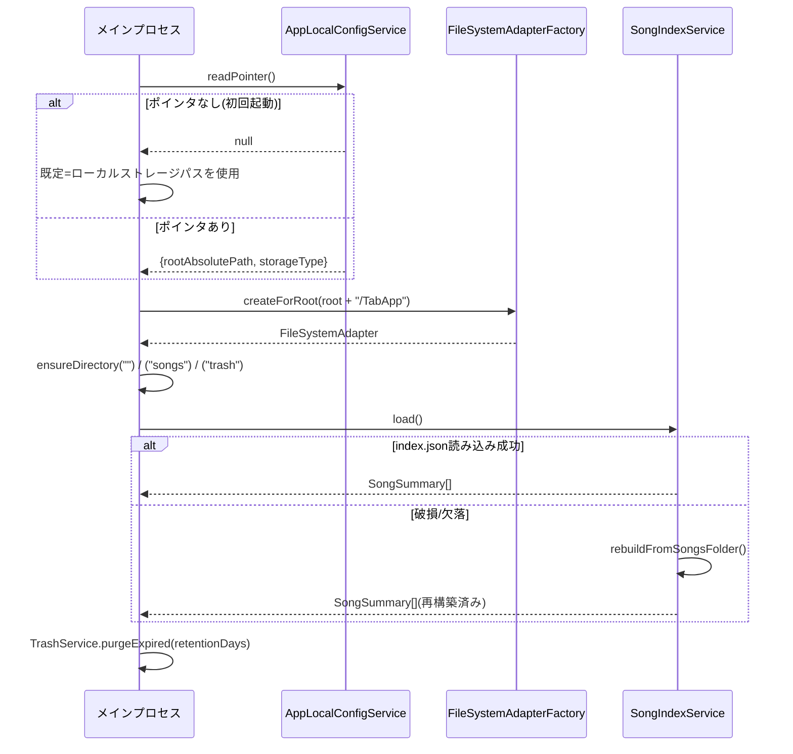
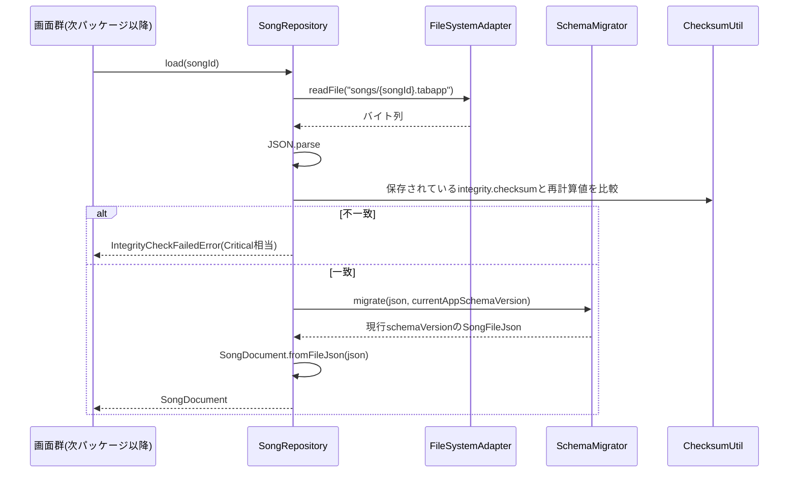
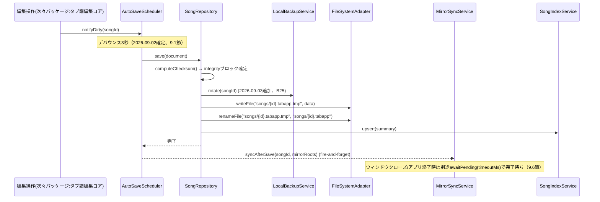
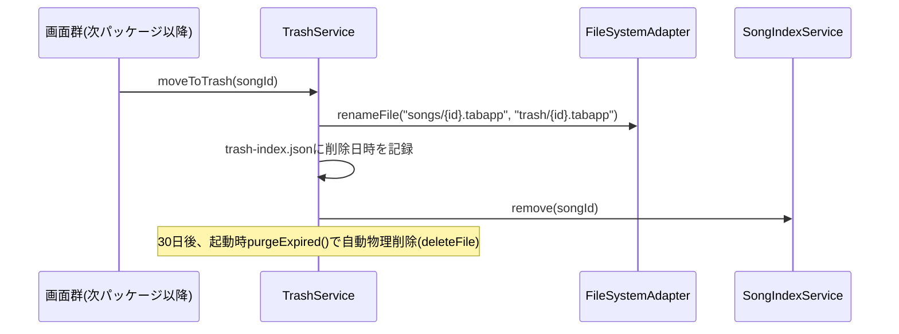

# 詳細設計書：データモデル・永続化

- **対応作業パッケージ**：要件定義書9章「データモデル・永続化」（相対サイズM）、実施順序2（[[../basic_design/13_design_decision_points.md#3]]B11）
- **ブランチ名**：`feature/data-model-persistence`
- **前提とする基本設計書**：[[../basic_design/02_data_model.md]]、[[../basic_design/06_file_io_persistence.md]]、[[../basic_design/09_nonfunctional.md]]、[[../basic_design/01_architecture.md#3]]AD-1・AD-3
- **前提とする詳細設計書**：[[web-core-foundation.md]]（`FileSystemAdapter`最小版・パッケージ構成を本書で拡張する）
- **本書の位置づけ**：[[../basic_design/15_development_process.md#1.2]]に基づく詳細設計書。

---

## 1. 目的・スコープ

Song／Part／Bar／Voice／Beat／Noteの構造化データモデルと、その永続化（自動保存・ゴミ箱・スキーマバージョン管理・保存先切替・ミラー機能）を実装する。以降のほぼ全パッケージ（タブ譜編集コア、パート・チューニング管理、再生エンジン統合、画面群・ナビゲーション）がこのパッケージの`SongDocument`とその読み書きAPIに依存する。

**スコープ外**：Undo/Redoを含むコマンド層・実際の編集操作（→タブ譜編集コア）、`NotificationCenter`本体（→エラー・ログ基盤。本パッケージでは[[web-core-foundation.md#3.1]]と同様の暫定ログ出力に留め、次パッケージで置き換える）、曲一覧・設定画面等のUI（→画面群・ナビゲーション。本パッケージはサービス層とデータ構造のみ）。

## 2. パッケージ構成の拡張

[[web-core-foundation.md#2]]のモノレポ構成に対し、以下を実体化する。

```
packages/core/src/
├─ domain/           ★本パッケージ：SongDocument, AppMetadata, TuningPreset, Tag等の型とロジック
├─ persistence/       ★本パッケージ（新設ディレクトリ）：Repository/Index/Trash/Migration/Storage系サービス
└─ platform/          ★本パッケージ：FileSystemAdapterインターフェースを拡張
apps/desktop/src/main/
└─ ElectronFileSystemAdapter（拡張）、AppLocalConfigService実装（3.5節）
tools/
└─ ★次パッケージ以降で使う開発用サンプルデータ生成スクリプトの土台（雛形のみ、中身は各パッケージで追加）
```

## 3. クラス／インターフェース構成

### 3.1 `packages/core/src/domain`（新設）

| クラス/型 | 責務 | 主要メンバー |
|---|---|---|
| `SongDocument` | 1曲の集約ルート。alphaTabのScore系オブジェクトと本アプリ独自の`AppMetadata`をまとめて保持し、シリアライズ／デシリアライズの単位となる（[[../basic_design/01_architecture.md#3]]AD-1） | `id: string`／`score: alphaTab.model.Score`／`appMeta: AppMetadata`／`schemaVersion: string`／`toFileJson(): SongFileJson`／`static fromFileJson(json: SongFileJson): SongDocument`（内部で4.2節のマイグレーションを適用済みの`json`を受け取る前提）／`computeChecksum(): string` |
| `AppMetadata` | Score本体が持たない付随情報 | `tags: TagRef[]`／`memos: Memo[]`／`sectionMarkers: SectionMarker[]`／`settings: { defaultViewMode: ViewMode; mixerSnapshot: unknown }`／`thumbnail: { encoding: 'base64-png'; data: string } \| null` |
| `SongFileJson`（型） | [[../basic_design/02_data_model.md#4.1]]のファイル形式に対応するプレーンJSON型 | `schemaVersion: string`／`song: unknown`（alphaTabがパース可能な形式）／`appMeta: AppMetadataJson`／`integrity: { savedAtMonotonic: number; checksum: string }` |
| `SongSummary` | 曲一覧表示用の軽量情報（[[../basic_design/02_data_model.md#5]]） | `id: string`／`title: string`／`updatedAt: string`／`tags: string[]`／`thumbnailRef: string \| null`／`isTrashed: boolean` |
| `TuningPreset` | チューニングプリセット（Song非依存のグローバルデータ、[[../basic_design/02_data_model.md#3.7]]） | `id: string`／`name: string`／`builtin: boolean`／`stringPitches: number[]` |
| `Tag` | タグマスタ | `id: string`／`name: string` |

**2026-09-02修正**：[[../basic_design/02_data_model.md#2]]のER図で`SONG.schemaVersion`が`int`型と表記されていたが、同ドキュメント4.2節は明示的に「セマンティックバージョニング文字列」と定義しており矛盾していた。本パッケージの実装対象はER図ではなく4.2節の定義（`string`）であるため、ER図側を`string`に修正した（基本設計書側の誤記訂正、[[../basic_design/02_data_model.md]]を参照）。

### 3.2 `packages/core/src/persistence`（新設）

| クラス | 責務 | 主要メソッド | 例外・エラー時の挙動 |
|---|---|---|---|
| `SchemaMigrator` | `schemaVersion`ごとの逐次マイグレーション関数を登録・適用する（[[../basic_design/02_data_model.md#4.2]]） | `register(fromVersion: string, toVersion: string, fn: (json: unknown) => unknown): void`／`migrate(json: unknown, currentAppSchemaVersion: string): SongFileJson` | 対応するマイグレーション関数が見つからない（未知の将来バージョンを開こうとした等）場合は`UnsupportedSchemaVersionError`を投げ、呼び出し元はCriticalとして扱う（08章のNotificationCenter未実装のため、本パッケージでは例外をそのまま呼び出し元に伝播させ、UI層側の暫定ハンドラでダイアログ表示する） |
| `ChecksumUtil` | 保存内容の完全性検証用チェックサムを計算する | `compute(schemaVersion: string, song: unknown, appMeta: unknown): string`（sha256、`integrity`ブロック自体は計算対象に含めない。**2026-09-02確定**：ハッシュ対象は`{schemaVersion, song, appMeta}`を決定的な鍵順序でJSON文字列化したUTF-8バイト列とする。この「何をハッシュするか」は基本設計で未規定だったため、詳細設計としてここで確定する） | - |
| `SongIndexService` | `index.json`の読み書きと差分更新（[[../basic_design/06_file_io_persistence.md#10]]） | `load(): Promise<SongSummary[]>`／`upsert(summary: SongSummary): Promise<void>`／`remove(songId: string): Promise<void>`／`rebuildFromSongsFolder(): Promise<SongSummary[]>`（`index.json`が破損・欠落していた場合のフォールバック。`songs/`配下を全走査し`SongDocument`のヘッダ部のみ読んで再構築する） | `index.json`のパース失敗時は例外を投げず`rebuildFromSongsFolder()`に自動フォールバックし、Warning相当のログを暫定出力する |
| `SongRepository` | 1曲の読み込み・保存を担うアプリケーションサービス。`SchemaMigrator`・`ChecksumUtil`・`FileSystemAdapter`・`SongIndexService`・`MirrorSyncService`・`LocalBackupService`を協調させる | `load(songId: string): Promise<SongDocument>`／`save(document: SongDocument): Promise<void>`（4.1節のアトミック書き込み手順を実行する前に`LocalBackupService.rotate(songId)`を呼び出し、直前世代を退避する。[[../basic_design/13_design_decision_points.md#3]]B25、9.5節）／`create(initialSetup: NewSongSetup): Promise<SongDocument>` | `load()`は該当ファイルが存在しない場合`SongNotFoundError`、チェックサム不一致の場合`IntegrityCheckFailedError`（後者はCriticalとして呼び出し元に伝播） |
| `LocalBackupService`（2026-09-03新設、B25） | 保存直前の1世代分をデバイスローカルに退避する、実装内部の安全ネット。ユーザー向けの世代管理バックアップ機能ではなく、`SongRepository.save()`から書き込み直前にのみ呼ばれる非公開の補助機構。主ストレージ・ミラー先とは異なる、OS標準のアプリローカル領域（Electronでは`app.getPath('userData')`配下）に保持することで、複数端末間の同期コンフリクトの対象に含めない（9.5節） | `rotate(songId: string): Promise<void>`（保存前の現行ファイルを1世代だけ複製）／`restore(songId: string): Promise<SongDocument \| null>`（`FILE-002`のリカバリダイアログから使用） | 複製元ファイルが存在しない場合（初回保存）は何もしない。複製先への書き込みに失敗しても主保存処理は継続する（バックアップの失敗で保存全体を失敗させない） |
| `AutoSaveScheduler` | 編集による変更通知（dirtyフラグ）を受けてデバウンス保存をスケジュールする | `notifyDirty(songId: string): void`／`flush(songId: string): Promise<void>`（即時保存、ウィンドウクローズ時等に使用）／`dispose(songId: string): void` | 内部で`SongRepository.save()`を呼ぶ。保存が失敗した場合は最大3回まで短い間隔（1秒・3秒・9秒）でリトライし、それでも失敗すればErrorレベル相当として暫定通知する |
| `TrashService` | ゴミ箱操作（[[../basic_design/06_file_io_persistence.md#7]]） | `moveToTrash(songId: string): Promise<void>`／`restore(songId: string): Promise<void>`／`purgeExpired(retentionDays: number): Promise<number>`（削除件数を返す。アプリ起動時に一度呼び出す）／`permanentlyDelete(songId: string): Promise<void>`（ゴミ箱画面からの即時完全削除用） | `trash-index.json`の読み書きは`SongIndexService`と同様のフォールバック（破損時は`trash/`フォルダを走査して再構築） |
| `StorageConfigService` | 保存先設定（主ストレージ・ミラー先・ゴミ箱保持日数等、[[../basic_design/06_file_io_persistence.md#2.1]]）の読み書き。実体は`{アクティブなストレージルート}/TabApp/settings.json` | `load(): Promise<StorageConfig>`／`save(config: StorageConfig): Promise<void>`／`validateMirrorConfig(config: StorageConfig): ValidationResult`（[[../basic_design/06_file_io_persistence.md#4.2]]の禁止パターン：主ストレージとミラー先の重複、を検出する） | バリデーション違反は例外ではなく`ValidationResult`（`{ ok: boolean; errors: string[] }`）として返す（UI層でそのままエラー表示に使えるようにするため） |
| `StorageMigrationService` | 主ストレージの切替（[[../basic_design/06_file_io_persistence.md#2.2]]の移行フロー） | `migrate(fromRoot: string, toRoot: string, onProgress?: (done: number, total: number) => void): Promise<MigrationResult>` | 1件でも失敗すれば`MigrationResult.success = false`とし、アクティブパスの切替は行わない（呼び出し元＝設定画面パッケージが5節のダイアログ文言を出す） |
| `MirrorSyncService` | 主ストレージ保存成功後の非同期ミラーコピー（[[../basic_design/06_file_io_persistence.md#4.1]]） | `syncAfterSave(songId: string, mirrorRoots: string[]): void`（fire-and-forgetで戻り値を待たせない。内部で失敗をキャッチしログのみ行う。呼び出し元の保存処理をブロックしない契約を明文化）／`awaitPending(timeoutMs: number): Promise<void>`（2026-09-03追加、B26。実行中の全ミラーコピーが完了またはタイムアウトするまで待機する。ウィンドウクローズ処理・アプリ終了処理から呼び出す。既定タイムアウト15秒、9.6節） | 例外を外部に投げない（設計上の強制。ミラー失敗が主保存を巻き込まないことを保証する）。`awaitPending()`はタイムアウトしても例外を投げず、単に処理を打ち切って復帰する（終了処理を無期限にブロックしないため） |

### 3.3 `packages/core/src/platform`（`FileSystemAdapter`の拡張）

[[web-core-foundation.md#3.2]]で定義した最小版に、以下を追加する（**既存メソッドのシグネチャは変更しない**、[[web-core-foundation.md#9]]の申し送り通り）。

| 追加メソッド | 責務 |
|---|---|
| `renameFile(fromRelativePath: string, toRelativePath: string): Promise<void>` | アトミック書き込み（tmp→本ファイル）およびゴミ箱の移動に使用 |
| `deleteFile(relativePath: string): Promise<void>` | ゴミ箱の完全削除（保持期間経過後の物理削除）に使用 |
| `copyFile(fromRelativePath: string, toRelativePath: string): Promise<void>` | 同一ルート内でのコピーが必要な場面（現状は未使用だが将来のため定義） |
| `exists(relativePath: string): Promise<boolean>` | マイグレーション・初回起動時のディレクトリ存在確認に使用 |

**新設：`FileSystemAdapterFactory`**（`packages/core/src/platform`）：[[web-core-foundation.md]]の`FileSystemAdapter`は「1つの設定済みルート」に紐づく設計だったが、ミラー同期（3.2節`MirrorSyncService`）とストレージ移行（`StorageMigrationService`）は**複数のルート**（主ストレージ・各ミラー先・移行元/移行先）に同時にアクセスする必要がある。そこで、任意の絶対パスをルートとする`FileSystemAdapter`インスタンスを生成するファクトリを本パッケージで追加する。

| インターフェース | 責務 | 主要メソッド |
|---|---|---|
| `FileSystemAdapterFactory` | 絶対パスを受け取り、そのパスをルートとする`FileSystemAdapter`実装を返す | `createForRoot(absoluteRootPath: string): FileSystemAdapter` |

Electron側実装（`ElectronFileSystemAdapterFactory`、`apps/desktop/src/main`）は`ElectronFileSystemAdapter`のコンストラクタにルートパスを渡すだけの薄いラッパーになる。アプリ全体で通常使う「現在のアクティブストレージ」用アダプタは、起動時に`createForRoot(activeRoot + '/TabApp')`で1つ生成し、`SongRepository`等に注入する。

### 3.4 `packages/core/src/platform`（新設：`AppLocalConfigService`契約）

[[../basic_design/06_file_io_persistence.md#3]]が要求する「主ストレージが未確定な初回起動時も参照できるローカル既定パスのポインタ情報」を扱う。ストレージ抽象の外側（OS標準のアプリ設定フォルダ、Electronでは`app.getPath('userData')`）に置く必要があるため、`FileSystemAdapter`とは別の小さな契約として定義する。

| インターフェース | 責務 | 主要メソッド |
|---|---|---|
| `AppLocalConfigService` | OS標準のアプリ設定フォルダに置く、ごく小さなポインタ情報（現在のアクティブストレージルートの絶対パスと種別）の読み書き | `readPointer(): Promise<StorageRootPointer \| null>`（初回起動時は`null`、既定でローカルストレージにフォールバックする）／`writePointer(pointer: StorageRootPointer): Promise<void>` |
| `StorageRootPointer`（型） | フィールド：`rootAbsolutePath: string`、`storageType: 'local' \| 'icloud' \| 'gdrive' \| 'custom'` | - |

Electron実装は`app.getPath('userData')`配下に`storage-pointer.json`として保存する。

## 4. 主要シーケンス

### 4.1 アプリ起動〜曲一覧表示



### 4.2 曲を開く



### 4.3 自動保存



### 4.4 ゴミ箱への移動・復元



## 5. ストレージ設定・移行の実装方針

- `StorageConfig`型：`{ primaryRoot: string; primaryType: 'local'|'icloud'|'gdrive'|'custom'; mirrors: { root: string; type: 'local'|'icloud'|'gdrive'|'custom' }[]; trashRetentionDays: number }`。既定値は`primaryRoot`＝OS既定のローカルアプリデータフォルダ、`mirrors: []`、`trashRetentionDays: 30`（[[../basic_design/13_design_decision_points.md#3]]B9）。
- 候補フォルダの自動検出（[[../basic_design/06_file_io_persistence.md#2.1]]「候補の自動検出」）は本パッケージでは検出ロジックのインターフェース（`StorageLocationDetector.detectCandidates(): Promise<{ type: 'icloud'|'gdrive'; path: string }[]>`）のみ定義し、実際の既知パスパターン走査ロジックは実装時にPhase 1前半の実機検証（[[../basic_design/13_design_decision_points.md#2]]A5）と合わせて具体化する。
- `StorageMigrationService.migrate()`は3.3節の`FileSystemAdapterFactory`で移行元・移行先それぞれのアダプタを生成し、`songs/`・`trash/`・`trash-index.json`・`index.json`・`tuning-presets.json`・`tags.json`・`settings.json`・`preferences.json`を1件ずつ`readFile`→`writeFile`→チェックサム照合の順でコピーする。全件成功後に`AppLocalConfigService.writePointer()`でアクティブルートを切替える（[[../basic_design/06_file_io_persistence.md#2.2]]のシーケンス通り）。**2026-09-03追記**：`preferences.json`（[[../detailed_design/screens-navigation.md#3.1]]の`AppPreferencesService`が管轄）が本一覧から漏れていた見落としをレビューで指摘され（[[../review/design_review_2026-09-03.md]]A-1）、追加した。`AppPreferencesService`が本サービス確定より後に新設されたことによる横断的な見落としであり、`logs/`フォルダ（[[../basic_design/08_error_logging.md]]）は個人開発規模でのログの重要度を踏まえ引き続き移行対象に含めない方針を維持する（[[../basic_design/13_design_decision_points.md#4]]C14）。**2026-09-06追記（レビュー是正、B-1、[[../review/design_review_2026-09-04.md]]）**：`trash-index.json`が本一覧に明示的に列挙されておらず、`trash/`に含まれる想定なのか、単なる記載漏れなのかが判別できないという指摘を受けた。`trash-index.json`は`TabApp/`直下に`index.json`と並んで置かれる独立したファイルであるため（B29、[[../basic_design/06_file_io_persistence.md#3]]）、上記一覧に独立した項目として明記した。

## 6. オンデマンドダウンロード対策（A5関連、暫定実装方針）

[[../basic_design/13_design_decision_points.md#2]]A5は実機検証待ちのままだが、リトライの「形」自体は実機がなくても設計できるため、本パッケージでは暫定パラメータを次の通り確定する（Phase 1実機検証で調整可能なよう定数化する）。

| パラメータ | 暫定値 |
|---|---|
| リトライ対象 | `readFile`が空データを返す、または一定時間応答しない場合（プレースホルダー実体化待ちの疑い） |
| リトライ回数 | 最大5回 |
| バックオフ | 200ms, 400ms, 800ms, 1600ms, 3200ms（指数バックオフ、合計約6.2秒） |
| リトライ後もなお失敗 | Error相当として呼び出し元に例外を伝播（暫定ログ出力、08章完了後に`NotificationCenter`連携へ置き換え） |

この対策は`ElectronFileSystemAdapter.readFile()`内部にラップする形で実装し、`FileSystemAdapter`インターフェース自体にはリトライの存在を露出させない（呼び出し側は通常の`readFile`として扱える）。

## 7. キャパシティ上限の実装（[[../basic_design/02_data_model.md#4.3]]）

| 上限 | 実装箇所 |
|---|---|
| 曲数1000程度 | `SongIndexService`が保持する一覧件数が900件（90%）を超えたらWarning相当を暫定発行する契約のみ用意（実際のUI表示は画面群パッケージ） |
| タグ50個 | `Tag`作成時に`SongIndexService`とは別の`TagStore`（3.1節`Tag`型を保持するグローバルストア、`tags.json`）でバリデーション |
| 小節メモ100文字 | `AppMetadata.memos`への追加時にバリデーション（実際の追加操作はコマンド層＝次々パッケージが担当するため、本パッケージではバリデーション関数のみをexportする） |

## 8. 単体テスト観点（[[../basic_design/11_test_strategy.md#2]]のC2対象ロジックに対応）

- `SchemaMigrator.migrate()`：旧バージョンJSON→新バージョンの変換結果検証（C0/C1/C2）。
- `ChecksumUtil`：改ざん・欠損データでの不一致検出（C0/C1）。
- `StorageConfigService.validateMirrorConfig()`：主ストレージとミラー先の重複検出、複数ミラー設定の組合せ判定（[[../basic_design/06_file_io_persistence.md#4.2]]の表に対応するケースを網羅、C0/C1/C2）。
- `TrashService.purgeExpired()`：保持期間境界値（29日/30日/31日相当）でのC1判定。
- `AutoSaveScheduler`のデバウンス・リトライロジック（C0/C1）。

## 9. このパッケージで解決する設計分岐点

### 9.1 自動保存のデバウンス間隔（新規、基本設計で数値未確定だった項目）

[[../basic_design/06_file_io_persistence.md#5]]・[[../basic_design/09_nonfunctional.md#1]]はいずれも「数秒間隔でまとめて保存するデバウンス方式」とのみ記載し具体的な秒数を確定していなかった。本パッケージで**デバウンス3秒、連続編集時の最大遅延10秒（3秒のデバウンスを継続的にリセットされ続けても10秒経過したら強制フラッシュ）**に確定する。理由：要件5.2「ノート入力反応100ms以内」とは独立した保存タイミングの話であり、3秒は「保存の連続実行による負荷」と「クラッシュ時に失われうる編集量」のバランスとして一般的な値。ウィンドウを閉じる際は`AutoSaveScheduler.flush()`で待たずに即時保存する（ミラー同期の終了時待ち合わせについては9.6節を参照）。

### 9.2 ハッシュ計算対象の確定（新規）

[[../basic_design/02_data_model.md#4.1]]は`checksum`フィールドの存在のみ定義し、何をハッシュするかは未規定だった。3.2節`ChecksumUtil`の通り「`integrity`ブロックを除く`{schemaVersion, song, appMeta}`の決定的JSON文字列化」に確定した。

### 9.3 マルチルート操作のためのアダプタ設計（新規）

[[web-core-foundation.md]]の`FileSystemAdapter`は単一ルート前提だったが、ミラー・移行機能で複数ルートへの同時アクセスが必要になったため、`FileSystemAdapterFactory`（3.3節）を追加する形で対応した。既存パッケージのインターフェースを破壊的変更せず、ファクトリという形での拡張に留めた点が[[web-core-foundation.md#9]]の申し送りに対する回答である。

### 9.4 schemaVersionの型不整合の是正

1節末尾の通り、[[../basic_design/02_data_model.md]]のER図表記（`int`）を4.2節の定義（`string`、セマンティックバージョニング）に合わせて修正した。

### 9.5 保存直前のローカルバックアップ（新規、B25、新しい視点でのレビューによる追加）

`FILE-002`（[[error-logging-foundation.md]]のエラーコード表）は当初「復元しますか？」という選択肢を通知文言として用意していたが、実際に復元できる仕組みが存在しない状態だった（新しい視点でのレビューで発覚）。これを埋めるため`LocalBackupService`（3.2節）を新設し、`SongRepository.save()`が書き込み前に必ず`rotate(songId)`を呼び出して直前の1世代を退避するようにした。

本人からは「マルチデバイス対応で邪魔にならないか」との確認があったため、配置場所を主ストレージ・ミラー先とは完全に切り離したOS標準のアプリローカル領域とした。これにより、複数端末間の同期スコープに一切含まれず、将来の同期コンフリクト・重複バックアップの原因にはならない。また、[[../tab_app_requirements.md]]の要件変更履歴に記録されている「追加の世代管理バックアップ（日次スナップショット等）は不要」という決定とも矛盾しない。あちらはユーザーが意識して使う機能としての世代管理バックアップを指しており、本機能は`SongRepository`内部だけで完結する、ユーザーからは見えない単一世代の安全ネットである（性質が異なる別の仕組み）。

### 9.6 終了時のミラー同期完了待ち（新規、B26、新しい視点でのレビューによる追加）

3.2節`MirrorSyncService.syncAfterSave()`はfire-and-forget（戻り値を待たない）設計だったため、ウィンドウクローズやアプリ終了のタイミングでミラーコピーが完了する保証がなかった（新しい視点でのレビューで発覚）。本人へ確認したところ「終了処理は待ちが生じてもよい」との方針が確認できたため、`MirrorSyncService.awaitPending(timeoutMs)`（既定15秒）を新設し、ウィンドウクローズ処理・アプリの`before-quit`処理から、`AutoSaveScheduler.flush()`の直後に呼び出すこととした。タイムアウトしても例外は投げず、単に終了処理を継続する（ミラー未完了のまま終了してもデータ消失にはならない。主保存は既に完了しているため、ミラーはあくまで追加の保険という位置づけを維持する）。

## 10. 完了基準（Definition of Done）

| # | 基準 | 本パッケージでの具体的な確認内容 |
|---|---|---|
| 1 | 基本設計の記載内容を満たしている | [[../basic_design/02_data_model.md]]・[[../basic_design/06_file_io_persistence.md]]の全節との対応を確認 |
| 2 | 詳細設計書と実装が整合している | 3節のクラス構成・シグネチャ通りに実装されていること |
| 3 | 単体・結合テスト | 8節の単体テスト観点をすべて実施。結合テストとして「ローカル／iCloud Drive／Google Driveそれぞれのフォルダに対する読み書き」（[[../basic_design/11_test_strategy.md#5]]）は実機検証待ち（A5）のため、ローカルフォルダでの結合テストのみ本パッケージで実施し、クラウドフォルダでの結合テストはPhase 1前半のA5検証と合わせて追加する |
| 4 | セルフレビュー | **2026-09-03修正**：[[../basic_design/15_development_process.md#6]]は2026-09-02にセルフレビュー対象を「L/XLサイズのみ」から「サイズ問わず全件」へ改訂済みであり、本行の「Mサイズのため対象外」という記載は旧方針のまま取り残されていた（[[../review/design_review_2026-09-03.md]]A-2）。実際には本パッケージも新しい視点でのレビューを複数回実施済み（9.5節・9.6節のB25・B26の発見等）であり、新方針のもとで対象パッケージとして扱う |
| 5 | 手動シナリオ確認 | 曲を新規作成→自動保存が3秒後に発火→アプリ再起動後に内容が復元されること／ゴミ箱への移動と復元／保存先切替（ローカル同士の2フォルダ間）／`LocalBackupService`による1世代バックアップの生成と`restore()`の動作（B25）／アプリ終了時に`MirrorSyncService.awaitPending()`がミラーコピー完了を待ってから終了すること（B26）を目視確認する |
| 6 | `main`へマージ済みで起動可能 | [[web-core-foundation.md]]のサンプル描画に加え、上記5のシナリオが動作する状態 |

## 11. 次パッケージへの申し送り

- 「エラー・ログ基盤」パッケージ完了後、本書中の「暫定ログ出力」「例外をそのまま伝播」としている箇所（`SchemaMigrator`、`SongIndexService`のフォールバック、`AutoSaveScheduler`のリトライ失敗、6節のリトライ失敗）をすべて`NotificationCenter`経由の通知に置き換える。置き換え対象箇所は本書の該当節に「暫定」と明記した通り。
- 「タブ譜編集コア」パッケージは、`SongDocument`の`score`（alphaTab Scoreオブジェクト）を直接操作するコマンド層を実装し、変更のたびに`AutoSaveScheduler.notifyDirty(songId)`を呼び出す形で本パッケージと連携する。コマンド層は`SongRepository`や`FileSystemAdapter`を直接呼ばない（永続化はこのパッケージのサービスに委譲する層構造を維持する）。
- サムネイル生成（`AppMetadata.thumbnail`の更新）は「表示モード」パッケージでalphaTabレンダリング結果から生成するロジックが揃った時点で、`SongRepository.save()`のフックとして接続する。本パッケージでは`thumbnail`フィールドの型と保存先のみを用意し、生成ロジックは持たない。
- `StorageLocationDetector`（5節）の実際の検出ロジックはPhase 1前半、A5の実機検証と合わせて実装する。
