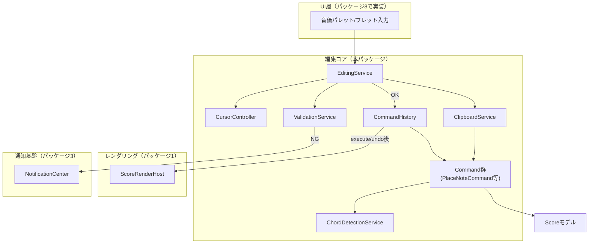
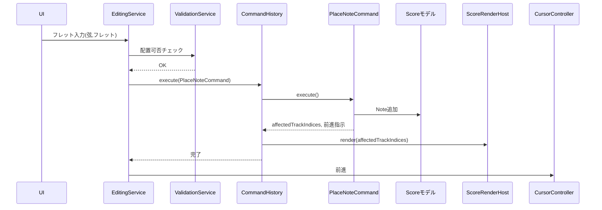
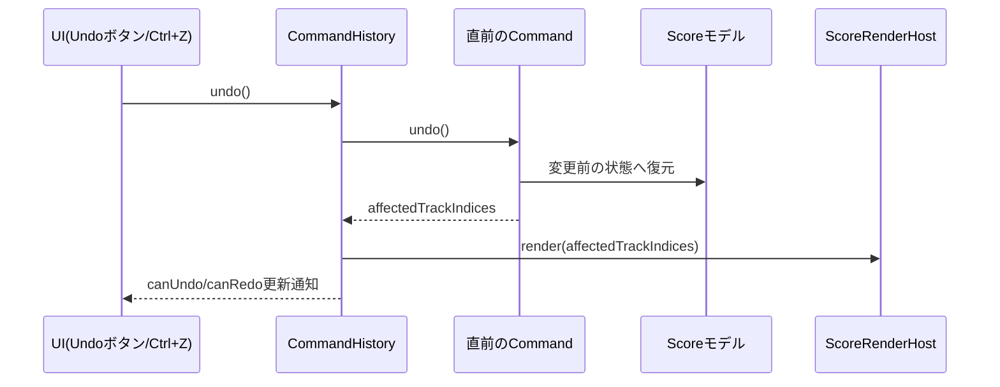
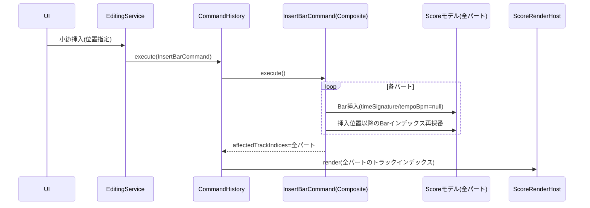
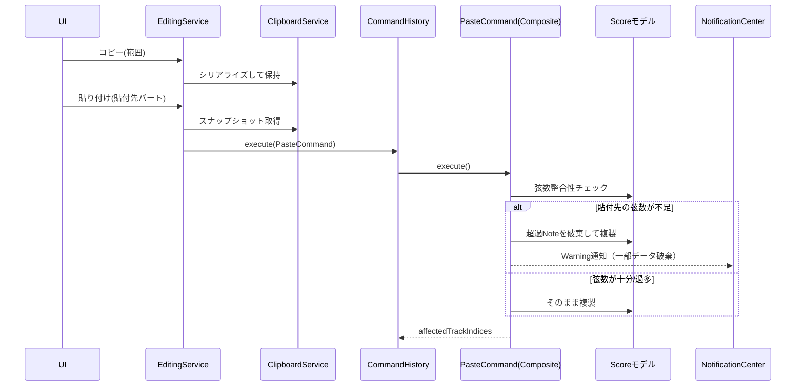
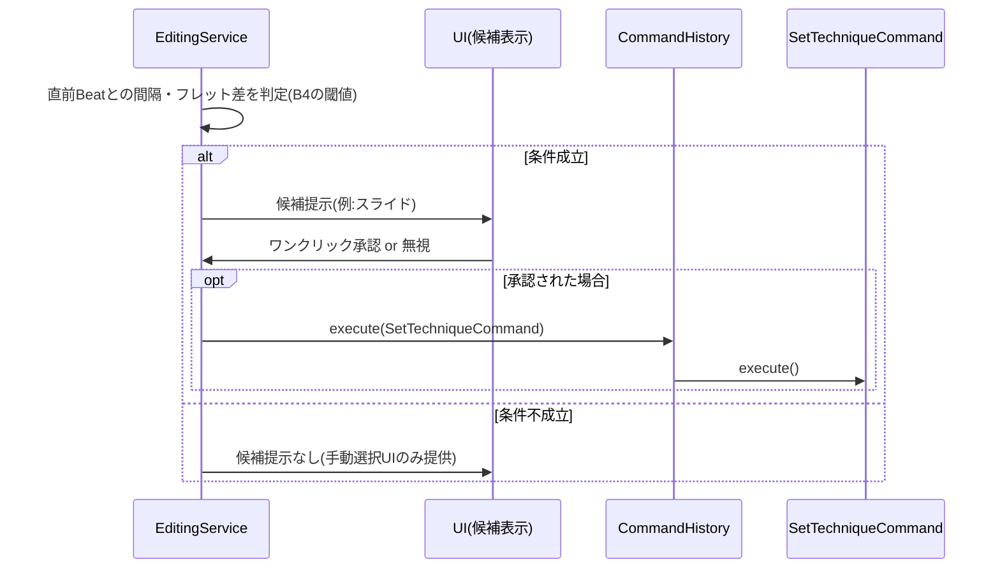

# タブ譜編集コア 詳細設計書

- **対応作業パッケージ**：タブ譜編集コア（実施順序4、[[../basic_design/13_design_decision_points.md#3]]B11、XLサイズ）
- **ブランチ**：`feature/editing-core`
- **前提ドキュメント**：[[../basic_design/04_editing_core.md]]、[[../basic_design/02_data_model.md]]、[[../basic_design/13_design_decision_points.md]]（特にA1残課題、B2〜B5）、[[../basic_design/11_test_strategy.md]]（C2対象一覧）、[[web-core-foundation.md]]（`ScoreRenderHost`）、[[data-model-persistence.md]]（自動保存トリガ）、[[error-logging-foundation.md]]（`NotificationCenter`/`ErrorCodeRegistry`）

方針として本パッケージはXLサイズだが、サブ機能間の結合（カーソル・コマンド・バリデーション・再描画が常に一体で動く）が強いため、**サブ機能単位に分割せず単一の詳細設計書として作成する**（本人の指示、2026-09-02）。ブランチも`feature/editing-core`単一とする。

**用語訂正（2026-09-02）**：本書は当初、再描画呼び出しを`ScoreRenderHost.renderTracks(...)`／`renderAll()`という独自の名称で記載していたが、[[web-core-foundation.md#3.1]]が実際に定義している`ScoreRenderHost`のメソッドは`render(trackIndices?: number[]): void`（第2引数省略時は全トラック再描画）である。詳細設計書はメソッドシグネチャレベルで実装と一致している必要がある（B13の趣旨）ため、本書内の呼び出し表記をすべて`render(affectedTrackIndices)`／`render()`（省略時＝全トラック）に統一する。独自メソッドの追加は行わない。

**欠落コマンドの追記（2026-09-02）**：[[playback-integration.md#4.4]]の`TapTempoController`が「`SetTempoCommand`（本書6.4節に準ずる新規コマンド）」を発行する旨を記載していたが、本書6.4節の具象コマンド一覧には当該コマンドが実際には定義されていなかった（要件4.1「テンポ入力：数値直接入力＋タップテンポのハイブリッド」がコマンドとして未翻訳のまま残っていた欠落）。6.4節へ`SetTempoCommand`を追加し、この参照を実体化する。

**メモ・セクションマーカーの未定義コマンドの追記（2026-09-02、セルフレビューで発見）**：[[../basic_design/02_data_model.md#3.5]][[#3.6]]がSectionMarker／Memoエンティティを定義し、[[../basic_design/03_screens_ui_pc.md#3]]の画面インベントリ#8・#9がそれぞれの操作画面（譜面上インライン表示、小節メモ一覧パネル）を想定していたにもかかわらず、本書6.4節にはこれらの追加・編集・削除を行う具象Commandが定義されていなかった（`ValidationService`が`EDIT-004`（メモ文字数上限）を登録していたにもかかわらず、それを消費するCommandが存在しないという不整合も含む）。6.4節・7節へ追加し、この欠落を解消する。

## 1. スコープ

**含む**：カーソル管理、編集サービス（UIイベント→コマンド変換）、コマンド層一式（`Command`インターフェース・`CommandHistory`・具象コマンド群）、バリデーションサービス（ノート／小節レベル）、コードネーム検出、範囲選択・クリップボード、Score再描画戦略の確定。

**含まない（他パッケージに委譲）**：
- UIコンポーネント自体（音価パレット・フレット入力バー等の描画・イベントハンドリング）→ パッケージ8（画面群・ナビゲーション）
- パート数上限（8）のバリデーション→ パッケージ5（パート・チューニング管理）が`ValidationService`を非破壊拡張する形で追加する（7節参照）
- 再生中の編集可否制御→ パッケージ7（再生エンジン統合）

## 2. 全体構造図

## 3. Score再描画戦略の確定（A1残課題の解決）

[[../basic_design/13_design_decision_points.md#2]]A1で「専用編集APIは存在せず、コマンド層がScoreモデルを直接操作した後`AlphaTabApi.renderScore()`で再描画する」ことまでは確定済みだったが、「**どのプロパティ変更が安全か**」の切り分けが残課題だった。

**検討した選択肢**：
- (a) 変更内容ごとに「安全な部分再描画」と「全体再描画が必要な変更」を分類し、コマンドごとに異なる再描画APIを呼び分ける
- (b) 分類を試みず、すべてのコマンドのexecute/undo後に一律で`ScoreRenderHost.render(affectedTrackIndices)`を呼ぶ

alphaTab公式ドキュメントは「どの変更が安全か」の網羅的なリストを提供していない（[[../basic_design/13_design_decision_points.md#2]]A1参照）。(a)は将来的な最適化余地はあるが、alphaTabのバージョンアップ等で「安全」の境界が変わった場合に静かに描画崩れを起こすリスクがあり、実機検証なしに分類を確定させることはできない。

**(b)に確定する**：正しさを優先し、**コマンドの実行・取り消しは常に対象トラック（`affectedTrackIndices`）のみを対象とした[[web-core-foundation.md#3.1]]の`ScoreRenderHost.render(affectedTrackIndices)`呼び出しとセットで行う**。この呼び出し責務は個々のCommandではなく`CommandHistory`に一元化する（6.2節）。理由：
1. 「常に再描画する」という一律ルールなら、コマンド実装者が再描画要否を個別判断する必要がなく、判断漏れによる描画崩れを構造的に防げる。
2. 対象を`affectedTrackIndices`（変更が及んだパートのみ）に絞ることで、全パート一律の全体再描画よりコストを抑える。
3. 万一これでも部分再描画が不整合を起こすケースが見つかった場合のフォールバックとして、`render()`を引数省略（＝全トラック再描画）で呼び出せば全体再描画に切り替えられる。`CommandHistory`側にこの切替を設定フラグとして持たせる（既定はオフ、常に`affectedTrackIndices`指定）。

**新たな検証待ち事項（A8として[[../basic_design/13_design_decision_points.md#2]]に追記する）**：「コマンド実行のたびに対象トラックを再描画する」方式が、要件9章の入力反応性目標（[[../basic_design/09_nonfunctional.md#1]]）を満たすかは実機測定が必要。目標未達の場合の対策候補：(i) 連続入力（ドラッグ中のプレビュー等）を`canMergeWith`/`mergeWith`（6.1節）でまとめ再描画回数を減らす、(ii) デバウンス、(iii) (a)案への部分移行。本パッケージの設計自体はいずれの対策にも影響を受けない構造（再描画呼び出し箇所が`CommandHistory`に一元化されているため）としている。

## 4. カーソルモデル：`CursorController`

| 責務 | 内容 |
|---|---|
| 現在位置の保持 | `currentPartId`・`currentBarIndex`・`currentBeatIndex`（Voice内インデックス、MVPはVoice常に1つのため実質Bar内インデックス）を保持する |
| 現在の入力音価の保持 | 音価パレットで選択中の音価（`currentDuration`）をUI状態として保持する（コマンド化しない、[[../basic_design/04_editing_core.md#2]]） |
| 和音入力モードの保持 | 同一Beatへの追加入力を続けるか否かの状態（`chordInputMode`）を保持する（[[../basic_design/04_editing_core.md#3]]） |
| 自動前進 | `PlaceNoteCommand`・`InsertRestCommand`の実行成功後、現在音価分だけ次のBeatへ位置を進める |
| 手動移動 | 矢印キー・クリック等による直接移動を受け付ける（和音入力モードは解除される） |
| 選択範囲の保持 | 範囲選択の開始位置・終了位置（同一パート内、[[../basic_design/04_editing_core.md#9]]）を保持する |

`CursorController`はUI状態専用でありUndo/Redo対象外（カーソル移動自体はコマンド化しない）。ただし、コマンドの`execute`/`undo`が「カーソルをどこへ動かすべきか」の情報（前進要否等）を返し、`EditingService`がそれを見て`CursorController`を更新する。`CursorController`は6.2節の`CommandHistory`と同様、編集ウィンドウ（＝開いている曲）ごとに1インスタンスとする。

## 5. `EditingService`

| 責務 | 内容 |
|---|---|
| UIイベントの受付 | 音価選択、フレット入力、記号確定、範囲選択操作、コピー/ペースト操作等のUIイベントを受け取る |
| コマンド組み立て | `CursorController`の現在位置＋UI入力値から、具象コマンドのコンストラクタ引数を組み立てる |
| バリデーション呼び出し | コマンド実行前に`ValidationService`へ検証を依頼する |
| NG時の処理 | 検証NGの場合は`NotificationCenter.report(code, context)`を呼び出し、コマンドは発行しない（[[../basic_design/04_editing_core.md#4]]） |
| OK時の処理 | `CommandHistory.execute(command)`を呼び出し、戻り値の前進指示に従って`CursorController`を更新する |
| 和音入力の判定 | 同一カーソル位置への追加入力を`chordInputMode`から判定し、`PlaceNoteCommand`のBeat内追加として扱う（[[../basic_design/04_editing_core.md#3]]） |

## 6. コマンド層

### 6.1 `Command`インターフェース（責務レベル）

[[../basic_design/13_design_decision_points.md#3]]B13により、基本設計では責務表のみとされていたため、ここで最終形を確定する（コードではなく責務の一覧として記述する）。

| 責務 | 内容 |
|---|---|
| 識別・表示 | Undo/Redo履歴上でユーザーに提示する識別情報とラベル（例：「音符を配置」）を持つ |
| 対象トラックの申告 | 自身の変更が影響するパート（トラック）のインデックス一覧（`affectedTrackIndices`）を持つ。3節の再描画戦略で使用する |
| 実行 | Scoreモデルに対する変更を適用し、カーソルの前進要否を呼び出し元へ伝える |
| 取り消し | 実行内容を打ち消し、変更前の状態へ戻す（execute/undoの対称性を保証する。[[../basic_design/11_test_strategy.md#2]]によりC2まで単体テスト対象） |
| 結合可否判定（任意） | 直前に実行された同種のコマンドと1つの履歴エントリへまとめられるかを判定する。対応しないコマンドは常に「結合不可」を返せばよい |
| 結合（任意） | 結合可能と判定された2つのコマンドを1つにまとめる |

### 6.2 `CommandHistory`

**スコープ訂正（2026-09-02）**：[[../basic_design/04_editing_core.md#8.2]]は当初「アプリ全体で単一のインスタンス」としていたが、[[../basic_design/03_screens_ui_pc.md#2]]で複数の編集ウィンドウ（異なる曲）を同時に開ける方針が確定しているため、文字通りアプリプロセス全体で単一インスタンスにすると異なる曲のUndo/Redoスタックが混線する。正しくは**「編集ウィンドウ（＝開いている曲）ごとに1つの`CommandHistory`インスタンス」であり、そのインスタンスの中で当該曲の全パートが履歴を共有する**という意味に訂正する。基本設計側も訂正済み。

| 責務 | 内容 |
|---|---|
| 保持 | 編集ウィンドウ（＝開いている曲）ごとに1つのインスタンス。`undoStack`／`redoStack`を保持する（そのインスタンス内で全パート横断、[[../basic_design/04_editing_core.md#8.2]]） |
| 実行仲介 | `execute(command)`：コマンドの`execute`を呼び出し→`undoStack`へ積む→`redoStack`をクリア→3節の再描画呼び出し（`ScoreRenderHost.render(affectedTrackIndices)`）→自動保存トリガの通知（[[data-model-persistence.md]]の`AutoSaveScheduler`へ変更検知を伝える）→7節（後述の拡張）で述べる「コマンド適用通知」の発火 |
| Undo/Redo仲介 | `undo()`／`redo()`：対応するコマンドの`undo`/`execute`を呼び出し、同様に再描画・自動保存通知・コマンド適用通知を行う |
| 状態通知 | `canUndo()`／`canRedo()`、およびUndo/Redoボタンの活性状態更新のための購読（`subscribe(listener)`）を提供する |
| コマンド適用通知（他パッケージ向け拡張ポイント） | `execute`/`undo`/`redo`のたびに「どのコマンドが・どのトラックに対して適用されたか」を購読者へ通知する`onCommandApplied(listener)`を提供する。UIのUndo/Redoボタン用の`subscribe`とは別チャンネルとし、パート・ミキサー値の変更をAlphaSynthへ反映する必要がある再生パッケージ（[[../basic_design/05_playback_audio.md#7]]）等、Scoreモデルの変更を検知したい他パッケージがこれを購読する（既存の`subscribe`のシグネチャは変更しない非破壊拡張） |
| 結合の適用 | `execute`時、直前の履歴エントリと結合可能であれば結合してから積む（連続ドラッグ操作等の履歴肥大化を防ぐ、[[../basic_design/04_editing_core.md#8.2]]のメモリ方針に対応） |
| メモリ予算管理（**2026-09-03追加**） | `undoStack`／`redoStack`の各エントリについて推定サイズ（バイト数）を保持し、合計が**80MB**を超えないか`execute`のたびに監視する（[[../basic_design/04_editing_core.md#8.2]]、[[../basic_design/13_design_decision_points.md#4]]C11）。通常サイズのコマンド（数百バイト程度）では実質的に発火しない |
| 下限保証（**2026-09-03追加**） | 予算超過時でも直近**200件**のエントリは破棄しない。エビクション処理は下限を満たした状態でのみ動作する |
| エビクション（**2026-09-03追加**） | 予算超過かつ下限（200件）を満たしている場合、`undoStack`側の最も古いエントリから順に破棄し、予算内または下限件数まで縮小する。単一コマンドの推定サイズが予算全体を超える場合でも、そのコマンドの`execute`自体は拒否せず、他の古いエントリを可能な限り破棄して領域を確保する |
| エビクション通知（**2026-09-03追加**） | セッション中に実際にエビクションが発生した最初の1回のみ、`NotificationCenter.report('EDIT-008', context)`（Info）を呼び出す。2回目以降は再通知しない |
| セッション境界 | メモリ上のみに保持し、ファイルへは一切書き出さない（要件5.6、[[../basic_design/04_editing_core.md#8.3]]）。ウィンドウを閉じればそのインスタンスも破棄される |

### 6.3 `CompositeCommand`

複数の`Command`を1つの履歴エントリとして束ねる。`execute`は内包するコマンドを登録順に、`undo`は逆順に呼び出す。`affectedTrackIndices`は内包する全コマンドの合併集合とする。`InsertBarCommand`／`DeleteBarCommand`／`PasteCommand`はこの形で実装する（[[../basic_design/04_editing_core.md#9]][[#10]]）。

### 6.4 具象コマンド一覧

| コマンド | 責務概要 | 対応基本設計 |
|---|---|---|
| `PlaceNoteCommand` | 指定Beatへ1つのNoteを追加（和音入力時は既存Beatへの追加）。実行前提として6.1の重複・範囲チェックはValidationServiceが済ませている | [[../basic_design/04_editing_core.md#2]][[#3]] |
| `InsertRestCommand` | 指定Beatを明示的に`isRest=true`として生成する | [[../basic_design/04_editing_core.md#2]] |
| `SetTieCommand` | 対象Noteの`tieToNext`を設定する | [[../basic_design/04_editing_core.md#5]] |
| `SetSlurCommand` | 範囲選択された複数Noteへ共通の`slurGroupId`を付与する | [[../basic_design/04_editing_core.md#5]] |
| `SetTechniqueCommand` | 対象Noteの`techniques`構造を部分更新する（チョーキング幅・スライド種別等、単一コマンド形状に統一） | [[../basic_design/04_editing_core.md#6]] |
| `SetChordNameCommand` | 対象Beatの`chordNameOverride`を設定する（手動修正） | [[../basic_design/04_editing_core.md#7]] |
| `SetTempoCommand` | 対象Barの`tempoBpm`を設定する（`null`を指定すれば継承状態に戻すことも含む）。要件4.1「テンポ入力：数値直接入力＋タップテンポのハイブリッド」に対応する共通コマンドで、将来の数値直接入力UI（パッケージ8）と[[playback-integration.md#4.4]]の`TapTempoController`の両方が発行元となる。対象曲の`CommandHistory`経由で実行され、他コマンド同様`affectedTrackIndices`（当該Barを含む全パート、10.3節のInsertBarCommandと同じ「Barは全パート共通構造」の扱い）を申告する。具体的な入力可能範囲（BPM上下限）は基本設計側で未規定のため、実装時に確定してよい詳細と位置づける | [[../basic_design/04_editing_core.md#2]]、[[../basic_design/05_playback_audio.md#6]]、[[playback-integration.md#4.4]] |
| `AddMemoCommand` | 指定Barへ新規メモを追加する。`ValidationService`が文字数上限（`EDIT-004`）を検証済みの前提で実行する。`affectedTrackIndices`は空配列（メモはパートに従属しないデータであり譜面自体の再描画は不要、小節メモ一覧パネルの更新のみで足りる）（**2026-09-02追記**、セルフレビューで発見された未定義コマンドの是正） | [[../basic_design/02_data_model.md#3.6]] |
| `EditMemoCommand` | 既存メモのテキストを更新する（同上の検証・`affectedTrackIndices`方針） | [[../basic_design/02_data_model.md#3.6]] |
| `DeleteMemoCommand` | 既存メモを削除する（同上） | [[../basic_design/02_data_model.md#3.6]] |
| `AddSectionMarkerCommand` | 指定Barへセクションマーカー（ラベル文字列）を追加する。譜面上インライン表示・編集（画面インベントリ#8、[[../basic_design/03_screens_ui_pc.md#3]]）に対応する唯一のコマンドで、`affectedTrackIndices`は当該Barを含む全パート（10.3節`InsertBarCommand`と同じ「Barは全パート共通構造」の扱い。譜面上に直接描画されるため再描画が必要）（**2026-09-02追記**、同上） | [[../basic_design/02_data_model.md#3.5]] |
| `EditSectionMarkerCommand` | 既存セクションマーカーのラベルを更新する（同上の`affectedTrackIndices`方針） | [[../basic_design/02_data_model.md#3.5]] |
| `DeleteSectionMarkerCommand` | 既存セクションマーカーを削除する（同上） | [[../basic_design/02_data_model.md#3.5]] |
| `InsertBarCommand`（`CompositeCommand`） | 全パートの指定位置へ小節を挿入し、以降のBarインデックスを再採番する。新規小節の`timeSignature`/`tempoBpm`は常に`null`（継承）で初期化する（B5） | [[../basic_design/04_editing_core.md#10]] |
| `DeleteBarCommand`（`CompositeCommand`） | 全パートの指定小節を削除しBarインデックスを再採番する。関連するSectionMarker/Memoの扱いはCriticalダイアログ（既定＝直前の小節へ移動、B2）の結果を`context`として受け取り反映する | [[../basic_design/04_editing_core.md#10]] |
| `PasteCommand`（`CompositeCommand`） | クリップボード内容を貼り付け先パートへ複製する。弦数不足時は超過Noteを警告付きで破棄、弦数過多時は警告なし（B3の非対称ルール） | [[../basic_design/04_editing_core.md#9]] |

## 7. `ValidationService`

| 責務 | 内容 |
|---|---|
| ノート配置検証 | 同一Beat内の同一`stringIndex`重複、フレット範囲外（0〜24）を検証する |
| 小節数検証 | 追加後の小節数が2048を超えないか検証する |
| メモ文字数検証 | `Memo.text`が上限（約100字）を超えないか検証する（`EDIT-004`）。消費元は6.4節の`AddMemoCommand`／`EditMemoCommand`（**2026-09-02追記**、セルフレビューで発見。当初は`EDIT-004`を登録済みなのに本表に責務として明記されておらず、消費するCommandも未定義だった） |
| 拡張ポイント | パッケージ5が「パート数上限8」の検証を、既存メソッドの変更なしに新規メソッド追加という形で本サービスへ非破壊拡張する（[[web-core-foundation.md]]で確立した`PlatformAdapter`と同じ非破壊拡張パターンを踏襲） |
| 検証結果の型 | 「OK」または「NG＋エラーコード＋コンテキスト情報」を返す。呼び出し元（`EditingService`）がNG時に`NotificationCenter.report()`へ橋渡しする |

**本パッケージで新規に登録するエラーコード**（[[error-logging-foundation.md]]の`ErrorCodeRegistry`への追加、既存コードとの衝突なし）：

| コード | レベル | 発生条件 |
|---|---|---|
| `EDIT-001` | Error | 同一Beat内で同一弦への重複配置 |
| `EDIT-002` | Error | フレット番号が0〜24の範囲外 |
| `EDIT-003` | Error | 小節数が2048を超える追加（**2026-09-02修正**：Warningから再分類、[[../basic_design/13_design_decision_points.md#3]]B20。ハードキャップであり超過時は追加自体を拒否するため、Warning本来の「操作継続可」の定義とは整合しなかった） |
| `EDIT-004` | Warning | メモ文字数が上限（約100字）に達した（**2026-09-03追記**：保存される内容は先頭100字に切り詰められる。入力操作自体はブロックしない、[[../basic_design/13_design_decision_points.md#4]]C13） |
| `EDIT-008` | Info | `CommandHistory`のメモリ予算超過によるUndo/Redo履歴のエビクションがセッション中に初めて発生（**2026-09-03新規**、6.2節、[[../basic_design/13_design_decision_points.md#4]]C11） |

（パート数上限のコードはパッケージ5側で`EDIT-005`として追加する想定を申し送る。タグ総数・曲数上限は[[data-model-persistence.md]]側の管轄のため対象外）

## 8. `ChordDetectionService`

| 責務 | 内容 |
|---|---|
| コード推定 | Beat内のNote群（弦のチューニング＋フレットから実音を算出）から、既知コードフォーム辞書照合＋一般的な和声解析（転回形対応）のハイブリッドでルート音・コード品質を推定する |
| 候補提示 | 複数候補がある場合、最も一般的な解釈（開放的な形、テンションを含まない）を既定候補とする |
| override優先 | `Beat.chordNameOverride`が設定されている場合はそちらを優先表示し、本サービスの推定結果は使用しない |

具体的な辞書のカバー範囲・転回形の優先順位付けアルゴリズムは、[[../basic_design/04_editing_core.md#7]]が明記する通り実装時に確定してよい実装詳細と位置づけ、本書では上記インターフェースレベルの確定に留める。

## 9. `ClipboardService`

| 責務 | 内容 |
|---|---|
| コピー | 選択範囲（単一パート内、[[../basic_design/04_editing_core.md#9]]）のBeat/Note群をアプリ内メモリ上のクリップボード内部形式へシリアライズする |
| 保持 | OSクリップボード連携は行わず、アプリ内メモリのみに保持する（要件上は任意機能） |
| ペースト用データ提供 | `PasteCommand`構築時に、コピー時点のBeat/Note群のスナップショットを提供する |

## 10. シーケンス図

### 10.1 ステップ入力（音符配置、再描画呼び出しの一元化を明示）

### 10.2 Undo/Redo

### 10.3 小節挿入（全パート再採番）

### 10.4 コピー＆ペースト（弦数不整合ケース）

### 10.5 奏法記号の自動候補→確定

## 11. ビルド・テストに関する補足

- [[../basic_design/11_test_strategy.md#2]]により、6.1のCommand execute/undo対称性、7節のバリデーション各種、8節のコード検出（既知コードフィクスチャ）、B5の継承チェーン再計算はC2（条件網羅）まで単体テスト対象とする。
- [[../basic_design/11_test_strategy.md#9]]の開発用サンプルデータ（全奏法記号網羅フィクスチャ、2048小節フィクスチャ）を`tools/`パッケージで用意し、本パッケージのバリデーション上限テスト・パフォーマンス確認に用いる。
- 3節で確定した再描画戦略の性能実測（新規A8項目）は、本パッケージの単体テストの範囲外（実機・Phase 1で実施）。単体テストでは`ScoreRenderHost.render`をモック化し、正しい`affectedTrackIndices`で呼び出されたかのみを検証する。

## 12. 新たに確定した設計決定（本書のまとめ）

- **Score再描画戦略**（3節）：コマンド実行・取り消しのたびに`CommandHistory`が対象トラックのみ`ScoreRenderHost.render(affectedTrackIndices)`で再描画する一律方式に確定。A1完全解決、A8を新規検証待ち事項として追加。
- **`Command`インターフェースの最終形**（6.1節）：B13で基本設計から追い出されていた具体的責務定義をここで確定。
- **`CommandHistory`のスコープ訂正**（6.2節）：「アプリ全体で1つ」ではなく「編集ウィンドウ（曲）ごとに1つ」であることを明確化。複数編集ウィンドウ対応（[[../basic_design/03_screens_ui_pc.md#2]]）との整合性を取った。
- **`CommandHistory`へのコマンド適用通知の追加**（6.2節）：他パッケージ（特に再生エンジン統合）がScoreモデルの変更を検知できるよう`onCommandApplied`購読チャンネルを非破壊追加。
- **`ScoreRenderHost`呼び出し表記の訂正**：[[web-core-foundation.md#3.1]]の実メソッド名`render(trackIndices?)`に統一し、独自の`renderTracks`/`renderAll`という誤った表記を修正。
- **`SetTempoCommand`の追加**（6.4節）：[[playback-integration.md#4.4]]が参照していたが本書に未定義だったコマンドを追加し、テンポ入力（数値直接入力・タップテンポ）を正式にコマンド化した。
- **メモ・セクションマーカーの具象Command追加**（6.4節）：[[../basic_design/02_data_model.md#3.5]][[#3.6]]が想定していたが本書に未定義だった`AddMemoCommand`等6件を追加した（2026-09-02、セルフレビューで発見）。
- **`ValidationService`のメモ文字数検証responsibility明記**（7節）：`EDIT-004`を登録済みだが表に明記されていなかった責務を追記した（2026-09-02、セルフレビューで発見）。
- **`EDIT-003`のエラーレベル再分類**（7節）：WarningからErrorへ変更（[[../basic_design/13_design_decision_points.md#3]]B20）。
- **新規エラーコード**`EDIT-001`〜`EDIT-004`（7節）。
- **Undo/Redo履歴のメモリ予算制**（**2026-09-03追加**、6.2節）：要件4.1の「セッション内無制限」を撤回し、80MBメモリ予算・直近200件の下限保証・最古エントリからのエビクション・初回のみのInfo通知（`EDIT-008`）という有限のアルゴリズムに確定した（[[../basic_design/13_design_decision_points.md#4]]C11、要件変更履歴[[../tab_app_requirements.md#10]]#12。レビュー指摘は[[../review/design_review_2026-09-03.md]]B-2）。
- **`EDIT-004`の挙動明確化**（**2026-09-03追加**、7節）：メモ入力自体はブロックせず、保存内容を先頭100字に切り詰める挙動として確定した（C13）。

## 13. Definition of Done

- 本書で定義した`CursorController`・`EditingService`・`ValidationService`・`ChordDetectionService`・`ClipboardService`・`Command`一式（`SetTempoCommand`、`AddMemoCommand`等のメモ／セクションマーカー系コマンド含む）・`CommandHistory`が実装され、[[../basic_design/11_test_strategy.md#2]]のカバレッジ基準を満たす単体テストが揃っている。
- 全奏法記号網羅フィクスチャ・2048小節フィクスチャに対して、ステップ入力・和音入力・タイ/スラー・奏法記号・コード検出・Undo/Redo・範囲選択コピー＆ペースト・小節挿入削除の一連の操作が結合テストレベルで通しで確認できる。
- 6.1〜6.4のコマンド全種について、execute/undoの対称性テストがC2まで揃っている。
- `NotificationCenter`への`EDIT-001`〜`EDIT-004`の通知が結合テストで確認できる。
- 本書のA1解決・A8追加が[[../basic_design/13_design_decision_points.md]]へ反映されている。
- 複数編集ウィンドウを同時に開いた状態で、それぞれのUndo/Redoが独立して機能することが結合テストで確認できる（6.2節のスコープ訂正の検証）。
- `CommandHistory.onCommandApplied`の購読が正しく発火することが単体テストで確認できる。
- `SetTempoCommand`のexecute/undoにより、タップテンポ・将来の数値直接入力UIの双方から`Bar.tempoBpm`が正しく更新されることが確認できる。
- **2026-09-03追加**：大容量コマンド（`RemovePartCommand`等）を連続実行してメモリ予算（80MB）を超過させるテストシナリオで、(1) 直近200件の下限が守られる、(2) 下限を満たした状態では最古エントリから破棄される、(3) `EDIT-008`通知がセッション中1回のみ発行される、の3点が単体テストで確認できる。
- **2026-09-08追記（DoD 基準5）**：本パッケージの編集操作は実 UI（フレット入力バー・音価パレット等）がパッケージ8実装のため、[[../basic_design/15_development_process.md#7]]基準5の実 UI での手動シナリオは実施できていない。全奏法記号網羅・2048小節フィクスチャに対する通し結合テストでシステムテスト観点を暫定的に担保したうえで `main` へマージ済みとし、実 UI での一連操作の手動確認は[[00_reference.md#8.1]] G23 としてパッケージ8着手時の繰り越し項目に登録した（[[screens-navigation.md#9]] P4）。

## 14. 引き継ぎ事項（次パッケージへ）

- **パッケージ5（パート・チューニング管理）**：`ValidationService`へパート数上限（8）チェックを非破壊追加すること（`EDIT-005`として登録、Errorレベル。[[../basic_design/13_design_decision_points.md#3]]B20）。チューニングプリセット適用も本パッケージの`Command`パターン（`SetTuningCommand`等）を踏襲すること。パート・チューニング関連のコマンドが、どの`CommandHistory`インスタンス（＝どの曲の編集ウィンドウ）に属するかを明確にすること（6.2節参照）。
- **パッケージ6（表示モード）**：表示モード切替（フォーカス/スクロール/スコア）をまたいでも`CursorController`の状態（現在位置・入力音価）が失われない契約とすること。
- **パッケージ7（再生エンジン統合）**：再生中の編集可否（ロックするか、再生を止めずに編集を許すか）は本パッケージでは未定義。`CommandHistory.onCommandApplied`（6.2節）を購読すれば、パート・ミキサー値の変更をAlphaSynthへ反映するタイミングを検知できる。`SetTempoCommand`（6.4節）は本書で定義済みのため、`TapTempoController`はこれをそのまま発行してよい。`ChordDetectionService`はピッチ算出を内部で行っているが、`computeRealMidiPitch`（B18）を抽出した際はそちらへ委譲すること（単一の真実源、9.21節）。

## 15. 実装時に確定した事項（2026-09-08、`feature/editing-core`）

本書は責務レベル止まり（G1）だが、実装は責務レベルの本書を正として行い、as-built のメソッドシグネチャは[[00_reference.md#3.4]]へ反映した。実装時の構造判断は以下（詳細は[[00_reference.md#9]]9.21節、[[../basic_design/13_design_decision_points.md#3]]B33）。

- **コマンドは alphaTab `Score.finish()` を呼ばない（B33）**：`finish()`は「意図」フィールドから派生リンク（タイの継続音へのフレット複製、`slideTarget`相互参照、`beat.index`・`previousBeat`/`nextBeat`）を生成するため、execute で finish すると undo で意図フィールドを戻しても派生リンクが残り3節の execute/undo 対称性が崩れる。派生計算は6.2節の`CommandHistory`が execute/undo/redo 後に呼ぶ`ScoreRenderHost.render()`（内部で alphaTab が re-finish）に一任する。構造変更（Beat 追加）で必要な`beat.voice`逆参照だけ`insertBeatAt`ヘルパーで明示的に張る。
- **`InsertBarCommand`／`DeleteBarCommand`／`PasteCommand` は単一`Command`**（6.3節は`CompositeCommand`化としていた）：alphaTab の Staff/Score へのミッド挿入は`splice`が必要で per-part 子コマンドに割りにくいため、全パートを同期変更する単一コマンドとした。1 回の undo で全体が戻る原子性は担保。`CompositeCommand`クラス自体は他の複合操作向けに残置。
- **`EDIT-009`（Warning）を採番**：7節はペースト時の弦数不足による音の破棄（B3）を「Warning付きで破棄」とだけ書きコード未割当だったため、実装時に`EDIT-009`として採番した（[[00_reference.md#5]]）。
- **`CommandHistory.execute`/`undo`/`redo` は`CommandOutcome`を返す**（6.2節の表では戻り値を明示していなかった）：`EditingService`がカーソル前進を判定するため。
- **`SetChordNameCommand` は`Beat.text`を設定**（`chordNameOverride`という alphaTab フィールドは存在しないため）。`ChordDetectionService.resolveDisplayName`が`Beat.text`を override として優先する。
- **`SectionMarker` は`AppMetadata.sectionMarkers`＋ alphaTab `MasterBar.section`の両方にミラー**（譜面上インライン表示のため）。
- **`ChordDetectionService`の辞書**：maj/m/7/maj7/m7/dim/dim7/m7b5/6/m6/sus4/sus2/aug/5。転回形はピッチクラス集合が同一のため自動対応。
- **§11 の`tools/`フィクスチャ**：`tools/`ワークスペース未整備のため当面`packages/core/src/testing/editingFixtures.ts`にテスト支援として置く。負荷テスト用のスタンドアロン生成器は Phase 1 後半へ申し送り。
