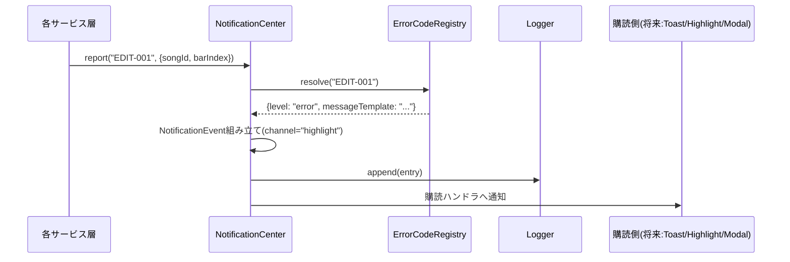
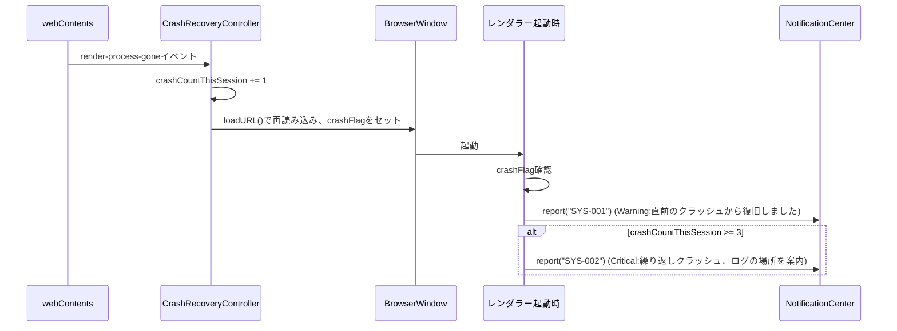
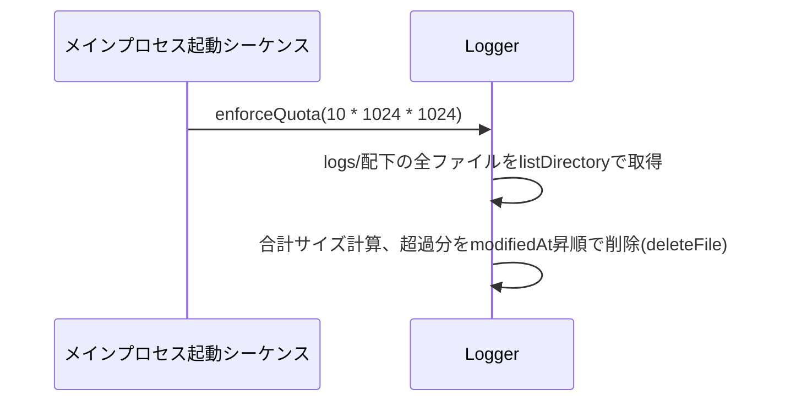

# 詳細設計書：エラー・ログ基盤

- **対応作業パッケージ**：要件定義書9章「エラー・警告基盤」（S）＋「ログ基盤」（S）、実施順序3（[[../basic_design/13_design_decision_points.md#3]]B11。2件のSサイズパッケージを合わせて先に片付ける方針）
- **ブランチ名**：`feature/error-logging-foundation`
- **前提とする基本設計書**：[[../basic_design/08_error_logging.md]]、[[../basic_design/06_file_io_persistence.md#3]]（`logs/`フォルダ。**2026-09-02修正**：セルフレビューで発見、当該定義は同書§1ではなく§3にあるため訂正）、[[../basic_design/11_test_strategy.md#4]]
- **前提とする詳細設計書**：[[web-core-foundation.md]]（`FileSystemAdapter`）、[[data-model-persistence.md]]（`FileSystemAdapterFactory`、現アクティブルート用アダプタ）
- **本書の位置づけ**：[[../basic_design/15_development_process.md#1.2]]に基づく詳細設計書。

---

## 1. 目的・スコープ

[[../basic_design/08_error_logging.md#1]]の4段階メッセージ方式（Info/Warning/Error/Critical）を実装する`NotificationCenter`と、[[../basic_design/08_error_logging.md#2]]のログ基盤（日次ローテーション・10MB共有クォータ）を実装する。あわせて、前2パッケージ（[[web-core-foundation.md]]・[[data-model-persistence.md]]）が「暫定ログ出力／例外をそのまま伝播」としていた箇所を、本パッケージの成果物に置き換える（9節）。

**スコープ外**：トースト・ハイライト・モーダルの実際のReact表示コンポーネント（→画面群・ナビゲーション。本パッケージは`NotificationCenter`が発行するイベントの契約までを定義し、購読側の見た目は次々パッケージ以降で実装する）。

## 2. クラス／インターフェース構成

### 2.1 `packages/core/src/errors`（新設）

| クラス/型 | 責務 | 主要メソッド/フィールド |
|---|---|---|
| `NotificationCenter` | 4段階のメッセージ方式の唯一の窓口。プラットフォーム非依存の純粋ロジック（[[../basic_design/08_error_logging.md#1.1]]） | `report(code: string, context?: Record<string, unknown>): void`／`subscribe(handler: (event: NotificationEvent) => void): () => void`（戻り値は購読解除関数）／`getRecentBuffer(maxEntries: number): NotificationEvent[]`（クラッシュログ用の直近ログバッファ取得、3節で使用） |
| `NotificationEvent`（型） | 発行されるイベント | `level: 'info'\|'warning'\|'error'\|'critical'`／`channel: 'toast'\|'highlight'\|'modal'`／`code: string`／`message: string`／`context?: Record<string, unknown>`／`timestamp: string` |
| `ErrorCodeRegistry` | エラーコード（`{ドメイン}-{連番}`）ごとに、固定のレベル・チャンネル・メッセージテンプレートを保持する（[[../basic_design/08_error_logging.md#1.2]]） | `register(code: string, def: ErrorCodeDefinition): void`／`resolve(code: string): ErrorCodeDefinition`（未登録コードで呼ばれた場合は`UnknownErrorCodeError`を投げる＝開発時に気づけるようにする） |
| `ErrorCodeDefinition`（型） | フィールド：`level`、`channel`（`level`から`LEVEL_TO_CHANNEL`表で自動導出するため実質`level`のみ登録すればよい）、`messageTemplate: string`（`{context.xxx}`形式のプレースホルダ埋め込みに対応） | - |
| `LEVEL_TO_CHANNEL`（定数表） | レベル→表示チャンネルの固定対応 | `info→toast`／`warning→toast`／`error→highlight`／`critical→modal`（[[../basic_design/08_error_logging.md#1]]の表をそのままコード化） |

**2026-09-02確定（基本設計からの実装レベルの精緻化）**：[[../basic_design/08_error_logging.md#1.1]]の図は`report(level, code, context)`という呼び出し例を示していたが、本パッケージでは**`report(code, context)`のみ**とし、`level`は`ErrorCodeRegistry`がコードから引く設計に変更する。理由：同じコードに呼び出し側ごとに異なるレベルを渡せてしまうと「重複配置は常にError」といった一貫性が呼び出し側の規律に依存してしまう。コードとレベルを1対1に固定することで、レベルの誤指定というクラスのバグをそもそも起こせない設計にする。

### 2.2 `packages/core/src/errors`（ログ基盤）

| クラス/型 | 責務 | 主要メソッド |
|---|---|---|
| `Logger` | `NotificationCenter`が発行する全イベントを永続ログとして記録する（[[../basic_design/08_error_logging.md#2]]）。`FileSystemAdapter`（[[data-model-persistence.md#3.3]]でルート解決済みのインスタンス）を注入して使う | `append(entry: LogEntry): Promise<void>`／`writeCrashLog(reason: string, recentBuffer: NotificationEvent[]): Promise<void>`／`enforceQuota(maxTotalBytes: number): Promise<void>`（`logs/`フォルダ合計サイズが上限を超えたら最終更新日時の古いファイルから削除）／`getLogFolderAbsolutePath(): string`（設定画面「アプリ情報」からエクスプローラーで開く用） |
| `LogEntry`（型） | フィールド：`timestamp`、`level`、`code`、`message`、`context`、`stack?: string`（Error/Critical時のみ） | - |
| ファイル命名規則 | 通常ログ：`logs/app-YYYYMMDD.log`（1行1JSON、追記形式）。クラッシュログ：`logs/crash-YYYYMMDD-HHMMSS.log` | - |

**`NotificationCenter`と`Logger`の結線**：`NotificationCenter.report()`内部で、購読者への通知（`subscribe`ハンドラ呼び出し）と`Logger.append()`呼び出しの両方を行う。`Logger`自体は`NotificationCenter`の一機能ではなく独立したクラスとし、`NotificationCenter`が`Logger`インスタンスを保持する形にする（テスト時に`Logger`をモックへ差し替えやすくするため）。

### 2.3 `apps/desktop/src/main`（クラッシュ検知・復旧）

| クラス | 責務 | 主要メソッド |
|---|---|---|
| `CrashRecoveryController` | レンダラークラッシュの検知・再読み込み・繰り返しクラッシュの判定を行う（[[../basic_design/08_error_logging.md#3]]、[[../basic_design/06_file_io_persistence.md#9]]） | `attach(window: BrowserWindow): void`（`webContents.on('render-process-gone', ...)`を登録。`reason==='clean-exit'`はクラッシュ扱いしない。クラッシュ時は`crashCountThisSession`を+1し、破棄済みでなければ`webContents.reload()`、`onCrash({reason, crashCountThisSession})`フックを呼ぶ）／`consumeRecoveryState(): CrashRecoveryState`（renderer起動時にIPCで1回呼ばれ、`{recovered, repeatedCrash}`を返し`recovered`フラグを消費する。`repeatedCrash`は`crashCountThisSession >= REPEATED_CRASH_THRESHOLD(=3)`）／constructor は `{threshold?, onCrash?}` を受ける。`crashCountThisSessionValue` getter（診断用）。**通知（SYS-001/SYS-002）自体は出さず、renderer の `errorLoggingBootstrap` が状態を見て `report()` する** |

**2026-09-02確定（基本設計の記述を具体化）**：[[../basic_design/08_error_logging.md#3]]は「同一操作で3回等」と書いていたが、「同一操作」を判定するには編集コマンド層（タブ譜編集コアパッケージ、まだ未実装）が持つ「直前の操作種別」の情報が必要になる。本パッケージの時点ではその情報がないため、**暫定的に「同一ウィンドウ・同一アプリセッション内で3回」**に簡略化して実装する。タブ譜編集コアパッケージ完了後、直前操作のコンテキストを`CrashRecoveryController`に渡せるようになった時点で、要件通りの「同一操作で3回」判定に精緻化することを次パッケージ以降へ申し送る（9.4節）。

### 2.4 プロセス配置と結線（2026-09-08確定、[[../basic_design/13_design_decision_points.md#3]]B32）

基本設計 [[../basic_design/08_error_logging.md#1.1]] は `NotificationCenter` を「Webコア内シングルトン」とだけ述べていたが、`Logger` が `FileSystemAdapter` を要する（2.2節）ため、Electron の main/renderer 分割上の実体を実装時に確定した。

| 要素 | プロセス | 実体 |
|---|---|---|
| `NotificationCenter` | renderer（Webコア） | `packages/core/src/errors` の共有シングルトン `notificationCenter`（コア8コード登録済みの `errorCodeRegistry` を保持）。テストは `NotificationCenter` クラスを直接 `new` する |
| `Logger` | main プロセス | `apps/desktop/src/main/main.ts` が `ElectronFileSystemAdapterFactory` のアクティブルート用アダプタを注入して生成。起動シーケンスで `enforceQuota(DEFAULT_LOG_QUOTA_BYTES=10MB)` を1回呼ぶ（3.3節） |
| 結線 | — | renderer の `errorLoggingBootstrap` が `notificationCenter.subscribe(...)` で全イベントを `window.riffLineApi.log.append(event)` へ転送。main の `registerLogHandlers` が受けて `Logger.append(toLogEntry(event))` と `LogRingBuffer.push(event)` を行う。`setLogSink` は同一プロセス（テスト・将来）向けに `NotificationCenter` へ残す |
| `LogRingBuffer`（新設、main） | main プロセス | `render-process-gone` で renderer 側バッファが失われるため、クラッシュログに添える直近 `NotificationEvent` 履歴を main 側でも保持する（既定200件、`NotificationCenter.getRecentBuffer` と同方式） |
| クラッシュ復旧通知 | — | `CrashRecoveryController` は通知を出さず、`crash:getRecoveryState` IPC で `{recovered, repeatedCrash}` を返す。renderer の `errorLoggingBootstrap` が起動時に1回引き、`repeatedCrash`→`SYS-002`、`recovered`→`SYS-001` を `notificationCenter.report()` する |

IPC は既存チャンネル不変の**非破壊追加**：`log:append`（`LOG_CHANNELS.append`）／`crash:getRecoveryState`（`CRASH_CHANNELS.getRecoveryState`）。型（`NotificationEvent`／`LogEntry`／`CrashRecoveryState`）は `@riff-line/shared-types` が単一の真実源とし、`packages/core/src/errors/types.ts` は re-export に留める。

`Logger.append` は `FileSystemAdapter` に追記APIが無く read→concat→write のため、連続呼び出しで行が失われないよう内部の直列化キューで1件ずつ処理する。キューの掃きだしを待つ `flush(): Promise<void>` を持つ（アプリ終了処理・テスト用、公開シグネチャの非破壊追加）。

## 3. 主要シーケンス

### 3.1 通常のエラー/警告発行

### 3.2 クラッシュ検知・復旧

### 3.3 ログローテーション・クォータ適用（起動時）

## 4. エラーコードレジストリの初期登録（本パッケージで確定する分だけ）

前2パッケージの暫定処理を置き換えるために必要な最小セットを、本パッケージで登録する（以降のパッケージが自分の担当領域のコードを追加登録していく）。

| コード | レベル | 発生源 | メッセージ概要 |
|---|---|---|---|
| `FILE-001` | Error | [[data-model-persistence.md#3.2]] `AutoSaveScheduler`のリトライ全滅（**2026-09-02修正**：セルフレビューで発見、`SongRepository.save()`自体ではなく、それを呼び出す`AutoSaveScheduler`のリトライループが発生源。9.2節の記載と統一） | 「保存に失敗しました。保存先の空き容量・アクセス権を確認してください」 |
| `FILE-002` | Critical | [[data-model-persistence.md#4.2]] `IntegrityCheckFailedError` | 「データの整合性エラーを検知しました。直前の自動保存内容から復元しますか？」（[[../basic_design/08_error_logging.md#5]]の文言方針に従う）。**2026-09-08追記**：文言の「復元」に対応する実手段は`LocalBackupService.restore(songId)`（[[../basic_design/13_design_decision_points.md#3]]B25、[[00_reference.md#8.1]]G13）。`SongRepository.load`がチェックサム不一致検知時に`report('FILE-002', {songId})`を呼ぶ |
| `FILE-003` | Error | [[data-model-persistence.md#6]] オンデマンドダウンロードのリトライ全滅 | 「クラウド同期フォルダ内のファイルにアクセスできません。同期状況を確認してください」 |
| `FILE-004` | Critical | [[data-model-persistence.md#3.2]] `SchemaMigrator`の`UnsupportedSchemaVersionError` | 「このファイルは新しいバージョンのアプリで作成されたため開けません」 |
| `FILE-005` | Warning | [[data-model-persistence.md#3.2]] `MirrorSyncService`のミラー書き込み失敗 | 「ミラー先への保存に失敗しました（主保存は正常です）」 |
| `SYS-001` | Warning | 2.3節 クラッシュ復旧成功 | 「直前のクラッシュから復旧しました」 |
| `SYS-002` | Critical | 2.3節 繰り返しクラッシュ | 「クラッシュが繰り返し発生しています。ログフォルダを確認してください」 |
| `RENDER-001` | Error | [[web-core-foundation.md#3.1]] `ScoreRenderHost`の`renderError` | 「譜面の描画に失敗しました」 |

## 5. テーマトークンとの関係

色トークンの具体値は[[../basic_design/14_visual_design_system.md#3]]で確定済みであり、本パッケージは関与しない。`NotificationEvent.level`／`channel`が、画面群パッケージで実装される表示コンポーネントがどのトークンを参照するかを決定する入力になる、という契約のみをここで確定する。

## 6. 単体テスト観点（[[../basic_design/11_test_strategy.md#2]]のC2対象）

- `NotificationCenter.report()`：コードからレベル・チャンネルが正しく解決されること、未登録コードで例外が投げられること（C0/C1/C2：レベル×チャンネルの組み合わせ網羅）。
- `Logger.enforceQuota()`：ちょうど境界値（10MB前後）でのC1判定。
- `CrashRecoveryController`：`crashCountThisSession`が2回目・3回目でのC1分岐（Critical発火有無）。
- `ErrorCodeRegistry.resolve()`：登録済み／未登録コードのC0/C1。

## 7. 結合テスト観点

- 実際の`FileSystemAdapter`を使い、`Logger.append()`→ファイル生成→`enforceQuota()`での削除までの一連の流れ（[[../basic_design/11_test_strategy.md#5]]）。
- [[data-model-persistence.md]]の`SongRepository`・`SchemaMigrator`から実際に`NotificationCenter.report()`が呼ばれ、対応するコードでログ記録されることを結合テストで確認する（4節のコード対応表通りに配線されているかの検証）。

## 8. 完了基準（Definition of Done）

| # | 基準 | 本パッケージでの具体的な確認内容 |
|---|---|---|
| 1 | 基本設計の記載内容を満たしている | [[../basic_design/08_error_logging.md]]全節との対応を確認 |
| 2 | 詳細設計書と実装が整合している | 2節のクラス構成・4節のコード表通りに実装されていること |
| 3 | 単体・結合テスト | 6・7節の観点を実施 |
| 4 | セルフレビュー | **2026-09-03修正**：[[../basic_design/15_development_process.md#6]]は2026-09-02にセルフレビュー対象を「L/XLサイズのみ」から「サイズ問わず全件」へ改訂済みであり、本行の「Sサイズ2件のため対象外」という記載は旧方針のまま取り残されていた（[[../review/design_review_2026-09-03.md]]A-2）。新方針のもとで対象パッケージとして扱う |
| 5 | 手動シナリオ確認 | 意図的に保存先フォルダを読み取り専用にして`FILE-001`のError表示を確認、意図的にレンダラーをクラッシュさせて`SYS-001`の復旧通知を確認する。**2026-09-08 実施**：production ビルドを CDP でヘッドレス起動し、`Page.crash` → main の `render-process-gone` 検知 → `CrashRecoveryController` によるウィンドウ再読み込み → 復帰後シェルの通知一覧に `SYS-001`（warning/toast「直前のクラッシュから復旧しました。」）表示、かつ `logs/app-YYYYMMDD.log` へ同 SYS-001 行が記録、`logs/crash-YYYYMMDD-HHMMSS.log` も生成、を確認。`FILE-001` は現シェルに保存フローが無い（編集コアは WP4）ため、UT（`AutoSaveScheduler` リトライ全滅→`report('FILE-001')`）＋ IT（実ログファイルへの書き出し）と、`SYS-001` で実証済みの同一表示経路で担保。ウィンドウ内の最終目視は本人環境で `run-app.cmd` により実施 |
| 6 | `main`へマージ済みで起動可能 | 上記5のシナリオが動作する状態 |

## 9. 前パッケージの暫定実装の置き換え・次パッケージへの申し送り

**2026-09-08 実装時の実施状況**：9.1・9.2 は本パッケージで実施済み（下記各項に「実施」を追記）。9.3（`FILE-003`）はコード登録のみ行い、`report()` 呼び出しは `SongRepository.load` を実際に配線するパッケージ（bootstrap）へ申し送る。

### 9.1 [[web-core-foundation.md#3.1]]への反映
`ScoreRenderHost`の`renderError`イベントハンドラ（暫定で`console.error`相当としていた箇所）を、`NotificationCenter.report('RENDER-001', context)`の呼び出しに置き換える。**実施（2026-09-08）**：`ScoreRenderHost`自体は alphaTab の Host として `NotificationCenter` に依存させず `renderError` イベントを発火するのみに留め、購読側（renderer 起動配線＝現状は最小シェル `App.tsx`、将来は画面群パッケージの `NotificationUIBinder`）が `report('RENDER-001', {detail})` を呼ぶ。`ScoreRenderHost` 内の `console.error` は開発時診断として残置。

### 9.2 [[data-model-persistence.md#3.2]]への反映
`SchemaMigrator`の`UnsupportedSchemaVersionError`、`SongRepository.load()`の`IntegrityCheckFailedError`、`AutoSaveScheduler`のリトライ失敗、`MirrorSyncService`の失敗ログを、それぞれ4節の対応コード（`FILE-004`／`FILE-002`／`FILE-001`／`FILE-005`）での`NotificationCenter.report()`呼び出しに置き換える。**実施（2026-09-08）**：`packages/core/src/errors` の共有シングルトン `notificationCenter` を各サービスから直接呼ぶ形で置き換えた。`SchemaMigrator` は `UnsupportedSchemaVersionError` を組み立てる私設ヘルパー内で `report('FILE-004')` を呼び throw も継続（呼び出し元は型付きエラーで制御フロー）。`SongRepository.load` はチェックサム不一致で `report('FILE-002')` 後に throw。`AutoSaveScheduler` はリトライ全滅で `report('FILE-001')`（既存の `hooks.onError` も維持）。`MirrorSyncService` はミラー書き込み失敗・コピー元読み込み失敗で `report('FILE-005')`。エラーコードを持たない内部回復警告（`index.json` 再構築等）は従来どおり `log.ts` の `warnProvisional`（console）に残す。

**既知の粗さ（follow-up）**：`SchemaMigrator` は `(オブジェクトでない)` `(schemaVersion 欠落)` といった破損ファイルでも `UnsupportedSchemaVersionError` を投げる設計であり、実装もそれらで `FILE-004`（「新しいバージョンのアプリで作成されたため開けません」）を発行する。文言と実状（＝単なる破損）がずれるが、これは本置き換え以前から `UnsupportedSchemaVersionError` に一本化されていた挙動で、9.2 節のマッピング（同エラー → `FILE-004`）に区別を設けていないため踏襲した。破損とバージョン非対応を別コードに分けるかはデータモデル・永続化側の課題として持ち越す。

### 9.3 [[data-model-persistence.md#6]]への反映
オンデマンドダウンロード対策のリトライ全滅時の例外伝播を`FILE-003`での`report()`に置き換える。**2026-09-08時点**：`FILE-003` はレジストリへ登録済み。ただしオンデマンドDLのリトライは main プロセスの `retryOnEmptyRead`（[[data-model-persistence.md#6]]）にあり、失敗は `ElectronFileSystemAdapter` で `FileReadError` に正規化されて renderer へ渡る。この時点で「オンデマンドDL全滅」と「その他の読み取り失敗」を区別する情報は失われており、かつ `SongRepository.load` を実際に呼び出す配線がまだ存在しない（パッケージ8）。よって `report('FILE-003')` の呼び出し箇所は、`SongRepository.load` を配線する bootstrap 側で「読み取り失敗をユーザー向けに通知する」処理の一部として実装することを申し送る（`FILE-002`/`FILE-004` の Critical と異なり `FILE-003` は Error なので、read 経路の失敗ハンドリングにまとめてよい）。

### 9.4 次パッケージ（タブ譜編集コア）への申し送り
- 2.3節で暫定化した「同一操作で3回」判定の精緻化（コマンド層が持つ直前操作コンテキストを`CrashRecoveryController`へ渡す配線）。
- あわせて、`CrashRecoveryController.attach` は現状クラッシュのたび無条件で `webContents.reload()` する（`REPEATED_CRASH_THRESHOLD`=3 は SYS-002 通知の判定にのみ使い、再読み込み自体は打ち切らない）。起動直後クラッシュが連続する状況での再読み込み回数の上限（例：しきい値到達後は reload を止めて Critical モーダルのみ表示）も、直前操作コンテキストの配線と同時に検討する。
- タブ譜編集コアのバリデーションエラー（重複配置、フレット範囲外等）は`EDIT-xxx`のコードとして本パッケージの`ErrorCodeRegistry`に追加登録する（登録自体は当該パッケージの詳細設計で行う）。
