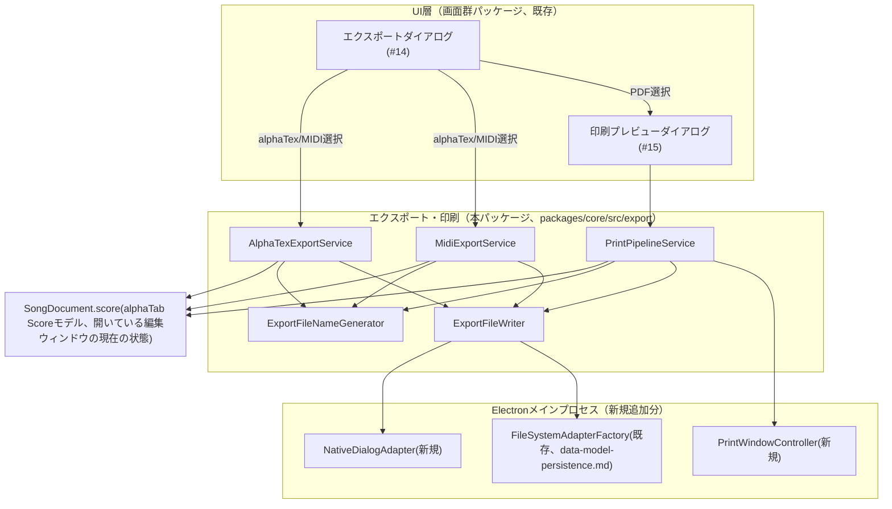
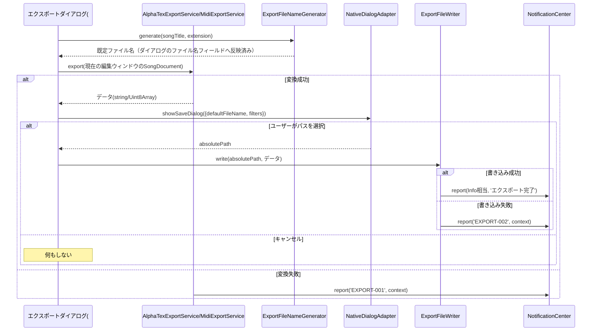
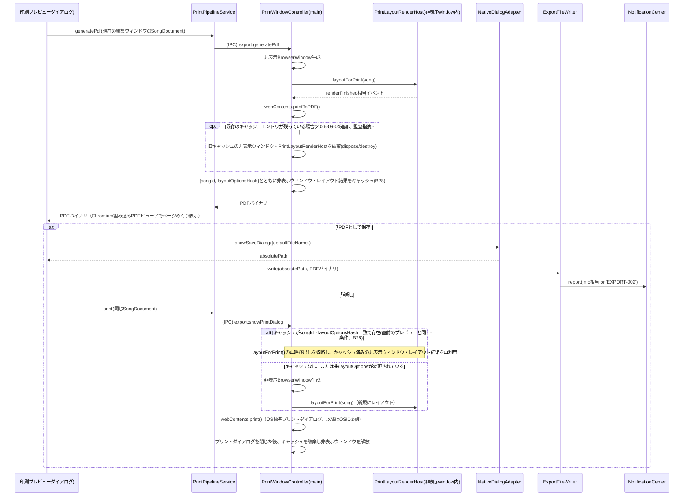

# エクスポート・印刷 詳細設計書

- **対応作業パッケージ**：要件定義書9章Phase 2「書き出し機能」（相対サイズM）・「印刷プレビュー」（相対サイズM）。この2件は[[../basic_design/07_export_print.md]]が単一の基本設計書として統合しているため、[[error-logging-foundation.md]]（Sサイズ2件を統合した前例）に倣い、本書でも1つの詳細設計書としてまとめて扱う。
- **ブランチ名**：`feature/export-print`
- **実施順序**：Phase 2の最初（かつ現時点で唯一）の作業パッケージ群。Phase 2実施順序は[[../basic_design/15_development_process.md#4.1.1]]に本書作成にあわせて新設した。
- **前提とする基本設計書・詳細設計書**：[[../basic_design/07_export_print.md]]（全節）、[[../basic_design/03_screens_ui_pc.md#3]]（画面インベントリ#10エクスポートダイアログ・#11印刷プレビューダイアログ）、[[../basic_design/13_design_decision_points.md]]（A3・B6解決済み、B19）、[[../basic_design/01_architecture.md#3]]AD-1・AD-3・AD-5（`packages/core/src/export`は本パッケージ用に予約済みの空フォルダ）、[[../basic_design/06_file_io_persistence.md]]、[[../basic_design/08_error_logging.md#1.2]]（`EXPORT`ドメイン、本パッケージで初めて使用）、[[web-core-foundation.md]]（`ScoreRenderHost`、IPC契約パターン）、[[data-model-persistence.md#3.1]][[#3.3]]（`SongDocument`／`SongRepository`／`FileSystemAdapterFactory`）、[[playback-integration.md#3.2]]（カポ実音変換式）、[[view-modes.md#4.3]]（`ScoreRenderHost`非破壊拡張の前例）、[[screens-navigation.md#3.6]][[#4.8]]（B19、画面インベントリ#14・#15のUIシェル）

---

## 1. 目的・スコープ

**含む**：alphaTexエクスポート、MIDIエクスポート、PDF生成、印刷プレビュー、ファイル名生成、[[../basic_design/screens-navigation.md]]（[[screens-navigation.md#4.8]]、以下単に「画面群パッケージ」）が用意した画面インベントリ#14（エクスポートダイアログ）・#15（印刷プレビューダイアログ）のUIシェルに対する実処理の接続、およびB19（Phase 1でのボタン無効化状態）の解消。

**含まない（他パッケージ・他Phaseの責務）**：
- エクスポートダイアログ・印刷プレビューダイアログ自体のUI構造（形式選択・ファイル名編集フィールド・ページめくり枠）→ [[screens-navigation.md#4.8]]で実装済み。本パッケージはこれらのUIから呼ばれるサービス層のみを追加する。
- OS標準の共有手段（エクスプローラー表示・メールクライアント起動）→ [[../basic_design/07_export_print.md#4]]の通りOSに委譲、本パッケージでの実装対象外。
- Phase 3（iPhone版）での共有シート（`UIActivityViewController`相当）→ 9節で申し送る。
- pdf-libへの切替（B6のフォールバック条件、`printToPDF()`で要件を満たせないと判明した場合のみ）→ 未着手のまま据え置く。

## 2. 全体構造図

## 3. モジュール構成

### 3.1 `packages/core/src/export`（実体化。[[../basic_design/01_architecture.md#3]]AD-5で予約済みの空フォルダ）

| クラス | 責務 | 主要メソッド |
|---|---|---|
| `AlphaTexExportService` | Scoreモデル→alphaTexテキストへの変換（ネイティブAPI利用、[[../basic_design/13_design_decision_points.md#2]]A3） | `export(song: SongDocument, options?: AlphaTexExportOptions): string`（内部で`alphaTab.exporter.AlphaTexExporter.exportToString(song.score, settings)`を呼ぶ。変換失敗時は例外を投げず`EXPORT-001`を`report()`し`null`を返す） |
| `MidiExportService` | Scoreモデル→標準MIDIファイル(SMF形式1)への自前変換 | `export(song: SongDocument): Uint8Array \| null`（失敗時`EXPORT-001`。パート＝トラック1:1対応、テンポ/拍子変更はコンダクタートラックのメタイベント、ノートのピッチは3.3節`computeRealMidiPitch`を使用、ベロシティは既定値＋アクセント記号で加算、ベンドはピッチベンドCC、パームミュートはノート長短縮＋CC11（Expression）減衰で近似） |
| `ExportFileNameGenerator` | ファイル名自動生成（[[../basic_design/07_export_print.md#2]]） | `generate(songTitle: string, extension: 'tex' \| 'mid' \| 'pdf'): string`（`{曲名}_{YYYYMMDD}.{拡張子}`、禁止文字`/ \ : * ? " < > \|`を`_`へ置換） |
| `ExportFileWriter` | 生成済みデータの書き出し先フォルダへの書き込み | `write(destinationAbsolutePath: string, data: Uint8Array \| string): Promise<boolean>`（3.3節参照。失敗時`EXPORT-002`を`report()`し`false`を返す） |
| `PrintPipelineService` | PDF生成・印刷プレビュー・印刷実行のオーケストレーション | `generatePdf(song: SongDocument): Promise<Uint8Array \| null>`／`print(song: SongDocument): Promise<boolean>`（3.4節参照） |

**エラーコード新規登録**（[[../basic_design/08_error_logging.md#1.2]]で予約済みの`EXPORT`ドメインを本パッケージが初めて使用する）：

| コード | レベル | 発生条件 |
|---|---|---|
| `EXPORT-001` | Error | alphaTex／MIDI／PDFいずれかの変換処理中の失敗（該当フォーマットのエクスポートのみ不可、他の形式・他の操作は可能というError本来の意味に合致する。**2026-09-02のセルフレビューでB20の教訓を踏まえ、本パッケージ新規のエラーコードもすべて「実際に該当操作を拒否する場面か」を確認した上で登録した**） |
| `EXPORT-002` | Error | 出力先フォルダへのファイル書き込み失敗（権限不足・ディスク容量不足等）。[[web-core-foundation.md#3.2]]の`FileWriteError`と同種の性質で、呼び出し元はリトライしない（ユーザーが保存先を変えて再実行する想定） |

エクスポート成功時はInfoレベル（[[../basic_design/08_error_logging.md#1]]の「エクスポート完了」例に対応）で通知する。Info個別のエラーコード登録は既存の他パッケージでも行っていない（[[00_reference.md#5]]参照）ため、本パッケージでも登録しない。

### 3.2 `packages/core/src/export`（新設：`PrintLayoutRenderHost`）

07章3.2節の生成パイプライン（Scoreモデル→alphaTabレイアウトエンジンでのA4幅再レイアウト→非表示領域へのSVGページ描画→ヘッダー/フッター合成→`printToPDF()`）のうち、「A4幅再レイアウト＋SVGページ描画」を担当する。

| クラス | 責務 | 主要メソッド |
|---|---|---|
| `PrintLayoutRenderHost` | A4幅相当でのページ単位レイアウト・SVG描画。**[[web-core-foundation.md#3.1]]の`ScoreRenderHost`とは別の独立クラスとして新設する**（B21、7節） | `initialize(container: HTMLElement, options: PrintLayoutOptions): void`／`layoutForPrint(song: SongDocument): Promise<PrintLayoutResult>`（`PrintLayoutResult = { pageCount: number }`。ページ内容はコンテナDOM上に直接SVGとして描画されるため戻り値はページ数のみで足りる。描画完了は`renderFinished`相当のイベントで通知、[[web-core-foundation.md#3.1]]の`RenderHostEvents`と同じ命名を踏襲）／`dispose(): void` |
| `PrintLayoutOptions`（型） | 初期化オプション | `pageSizeMm: { width: 210, height: 297 }`（A4固定）／`headerText: string`（曲名）／`footerText: string`（ページ番号のプレースホルダー＋エクスポート日付） |

**B21：`PrintLayoutRenderHost`を`ScoreRenderHost`の非破壊拡張ではなく独立クラスとして新設する判断**（[[../basic_design/13_design_decision_points.md#3]]へ追記）：
- (a) 既存`ScoreRenderHost`（編集ウィンドウに1つ、[[00_reference.md#2]]の編集ウィンドウ単位スコープパターン）へ「印刷レイアウトモード」を非破壊追加する
- (b) 印刷専用の新規クラスとして独立させる
- **(b)に確定**。理由：`ScoreRenderHost`は現在の表示モード・ズーム状態（[[view-modes.md#4.1]][[#4.2]]）を保持しているインスタンスであり、これに印刷用のA4固定レイアウトを適用すると、印刷処理の間ユーザーが見ている編集画面の表示状態を一時的に壊す（または退避・復元する複雑な処理が必要になる）。印刷は既存の対話的レンダリングと完全に独立した非表示領域で行うべきであり（[[../basic_design/07_export_print.md#3.2]]が最初から「非表示レンダリング領域」と規定している）、無理に共有インスタンスにするメリットがないため独立クラスとした。

### 3.3 `apps/desktop/src/main`（Electron、新規追加分）

| クラス/インターフェース | 責務 | 主要メソッド |
|---|---|---|
| `NativeDialogAdapter`（新規インターフェース） | OS標準の「名前を付けて保存」ダイアログの呼び出し。**[[../basic_design/01_architecture.md#3]]AD-3の既存4種（FileSystemAdapter／AudioSessionAdapter／WindowAdapter／UpdateCheckAdapter）のいずれの非破壊拡張でもなく、`WindowAdapter`（[[screens-navigation.md#4.1]]）と同じく新規追加のインターフェースとして扱う**（AD-3策定時点でエクスポート機能を想定していなかったため） | `showSaveDialog(options: SaveDialogOptions): Promise<string \| null>`（`SaveDialogOptions = { defaultFileName: string, filters: { name: string, extensions: string[] }[] }`。ユーザーがキャンセルした場合`null`） |
| `PrintWindowController`（新規、メインプロセス限定） | PDF生成専用の非表示`BrowserWindow`の生成・破棄、および直前のレイアウト結果のキャッシュ管理（**2026-09-03追記**、B28）。**ユーザーに見える複数編集ウィンドウを管理する[[screens-navigation.md#4.1]]の`WindowManager`（`WindowAdapter`実装）とは責務を分離する**（ユーザー可視ウィンドウ管理と、PDF生成という技術的実装詳細のための非表示ウィンドウ管理は性質が異なるため） | `renderAndGeneratePdf(song: SongDocument, layoutOptions: PrintLayoutOptions): Promise<Uint8Array>`（内部で非表示`BrowserWindow`を生成→専用の印刷用レンダリングルートをロード→`PrintLayoutRenderHost.layoutForPrint()`の完了をIPC経由で待機→`webContents.printToPDF()`を呼び出し→結果を返す。**2026-09-03追記**：生成後、非表示ウィンドウと`PrintLayoutRenderHost`インスタンスを`{ songId, layoutOptionsHash }`とともに直近1件分だけキャッシュとして保持する（即座には破棄しない）。**2026-09-04再修正（監査指摘、B28関連）**：このキャッシュ格納の直前に、既存のキャッシュエントリが残っている場合は必ず先にそれを破棄する（`PrintLayoutRenderHost.dispose()`の呼び出し、および非表示`BrowserWindow`の`destroy()`）。この破棄を怠ると、印刷を経ずにプレビュー（`generatePdf`）だけを繰り返し呼び出した場合（曲やレイアウトオプションを切り替えながら複数回プレビューする等）に、Electronのガベージコレクションでは解放されないネイティブリソースである非表示`BrowserWindow`が蓄積するリソースリークになりうるため、「新規レンダリング完了→旧キャッシュエントリ破棄→新エントリで置換」という順序を必ず守る。B28）／`showPrintDialog(song: SongDocument, layoutOptions: PrintLayoutOptions): Promise<void>`（**2026-09-03追記**：呼び出し時、直前にキャッシュされたレイアウト結果が同一の`songId`・`layoutOptionsHash`であれば、非表示ウィンドウ・`PrintLayoutRenderHost`を再利用し`layoutForPrint()`の再呼び出しを省略する（B28）。キャッシュが存在しない、または`songId`・`layoutOptionsHash`が異なる場合は、キャッシュ（存在すれば）を破棄したうえで通常どおり新規の非表示ウィンドウを生成しレイアウトし直す。レイアウト完了後、`webContents.print()`を呼び出す。OS標準のプリントダイアログの表示・実際の印刷処理自体はOSに委譲。呼び出し完了後（プリントダイアログを閉じた後）はキャッシュを破棄し非表示ウィンドウを解放する） |

**IPC契約の追加**（[[web-core-foundation.md#4]]の契約パターン（`ipcRenderer.invoke`/`ipcMain.handle`、Promiseベース）に従い新規チャンネルを追加するのみで、既存チャンネルの変更はない＝非破壊）：

| チャンネル名 | 方向 | 対応するAdapter/Controllerメソッド | ペイロード概要 |
|---|---|---|---|
| `dialog:showSaveDialog` | renderer→main（invoke） | `NativeDialogAdapter.showSaveDialog` | `SaveDialogOptions` → `string \| null` |
| `export:generatePdf` | renderer→main（invoke） | `PrintWindowController.renderAndGeneratePdf` | `{ songId: string, layoutOptions: PrintLayoutOptions }` → `Uint8Array` |
| `export:showPrintDialog` | renderer→main（invoke） | `PrintWindowController.showPrintDialog` | `{ songId: string, layoutOptions: PrintLayoutOptions }` → `void` |
| `export:writeFile` | renderer→main（invoke） | `ExportFileWriter`が内部で使用 | `{ absolutePath: string, data: Uint8Array \| string }` → `boolean` |

型定義は[[web-core-foundation.md#4.2]]と同じく`packages/shared-types/src/index.ts`に追加する。

### 3.4 既存クラスの再利用（非破壊、新規追加なし）

- **`FileSystemAdapterFactory.createForRoot(absoluteRootPath)`**（[[data-model-persistence.md#3.3]]で確定済み）をそのまま再利用する。`ExportFileWriter.write(destinationAbsolutePath, data)`は内部で`createForRoot(dirname(destinationAbsolutePath))`により書き出し先フォルダをルートとする一時的な`FileSystemAdapter`を取得し、`writeFile(basename(destinationAbsolutePath), data)`を呼ぶ。書き出し先はSongの管理ルート（[[../basic_design/06_file_io_persistence.md#3]]の`TabApp/`配下）の外（ユーザーが`NativeDialogAdapter`で選んだ任意のフォルダ）になるのが通常だが、`createForRoot`は任意の絶対パスをルートにできる設計のため、新規のIPC・インターフェース追加なしに対応できる。
- **`SongDocument.score`**（[[data-model-persistence.md#3.1]]）：エクスポート対象のScoreモデルは、`SongRepository.load()`でディスクから再読込するのではなく、**エクスポート操作を行った編集ウィンドウが現在メモリ上に保持している`SongDocument`をそのまま使用する**（B23、7節）。

## 4. シーケンス図

### 4.1 alphaTex／MIDIエクスポート

### 4.2 PDF生成・印刷プレビュー・保存・印刷（レイアウトキャッシュ再利用を含む、2026-09-03改訂・B28、2026-09-04キャッシュ破棄追加）

**プレビュー表示の実装方針**：[[../basic_design/07_export_print.md#3.3]]は「PDF生成後、印刷プレビューダイアログでページめくり表示する」としている。本書では、生成されたPDFバイナリをそのままChromiumの組み込みPDFビューア（`<webview>`または`<iframe>`にBlob URLで読み込ませる）で表示する方式に確定する。これにより、SVGページ配列をレンダラーへ個別に転送してページめくりUIを自前実装する必要がなくなり、実装コストを抑えられる（[[../basic_design/07_export_print.md#3.1]]のレイアウト方針・ページング自体はPDF生成時にChromiumの印刷エンジンに委譲済みであるため、二重実装にはならない）。

**レイアウトキャッシュ再利用の背景（2026-09-03追加、B28）**：[[../review/design_review_2026-09-03.md]]B-4で、「プレビュー→印刷」という典型的な連続操作において、`renderAndGeneratePdf()`と`showPrintDialog()`がそれぞれ独立に非表示ウィンドウを生成し`PrintLayoutRenderHost.layoutForPrint()`を呼び出しており、同一の`songId`・`layoutOptions`のままレイアウト計算が2重に行われていることが指摘された。プレビュー直後に印刷を行う場合は曲・レイアウトオプションが変わっていないことがほとんどであるため、直前のレイアウト結果・非表示ウィンドウを`PrintWindowController`が1件だけキャッシュし、直後の`showPrintDialog()`呼び出しが同一条件であれば再利用する方式に確定した。曲やレイアウトオプションが変更されていた場合、またはプレビューを経由しない直接印刷の場合は、従来どおり新規にレイアウトする（キャッシュはあくまで直前プレビューとの重複排除が目的であり、鮮度保証の仕組みではないため、条件が変わっていれば必ず再レイアウトする）。**2026-09-04追記（監査指摘への対応）**：`renderAndGeneratePdf()`が新しいキャッシュエントリを格納する際、既に前回のプレビューで残っていたキャッシュエントリ（非表示`BrowserWindow`・`PrintLayoutRenderHost`）が明示的に破棄されず参照が上書きされるだけになっていた欠落が監査で指摘された（[[../review/design_review_2026-09-03_audit.md]]B-4）。Electronの`BrowserWindow`はJSのガベージコレクションでは解放されないネイティブリソースであるため、印刷を経ずにプレビューだけを繰り返す操作（レイアウトオプションを変えながらの複数回プレビュー、複数曲の連続プレビュー等）でこの経路をたどると隠しウィンドウが蓄積するリソースリークになりうる。3.3節の記述を、新規キャッシュ格納の直前に既存エントリを必ず破棄する順序に修正して解消した。

## 5. 曲数・小節数上限との関係（非機能面）

[[../basic_design/09_nonfunctional.md#2]]の想定最大規模（2048小節）でのエクスポート・PDF生成の所要時間は実機での計測が必要であり、実機を要さない範囲では確定できない。A6・A8・A9（[[../basic_design/13_design_decision_points.md#2]]）と同様の性質の検証待ち事項として、新たに**A10**をカテゴリAへ追加する。

| # | 分岐点 | 選択肢 | 暫定方針・フォールバック | 検証時期 |
|---|---|---|---|---|
| A10（2026-09-02追加） | 大曲（2048小節・複数パート）でのalphaTexエクスポート・MIDI生成・PDF生成（`printToPDF()`）の所要時間が、体感上許容できる範囲に収まるか | (a) 現行の同期的な一括変換のまま許容範囲と確認される (b) 進捗表示（プログレスバー）付きの非同期処理へ変更する | 本書のサービス群はいずれも`Promise`ベースの非同期APIとして設計済みであり、(b)へ切り替える場合もUI層（エクスポート/印刷ダイアログ）への進捗コールバック追加のみで対応でき、`AlphaTexExportService`/`MidiExportService`/`PrintPipelineService`のシグネチャ変更は不要（呼び出し側が待つか進捗を表示するかの違いのみ）。Phase 2の実機検証で確定する | Phase 1/2実機検証（A6・A8・A9と同時実施可能） |

## 6. ビルド・テストに関する補足

- `MidiExportService`は[[../basic_design/11_test_strategy.md#3]]が既に指定している「単体テスト＋ラウンドトリップテスト（変換後に再読み込みして元データと比較）」の対象。ラウンドトリップ検証用に軽量なSMFパーサ（テスト専用の依存でよい）を用意する。
- `AlphaTexExportService`は同じく[[../basic_design/11_test_strategy.md#3]]が指定する「エクスポート結果をalphaTexとして再インポートし元Scoreと比較するラウンドトリップ検証」の対象。alphaTabのインポート機能（`AlphaTexImporter`相当、あるいは`AlphaTabApi.tex`設定での再読込）を使う。
- 3.3節`computeRealMidiPitch`（[[playback-integration.md#3.2]]から抽出）の境界値テスト（capoFret=0/12、フレット0〜24）は既に[[playback-integration.md#6]]でC2まで単体テスト対象と定義済みであり、`MidiExportService`側は同じ関数を呼ぶだけなので重複テストは不要（呼び出しが正しい引数で行われているかのみ検証すればよい）。
- `PrintLayoutRenderHost`の実際のレイアウト結果（段組み・改ページ位置）は手動シナリオ確認とし、単体テストでは`alphaTab`側のレイアウトAPI呼び出しをモック化してオプション（A4幅・ヘッダー/フッター文言）が正しく渡っているかのみ検証する（[[view-modes.md#6]]の`ScoreRenderHost`モック化方針と同じ考え方）。
- `ExportFileWriter`・`NativeDialogAdapter`はファイルシステム・OSダイアログに依存するため結合テスト対象とし、単体テストでは`FileSystemAdapterFactory`をモック化する。
- **2026-09-03追加**：`PrintWindowController`のレイアウトキャッシュ判定（`songId`・`layoutOptionsHash`の一致判定、B28）は複合条件を含むため、[[../basic_design/11_test_strategy.md#2]]の方針によりC2まで単体テスト対象とする。キャッシュ再利用時に`layoutForPrint()`が呼ばれないこと、条件不一致時には新規にレイアウトされキャッシュが正しく差し替わることを検証する。
- **2026-09-04追加（監査指摘への対応）**：`renderAndGeneratePdf()`を印刷を挟まず連続で複数回呼び出した場合に、キャッシュされる非表示`BrowserWindow`・`PrintLayoutRenderHost`が常に最大1件に保たれ（前回分が確実に破棄され、参照が残らないこと）、リークしないことを単体テストで検証する（[[../review/design_review_2026-09-03_audit.md]]B-4）。
- **2026-09-03修正**：[[../basic_design/15_development_process.md#6]]は2026-09-02にセルフレビュー対象を「L/XLサイズのみ」から「サイズ問わず全件」へ改訂済みであり、本行が当初記載していた「本パッケージはM×2件でありDoD上のセルフレビュー必須対象には該当しない」という記述は旧方針のまま取り残されていた（[[../review/design_review_2026-09-03.md]]A-2）。新方針のもとで対象パッケージとして扱う。なお、新規追加したエラーコード（`EXPORT-001`/`EXPORT-002`）のレベルが実際の挙動（該当操作のみ拒否）と一致していることは3.1節で確認済みであり、B20と同種の誤りが再発していないことをここに明記する。

## 7. 新たに確定した設計決定（本書のまとめ）

- **B21：`PrintLayoutRenderHost`の独立クラスとしての新設**（3.2節）：`ScoreRenderHost`の非破壊拡張ではなく独立クラスとする。編集ウィンドウの対話的な表示状態を印刷処理で汚さないため。
- **B22：エクスポート／PDF保存の保存先選択方式**：(a) エクスポートダイアログ自体に保存先フォルダ選択UIを追加する (b) OS標準の「名前を付けて保存」ダイアログ（`NativeDialogAdapter`）に委ねる。**(b)に確定**。[[screens-navigation.md#4.8]]が既に実装済みのダイアログ#14（「形式選択・ファイル名編集フィールドのUIのみ」）に保存先フォルダ選択UIを追加する変更が不要になり、Phase 1で確定済みのUIシェルをそのまま活かせる。また、上書き確認等をOS標準ダイアログの挙動にそのまま委ねられる利点もある。
- **B23：エクスポート対象のScoreモデルの取得元**：(a) `SongRepository.load()`でディスクから再読込する (b) エクスポートを実行した編集ウィンドウが現在メモリ上に保持している`SongDocument`をそのまま使う。**(b)に確定**。自動保存のデバウンス（最大10秒、[[data-model-persistence.md#3.2]]）により、ディスク上のファイルは直近の編集を反映していない可能性があるため、ユーザーが今見ている内容をそのまま書き出すべきという直感的な期待に合わせる。
- **既存インターフェースの新規追加**（拡張ではない）：`NativeDialogAdapter`（[[../basic_design/01_architecture.md#3]]AD-3の4種とは別の新規追加、[[screens-navigation.md#4.1]]の`WindowAdapter`と同じ扱い）、`PrintWindowController`（メインプロセス限定の新規ヘルパー）。
- **`EXPORT`ドメインのエラーコード初登録**：`EXPORT-001`（変換失敗、Error）・`EXPORT-002`（書き込み失敗、Error）。いずれも「該当操作のみ拒否」というError本来の意味に合致することをB20の教訓を踏まえて確認済み。
- **`playback-integration.md`からの共有関数抽出**：カポ実音変換式（[[playback-integration.md#3.2]]、B18）を`computeRealMidiPitch`として`packages/core/src/domain`配下の純粋関数に抽出し、`PlaybackService`と`MidiExportService`の両方から呼び出す（非破壊のリファクタリング。`PlaybackService`の外部シグネチャ・挙動に変更はない）。[[playback-integration.md#3.2]][[#9]]側にもこの抽出を実際に追記済み（本書執筆と同じターンで反映）。
- **B28：PDFプレビュー・印刷のレイアウト結果キャッシュ再利用**（**2026-09-03追加**、3.3節・4.2節）：`renderAndGeneratePdf()`（プレビュー）と`showPrintDialog()`（印刷）が独立に`layoutForPrint()`を呼び直し2重計算していた問題（[[../review/design_review_2026-09-03.md]]B-4）を、`PrintWindowController`が直前のレイアウト結果・非表示ウィンドウを1件だけキャッシュし、直後の同一条件（`songId`・`layoutOptions`）での呼び出しで再利用する方式で解消した。条件が変わっていれば通常どおり再レイアウトする。**2026-09-04追記**：`renderAndGeneratePdf()`側でキャッシュを新規格納する際に旧エントリを明示的に破棄する処理が欠落しており、印刷を経ないプレビュー連続実行でリソースリークになりうる欠落が監査で発見されたため、格納前に必ず旧エントリを破棄する順序へ修正した（[[../review/design_review_2026-09-03_audit.md]]B-4）。

## 8. Definition of Done

- 本書で定義した`AlphaTexExportService`・`MidiExportService`・`ExportFileNameGenerator`・`ExportFileWriter`・`PrintPipelineService`・`PrintLayoutRenderHost`・`NativeDialogAdapter`・`PrintWindowController`が実装され、[[../basic_design/11_test_strategy.md#2]]のカバレッジ基準（全メソッドC0/C1、対象ロジックはC2）を満たす単体テストが揃っている。
- [[../basic_design/screens-navigation.md#3.6]]B19で無効化されていたエクスポートダイアログ（#14）・印刷プレビューダイアログ（#15）の実行ボタンが、本パッケージのサービスに接続され、無効化状態が解除されている。
- alphaTex・MIDIそれぞれのラウンドトリップテスト（[[../basic_design/11_test_strategy.md#3]]）がパスしている。
- PDF生成→プレビュー表示→保存、およびPDF生成→印刷、の両フローが結合テストまたは手動シナリオで確認できる。
- カポあり・複数パート・複数拍子変更を含むフィクスチャでのMIDIエクスポートで、`computeRealMidiPitch`が正しいピッチを出力することを確認する。
- エクスポート・PDF生成いずれかの失敗時に`EXPORT-001`／書き込み失敗時に`EXPORT-002`が正しく発行され、該当操作のみが失敗し他の操作に影響しないことを確認する（B20の教訓の再検証）。
- 本書で新規登録した`EXPORT-001`・`EXPORT-002`、新規追加した`NativeDialogAdapter`・`PrintWindowController`、およびB21〜B23が[[00_reference.md]]（1節・3節・4節・5節・6節）と[[../basic_design/13_design_decision_points.md#3]]へ反映されている。
- **2026-09-03追加**：プレビュー（`generatePdf`）に続けて印刷（`print`）を同一曲・同一レイアウトオプションで実行した場合、`layoutForPrint()`が1回しか呼ばれないこと（キャッシュ再利用、B28）を結合テストで確認できる。曲またはレイアウトオプションを変更してから印刷した場合は、`layoutForPrint()`が再度呼ばれることも確認できる。
- **2026-09-04追加（監査指摘への対応）**：印刷を挟まずに`generatePdf`（プレビュー）だけを複数回連続実行した場合、キャッシュされる非表示ウィンドウ・`PrintLayoutRenderHost`が常に直近1件のみに保たれ、それ以前のインスタンスが確実に破棄されている（リークしていない）ことを確認できる（[[../review/design_review_2026-09-03_audit.md]]B-4）。

## 9. 引き継ぎ事項

- **`playback-integration.md`への影響**：`computeRealMidiPitch`の抽出は[[playback-integration.md]]の外部挙動を変えない非破壊リファクタリングだが、実装時は同書のテスト（境界値：capoFret=0/12、フレット0〜24）が抽出後の共有関数に対しても引き続きパスすることを確認する。同書3.2節・7節・9節に本書からの参照・追記を反映済み。
- **Phase 3（iPhone版）への申し送り**：`NativeDialogAdapter`（3.3節）はElectronの「名前を付けて保存」ダイアログを前提にしており、iPhone版では`UIActivityViewController`（共有シート）による別実装が必要になる（[[../basic_design/01_architecture.md#3]]AD-3の疎結合方針に従い、Phase 3着手時に再検討）。`PrintWindowController`（非表示`BrowserWindow`によるPDF生成）も同様にElectron固有であり、iPhone版のPDF生成方式はPhase 3で別途検討する。
- **フォールバック条件（B6）の再確認**：`printToPDF()`のヘッダー/フッター表現が実装時に不十分と判明した場合、[[../basic_design/07_export_print.md#3.2]]のフォールバック条件に従いpdf-lib等への切替を検討する。その場合、3.2節`PrintLayoutRenderHost`が生成するSVGページ出力を画像化してライブラリに渡す構成へ変更するが、`PrintPipelineService`の外部APIシグネチャ（`generatePdf`/`print`）は変更せずに済む設計にしてある。
- **実装フェーズ全体**：本書によりPhase 2（エクスポート・印刷）の詳細設計が完了した。次のマイルストーンはPhase 0/1の実機技術検証（カテゴリA、A4〜A10）、実装フェーズ、またはPhase 3（iPhone版展開）の詳細設計であり、いずれに進むかは状況に応じて選択する。
