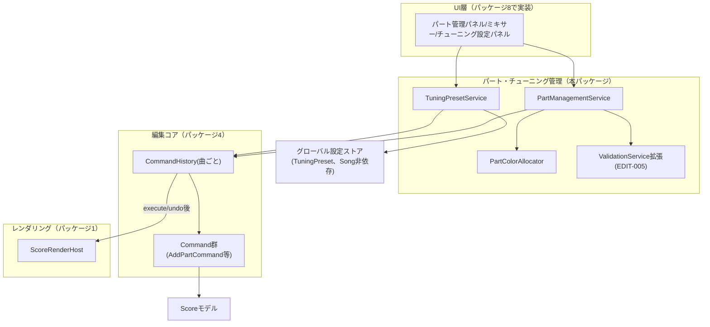
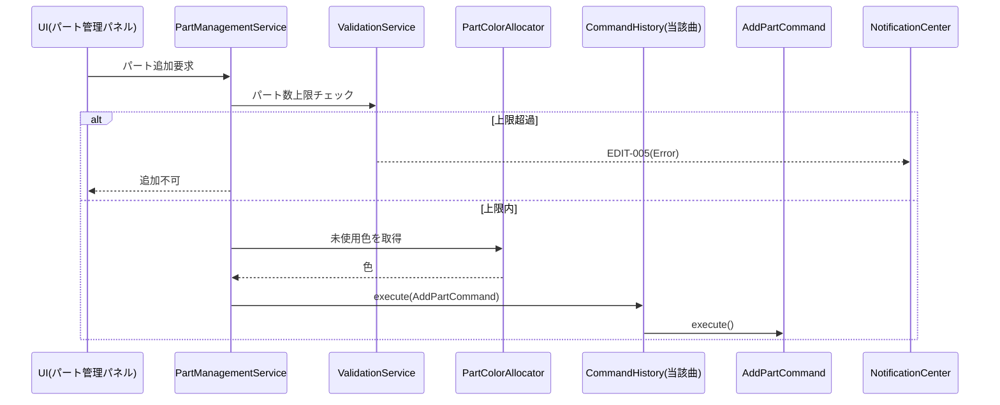
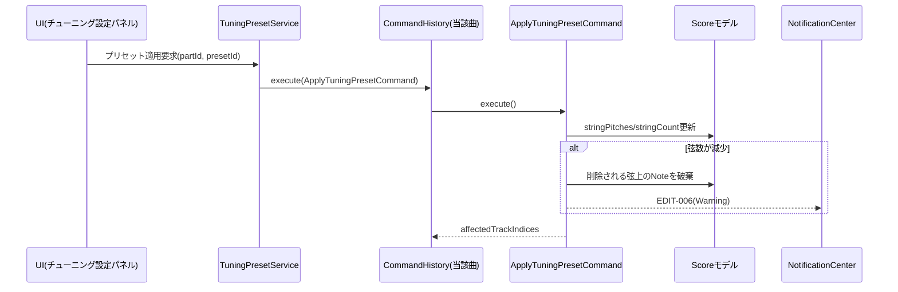
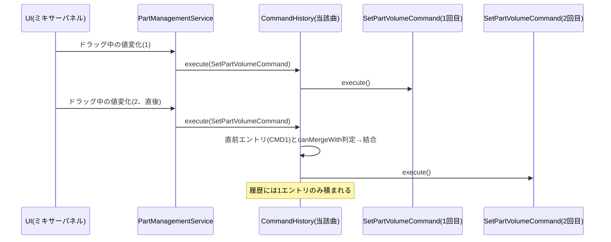

# パート・チューニング管理 詳細設計書

- **対応作業パッケージ**：パート・チューニング管理（実施順序5、[[../basic_design/13_design_decision_points.md#3]]B11）
- **ブランチ**：`feature/part-tuning-management`
- **前提ドキュメント**：[[../basic_design/02_data_model.md]]（§3.2 Part、§3.7 TuningPreset）、[[../basic_design/03_screens_ui_pc.md]]（§5 パートリスト／ミキサー、§10 パート管理・チューニング設定パネル・新規曲作成ウィザード）、[[../basic_design/05_playback_audio.md]]（§2・§7 ミキサーの単方向データフロー、capoの運指/実音変換）、[[../basic_design/13_design_decision_points.md]]（B3弦数不整合の先例、B10）、[[editing-core.md]]（`Command`/`CommandHistory`基盤、`ValidationService`拡張ポイント、`EDIT-005`申し送り）

## 1. スコープ

**含む**：パートのCRUD（追加・削除・並べ替え）、パート属性（名前・楽器種別・弦本数・音量／パン／ソロ／ミュート・カポ・識別色）のコマンド化、パート識別色の自動割当、チューニングプリセット（組み込み＋ユーザー定義）の管理と適用、プリセット適用時の弦数同期ロジック、`ValidationService`へのパート数上限（8）の非破壊拡張。

**含まない（他パッケージに委譲）**：
- パート管理パネル／チューニング設定パネル／ミキサーパネル自体のUI実装 → パッケージ8（画面群・ナビゲーション）
- カポ適用後の実音変換（運指→実音のピッチ計算） → パッケージ7（再生エンジン統合、[[../basic_design/05_playback_audio.md#8]] ※章番号は暫定、実際の再生ピッチ計算ロジックの所属先）
- 新規曲作成ウィザードのステップ遷移UI自体 → パッケージ8（本パッケージが提供するコマンド・サービスを呼び出すのみ）

## 2. 全体構造図

## 3. 新規設計決定

### 3.1 パート数上限のValidationService非破壊拡張

[[editing-core.md#7]]が申し送った通り、`ValidationService`へ「パート数が8を超えないか」を検証する新規メソッドを追加する（既存メソッドのシグネチャ変更なし。[[web-core-foundation.md]]の`PlatformAdapter`拡張パターンと同一の考え方）。エラーコード`EDIT-005`（**2026-09-02修正**：当初Warningとしていたが、パート数上限は超過時に追加自体を拒否するハードキャップであり、Warning本来の「操作継続可」の定義と矛盾していたため、[[../basic_design/13_design_decision_points.md#3]]B20によりErrorへ再分類。セルフレビューで発見）を[[error-logging-foundation.md]]の`ErrorCodeRegistry`へ登録する。

### 3.2 チューニングプリセット適用時の弦数同期（新規決定）

**課題**：[[../basic_design/02_data_model.md#3.7]]のTuningPresetは`stringPitches`配列（弦数分の長さ）を持つが、Partの`stringCount`は独立したフィールドである。プリセットの弦数がパートの現在の弦数と異なる場合（例：6弦パートへ7弦プリセットを適用）にどう扱うかは基本設計で未規定だった。

**検討した選択肢**：
- (a) 弦数が一致しない場合は適用を拒否し、先にパートの弦数を変更するようユーザーに促す
- (b) プリセット適用時に`Part.stringCount`もプリセットの弦数へ自動的に合わせる

**(b)に確定する**：チューニングプリセットは「6弦標準」「7弦ドロップA」のように弦数と一体の概念であり、ユーザーがプリセットを選ぶ操作の意図は「このチューニング（＝この弦数）にしたい」であることが大半のため、(a)は単なる二度手間になる。したがって`ApplyTuningPresetCommand`は`stringPitches`と`stringCount`を1つのコマンドでアトミックに更新する。

**弦数減少時のデータ影響**：[[../basic_design/13_design_decision_points.md#3]]B3（コピー＆ペーストの弦数不整合の非対称ルール）と同じ考え方を援用する：
- 弦数が**増加**する場合：新規に追加される弦は既存のNoteに影響しないため、警告なしで適用する。
- 弦数が**減少**する場合：削除される弦番号に置かれていたNoteは警告（Warning）付きで破棄する。新規エラーコード`EDIT-006`を登録する。

`SetCustomTuningCommand`（プリセットを使わない手動チューニング編集で弦数そのものは変えない操作）にはこの弦数同期ロジックは適用されない（弦数を変えたい場合は後述のパート弦数変更操作、または弦数の異なるプリセット適用を経由する）。

### 3.3 カポの範囲確定（B14として追加）

要件定義書にはカポの数値範囲の明記がなく、基本設計でも確定していなかった。実在するカポタスト（カポダスト）の可動域を踏まえ、**`capoFret`は0〜12の整数に確定する**（B14として[[../basic_design/13_design_decision_points.md#3]]へ追加する）。範囲外の値は`EDIT-007`（Error）として拒否する。

**capoFretとフレット番号の組み合わせ範囲について（2026-09-03追記、B-1）**：`capoFret`（0〜12、本節）とフレット番号（0〜24、[[../basic_design/04_editing_core.md#4]]・[[../basic_design/04_editing_core.md#11]]）はそれぞれ独立に範囲検証されており、両者を組み合わせた場合（実音＝開放弦ピッチ＋`capoFret`＋記譜フレット番号、[[playback-integration.md#3.2]]）についての追加検証は行わない。理由は、最悪値の組み合わせ（`capoFret`=12・フレット番号=24、計36半音＝3オクターブ）でも、ギター／ベースの開放弦ピッチにこれを加算した結果は通常の演奏可能音域を超えるだけであり、システム上不正な値（MIDIノート番号のオーバーフロー等）には該当しないためである。したがって組み合わせに起因する追加のエラーコードや上限は設けない（[[../review/design_review_2026-09-03.md]]B-1で指摘、対応不要と判断）。

### 3.4 パート識別色の自動割当ロジック

[[../basic_design/02_data_model.md#3.2]]で「新規パート追加時は既存パートと重複しない色を8色程度の既定パレットから自動割当」とされていた点を具体化する。固定8色パレット（パート数上限8と同数のため、全パートに重複なく割り当てられることが保証される）を順序付きで保持し、`PartColorAllocator`が現在使用中の色を除いた最初の未使用色を返す。パート削除で色が解放されれば、次回追加時にその色が再利用候補に戻る（LRU等の複雑な履歴は持たない、単純な「未使用の先頭」方式）。

### 3.5 チューニングプリセットのCRUDとCommandHistoryの関係、および削除方式の確定（B27、新しい視点でのレビューによる修正）

4.2節の通り、ユーザー定義プリセットの作成・削除はSong非依存のグローバルストア（`tuning-presets.json`）に対する操作であり、特定の曲の`CommandHistory`（編集ウィンドウ単位スコープ、[[editing-core.md#6.2]]）にも、Undo/Redo対象にも馴染まない。プリセットの追加・削除は「素材を用意する／片付ける」操作であり、曲の編集内容そのものの取り消し対象ではないため、`CommandHistory`を経由しない単純なサービス操作として扱う。

**削除方式の確定（B27）**：当初は物理削除（`tuning-presets.json`からの即時除去）を想定していたが、新しい視点でのレビューで、既に曲に適用済みのプリセットが後から削除された場合の追跡可能性（元になったプリセットが何だったかを辿れなくなる）や、誤削除からの復旧手段が存在しないことが問題として判明した。[[../basic_design/06_file_io_persistence.md#7]]の`TrashService`と同じ論理削除パターンを転用し、削除は「非表示化（`isDeleted`フラグ）」のみを行う（実データは保持する）。

ただし、本人からの指摘（「論理削除にする場合、キャッシュとして肥大化しないよう注意」）を踏まえ、無制限には蓄積させない。保持条件は**論理削除から7日経過、または論理削除状態のプリセットが20件を超えた時点、のいずれか早い方**とし、超過分は削除日時が古いものから物理的にパージする（`TuningPresetService.purgeExpired()`。アプリ起動時に`TrashService.purgeExpired()`（[[../detailed_design/data-model-persistence.md#3.2]]）と合わせて呼び出す）。一覧取得（`list()`）は常に論理削除済みのプリセットを除外して返す。

### 3.6 `PartColorAllocator`のスコープ確定（ステートレスな割当処理、新しい視点でのレビューによる是正）

[[editing-core.md]]で確立された「新規クラスはスコープ（編集ウィンドウ単位／アプリ全体単位）を明記する」というルールが、本書初版の`PartColorAllocator`には適用されていなかった（新しい視点でのレビューで発見、[[../basic_design/13_design_decision_points.md]]運用ルール節を参照）。`PartColorAllocator`は内部状態を一切持たず、呼び出しのたびに対象曲の現在のPart一覧を引数として受け取り未使用色を計算して返す**ステートレスな割当処理**であり、そもそもスコープ（どの単位でインスタンスを持つか）という概念自体が存在しない。これを「編集ウィンドウ単位」「アプリ全体単位」に次ぐ第三のスコープ分類として明記する。

**バッチ割当時の注意（本人指摘「多少注意して」への対応）**：新規曲作成ウィザードのように、複数パートを1回のUI操作でまとめて追加する場面では、各パートの`AddPartCommand`が`CommandHistory`へ`execute`されてモデルに反映されるまでの間、`PartColorAllocator`が「現在使用中の色」をモデルから読み取るだけでは、同一バッチ内でまだ未実行の他パートに割り当て予定の色を検知できず、重複した色を割り当ててしまう可能性がある。したがって、バッチ割当の呼び出し元（本パッケージでは新規曲作成ウィザードのステップ処理、パッケージ8が実装）が、バッチ内で既に払い出し済みだが未実行の色の一覧を、`PartColorAllocator`の呼び出しごとに除外リストとして渡す責任を持つ。`PartColorAllocator`自体はこの責任を負わず、ステートレスなままに保つ。

## 4. モジュール構成

### 4.1 `PartManagementService`

| 責務 | 内容 |
|---|---|
| パート追加受付 | UI（パート管理パネル・新規曲作成ウィザード）からのパート追加要求を受け、`ValidationService`（パート数上限）を確認し、`PartColorAllocator`から色を取得したうえで`AddPartCommand`を組み立てる（バッチ追加時の除外リストの扱いは3.6節） |
| パート削除受付 | 削除要求を受け、対象パートの全データ（Bar/Voice/Beat/Note含む）を`RemovePartCommand`として発行する |
| 並べ替え受付 | パートリスト上のドラッグ並べ替え等から`order`変更要求を受け、`ReorderPartsCommand`を発行する |
| ミキサー系プロパティ変更受付 | 音量／パン／ソロ／ミュートの変更要求を受け、対応するコマンド（4.3節）を発行する。ドラッグ中の連続変更は[[editing-core.md#6.1]]の結合可否判定（`canMergeWith`）を用いて1履歴エントリへまとめる |
| カポ変更受付 | カポ変更要求を受け、3.3節の範囲検証後に`SetCapoFretCommand`を発行する |
| 発行先 | 組み立てたコマンドは、対象パートが属する曲の`CommandHistory`インスタンス（[[editing-core.md#6.2]]、編集ウィンドウごと）へ`execute`する |

### 4.2 `TuningPresetService`

| 責務 | 内容 |
|---|---|
| 組み込みプリセット提供 | アプリ同梱の標準プリセット（レギュラーチューニング、ドロップD等）の一覧を提供する |
| ユーザー定義プリセットのCRUD | ユーザーが独自に追加・削除するプリセットを、Song非依存のグローバルストアに保持する。作成・削除は`CommandHistory`を経由しない単純なサービス操作とする（3.5節）。削除は論理削除方式とする（3.5節、B27） |
| 論理削除・パージ | 削除は`isDeleted`フラグによる論理削除とし、「7日経過」または「論理削除件数20件超過」のいずれか早い方で古いものから物理パージする（`purgeExpired()`、3.5節B27）。`list()`は論理削除済みを常に除外する |
| プリセット適用 | 指定パートへ指定プリセットを適用する要求を受け、3.2節の弦数同期を含む`ApplyTuningPresetCommand`を組み立て、対象パートが属する曲の`CommandHistory`へ`execute`する |
| 既存パートからのコピー | 新規曲作成ウィザードの「既存パートのチューニングをコピー」操作向けに、指定パートの現在のチューニングをその場でスナップショットとして返す（プリセットとして保存はしない一時的な複製） |
| 参照ではなく値のコピー | プリセット削除後も既存曲のチューニングが壊れないよう、`ApplyTuningPresetCommand`はプリセットの`presetId`と実値のスナップショットの両方をPartへ保存する（[[../basic_design/02_data_model.md#3.7]]の方針どおり） |

### 4.3 `PartColorAllocator`

| 責務 | 内容 |
|---|---|
| 色割当 | 固定8色パレットから、対象曲内で現在使用中でない先頭の色を返す。スコープの概念を持たないステートレスな割当処理（3.6節） |
| バッチ割当時の重複回避 | `PartColorAllocator`自体は状態を持たないため、複数パート一括追加時に同一バッチ内で重複しないようにする責任は呼び出し元が負う（除外リストを渡す。3.6節） |
| 手動変更の受付 | ユーザーがパート管理パネルから手動で色を変更した場合、重複チェックなしでそのまま`SetPartColorCommand`の値として受け付ける（重複を許容しても表示上の識別性が落ちるだけで機能的な破綻はないため、自動割当時のみ重複を避ければよい） |

### 4.4 `ValidationService`拡張

[[editing-core.md#7]]で定義済みの`ValidationService`に対し、既存メソッドのシグネチャを変更せず以下を追加する。

| 検証項目 | 発生タイミング | エラーレベル | エラーコード |
|---|---|---|---|
| パート数上限(8)超過 | パート追加時 | Error（**2026-09-02修正**：Warningから再分類、[[../basic_design/13_design_decision_points.md#3]]B20） | `EDIT-005` |
| プリセット適用による弦数減少でNote破棄 | プリセット適用時 | Warning | `EDIT-006` |
| カポ範囲外(0〜12) | カポ変更時 | Error | `EDIT-007` |

## 5. コマンド一覧（`editing-core.md`の`Command`/`CommandHistory`基盤に準拠）

| コマンド | 責務概要 | 結合可否 |
|---|---|---|
| `AddPartCommand` | 新規パートを末尾（または指定位置）に追加する。初期チューニングは設定ダイアログの既定値（[[../basic_design/03_screens_ui_pc.md#10]]項目1）またはウィザードでのコピー元指定に従う | 不可 |
| `RemovePartCommand` | パートとその配下の全Bar/Voice/Beat/Noteを削除する。Undo時は削除前の全内容を復元できるよう、削除直前のパート全体を差分として保持する | 不可 |
| `ReorderPartsCommand` | パートの`order`を一括更新する | 不可 |
| `SetPartVolumeCommand` / `SetPartPanCommand` | 対象パートの`volume`/`pan`を更新する | 可（ドラッグ中の連続変更を1エントリへまとめる） |
| `SetPartSoloCommand` / `SetPartMuteCommand` | 対象パートの`solo`/`mute`を切り替える | 不可 |
| `SetPartColorCommand` | 対象パートの`color`を更新する | 不可 |
| `SetCapoFretCommand` | 対象パートの`capoFret`を更新する（0〜12検証済み） | 不可 |
| `ApplyTuningPresetCommand` | 対象パートの`stringPitches`・`stringCount`をプリセット値へ更新する（3.2節の弦数同期・Note破棄を含む） | 不可 |
| `SetCustomTuningCommand` | 対象パートの`stringPitches`を手動編集値で更新する（弦数は変更しない） | 不可 |

いずれのコマンドも`affectedTrackIndices`は対象パート単体（`AddPartCommand`/`RemovePartCommand`/`ReorderPartsCommand`は影響しうる全パート）を申告し、[[editing-core.md#3]]の再描画戦略にそのまま乗る。

## 6. シーケンス図

### 6.1 パート追加（上限到達ケース含む）

### 6.2 チューニングプリセット適用（弦数減少ケース）

### 6.3 ミキサースライダーのドラッグ中コマンド結合

## 7. ビルド・テストに関する補足

- [[../basic_design/11_test_strategy.md#2]]の方針に従い、`ApplyTuningPresetCommand`の弦数同期ロジック（増加/減少の複合条件）はC2（条件網羅）まで単体テスト対象とする。
- `PartColorAllocator`の重複回避ロジック（8色パレット、パート上限8との整合）はC1で十分だが、境界値（8パート目追加時に色が枯渇しないこと）はテストケースとして明記する。バッチ割当時の除外リスト処理（3.6節）も、新規曲作成ウィザードでの複数パート同時追加を模したテストケースを用意する。
- `TuningPresetService.purgeExpired()`の保持条件（7日経過／20件超過のいずれか早い方）は境界値（19件/20件/21件、6日/7日/8日相当）でC1判定を行う。
- `RemovePartCommand`のUndo（削除したパートの完全復元）は、[[../basic_design/11_test_strategy.md#9]]の全奏法記号網羅フィクスチャを使い、削除前後でデータが完全一致することを確認する結合テストを用意する。
- 複数編集ウィンドウ（異なる曲）を同時に開いた状態でのパート操作が、それぞれの`CommandHistory`インスタンス（[[editing-core.md#6.2]]）に正しく分離されることを確認する。

## 8. Definition of Done

- 本書で定義した`PartManagementService`・`TuningPresetService`・`PartColorAllocator`・`ValidationService`拡張・コマンド一式が実装され、[[../basic_design/11_test_strategy.md#2]]のカバレッジ基準を満たす単体テストが揃っている。
- `EDIT-005`〜`EDIT-007`の`NotificationCenter`通知が結合テストで確認できる。
- 弦数増加・減少それぞれのケースでプリセット適用が正しく動作し、減少時のNote破棄と警告が確認できる。
- パート追加→削除→Undoの一連の操作でデータが完全に復元されることが確認できる。
- チューニングプリセットの論理削除・7日/20件パージ（3.5節、B27）、および`PartColorAllocator`のバッチ割当時の重複回避（3.6節）が結合テストで確認できる。
- 3.2〜3.6節の新規設計決定が本書に記録され、3.3節のB14・3.5節のB27が[[../basic_design/13_design_decision_points.md]]へ反映されている。

## 9. 引き継ぎ事項（次パッケージへ）

- **パッケージ6（表示モード）**：スコア表示モードでのパート識別色の適用（[[../basic_design/02_data_model.md#3.2]]、[[../basic_design/03_screens_ui_pc.md#5]]）は本パッケージが確定した`Part.color`をそのまま参照すればよい。
- **パッケージ7（再生エンジン統合）**：カポ（`capoFret`、0〜12、3.3節）の運指→実音変換ロジック、ミキサー値（volume/pan/solo/mute）のAlphaSynthチャンネルへの反映（[[../basic_design/05_playback_audio.md#7]]の単方向データフロー）は本パッケージが確定したPartフィールドを読み取るだけでよい設計にしてある。
- **パッケージ8（画面群・ナビゲーション）**：パート管理パネル・チューニング設定パネル・ミキサーパネル・新規曲作成ウィザードのUI実装時は、本書の各サービス（`PartManagementService`/`TuningPresetService`）をそのまま呼び出す想定。UIからScoreモデルやコマンドを直接操作しないこと（[[../basic_design/01_architecture.md]] AD-2）。新規曲作成ウィザードの複数パート同時追加ステップは、3.6節のバッチ割当の除外リストをウィザード側で保持・受け渡しする実装にすること（`PartManagementService.peekNextColor(reserved)` で次に払い出す色を予約できる）。

## 15. 実装時に確定した事項（2026-09-08、`feature/part-tuning-management`）

本書は責務レベル止まり（G1）だが、実装は本書を正として行い、as-built のメソッドシグネチャは[[00_reference.md#3.5]]へ反映した。実装レベルの確定は[[00_reference.md#9]]9.22節にも記録。

- **パート = alphaTab `Track` ＋ `Staff`**：`capoFret`→`staff.capo`、`stringPitches`/`stringCount`→`staff.stringTuning.tunings`（.length）、`color`→`track.color`（`model.Color` ⇔ `#RRGGBB` を `hexToColor`/`colorToHex` で変換）、`volume`/`pan`/`solo`/`mute`→`track.playbackInfo.{volume,balance,isSolo,isMute}`（alphaTab の 0〜16 レンジ）、`order`→`score.tracks` 内の位置。走査ヘルパー（`getStaff`/`trackCount`）は[[editing-core.md#3]]の `scoreModel.ts` を再利用する。
- **`ValidationService`拡張は `PartValidationService extends ValidationService`**（§4.4）：基底クラスを一切変更しないサブクラスとして追加。`PartManagementService`/`TuningPresetService` はこのサブクラスを使い、`EditingService`（パッケージ4）は基底を使う。
- **コマンドは alphaTab `Score.finish()` を呼ばない**（[[../basic_design/13_design_decision_points.md#3]]B33 と同方針）。派生計算は `CommandHistory`→`ScoreRenderHost.render()` に一任。
- **`EDIT-006` の発行元は `ApplyTuningPresetCommand`**：弦数減少で実際に Note を破棄したときのみ発行し、redo では再通知しない。§4.4 の `PartValidationService.validateTuningPresetApplication` は UI 事前確認用の助言的メソッドで、`TuningPresetService` は pre-check せず常に適用する（二重通知回避）。
- **プリセット出自 `presetId` は Part へ保存しない（G22、[[00_reference.md#8.1]]）**：alphaTab `Staff`/`Tuning` に該当フィールドが無い。§4.2 の「参照ではなく値のコピー」（プリセット削除後もチューニングが壊れない）は満たし、provenance は適用時のプリセット名を `staff.stringTuning.name` に記録するに留めた。id レベル追跡は `AppMetadata` 拡張時へ申し送り。
- **`TuningPresetService.applyPreset(target, history, trackIndex, preset)`**：プリセット CRUD は Song 非依存のグローバル操作だが、適用だけは特定曲への操作のため per-window の `target`/`history` を引数で受ける。
- **組み込みプリセット**（`BUILTIN_TUNING_PRESETS`）：ギター標準／ドロップD／DADGAD／半音下げ／ベース標準／ベース ドロップD の6種。ファイル（`tuning-presets.json`）には保存しない。
- **`tools/` フィクスチャ**：`tools/` ワークスペース整備は Phase 1 後半へ申し送り（[[editing-core.md#15]]と同じ）。当面 `packages/core/src/testing/` のテスト支援を流用。
