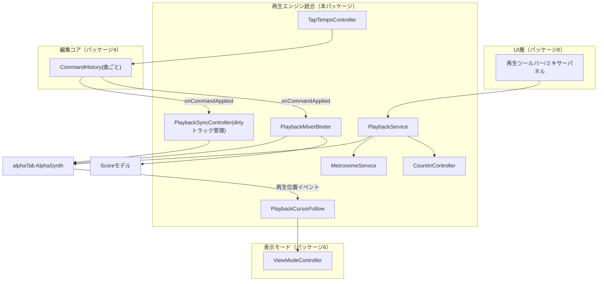
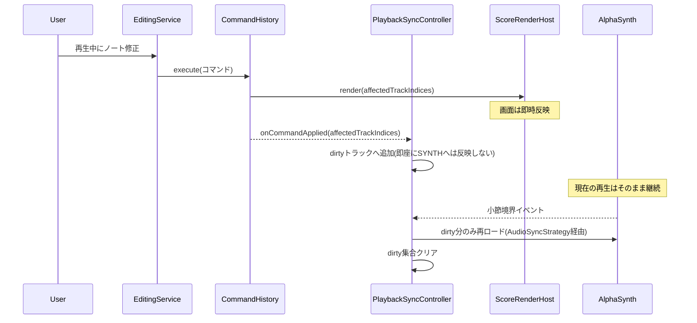
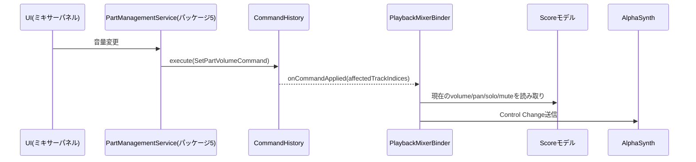
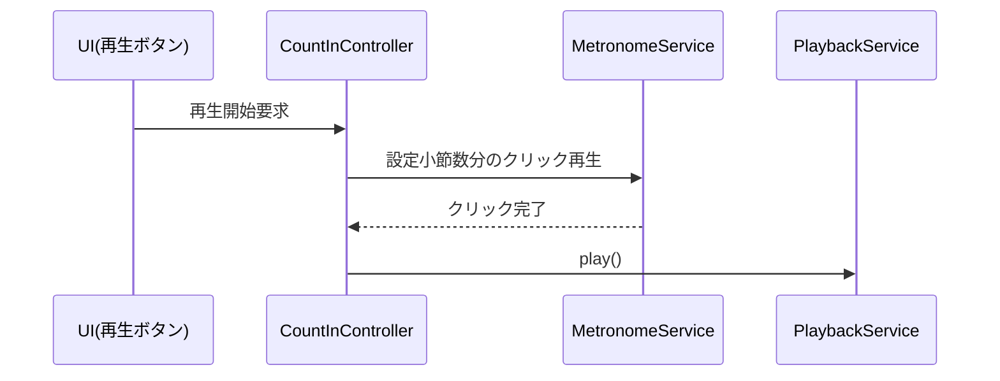
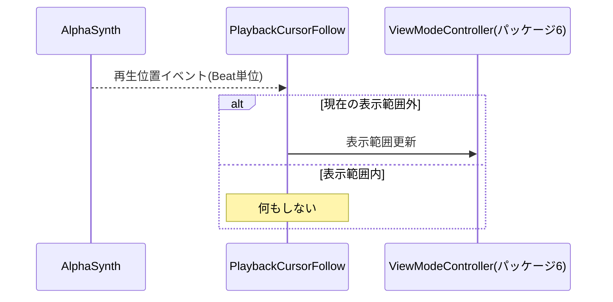

# 再生エンジン統合 詳細設計書

- **対応作業パッケージ**：再生エンジン統合（実施順序7、[[../basic_design/13_design_decision_points.md#3]]B11、Lサイズ）
- **ブランチ**：`feature/playback-integration`
- **前提ドキュメント**：[[../basic_design/05_playback_audio.md]]（全節）、[[../basic_design/13_design_decision_points.md]]（A4未解決、B14カポ範囲）、[[../basic_design/09_nonfunctional.md]]（§1 再生開始レイテンシ目標）、[[web-core-foundation.md]]（`ScoreRenderHost`、起動シーケンス）、[[editing-core.md]]（`CommandHistory.onCommandApplied`拡張ポイント、14節の引き継ぎ事項）、[[part-tuning-management.md]]（Part.volume/pan/solo/mute/capoFret、9節の引き継ぎ事項）、[[view-modes.md]]（`ViewModeController`の表示範囲更新API、9節の引き継ぎ事項）

## 1. スコープ

**含む**：`PlaybackService`ファサード（再生／停止／シーク／ループ範囲／テンポ倍率）、合奏・ソロ再生、区間・セクションループ、再生中の編集反映方式（画面即時・音は遅延、ループ以外の通常再生にも一般化）、カポの運指→実音変換（再生時のみ）、ミキサー値（volume/pan/solo/mute）のAlphaSynth反映、メトロノーム・カウントイン・タップテンポ、カーソル自動追従スクロールとの連携、AlphaSynthの起動時先行初期化。

**含まない（他パッケージに委譲）**：
- ミキサー値・カポ値そのものの保持とコマンド化 → パッケージ5（[[part-tuning-management.md]]、本パッケージはPartフィールドを読み取るだけ）
- 表示範囲の更新ロジック自体 → パッケージ6（[[view-modes.md]]、本パッケージはAPIを呼ぶだけ）
- ミキサーパネル・再生ツールバー等のUI実装 → パッケージ8（画面群・ナビゲーション）
- 減速再生のテンポ倍率入力UI・タップテンポのUIボタン自体 → パッケージ8（本パッケージはロジックのみ提供）

## 2. 全体構造図

## 3. 新規設計決定

### 3.1 再生中の編集可否・音への反映タイミング（[[editing-core.md#14]]の残課題を解決）

[[../basic_design/05_playback_audio.md#3.2]]は**ループ再生中**の同時編集について「画面は即時反映、音はループ境界まで遅延」という方式を既に定めていたが、[[editing-core.md#14]]は「ループしていない通常再生中の編集可否」を本パッケージの検討課題として申し送っていた。

**確定方針**：編集はいかなる再生状態でも常に許可する（ロックしない）。[[../basic_design/05_playback_audio.md#3.2]]の方式を**通常再生にも一般化**し、「音への反映は次の安全な境界（小節境界。ループ再生中はループ境界がそのまま小節境界の特殊ケースにあたる）まで遅延させる」という単一のルールに統一する。理由：ループの有無で編集反映の挙動を分ける合理的な理由がなく（発音キュー不整合のリスクはループ有無に関わらず同じ）、単一ルールにすることで実装・テストの対象が1系統で済む。具体的なメカニズムは4.2節`PlaybackSyncController`で定義する。

### 3.2 カポの運指→実音変換の計算方法（新規決定）

要件4.1「カポ表示規則：譜面は運指（as played）表示を基本とし、実音への変換は再生時のみ反映する」、および[[part-tuning-management.md#3.3]]で確定した`capoFret`（0〜12）について、実際の変換計算式が基本設計では未規定だった。**再生時の実際のMIDIピッチ＝（開放弦のチューニングピッチ）＋`capoFret`＋（記譜されたフレット番号）に確定する**。譜面表示（記譜フレット番号）は一切変更せず、`PlaybackService`がAlphaSynthへ渡す再生用ノートデータの生成時にのみこの加算を適用する。

**2026-09-02追記（Phase 2、非破壊リファクタリング）**：上記の計算式は、当初`PlaybackService`の内部実装としてのみ存在していたが、[[export-print.md#3.1]]の`MidiExportService`（MIDIエクスポート時のノートピッチ計算）が同一の計算式を必要としたため、`computeRealMidiPitch(openStringPitch: number, capoFret: number, frettedFret: number): number`として`packages/core/src/domain`配下の共有純粋関数に抽出した。`PlaybackService`はこの関数を呼び出す形に変更されたが、外部から見たシグネチャ・挙動（4.1節の責務表）に変更はない。7節の単体テスト対象（境界値：capoFret=0/12、フレット0〜24）は、抽出後の共有関数に対して実施する形になる。詳細は[[export-print.md#3.1]][[#7]]、[[00_reference.md#9]]9.12節を参照。

### 3.3 AlphaSynthの先行初期化（[[web-core-foundation.md]]の起動シーケンスへの非破壊追加）

[[../basic_design/05_playback_audio.md#9]]「再生開始レイテンシ200ms以内」の実現方式として、AlphaSynthの初期化をアプリ起動直後・非同期で行う。[[web-core-foundation.md#5]]の起動シーケンス（`ScoreRenderHost.initialize()`以降）に対し、既存ステップの変更を伴わない追加ステップとして`PlaybackService.preWarm()`（AlphaSynthインスタンス生成＋同梱SoundFontの非同期ロード開始）を挿入する。曲一覧表示・レンダリング初期化はこのロードを待たない（並行実行）。

## 4. モジュール構成

### 4.1 `PlaybackService`

| 責務 | 内容 |
|---|---|
| 再生制御 | 再生・停止・シーク・区間ループ設定・セクションループ設定・ソロ再生指定・テンポ倍率設定という抽象操作をUIへ公開する（[[../basic_design/05_playback_audio.md#1]]のファサード方針） |
| 先行初期化 | `preWarm()`：アプリ起動直後にAlphaSynthとSoundFontを非同期ロードする（3.3節） |
| ループ境界検知 | 区間ループ・セクションループの境界到達を検知し、開始小節の先頭へシークし直す（[[../basic_design/05_playback_audio.md#3.1]]） |
| カポ変換の適用 | 再生用データ生成時に3.2節の計算式（`computeRealMidiPitch`、2026-09-02抽出）でピッチ変換を適用する |
| インスタンススコープ | 編集ウィンドウ（＝開いている曲）ごとに1インスタンス（[[editing-core.md#6.2]]の`CommandHistory`と同じスコープ設計。複数編集ウィンドウでの同時再生に対応するため） |

### 4.2 `PlaybackSyncController`（dirtyトラック管理）

| 責務 | 内容 |
|---|---|
| dirty検知 | 再生中、`CommandHistory.onCommandApplied`（[[editing-core.md#6.2]]）を購読し、通知された`affectedTrackIndices`を「dirtyトラック集合」へ追加する（即座にはAlphaSynthへ反映しない） |
| 境界検知 | alphaTabの再生位置イベント（Beat単位で発火、[[../basic_design/05_playback_audio.md#5]]と同じイベント）を購読し、小節境界（ループ境界を含む）への到達を検知する |
| フラッシュ | 境界到達時、dirtyトラック集合に含まれるトラックのみAlphaSynthへ再ロードし、集合をクリアする。再生中でない場合はdirty管理自体を行わない（編集の都度即座に反映されるため不要） |
| フォールバック切替 | [[../basic_design/13_design_decision_points.md#2]]A4が未解決のため、「部分差し替え」と「一旦停止して再開」の2つの`AudioSyncStrategy`実装を持ち、Phase 1の実機検証結果に応じて設定で切り替えられるようにする（5節参照） |

### 4.3 `PlaybackMixerBinder`

| 責務 | 内容 |
|---|---|
| 購読 | `CommandHistory.onCommandApplied`を購読する（[[editing-core.md#6.2]]の同じ拡張ポイントを`PlaybackSyncController`と共有する） |
| 反映 | 通知された`affectedTrackIndices`について、Partの現在の`volume`/`pan`/`solo`/`mute`値をScoreモデルから読み取り、AlphaSynthの対応チャンネルへControl Changeとして送る（[[../basic_design/05_playback_audio.md#7]]の単方向データフロー） |
| 冪等な同期方針 | どのコマンド種別がミキサー値を変更したかを個別に判定せず、通知のたびに該当トラックの現在値を毎回まるごと再送する（変更がなければ同じ値を送るだけで実害がない）。[[editing-core.md#3]]のScore再描画戦略（分類を試みず一律に扱う）と同じ考え方を踏襲した設計判断 |
| ソロ優先／ミュート優先 | ソロ指定パートが1つ以上ある場合、ソロ対象以外を内部的にミュート扱いにする（[[../basic_design/05_playback_audio.md#2]]）。**同一トラックに明示 `mute` と `solo` が両立する場合は明示ミュートを優先**する（`effectiveMute = mute || (anySolo && !solo)`）。明示ミュートは絶対操作であり solo は上書きしない、という一般的な DAW 挙動に揃える（[[../basic_design/13_design_decision_points.md#3]]B35、2026-09-09 設計オーナー裁定。実装 `PlaybackMixerBinder.syncAll` と UT `PlaybackMixerBinder_SyncAllWithSoloAndExplicitMuteOnSoloTrack_KeepsMuted` が本規則の正） |

### 4.4 `MetronomeService` / `CountInController` / `TapTempoController`

| モジュール | 責務 |
|---|---|
| `MetronomeService` | 選択中の音色プリセット（[[../basic_design/13_design_decision_points.md#4]]C1）でクリック音を鳴らす。1拍目は共通してピッチを上げる |
| `CountInController` | 再生開始前に、設定（1小節／2小節、C2）に応じた小節数分の`MetronomeService`クリックを鳴らしてから`PlaybackService.play()`を呼び出す |
| `TapTempoController` | UIボタンの連続クリック間隔（直近3〜4回の平均）からBPMを算出し、`SetTempoCommand`（[[editing-core.md#6.4]]に準ずる新規コマンド、対象曲の`CommandHistory`経由で`Bar.tempoBpm`を更新）を発行する |

**設定値の入力元（2026-09-02、[[../basic_design/screens-navigation.md#3.1]]による非破壊追記）**：上表の各モジュールが参照する設定値（メトロノーム音色プリセットID、カウントイン小節数倍率、タップテンポの感度パラメータ）は、パッケージ8が新設する`AppPreferencesService.load()`（[[screens-navigation.md#3.1]]）から取得する。`MetronomeService`はプリセットIDを、`CountInController`は小節数倍率を、`TapTempoController`は感度パラメータをそれぞれ`AppPreferencesService`経由で読み取る契約とし、各モジュール自体の責務定義（上表）は変更しない（値の入力元を明確化するのみの非破壊追記）。設定変更の即時反映か次回再生からの反映かは実装時の詳細と位置づけ、本書では確定しない。**2026-09-02補足**：本節は当初、[[screens-navigation.md#3.1]]・[[00_reference.md#3.7]]からこの追記が行われた旨が参照されていたにもかかわらず、実際には本書に反映されていない食い違いがあった（セルフレビューで発見）。本追記により、その食い違いを解消した。

### 4.5 `PlaybackCursorFollow`

| 責務 | 内容 |
|---|---|
| 購読 | alphaTabの再生位置イベント（Beat単位）を購読する |
| 表示範囲更新 | 現在のフォーカスビューの表示範囲外に再生カーソルが出た場合のみ、[[view-modes.md#4.1]]の`ViewModeController`の表示範囲更新APIを呼び出す（過剰なスクロールを避ける「範囲外に出た時のみ更新」の原則、[[../basic_design/05_playback_audio.md#5]]） |

## 5. `AudioSyncStrategy`（A4対応）

| 実装 | 内容 | 適用条件 |
|---|---|---|
| `PartialReloadStrategy` | AlphaSynth側が対応トラックのみの部分差し替えをサポートする場合に使用。境界到達時にdirtyトラックのみ再ロードし、他トラックの再生は継続する | [[../basic_design/13_design_decision_points.md#2]]A4が(a)で解決した場合 |
| `PauseResumeStrategy` | 部分差し替え非対応の場合のフォールバック。境界到達時に一旦全体を停止し、最新データで即座に再開する（境界での数十msの空白は許容） | A4が(b)で解決した場合、またはPhase 1検証が完了するまでの既定 |

`PlaybackSyncController`はどちらの実装を使うかを起動時の設定値として受け取るだけでよい構造にし、A4の検証結果が出た時点で設定を切り替えるだけで済むようにする（[[editing-core.md#3]]のA8と同様、実機検証結果を設計変更なしに反映できる構造）。

## 6. シーケンス図

### 6.1 通常再生中の編集反映（3.1節の一般化ルール）

### 6.2 ミキサー値の反映

### 6.3 カウントイン付き再生開始

### 6.4 カーソル自動追従スクロール

## 7. ビルド・テストに関する補足

- `PlaybackSyncController`のdirty管理・境界検知ロジックは複合条件（再生中か否か×ループ有無×境界一致）を含むため、[[../basic_design/11_test_strategy.md#2]]の方針によりC2（条件網羅）まで単体テスト対象とする。
- 3.2節のカポ変換計算式（開放弦ピッチ＋capoFret＋記譜フレット、`computeRealMidiPitch`）は境界値（capoFret=0, capoFret=12、フレット0〜24の組み合わせ）を含めC2で単体テスト対象とする。**2026-09-02追記**：本関数は`MidiExportService`（[[export-print.md#3.1]]）からも呼び出されるが、同サービス側では本関数への引数の受け渡しが正しいことのみを確認すればよく、計算式自体の重複テストは不要（[[export-print.md#6]]参照）。
- `PlaybackMixerBinder`の冪等な同期方針は、Undo/Redoでミキサー値が変化するケース（[[part-tuning-management.md#5]]の`SetPartVolumeCommand`等）を含め結合テストで確認する。
- A4（[[../basic_design/13_design_decision_points.md#2]]）の実機検証は、[[../basic_design/11_test_strategy.md#8]]の負荷テスト計画と合わせてPhase 1で実施し、`AudioSyncStrategy`の既定実装を確定する。

## 8. Definition of Done

- 本書で定義した`PlaybackService`・`PlaybackSyncController`・`PlaybackMixerBinder`・`MetronomeService`・`CountInController`・`TapTempoController`・`PlaybackCursorFollow`が実装され、[[../basic_design/11_test_strategy.md#2]]のカバレッジ基準を満たす単体テストが揃っている。
- 合奏再生・ソロ再生・区間ループ・セクションループ・再生中の編集（画面即時／音は境界まで遅延）が結合テストで確認できる。
- カポ0・12を含む複数値での実音変換が正しいことが確認できる。
- カウントイン・メトロノーム・タップテンポが結合テストで確認できる。
- AlphaSynthの先行初期化により、曲を開いた際の再生開始レイテンシが体感上ブロックされないことを手動シナリオで確認する（実測値そのものはA4・A8同様Phase 1）。
- `AudioSyncStrategy`の2実装が、設定切替のみで入れ替え可能であることを確認する。

## 9. 引き継ぎ事項（次パッケージへ）

- **パッケージ8（画面群・ナビゲーション）**：再生ツールバー・ミキサーパネル・メトロノーム/カウントイン設定UIの実装時は、本書の各サービスをそのまま呼び出す想定。UIからAlphaSynthやScoreモデルを直接操作しないこと（[[../basic_design/01_architecture.md]] AD-2）。
  - **`PlaybackService.setSoloTracks` と `PlaybackMixerBinder` の関係を配線時に整理する**（2026-09-09、実装レビューでの気づき）：前者は一時的な「ソロ再生指定」（4.1節、UIの一時ソロ操作）、後者は永続 `Part.solo`（4.3節、ミキサーパネルのソロトグル）で、どちらも最終的に `PlaybackSynth.setChannelSolo` を駆動する。コマンド適用のたびに走る `PlaybackMixerBinder.syncAll()` は `setSoloTracks` による一時選択を上書きしうる。本パッケージは各々を設計責務どおり単体実装しただけで消費者（UI配線）が未実装のため実害は出ていないが、パッケージ8で両者を同時に使う場合は「一時ソロ中はミキサー同期のソロ列を抑制する」等の調停をどちらが持つかを決めること。
- **Phase 1実機検証**：A4（[[../basic_design/13_design_decision_points.md#2]]）の検証結果に応じて`AudioSyncStrategy`の既定実装を`PartialReloadStrategy`または`PauseResumeStrategy`に確定する。あわせてAlphaSynth先行初期化（3.3節）が実際に起動時間目標（[[../basic_design/09_nonfunctional.md#1]]）を圧迫していないかも確認する。
- **Phase 2（エクスポート・印刷）への申し送り済み事項（2026-09-02追記）**：3.2節のカポ実音変換式は`computeRealMidiPitch`として共有純粋関数に抽出され、[[export-print.md#3.1]]の`MidiExportService`から利用されている。本書側の外部シグネチャ・挙動に変更はないが、実装時は抽出後も7節の境界値テストが引き続きパスすることを確認する。

## 10. 実装時に確定した事項（2026-09-09、`feature/playback-integration`）

本節は as-built の記録。責務レベルの設計（3〜5節）を正とし、シグネチャは実装時に確定した（G1 の埋め戻しは行わない、[[view-modes.md#4.3]]と同じ方針）。

### 10.1 `PlaybackSynth` 縫い目と生 AlphaSynth の配線先送り

- alphaTab の生`AlphaSynth`/`AlphaTabApi`（player）に他モジュールを結合させないため、`packages/core/src/playback/types.ts`に **`PlaybackSynth`** インターフェース（再生制御＋チャンネル制御＋`reloadTracks`/`reloadAll`＋`loadSoundFont`＋位置/状態イベント購読）を定義し、本パッケージの全モジュールはこれにのみ依存する（editing の`RenderRequester`、viewmodes の`ViewModeRenderHost`と同じ「テスト可能な縫い目」）。
- **生`AlphaSynth`を`PlaybackSynth`として実体化する薄い実装クラス、および`PlaybackService.preWarm()`を[[web-core-foundation.md#5]]起動シーケンスへ挿入する配線は本パッケージでは実装しない**（[[web-core-foundation.md]]の`ScoreRenderHost`は`player.enablePlayer:false`で構成されており、player 有効化＋実オーディオ環境が要る）。パッケージ8（bootstrap 合成）／Phase 1 実機検証へ委譲する。[[#3.3]]の設計（`preWarm`の存在・非同期ロード・並行実行）は`PlaybackSynth.loadSoundFont()`＋`PlaybackService.preWarm()`として満たしている。G23 のパッケージ7分（下記 10.4）に手動確認を繰り越す。

### 10.2 tick ↔ 小節の対応（`TickMap`）

- 境界検知・シーク先解決に`TickMap`インターフェース（`tickToBarIndex(tick)`／`barStartTick(barIndex)`）を新設。Score 由来の実装`ArrayTickMap`（`buildBarTickBoundaries`＝`MasterBar.calculateDuration()`の積算）を提供する。`PlaybackSyncController`・`PlaybackService`・`PlaybackCursorFollow`が共有する。

### 10.3 `ViewModeController` の非破壊拡張（パッケージ6由来）

- 4.5節の`PlaybackCursorFollow`が呼ぶ「[[view-modes.md#4.1]]の表示範囲更新API」の実体が[[view-modes.md]]に無かった（[[view-modes.md#9]]は「そのまま呼び出せばよい」とだけ記載）。`ViewModeController`へ**`isBarVisible(barIndex): boolean`**と**`revealBar(barIndex): void`**を非破壊追加した（既存メソッドのシグネチャ不変）。`revealBar`は`focus`モードかつ現在範囲外のときだけ表示範囲を再センタリングして`applyViewMode`＋`onChange`を発火し、それ以外は何もしない（カーソル追従と同じ「範囲外に出た時のみ更新」の原則を共有）。`PlaybackCursorFollow`は`PlaybackViewport`（`isBarVisible`/`revealBar`の最小契約）にのみ依存し、`ViewModeController`が構造的に充足する。[[00_reference.md#3.6]]／[[00_reference.md#4]]は呼び出し元が同期する。

### 10.4 新規エラーコード・G23 繰り越し

- **新規エラーコードなし**：4.4節のメトロノーム／カウントイン／タップテンポは通知（`NotificationCenter.report`）を伴わない純粋なロジックであり、`PlaybackSynth`が無い場合の再生失敗通知もパッケージ8の配線層（`RENDER-001`相当の枠）に属する。`playback/index.ts`はエラーコードを共有レジストリへ登録しない。
- **G23（実 UI を要する DoD 基準5 手動シナリオ）パッケージ7分の繰り越し**（[[00_reference.md#8.1]] G23 へ追記）：再生ツールバー／ミキサーパネル／メトロノーム・カウントイン設定 UI が[[screens-navigation.md]]（パッケージ8）で実装されるため、以下を実 UI で確認できていない。UT／core 内結合テスト（`PlaybackMixerBinder`の Undo/Redo 追従等）で暫定担保した。
  - 合奏再生・ソロ再生・区間ループ・セクションループ・減速再生の一連操作
  - 再生中の編集（画面即時／音は小節境界まで遅延）の体感確認と、`AudioSyncStrategy`既定（`PauseResumeStrategy`）での境界の空白許容度
  - カウントイン付き再生開始・メトロノーム音色プリセット切替・タップテンポでのテンポ更新
  - `preWarm`により曲を開いた際の再生開始レイテンシが体感上ブロックされないこと（[[../basic_design/09_nonfunctional.md#1]]、実測は A4・A8 同様 Phase 1）
  - `AudioSyncStrategy`2実装が設定切替のみで入れ替わること（構造は UT で確認済み、実機切替は Phase 1）
