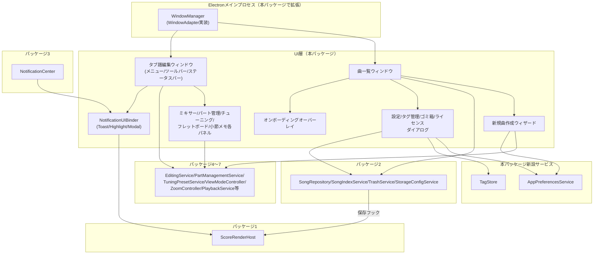
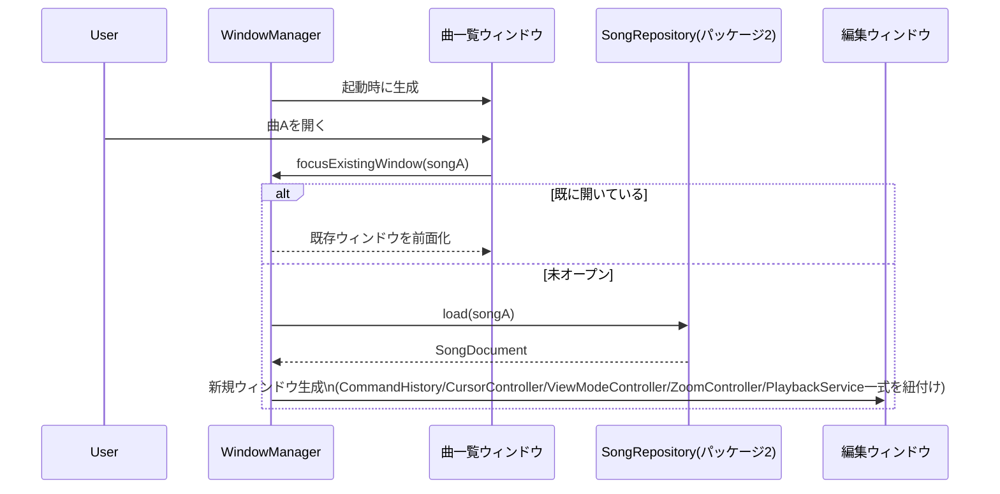
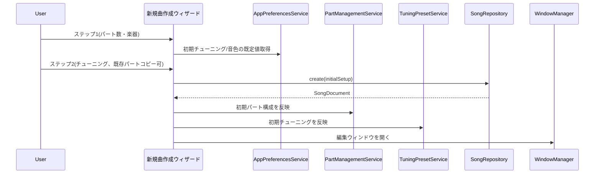
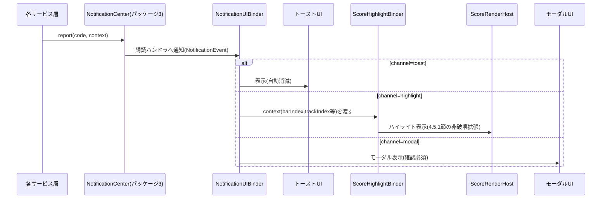
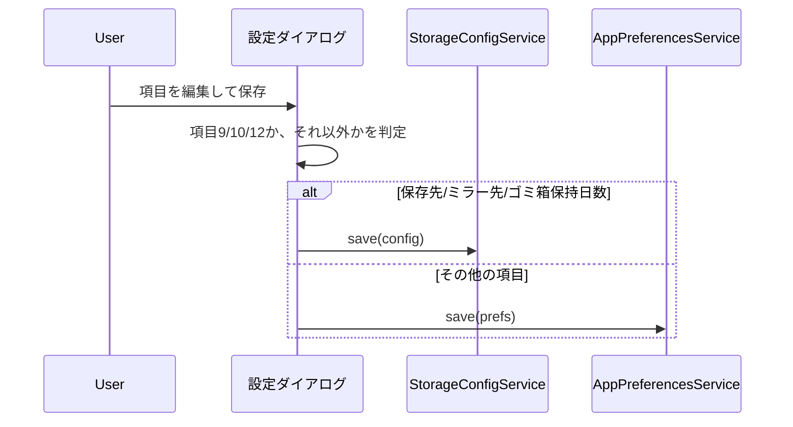
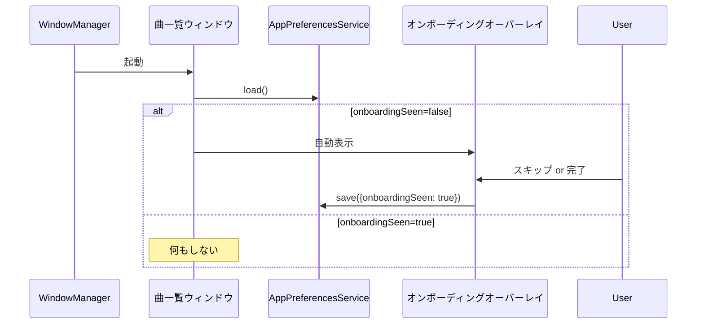
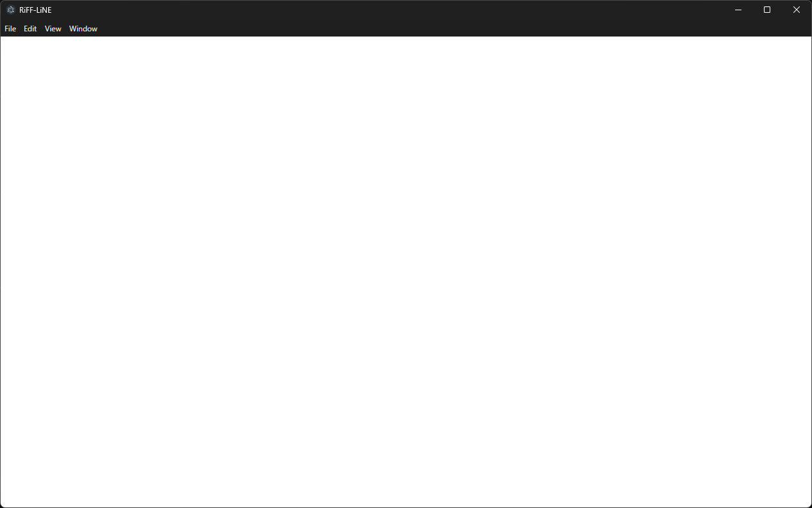
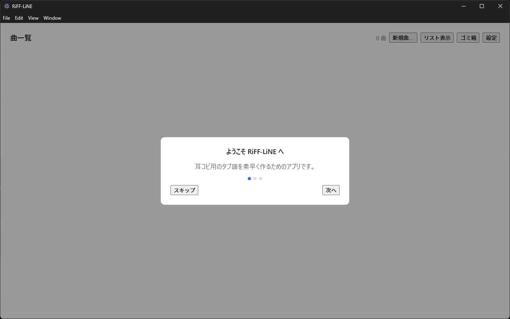
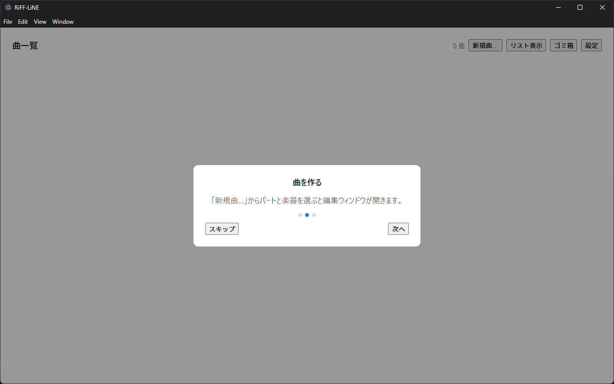
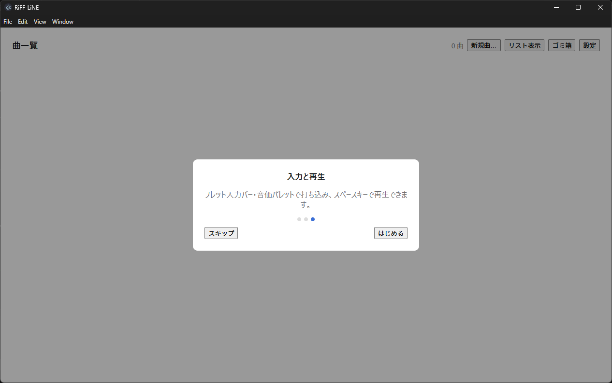

# 画面群・ナビゲーション 詳細設計書

- **対応作業パッケージ**：画面群・ナビゲーション（実施順序8、[[../basic_design/13_design_decision_points.md#3]]B11、Lサイズ。Phase 1（PC版MVP）の最終パッケージ）
- **ブランチ**：`feature/screens-navigation`
- **前提ドキュメント**：[[../basic_design/03_screens_ui_pc.md]]（全節、画面インベントリ・レイアウト・操作パターン）、[[../basic_design/14_visual_design_system.md]]（全節、配色・タイポグラフィ・コンポーネントの見た目）、[[../basic_design/13_design_decision_points.md]]（B10パートリスト非縮退、C3設定項目、C5〜C7ビジュアル関連、B20エラーレベル再分類）、[[../basic_design/01_architecture.md#3]]AD-2（UIはScoreモデル/ScoreRenderHost/AlphaSynthを直接操作しない）・AD-3（`PlatformAdapter`群）、[[00_reference.md]]（横断リファレンス、本書で新規に確定するクラスもここへ反映する）、および全既存詳細設計書（[[web-core-foundation.md]]／[[data-model-persistence.md]]／[[error-logging-foundation.md]]／[[editing-core.md]]／[[part-tuning-management.md]]／[[view-modes.md]]／[[playback-integration.md]]、それぞれの引き継ぎ事項節）

## 1. スコープ

**含む**：曲一覧ウィンドウ・編集ウィンドウの複数ウィンドウ管理（`WindowAdapter`の新規定義）、新規曲作成ウィザード、メニューバー・ツールバー・キーボードショートカット・ステータスバー、ミキサーパネル・フレットボード図オーバーレイ・パート管理パネル・チューニング設定パネル・小節メモ一覧パネル、設定ダイアログ（12項目）・タグ管理ダイアログ・ゴミ箱ダイアログ・ライセンス/クレジットダイアログ・初回オンボーディングオーバーレイ、`NotificationCenter`購読によるToast/Highlight/Modal表示、これまでのパッケージが確定した各種`Service`/`Controller`をUIから呼び出す配線（AD-2の層構造を維持）。あわせて、詳細設計を通じて判明した3件の横断的な未決着事項（3.1〜3.3節）をここで解消する。

**含まない（他パッケージ・他フェーズに委譲）**：
- 実際のPDF／alphaTex／MIDI生成ロジック（Phase 2、[[../basic_design/07_export_print.md]]）。本パッケージはエクスポート・印刷プレビューダイアログの**UIシェルのみ**を用意する（3.6節で境界を確定）。
- alphaTabのレンダリング自体・Score再描画API → パッケージ1（[[web-core-foundation.md]]）
- コマンド・バリデーション・再生等のドメインロジック本体 → パッケージ4〜7（本パッケージは呼び出すのみ）
- ビジュアルデザインの具体的なトークン値 → [[../basic_design/14_visual_design_system.md]]（本パッケージはトークンを参照するのみで新規に値を定義しない）
- セクションマーカーの譜面上インライン表示・編集自体（画面インベントリ#8） → 編集コア（[[editing-core.md#6.4]]の`AddSectionMarkerCommand`等）と`ScoreRenderHost`の既存レンダリングで実現される。本パッケージが新たな画面・パネルとして実装するものではない（**2026-09-02追記**、セルフレビューで発見。8節のDoD表現もあわせて是正した）。

## 2. 全体構造図

## 3. 新規設計決定

### 3.1 `AppPreferencesService`の新設（設定ダイアログ項目の格納先確定）

[[../basic_design/03_screens_ui_pc.md#10]]の設定ダイアログ12項目のうち、項目9（保存先設定）・10（ミラー先設定）・12（ゴミ箱保持期間）は[[data-model-persistence.md#3.2]]の`StorageConfigService`（`{アクティブなストレージルート}/TabApp/settings.json`）が既に管轄しているが、残る項目1〜6・8・11（チューニング/音色初期値、メトロノーム音量・音色、デフォルトズーム、カウントイン長さ、タップテンポ感度、パート別デフォルト音量、アプリ情報表示、曲一覧表示方式既定値）は、これまでのどの詳細設計書にも格納先が定義されていなかった（横断的な見落とし）。**2026-09-02修正**：項目7「タグ管理」は永続化対象の設定値を持たないタグ管理ダイアログへの導線に過ぎないため、本サービスの対象から除外した（当初の書き方は範囲を「1〜8・11」としており項目7を誤って含意していた。セルフレビューで発見）。

**確定方針**：`StorageConfigService`とは責務を分離した新規サービス`AppPreferencesService`を本パッケージで新設する。保存先は`{アクティブなストレージルート}/TabApp/preferences.json`とし、`StorageConfigService`の`settings.json`（ストレージ構成そのものの設定）とはファイルを分ける（ストレージ移行のたびに書き換わるべき情報と、そうでない情報を混在させないため）。あわせて、初回オンボーディング（12節）の表示済みフラグ（`onboardingSeen: boolean`）もここに格納する（曲固有でもストレージ構成でもない、アプリ全体の状態のため）。

| 責務 | 内容 |
|---|---|
| 読み書き | `load(): Promise<AppPreferences>`／`save(prefs: AppPreferences): Promise<void>`（責務レベル。`FileSystemAdapter`を注入して使う、[[web-core-foundation.md#3.2]]と同じ非破壊拡張パターン） |
| 既定値 | 未保存時は組み込みの既定値（メトロノーム音色＝アコースティック系、デフォルトズーム＝各表示モードの目安値[[view-modes.md#3.2]]、曲一覧表示方式＝グリッド等）を返す |
| 消費元 | `PartManagementService.AddPartCommand`構築時の初期値（[[part-tuning-management.md#5]]）、`MetronomeService`/`CountInController`/`TapTempoController`の設定値（[[playback-integration.md#4.4]]、3.4節で後述）、`ZoomController`の初期ズーム値（[[view-modes.md#4.2]]）、`SongListView`の既定表示方式、オンボーディングオーバーレイの表示要否判定 |

**[[playback-integration.md#4.4]]への非破壊追記**：`MetronomeService`／`CountInController`／`TapTempoController`は責務表のみで「設定値をどこから得るか」を明記していなかった。本パッケージ経由で`AppPreferencesService`の値を参照する契約を追加する（既存の責務定義自体は変更しない、値の入力元を明確化するのみ）。**2026-09-02修正**：本追記は当初この節で「行った」と記載されていたが、実際には[[playback-integration.md#4.4]]本文への反映が漏れていた（セルフレビューで発見）。あらためて[[playback-integration.md#4.4]]へ実際に追記し、記載と実体を一致させた。

### 3.2 `TagStore`インターフェースの確定（未定義だった契約の具体化）

[[data-model-persistence.md#7]]は「タグ作成時に`SongIndexService`とは別の`TagStore`（`tags.json`）でバリデーションする」と`TagStore`の存在を前提にしていたが、同書の3節クラス一覧には`TagStore`自体の責務・メソッドが定義されていなかった（横断的な見落とし）。タグ管理ダイアログ（4.8節）が最初に必要とするため、本パッケージで確定する。

| 責務 | 内容 |
|---|---|
| 一覧取得 | `list(): Promise<Tag[]>` |
| 作成 | `create(name: string): Promise<Tag>`（上限50件チェック、超過時`TAG-001`、3.5節） |
| 名称変更 | `rename(tagId: string, name: string): Promise<void>` |
| 削除 | `delete(tagId: string): Promise<void>`（既存曲からの参照除去は[[data-model-persistence.md#3.1]]の`AppMetadata.tags`側で対応、本サービスは`tags.json`のマスタ削除のみ） |

実体は`{アクティブなストレージルート}/TabApp/tags.json`（[[data-model-persistence.md#7]]が既に前提としていたファイル）。`FileSystemAdapterFactory`は不要（アクティブルート固定でよい）。

### 3.3 サムネイル生成ロジックの所在の是正

[[data-model-persistence.md#11]]は「サムネイル生成は表示モードパッケージでロジックが揃った時点で`SongRepository.save()`のフックとして接続する」と表示モードパッケージへ申し送っていたが、[[view-modes.md]]の実際のスコープ・成果物にはサムネイル生成が含まれていなかった（申し送り先と実装内容が食い違っていた横断的な見落とし）。曲一覧ウィンドウ（[[../basic_design/03_screens_ui_pc.md#4]]）がサムネイル表示を必要とする以上、これ以上先送りできないため、**本パッケージがサムネイル生成ロジックを引き取って実装する**。

**方式**：[[../basic_design/13_design_decision_points.md#3]]B7で確定済みの定義（「alphaTabレイアウトでの最初の1段（システム）」）に従い、`ScoreRenderHost`が保持する現在パートのレンダリング結果から先頭1段のSVGを切り出し、`base64-png`相当（[[data-model-persistence.md#3.1]]の`AppMetadata.thumbnail`型）へラスタライズする`ThumbnailGenerator`（本パッケージ新設、責務レベル）を用意し、`SongRepository.save()`呼び出し前後のフックとして`AutoSaveScheduler`／明示保存の経路へ接続する。既存の保存フローのシグネチャは変更しない（フック追加による非破壊拡張）。

### 3.4 3.1節の反映：メトロノーム/カウントイン/タップテンポの設定値供給

3.1節の通り。`MetronomeService`が`AppPreferencesService`から音色プリセットIDを、`CountInController`が小節数倍率を、`TapTempoController`が感度パラメータを、それぞれ設定ダイアログ保存時に反映する（設定変更の即時反映か次回再生からの反映かは実装時の詳細と位置づけ、本書では確定しない）。**2026-09-02追記**：設定ダイアログ項目③「デフォルトズームレベル」（[[../basic_design/03_screens_ui_pc.md#10]]）は、[[view-modes.md#3.2]]がモードごとに独立保持すると確定したズーム値そのものを1つの数値に統合するものではなく、各モードの目安初期値に対する倍率調整として扱う（[[../basic_design/03_screens_ui_pc.md#10]]側の記述をあわせて修正、セルフレビューで発見）。

### 3.5 タグ数・曲数上限のエラーコード登録（[[00_reference.md#8.1]]G5の解消）

[[data-model-persistence.md#7]]にバリデーション関数の存在は示されていたが、対応する`ErrorCodeRegistry`登録コードが未登録だった（[[00_reference.md#8.1]]G5として記録済み）。本パッケージのタグ管理ダイアログ・曲一覧ウィンドウの実装に伴い、以下を新規登録する。

| コード | レベル | 発生条件 |
|---|---|---|
| `TAG-001` | Error | タグ総数が50件を超える作成操作（**2026-09-02修正**：Warningから再分類、[[../basic_design/13_design_decision_points.md#3]]B20。50件はハードキャップであり超過時は作成自体を拒否するため） |
| `SONG-001` | Warning | 曲数が900件（上限1000の90%）に到達（追加自体は継続可能な予告的警告、B20の対象外） |
| `SONG-002` | Error | 曲数が上限1000件に到達した新規曲作成（**2026-09-03新規**：1000件到達時の挙動が未定義だったレビュー指摘（[[../review/design_review_2026-09-03.md]]A-3）を受け、他のハードキャップと同様に新規作成を拒否するErrorとして確定した。[[../basic_design/13_design_decision_points.md#4]]C12） |

### 3.6 エクスポート／印刷ダイアログのPhase 1スコープ境界（B19として追加）

[[../basic_design/03_screens_ui_pc.md#3]]の画面インベントリはエクスポートダイアログ・印刷プレビューダイアログをPC版画面の一部として列挙しているが、実際のPDF／alphaTex／MIDI生成ロジックは要件定義書9章でPhase 2の作業パッケージとして明確に切り出されている（[[../basic_design/07_export_print.md]]冒頭）。両者の対応関係が既存ドキュメントに明記されておらず、Phase 1完了時にエクスポート機能がどこまで動くべきかが曖昧だったため、ここで確定する。

**確定方針**：本パッケージ（Phase 1）は、エクスポートダイアログ・印刷プレビューダイアログの**UIシェル（形式選択・ファイル名編集フィールド・レイアウトプレビュー領域の枠）のみ**を実装し、「エクスポート実行」「印刷」ボタンは**Phase 2未実装であることを示す無効化状態（ツールチップ「Phase 2で対応予定」）**とする。メニューバー・ツールバーからダイアログ自体は開けるが、実際の変換・出力処理は呼び出さない。理由：(a) ダイアログの構造自体は03章で確定済みでUIとしての実装コストは小さい、(b) Phase 1完了時点で「ボタンはあるが動かない」ことを明示的な無効化状態で示す方が、ボタン自体を隠すよりも今後の拡張（Phase 2）の接続先が分かりやすい。これを**B19**として[[../basic_design/13_design_decision_points.md#3]]へ追加する。

## 4. モジュール構成

### 4.1 `WindowManager`（`apps/desktop/src/main`、`WindowAdapter`の新規実装）

[[web-core-foundation.md#3.2]]の注記通り、[[../basic_design/01_architecture.md#3]]AD-3の`PlatformAdapter`4種のうち`AudioSessionAdapter`・`WindowAdapter`・`UpdateCheckAdapter`は未定義のままだった。本パッケージで`WindowAdapter`を新規定義する（既存の`FileSystemAdapter`とは独立した新規インターフェースであり、非破壊拡張ではなく新規追加）。

| 責務 | 内容 |
|---|---|
| 曲一覧ウィンドウの生成 | アプリ起動時に単一の曲一覧ウィンドウを生成する（[[../basic_design/01_architecture.md#3]]の単一インスタンスロックと連携） |
| 編集ウィンドウの生成・重複防止 | `focusExistingWindow(songId)`で既存ウィンドウがあれば前面化、なければ新規に編集ウィンドウを生成する（[[../basic_design/03_screens_ui_pc.md#2]]）。生成時、当該曲専用の`CommandHistory`／`CursorController`／`ViewModeController`／`ZoomController`／`PlaybackService`インスタンス一式（いずれも編集ウィンドウ単位スコープ、[[00_reference.md#2]]）をこのウィンドウに紐付ける |
| ウィンドウクローズ時の後始末 | 編集ウィンドウを閉じる際、[[data-model-persistence.md#3.2]]の`AutoSaveScheduler.flush(songId)`を待ってからウィンドウ破棄・上記インスタンス一式の破棄を行う |
| モーダル系ダイアログの生成 | 設定・タグ管理・ゴミ箱・ライセンスは曲一覧ウィンドウの子ダイアログとして生成する（[[../basic_design/03_screens_ui_pc.md#2]]） |

### 4.2 `MenuBarController`

[[../basic_design/03_screens_ui_pc.md#6]]のメニュー構成をOSネイティブメニューとして構築し、各項目を対応する下位パッケージのAPI呼び出しへ配線する（責務レベル。例：「元に戻す」→ 当該編集ウィンドウの`CommandHistory.undo()`、「エクスポート」→ 3.6節のシェルダイアログを開く）。UIからScoreモデル・`ScoreRenderHost`・AlphaSynthを直接操作しないというAD-2の層構造を、メニュー項目の配線においても維持する。

### 4.3 `KeyboardShortcutRouter`

[[../basic_design/03_screens_ui_pc.md#7]]のショートカット一覧を、フォーカスのある編集ウィンドウのコンテキストに対して配線する（責務レベル）。OS標準ショートカット（Ctrl+C等）と競合しないよう、テキスト入力欄にフォーカスがある場合はアプリ側のショートカットより入力欄側の既定動作を優先する。

### 4.4 `ToolbarViewModel` / `StatusBarViewModel`（編集ウィンドウごと）

| 責務 | 内容 |
|---|---|
| Undo/Redoボタン状態 | 当該ウィンドウの`CommandHistory.subscribe(listener)`（[[editing-core.md#6.2]]）を購読し活性状態を更新する |
| 再生系ボタン状態 | 当該ウィンドウの`PlaybackService`の状態を反映する（責務レベル） |
| パネル表示トグル | ミキサー／パート管理／チューニング／フレットボード／メモ一覧各パネルの表示・非表示を保持する（編集ウィンドウ単位、Undo/Redo対象外） |
| ステータスバー数値 | 小節位置／拍子／テンポ／カポ（`CursorController`・当該パートの`Part`情報から取得）、ズーム％（`ZoomController`）を等幅フォント表示する（[[../basic_design/14_visual_design_system.md#4]]） |

### 4.5 通知UI：`NotificationUIBinder` / `ScoreHighlightBinder`

[[error-logging-foundation.md#1]]の`NotificationCenter`は購読契約（`subscribe(handler)`）のみを定義し、実際のToast/Highlight/Modal表示コンポーネントはこのパッケージの担当と明記されていた（[[error-logging-foundation.md]]冒頭スコープ外節）。

| モジュール | 責務 |
|---|---|
| `NotificationUIBinder` | `NotificationCenter.subscribe(handler)`を購読し、`NotificationEvent.channel`（`toast`/`highlight`/`modal`）に応じて対応するUIコンポーネントへ振り分ける（[[../basic_design/03_screens_ui_pc.md#11]]のレベル別配置表：Info/Warning＝ステータスバー付近の自動消滅トースト、Error＝譜面ハイライト＋ステータスバーメッセージ、Critical＝モーダルダイアログ） |
| `ScoreHighlightBinder` | `channel === 'highlight'`のイベントを受け取り、`context`内の慣例フィールド（`barIndex`／`trackIndex`等、エラーコード発生元が既に`report()`へ渡している値、例：[[editing-core.md#7]]の`EDIT-001`/`EDIT-002`、小節数・パート数・タグ数上限系の`EDIT-003`/`EDIT-005`/`TAG-001`もB20により本チャンネルの対象になった）をもとに、4.5.1節で新設する`ScoreRenderHost`のハイライト用非破壊拡張を呼び出して赤枠ハイライトを表示する |

#### 4.5.1 `ScoreRenderHost`のハイライト表示用非破壊拡張（新規）

[[web-core-foundation.md#3.1]]の`ScoreRenderHost`（既存メソッドのシグネチャ変更なし）へ、Errorレベル通知の視覚化のためのメソッドを追加する。

| 追加メソッド（責務レベル） | 内容 |
|---|---|
| ハイライト表示 | 指定されたトラック・小節（範囲）に赤枠ハイライトを一定時間表示する |
| ハイライト解除 | 明示的に、または一定時間経過後に自動でハイライトを解除する |

具体的なalphaTabのDOM/SVG要素への装飾方法は、[[view-modes.md#4.3]]の表示モード適用メソッドと同様、実装時にalphaTab公式ドキュメントで確認のうえ確定する実装詳細と位置づける（意図的にシグネチャレベルまで踏み込まない）。

### 4.6 `AppPreferencesService`（3.1節で確定）

3.1節の表の通り。

### 4.7 `TagStore`（3.2節で確定）

3.2節の表の通り。

### 4.8 画面・パネル・ダイアログ一覧（責務レベル）

| # | 画面/パネル/ダイアログ | 主な責務・接続先 |
|---|---|---|
| 1 | 曲一覧ウィンドウ（`SongListView`） | `SongIndexService.load()`で一覧取得、`ThumbnailGenerator`（3.3節）で生成済みのサムネイルを表示、グリッド/リスト切替（既定値は`AppPreferencesService`）、右クリックメニュー（開く/名前変更/タグ編集/ゴミ箱へ/複製）、曲数表示（`SONG-001`警告閾値、3.5節） |
| 2 | 新規曲作成ウィザード | ステップ1（パート数・楽器）→`PartManagementService`、ステップ2（チューニング、既存パートからのコピー含む）→`TuningPresetService`、初期値は`AppPreferencesService`。完了時`SongRepository.create()`→`WindowManager`が編集ウィンドウを開く |
| 3 | タブ譜編集ウィンドウ（シェル） | 4.2〜4.4節のメニュー/ツールバー/ステータスバーを内包し、`ScoreRenderHost`のレンダリング領域をホストする（[[web-core-foundation.md#3.5]]の最小シェルを本パッケージで実際のUIに置き換える） |
| 4 | ミキサーパネル | `PartManagementService`（音量/パン/ソロ/ミュート、[[part-tuning-management.md#4.1]]）を呼び出す非モーダルパネル |
| 5 | フレットボード図オーバーレイ | `CursorController`の現在Beatのノート群・`ChordDetectionService`の推定結果（[[editing-core.md#8]]）を読み取り指板図を描画する（読み取り専用） |
| 6 | パート管理パネル | `PartManagementService`（追加/削除/並替/色、[[part-tuning-management.md#4.1]][[#4.3]]）を呼び出す非モーダルパネル |
| 7 | チューニング設定パネル | `TuningPresetService`（[[part-tuning-management.md#4.2]]）を呼び出す非モーダルパネル |
| 8 | 小節メモ一覧パネル | `AppMetadata.memos`（[[data-model-persistence.md#3.1]]）の一覧表示、[[editing-core.md#6.4]]の`AddMemoCommand`/`EditMemoCommand`/`DeleteMemoCommand`を呼び出す、クリックで該当小節へジャンプ（`CursorController`更新） |
| 9 | 設定ダイアログ | タブ4分類（編集/再生/保存先/その他）で12項目（[[../basic_design/03_screens_ui_pc.md#10]]）を表示。保存先/ミラー先/ゴミ箱保持日数→`StorageConfigService`、項目7（タグ管理）→タグ管理ダイアログへの導線のみ、それ以外→`AppPreferencesService`（3.1節） |
| 10 | タグ管理ダイアログ | `TagStore`（3.2節）のCRUDを呼び出す |
| 11 | ゴミ箱ダイアログ | `TrashService`（[[data-model-persistence.md#3.2]]）の一覧・復元・完全削除、残り日数表示 |
| 12 | ライセンス／クレジットダイアログ | 静的コンテンツ（alphaTab、同梱SoundFont、UIアイコンライブラリ等のライセンス表記、[[../basic_design/14_visual_design_system.md#7.2]]）。サービス接続なし |
| 13 | 初回オンボーディングオーバーレイ | `AppPreferencesService.load().onboardingSeen`が`false`の場合のみ自動表示。「スキップ」「次へ」操作の結果を`AppPreferencesService.save()`で永続化。設定ダイアログの「アプリ情報」タブから再表示可能（[[../basic_design/03_screens_ui_pc.md#12]]） |
| 14 | エクスポートダイアログ（UIシェルのみ） | 形式選択・ファイル名編集フィールドのUIのみ実装。「エクスポート実行」は無効化（3.6節B19） |
| 15 | 印刷プレビューダイアログ（UIシェルのみ） | ページめくりUIの枠のみ実装。「印刷」は無効化（3.6節B19） |

（画面インベントリ#8「セクションマーカー」は本表に含まれない。1節末尾の通り、譜面上インライン表示・編集は編集コアパッケージのコマンド群と`ScoreRenderHost`の既存レンダリングで実現されるため、本パッケージが独立した画面/パネルとして実装するものではない）

## 5. シーケンス図

### 5.1 アプリ起動〜曲を開く（複数ウィンドウ・重複防止）

### 5.2 新規曲作成ウィザード

### 5.3 通知のUI振り分け（Error時の譜面ハイライトを含む）

### 5.4 設定ダイアログの保存（項目の振り分け）

### 5.5 初回オンボーディングの表示判定

## 6. ビルド・テストに関する補足

- `WindowManager`の重複起動防止ロジック（同一`songId`での`focusExistingWindow`挙動）は複合条件を含むため、[[../basic_design/11_test_strategy.md#2]]の方針によりC2まで単体テスト対象とする。
- `AppPreferencesService`・`TagStore`の読み書き・上限バリデーション（`TAG-001`、3.5節）はC1〜C2で単体テスト対象とする。
- `NotificationUIBinder`のchannel振り分け（toast/highlight/modal）はC1（3値の分岐網羅）で十分。
- `ThumbnailGenerator`（3.3節）の実際の画質・サイズ確認は手動シナリオ確認とし、単体テストでは`ScoreRenderHost`をモック化してフック呼び出しのタイミングのみ検証する。
- 複数編集ウィンドウを同時に開いた状態で、各ウィンドウのツールバー状態・パネル表示状態が独立していることを結合テストで確認する（[[editing-core.md#6.2]]と同じスコープ設計のテストパターンを再利用）。

## 7. 新たに確定した設計決定（本書のまとめ）

- **`AppPreferencesService`の新設**（3.1節）：設定ダイアログ項目1〜6・8・11、およびオンボーディング表示済みフラグの格納先を確定。`StorageConfigService`とはファイルを分離。項目7（タグ管理）は対象外。
- **`TagStore`インターフェースの確定**（3.2節）：未定義だった契約を具体化。
- **サムネイル生成ロジックの所在是正**（3.3節）：パッケージ6への申し送りが実装されていなかった問題を、本パッケージが引き取ることで解消。
- **`ScoreRenderHost`のハイライト表示用非破壊拡張**（4.5.1節）：Errorレベル通知の視覚化を可能にする。
- **`TAG-001`・`SONG-001`の新規エラーコード登録**（3.5節）：[[00_reference.md#8.1]]G5を解消。`TAG-001`はErrorレベルで登録（B20）。
- **`SONG-002`の新規エラーコード登録**（**2026-09-03追加**、3.5節）：曲数上限1000件到達時の挙動未定義というレビュー指摘（[[../review/design_review_2026-09-03.md]]A-3）を受け、新規曲作成を拒否するErrorとして新規登録した（[[../basic_design/13_design_decision_points.md#4]]C12）。
- **エクスポート／印刷ダイアログのPhase 1スコープ境界（B19）**（3.6節）：UIシェルのみ実装し、実処理はPhase 2へ委譲することを明記。
- **`playback-integration.md`への非破壊追記を実際に反映**（3.1節）：本書からの参照のみで実体が伴っていなかった食い違いを是正（セルフレビューで発見）。

## 8. Definition of Done

> **2026-09-09 実装状況（`feature/screens-navigation`）**：`WindowManager`（`WindowAdapter`実装、`apps/desktop/src/main`）・`MenuBarController`・`KeyboardShortcutRouter`・`ToolbarViewModel`／`StatusBarViewModel`・`NotificationUIBinder`／`ScoreHighlightBinder`・`AppPreferencesService`・`TagStore`・`ThumbnailGenerator`・`PartColorOverlay`（G24）・`PlaybackPreferencesAdapter` を `packages/core/src/ui` に、4.8節の全画面/パネル/ダイアログ15件の React シェルを `apps/desktop/src/renderer/screens` に実装。`ScoreRenderHost` へハイライト/オーバーレイ用の非破壊拡張（`showErrorHighlight`/`clearErrorHighlight`/`getPartRegions`）を追加。`TAG-001`/`SONG-001`/`SONG-002` を `uiErrorCodes.ts` で登録。as-built シグネチャは[[00_reference.md#3.8]]、経緯は[[00_reference.md#9]]§9.25（配置判断は B36）。フレームワーク非依存ロジックはコア、JSX は L5 レンダラー、という分割にした運用判断は[[../rules/ui.rule.md]]「画面コンポーネントは packages/core/src/ui」からの意図的な乖離として[[../basic_design/13_design_decision_points.md#3]]B36 に記録。**2026-09-09 独立レビュー是正（1回目）**：`ThumbnailGenerator` を実 PNG 変換へ是正（B-1）、クローズ時自動保存 flush をトークン付きハンドシェイク（`AutoSaveFlushBridge`）で実体化・チャンネル名を `WINDOW_CHANNELS` へ集約（B-2）、新規曲作成フローを `songActions.createSongAndOpen` へ実配線し `SONG-001`/`SONG-002` の発火経路を通した（非ブロッキング#1・#2）。
**2026-09-09 本人実機で P2-a が FAIL（編集ウィンドウ全白、§9.0.1）→ 2回目の是正**：(B-3) `App.tsx` `EditWindow` の bootstrap 初期化順バグ（`host.initialize()` 前に `ViewModeController` を構築 → ctor の `applyViewMode` → `NOT_INITIALIZED` 同期 throw → React がツリーを unmount）を是正。`host.initialize()` を先行、rig 生成全体を try/catch＋可視エラー表示へフォールバック、`ErrorBoundary` を各ウィンドウに追加。(B-4) renderer bootstrap（`App.tsx` の DI 配線）が完全に無試験だった穴を埋めるため `apps/desktop/src/renderer/appBootstrap.test.tsx`（jsdom＋`.tsx`、新規 vitest プロジェクト `desktop-renderer`）で「マウントで throw せず chrome が描画される／初期化順回帰」を固定。(G25) 15画面シェルは [[../basic_design/14_visual_design_system.md]] の見た目に未到達（B36 のシェル方針による意図的な最小 inline style。Phase 1 追い込みで 14章準拠へ引き上げ。[[00_reference.md#8.1]] G25）。
`pnpm typecheck`／`pnpm lint`／`pnpm test`（765 pass / 1 skip、+127）／`pnpm build`／`pnpm format` 緑。実 UI 目視（DoD 基準3・5）は §9.0 のとおり本人環境で **P1/P2-a 再試験待ち**。

- 本書で定義した`WindowManager`（`WindowAdapter`実装）・`MenuBarController`・`KeyboardShortcutRouter`・`ToolbarViewModel`／`StatusBarViewModel`・`NotificationUIBinder`／`ScoreHighlightBinder`・`AppPreferencesService`・`TagStore`・`ThumbnailGenerator`、および4.8節の全画面/パネル/ダイアログが実装され、[[../basic_design/11_test_strategy.md#2]]のカバレッジ基準を満たす単体テストが揃っている。
- [[../basic_design/03_screens_ui_pc.md]]の画面インベントリ16件のうち、本パッケージが担当する15件（#8セクションマーカーを除く。セクションマーカーは譜面上インライン表示・編集のため[[editing-core.md#6.4]]のコマンド群と`ScoreRenderHost`の既存レンダリングで実現され、本パッケージが新たに画面/パネルとして実装するものではない）が、本書が定めた接続先（サービス/コントローラ）を通じて動作することを結合テストで確認できる（AD-2のUI/ドメイン層分離が守られていること）。**2026-09-02修正**：本項は当初「16件すべて」としていたが、#8は本パッケージのスコープ外であるため、担当範囲を正確に15件へ訂正した（セルフレビューで発見）。
- Info/Warning/Error/Criticalの4段階が、[[../basic_design/03_screens_ui_pc.md#11]]の配置表通りに表示されることを手動シナリオで確認する（`TAG-001`/`SONG-001`/`SONG-002`を含む）。
- 複数編集ウィンドウでの独立動作（5.1節）が結合テストで確認できる。
- 新規曲作成→編集→保存→曲一覧でのサムネイル確認、という一連の操作が手動シナリオで確認できる。
- エクスポート／印刷ダイアログがPhase 1では無効化状態で表示され、誤って実処理を呼び出さないことを確認する（B19）。
- 本書で新規登録した`TAG-001`・`SONG-001`・`SONG-002`、および新設した`AppPreferencesService`・`TagStore`・サムネイル生成の所在是正が[[00_reference.md]]（3節・4節・5節・8.1節）へ反映されている。
- **パッケージ1〜5から繰り越された実 UI 手動シナリオ（[[00_reference.md#8.1]] G23）を、本パッケージの UI 上で実施済みである**。9節の着手時チェックリストの全項目に結果（PASS／要修正）を記録し、G23 行を「解消済み（日付）」へ書き換える。実施中に判明した不具合は、原因パッケージの詳細設計・実装へ差し戻すか、本パッケージのバインダ層の問題として是正する。

## 9. 引き継ぎ事項（Phase 2・実装フェーズへ）

### 9.0 本パッケージ着手時に実施する繰り越し手動シナリオ（[[00_reference.md#8.1]] G23）

パッケージ1〜5 は実 UI が本パッケージ実装前だったため、DoD 基準5（[[../basic_design/15_development_process.md#7]]・[[../basic_design/11_test_strategy.md#6]]）を代替手段で暫定的に満たしてマージ済み。本パッケージの実 UI が揃った時点で、以下を実 UI で通し実施し、各項目に結果（PASS／要修正＋差し戻し先）を記録する。全項目 PASS で G23 を解消済みにする。

**2026-09-09 実施状況（パッケージ8実装時）**：本パッケージで曲一覧ウィンドウ・編集ウィンドウシェル・各パネル/ダイアログの実 UI と bootstrap（`App.tsx` の `#songlist`／`#edit/<songId>` 分岐、編集ウィンドウ単位インスタンス一式の生成）を実装した。自動テスト（UT/IT 計 +94）で各シナリオの配線を代替検証済み。ただし **`run-app.cmd` / `pnpm dev` を起動しての目視確認（描画・音・レイアウト）は本セッションの実行環境（Electron 可視化不可）では実施できず、本人環境での実施待ち**。勝手な PASS 扱いはしない。

- [ ] **P1**（初期化順バグを是正、再試験待ち）：編集ウィンドウ内で alphaTab のサンプル譜面が SVG 描画される。**2026-09-09 本人実機で P2-a が FAIL（編集ウィンドウ全白、証跡 §9.0.1 の `image-3.png`）→ 原因は `App.tsx` `EditWindow` の bootstrap 初期化順バグ（`host.initialize()` 前に `new ViewModeController(host, …)` を構築し、ctor 内の `host.applyViewMode()` → `requireApi()` が `NOT_INITIALIZED` を同期 throw、`useEffect` から抜けて React がツリーを unmount）**。独立レビュー B-3 として是正：(1) `host.initialize()` を `ViewModeController`/`ZoomController` 構築より前へ移動、(2) rig 一式の構築を try/catch で囲い失敗時は `RENDER-001`＋可視エラー表示へフォールバック（白画面にしない）、(3) `ErrorBoundary`（`apps/desktop/src/renderer/ErrorBoundary.tsx`）を各ウィンドウに 1 枚。B-4 として `apps/desktop/src/renderer/appBootstrap.test.tsx`（jsdom＋`.tsx`、`desktop-renderer` vitest プロジェクト）で「マウントで throw せず chrome が描画される／初期化順回帰」を固定。目視での P1/P2-a 再試験は本人環境。
- [ ] **P2-a**（初期化順バグを是正、再試験待ち）：曲を新規作成 → 3秒後に自動保存が発火 → アプリ再起動後に内容が復元される。上記 B-3 是正で編集ウィンドウの白画面は解消（自動テストで固定）。新規曲作成は `App.tsx` が `songActions.createSongAndOpen`（`SongRepository.create` → `windows.openSong`）へ実配線済み。`WindowManager.flushAutoSave` の renderer↔main は **トークン付きハンドシェイク（`AutoSaveFlushBridge`、`flushAutoSaveRequest`/`flushAutoSaveAck` ＋ 5 秒タイムアウト）で実体化済み**。ただし renderer 側で実際に `AutoSaveScheduler.flush()` を回す配線は編集ウィンドウ単位の Webコア bootstrap（履歴の永続化経路）に依存するため、現状の `App.tsx` は受け口を登録して即 ack する（往復は実体化・実 flush の中身は Phase 1 追い込み）。3 秒デバウンス発火・再起動復元の通し目視は本人環境。
- [ ] **P2-b**（本人環境待ち）：ゴミ箱への移動と復元／保存先切替（ローカル2フォルダ間）。`TrashDialog`/`SettingsDialog` の UI シェルは実装、`TrashService`/`StorageMigrationService` への配線は本人環境で通し確認。
- [ ] **P2-c**（本人環境待ち）：`LocalBackupService`（B25）、終了時 `AutoSaveScheduler.flush()`→`MirrorSyncService.awaitPending()`（B26）。`WindowManager` のクローズ時 flush フックは実装済み（UT-WIN-07/08）、`before-quit` 経路と実 I/O 目視は本人環境。
- [ ] **P3-a**（本人環境待ち・UT+IT 代替済み）：保存先フォルダを読み取り専用にすると `FILE-001` が Error として通知表示される。`NotificationUIBinder`→toast/highlight の振り分けは UT/IT 済み、実 I/O 発火の目視は本人環境。
- [ ] **P3-b**（本人環境待ち）：レンダラークラッシュで `SYS-001` 復旧通知が編集ウィンドウ内に表示され `logs/` にも記録。`CrashRecoveryController`（パッケージ3）は既存、通知表示は `NotificationUIBinder` 経由。目視は本人環境。
- [ ] **P4**（本人環境待ち）：フレット入力バー・音価パレット等の実 UI からの一連編集操作。本パッケージは編集ウィンドウシェル＋`CommandHistory`/`CursorController` 配線までを実装。フレット入力バー・音価パレットの本 UI は未実装（Phase 1 追い込み／別途）。パッケージ4 の通し結合テストで機能面は代替済み。
- [ ] **P5**（本人環境待ち）：パート追加・削除・並べ替え・ミキサー操作・カポ設定・チューニングプリセット・新規曲作成ウィザードの複数パート同時追加。`MixerPanel`/`PartManagementPanel`/`TuningPanel`/`NewSongWizard` の UI シェルは実装、`PartManagementService`/`TuningPresetService` への配線目視は本人環境。パッケージ5 の通し結合テストで機能面は代替済み。
- [ ] **P6**（本人環境待ち）：表示モード切替・モード別ズーム保持・スコア表示のパート識別色オーバーレイの目視。`ViewModeController`/`ZoomController` 配線と `PartColorOverlay`/`ScoreRenderHost.getPartRegions`（G24）は実装＋UT。実描画上の色味・位置は本人環境。
- [ ] **P7**（本人環境待ち）：合奏/ソロ再生・ループ・減速・カウントイン・タップテンポ・`preWarm` レイテンシ。生 `AlphaSynth` を `PlaybackSynth` として実体化する実装クラスは未配線（`PlaybackStateSource` に null を渡す設計）。Phase 1 実機検証で結線＋目視。

#### 9.0.1 手動シナリオ実施記録シート（P1〜P7）

実 UI での通し実施用。各シナリオの「手順」を上から順に行い、「期待値」と実際の挙動を突き合わせて「結果」欄に記録する。`FAIL` の場合は差し戻し先（原因パッケージの詳細設計・実装／本パッケージのバインダ層）とメモを必ず埋める。全シナリオが `PASS`（または妥当な理由付きで `対象外`）になった時点で、本節の日付を確定し、[[00_reference.md#8.1]] G23 行を「解消済み（日付）」へ、[[#8]] DoD 基準5 を満たした旨へ更新する。

**実施メタ情報**

| 項目 | 記入欄 |
|---|---|
| 実施日 | ______ |
| 実施者 | ______ |
| OS／バージョン | ______ |
| 起動方法 | ☐ `run-app.cmd` ☐ `pnpm dev` ☐ ビルド版（`pnpm --filter @riff-line/desktop build` → `start`） |
| 対象コミット（`git rev-parse --short HEAD`） | ______ |
| 保存先ルート（機微パスは書かない、種別のみ） | ☐ ローカル ☐ iCloud Drive ☐ Google Drive |

---

**P1 — サンプル譜面の SVG 描画**

| # | 手順 | 期待値 |
|---|---|---|
| 1 | アプリを起動する | 曲一覧ウィンドウが1枚だけ開く（二重起動しない） |
| 2 | 既存曲を開く（無ければ先に P2-a で1曲作成） | 編集ウィンドウが開き、譜面領域がマウントされる |
| 3 | 譜面領域を目視する | alphaTab の `<svg>` が描画され、五線＋タブ譜＋音符が見える。「rendering」表示で停止しない |
| 4 | DevTools コンソールを確認（あれば） | CSP 由来の worker／外部リソース読み込みエラーが出ていない（`useWorkers:false` 前提、B30） |

**結果**：☐ PASS ☐ FAIL ☐ 対象外（______）｜差し戻し先：______｜メモ：______

---

**P2-a — 自動保存 → 再起動復元**

| # | 手順 | 期待値 |
|---|---|---|
| 1 | 曲一覧で「新規作成」→ ウィザードでパート1つ・任意チューニングを選び完了 | 編集ウィンドウが開く（`songActions.createSongAndOpen` 経由） |
| 2 | 音符を数個入力する | 譜面に即時反映される |
| 3 | 操作せず約5秒待つ（3秒デバウンス＋余裕） | 自動保存完了の Info トーストが出る。保存先 `TabApp/songs/` に `.tabapp` が生成される |
| 4 | アプリを終了する | 終了時 flush が走り、エラーなく閉じる |
| 5 | 再起動し同じ曲を開く | 手順2で入力した音符が復元されている |

**結果**：☐ PASS ☑ FAIL ☐ 対象外（______）｜差し戻し先：______｜メモ：

---

**P2-b — ゴミ箱の移動／復元・保存先切替**

| # | 手順 | 期待値 |
|---|---|---|
| 1 | 曲一覧で曲を右クリック → 「ゴミ箱へ」 | 一覧から消える（論理削除） |
| 2 | ゴミ箱ダイアログを開く | 対象曲が残り日数付きで表示される |
| 3 | 「復元」を実行 | 曲一覧に戻る |
| 4 | 設定ダイアログ → 保存先をローカル別フォルダ A へ変更 | 以後の保存が A 配下になる。`index.json`／`tags.json`／`settings.json`／`preferences.json`／`tuning-presets.json` が A へ移行される |
| 5 | アプリ再起動 → 曲一覧が A の内容で表示される | 曲・タグ・設定が引き継がれている |
| 6 | 設定 → 保存先を元フォルダ B へ戻す | 逆方向にも移行できる |

**結果**：☐ PASS ☐ FAIL ☐ 対象外（______）｜差し戻し先：______｜メモ：______

---

**P2-c — LocalBackup（B25）・終了時 flush→ミラー完了待ち（B26）**

| # | 手順 | 期待値 |
|---|---|---|
| 1 | 曲を開いて編集 → 自動保存を待つ | `.tabapp` が更新される |
| 2 | アプリを正常終了（ウィンドウを閉じる／Alt+F4） | `AutoSaveScheduler.flush()` → `MirrorSyncService.awaitPending()` が走ってから終了する |
| 3 | 保存先の `TabApp/.backup/`（1世代）を確認 | バックアップ世代が1つ存在する |
| 4 | `TabApp/songs/` の対象 `.tabapp` を数バイト書き換えて壊す | — |
| 5 | 再起動して同じ曲を開く | 整合性チェック不一致 → `FILE-002`（Critical）通知＋バックアップからの復元導線が出る |

**結果**：☐ PASS ☐ FAIL ☐ 対象外（______）｜差し戻し先：______｜メモ：______

---

**P3-a — 保存先が読み取り専用 → `FILE-001`（Error）**

| # | 手順 | 期待値 |
|---|---|---|
| 1 | 現在の保存先フォルダを OS で読み取り専用（または書込権限を剥奪）に設定 | — |
| 2 | アプリで曲を編集し、自動保存の発火を待つ | 保存リトライが全滅したのち `FILE-001` の Error トーストが表示される。他操作は継続できる |
| 3 | フォルダ権限を元に戻す | 次回保存以降は正常化する |

**結果**：☐ PASS ☐ FAIL ☐ 対象外（______）｜差し戻し先：______｜メモ：______

---

**P3-b — レンダラークラッシュ → `SYS-001` 復旧通知＋ログ記録**

| # | 手順 | 期待値 |
|---|---|---|
| 1 | 編集ウィンドウでレンダラーを意図的にクラッシュさせる（DevTools コンソールで `process.crash()` 等。手段が無ければ「対象外＝手段なし」で記録） | レンダラープロセスが落ちて再生成される |
| 2 | ウィンドウ復帰後の通知を確認 | 編集ウィンドウ内に `SYS-001`（Warning：復旧成功）が表示される |
| 3 | 保存先の `TabApp/logs/` を確認 | 当該クラッシュ・復旧イベントが記録されている |
| 4 | （任意）短時間に連続クラッシュさせる | `SYS-002`（Critical）の確認必須モーダルが出る |

**結果**：☐ PASS ☐ FAIL ☐ 対象外（______）｜差し戻し先：______｜メモ：______

---

**P4 — 編集操作一式（フレット入力バー・音価パレット）**

> フレット入力バー・音価パレットの本 UI が未提供の場合は「対象外＝UI 未提供、Phase 1 追い込みへ」で記録（機能面はパッケージ4 の通し結合テストで担保済み）。

| # | 手順 | 期待値 |
|---|---|---|
| 1 | ステップ入力で単音を数個置く | 各音が譜面に即時反映される |
| 2 | 和音を入力する | 同一 Beat に複数弦の音が入る |
| 3 | タイ／スラーを付与する | 記号が描画され、再描画後も保持される |
| 4 | 奏法記号（ハンマリング／プリング／ベンド／スライド／ビブラート等）を付与する | 各記号が正しく描画される |
| 5 | コード検出パネルを見る | 現在 Beat の推定コードが表示される |
| 6 | Undo／Redo を連打する | 1操作ずつ正しく往復し、破綻しない |
| 7 | 範囲選択 → コピー → 別小節へペースト | 貼り付く。弦数不足時は `EDIT-009`（Warning） |
| 8 | 小節を挿入・削除する | 全パート同期で増減する。上限 2048 到達で `EDIT-003`（Error） |
| 9 | 一連の操作を通して行い、引っ掛かり・フリーズの有無を体感 | 目立つ操作遅延・フリーズが無い |

**結果**：☐ PASS ☐ FAIL ☐ 対象外（______）｜差し戻し先：______｜メモ：______

---

**P5 — パート・ミキサー・チューニング**

| # | 手順 | 期待値 |
|---|---|---|
| 1 | パート管理パネルでパートを3つ追加する | 3パート増える。パート色が自動割当され重複しない |
| 2 | パートを並べ替える | 順序が反映される |
| 3 | パートを1つ削除する | 該当パートが消える |
| 4 | ミキサーで音量／パン／ソロ／ミュートを操作する | 各値が反映される（再生時の効きは P7 で確認） |
| 5 | カポを 0 → 5 に変更する | ステータスバー等に反映される（範囲 0〜12、B14） |
| 6 | チューニングプリセットを適用 → 弦数の異なるプリセットへ変更 | 弦数同期（B15）。弦が減って消える音がある場合 `EDIT-006`（Warning） |
| 7 | ユーザー定義プリセットを論理削除 → 復元する | 7日／20件パージ前なら復元できる（B27） |
| 8 | 新規曲作成ウィザードで複数パートを同時に追加する | 色が重複しない。8パート超で `EDIT-005`（Error） |

**結果**：☐ PASS ☐ FAIL ☐ 対象外（______）｜差し戻し先：______｜メモ：______

---

**P6 — 表示モード・モード別ズーム・パート識別色オーバーレイ**

| # | 手順 | 期待値 |
|---|---|---|
| 1 | 表示モードを focus → scroll → score と切り替える | 切替でカーソル位置・入力音価が保持される |
| 2 | focus でズームを変更 → scroll へ切替 → 戻る | ズーム％がモードごとに独立保持される（B16、範囲 25〜400%） |
| 3 | Ctrl+ホイールでズームする | ステータスバーのズーム％が更新される |
| 4 | score 表示でパート識別色オーバーレイを見る | 各パートの描画領域が色分けされて重なる（G24、`getPartRegions` 由来） |
| 5 | ウィンドウ幅を変える／再描画させる | オーバーレイの位置が譜面に追従して再構築される |

**結果**：☐ PASS ☐ FAIL ☐ 対象外（______）｜差し戻し先：______｜メモ：______

---

**P7 — 再生（合奏・ループ・減速・カウントイン・タップテンポ・preWarm）**

> 生 `AlphaSynth` の `PlaybackSynth` 実体化が未配線で音が出ない場合は「対象外＝synth 未結線、Phase 1 実機検証へ」で記録（`PlaybackService` 等のロジックは fake に対する UT で担保済み）。

| # | 手順 | 期待値 |
|---|---|---|
| 1 | 合奏再生する | 全パートが鳴り、再生カーソルが譜面を追従する |
| 2 | パートを1つソロ指定して再生する | 指定パートのみ鳴る |
| 3 | 2小節を選択して区間ループ再生する | 区間末で開始小節へ再シークして繰り返す |
| 4 | セクションを指定してセクションループ再生する | セクション境界で開始小節へ再シークする |
| 5 | テンポ倍率を 0.5x にして再生する | ピッチを保ったまま半速で鳴る |
| 6 | 再生中に音符を編集する | 画面は即時に変わり、音は次の小節境界まで従来の内容で鳴る（B17） |
| 7 | カウントイン 1小節・2小節で再生開始する | 指定小節数のカウント後に本体が鳴る（C2） |
| 8 | メトロノーム音色プリセットを切り替える | 音色が変わり、1拍目のピッチが強調される |
| 9 | タップテンポを数回連打する | `Bar.tempoBpm` が更新される。Undo で元に戻る |
| 10 | 曲を開いた直後に再生開始する | `preWarm` により再生開始が体感上ブロックされない |

**結果**：☐ PASS ☐ FAIL ☐ 対象外（______）｜差し戻し先：______｜メモ：______

---

**総合判定**

| 項目 | 記入欄 |
|---|---|
| PASS 件数 ／ 対象外件数 ／ FAIL 件数 | ______ ／ ______ ／ ______ |
| G23 を「解消済み」にできるか | ☐ できる（日付：______）　☐ できない（残 FAIL：______） |
| 差し戻したパッケージ・課題 | ______ |

**その他スクリーンショット／動画／ログ等の添付資料**：
##### ① 初回起動時

### 9.1 Phase 2・実装フェーズ・Phase 3 への申し送り

- **Phase 2（エクスポート・印刷）**：本パッケージが用意したエクスポート／印刷プレビューダイアログのUIシェル（4.8節#14・#15）に対し、[[../basic_design/07_export_print.md]]の実際の変換ロジックを接続し、無効化状態を解除する（3.6節B19の解消）。
- **実装フェーズ全体**：本書を含む全8パッケージの詳細設計が完了したことで、Phase 1（PC版MVP）のV字モデル詳細設計工程が完了する。[[00_reference.md#8.1]]の既存ギャップのうちG5（タグ・曲数上限のエラーコード未登録）・G6（サムネイル生成ロジックの所在未定）は本書で解消し、あわせて`TagStore`の契約未定義（同種の見落とし、3.2節で解消）も対応した。G1（パッケージ1〜3とパッケージ4〜7の記述粒度の不統一）のみ残課題として実装フェーズ、または希望があれば専用の埋め戻しパスへ引き継ぐ。
- **Phase 3（iPhone版）**：`WindowAdapter`（4.1節）はPC版（複数ウィンドウ）を前提に設計しているため、iPhone版（単一画面・画面遷移ベース）では別実装が必要になる。[[../basic_design/01_architecture.md#3]]AD-3の疎結合方針に従い、インターフェース自体（`focusExistingWindow`相当の概念）をどこまで転用できるかはPhase 3着手時に再検討する。
