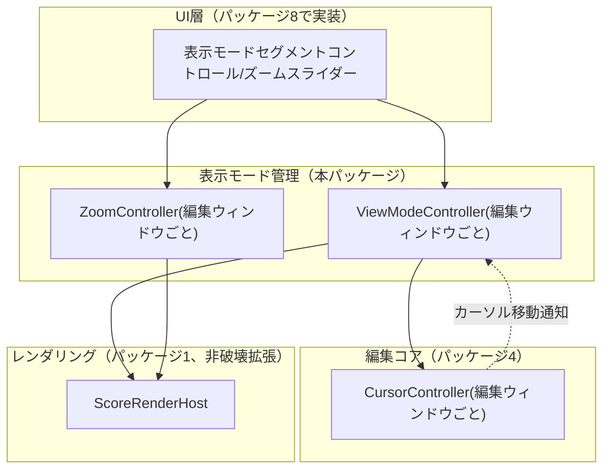
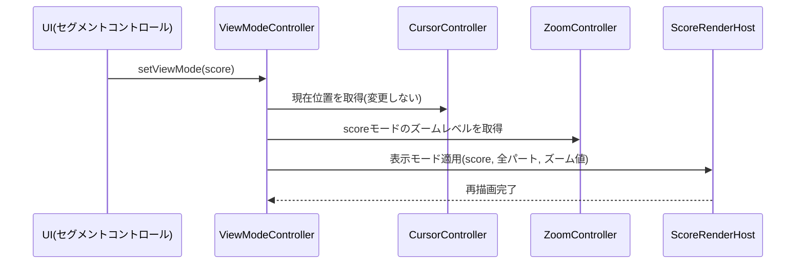
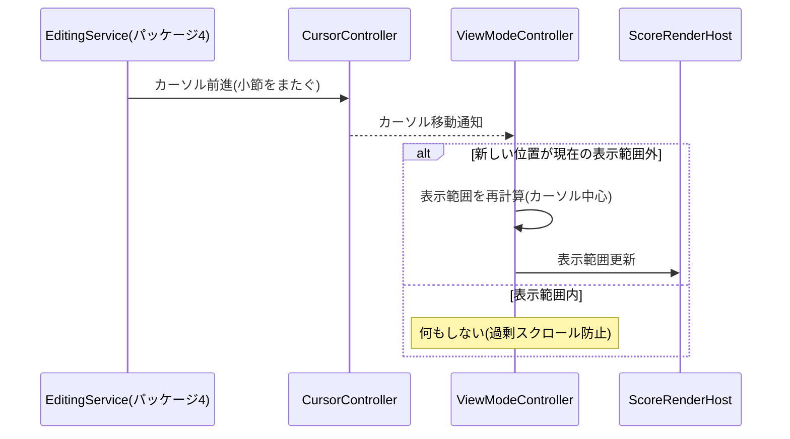
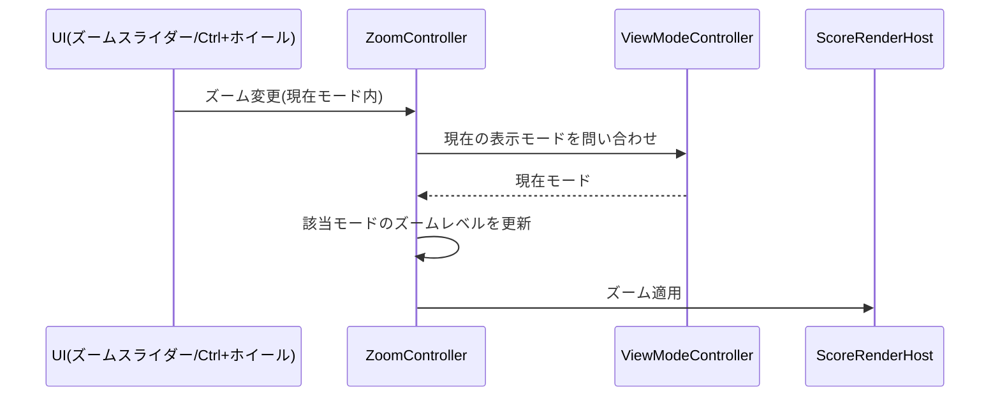

# 表示モード 詳細設計書

- **対応作業パッケージ**：表示モード（実施順序6、[[../basic_design/13_design_decision_points.md#3]]B11）
- **ブランチ**：`feature/view-modes`
- **前提ドキュメント**：[[../tab_app_requirements.md]]4.1節「表示ビュー」（**2026-09-02修正**：本行はかつて存在しない`../basic_design/tab_app_requirements.md`を指していたが、要件定義書は`basic_design/`の外・プロジェクトルート直下にあるため、正しいパスに訂正した。セルフレビューで発見）、[[../basic_design/03_screens_ui_pc.md]]（§5 表示モードセグメントコントロール・ズームUI）、[[../basic_design/09_nonfunctional.md]]（§1・§2 パフォーマンス目標、大曲対応）、[[../basic_design/02_data_model.md]]（§3.2 パート識別色、SONG_SETTINGS.defaultViewMode）、[[web-core-foundation.md]]（`ScoreRenderHost`）、[[editing-core.md]]（`CursorController`／`CommandHistory`の編集ウィンドウ単位スコープ、14節の引き継ぎ事項）、[[part-tuning-management.md]]（パート識別色の確定）

## 1. スコープ

**含む**：フォーカスビュー／全体スクロールビュー／スコア表示の3モード切替管理、ズームレベル管理、フォーカスビューの表示範囲（対象小節レンジ）のカーソル追従、`ScoreRenderHost`への表示モード関連の非破壊拡張、全体スクロールビューの描画方式に関する残課題の確定。

**含まない（他パッケージに委譲）**：
- パート識別色そのものの算出・保持 → パッケージ5（[[part-tuning-management.md#3.4]]で確定済み。本パッケージはスコア表示時にその色を使うだけ）
- 再生中のカーソル自動追従スクロール（[[../basic_design/05_playback_audio.md#5]]） → パッケージ7（再生エンジン統合）。ただし追従先の「表示範囲更新」APIは本パッケージが提供する（6.2節）
- 表示モード切替セグメントコントロール・ズームスライダーのUI実装自体 → パッケージ8（画面群・ナビゲーション）

## 2. 全体構造図

## 3. 新規設計決定

### 3.1 全体スクロールビューの描画方式（A9として新規追加）

[[../basic_design/09_nonfunctional.md#2]]は「全体スクロールビューはサムネイル的な簡易描画（詳細記譜を省略した縮小表示）を検討する」と`⚠要検証`のまま残していた。実機なしに簡易描画の要否・実装コストを確定させることはできないため、以下の暫定方針を確定する。

**暫定方針**：全体スクロールビューは**alphaTabネイティブの描画をそのまま使用し、独自の簡易描画レイヤーは実装しない**。alphaTabのレンダリング自体が画面外領域の描画コストを抑える仕組みを持つ前提（[[../basic_design/09_nonfunctional.md#1]]「alphaTabのCanvas/SVGレンダリングの仮想化」）に乗る。フォーカスビューは元々表示範囲を数小節に絞ることで性能対策済みのため、性能リスクが相対的に高いのは全体スクロールビューとスコア表示（全パート同時）である。

**フォールバック**：Phase 1の実機負荷テスト（2048小節フィクスチャ、[[../basic_design/11_test_strategy.md#8]]）でfps目標（[[../basic_design/09_nonfunctional.md#1]]、30fps以上）を満たさない場合、詳細記譜を省略した縮小表示レイヤーを追加実装する。

これを**A9（新規）**として[[../basic_design/13_design_decision_points.md#2]]に追加する。

### 3.2 ズームレベルの保持単位（新規決定）

ズーム操作（要件4.5「全曲俯瞰〜1音符単位」）を、3つの表示モードで単一の共有値にするか、モードごとに独立させるかは基本設計で規定されていなかった。**モードごとに独立して保持する**方式に確定する（`ZoomController`が`Map<ViewMode, zoomLevel>`相当の状態を編集ウィンドウごとに保持）。理由：フォーカスビュー（1音符単位の精密編集）と全体スクロールビュー（曲全体の確認）は目的が異なり最適なズーム量も大きく異なるため、共有にするとモード切替のたびにズームを再調整する手間が生じる。モード初回表示時の既定ズームは、フォーカス＝1画面に1〜2小節程度、全体スクロール／スコア表示＝1画面に4〜8小節程度が収まる値を初期値とする（具体的な換算はalphaTabのレイアウト設定に依存するため実装時に微調整）。設定ダイアログ項目③「デフォルトズームレベル」（[[../basic_design/03_screens_ui_pc.md#10]]）は、この目安値そのものを1つの数値に統合するものではなく、各モードの目安値に対する倍率調整（既定100%）として扱う（**2026-09-02追記**：セルフレビューで発見された、単一ズーム値という当初の含意との矛盾の是正）。

## 4. モジュール構成

### 4.1 `ViewModeController`

| 責務 | 内容 |
|---|---|
| 状態保持 | 現在の表示モード（`focus`/`scroll`/`score`）を編集ウィンドウごとに1つ保持する（[[editing-core.md#6.2]]の`CommandHistory`と同じく、複数編集ウィンドウ対応のためウィンドウ単位スコープとする） |
| モード切替 | UIからのモード変更要求を受け、`ScoreRenderHost`へ新モードでの再描画を指示する。切替時に`CursorController`の状態（現在位置・入力音価）は変更しない（[[editing-core.md#14]]の引き継ぎ契約） |
| フォーカスビューの表示範囲管理 | フォーカスビュー選択中のみ、`CursorController.currentBarIndex`を中心とした表示範囲（対象小節レンジ）を保持し、カーソル移動が表示範囲外に出た場合のみ範囲を追従させる（過剰な自動スクロールを避けるため、[[../basic_design/05_playback_audio.md#5]]のカーソル追従スクロールと同じ「範囲外に出た時のみ更新」原則を踏襲） |
| 初期値の適用 | 曲を開いた直後は`SONG_SETTINGS.defaultViewMode`（[[../basic_design/02_data_model.md#2]]）を初期モードとして適用する |

### 4.2 `ZoomController`

| 責務 | 内容 |
|---|---|
| 状態保持 | 表示モードごとのズームレベルを編集ウィンドウごとに保持する（3.2節） |
| ズーム変更受付 | ズームスライダー操作・Ctrl+ホイール操作を受け、現在モードのズームレベルを更新して`ScoreRenderHost`へ反映を指示する |
| 表示 | 現在のズーム％をステータスバー（[[../basic_design/03_screens_ui_pc.md#5]]）へ通知する |

### 4.3 `ScoreRenderHost`の非破壊拡張（パッケージ1由来）

[[web-core-foundation.md]]で定義済みの`ScoreRenderHost`（既存メソッドのシグネチャ変更なし）へ以下を追加する。

| 追加メソッド（責務レベル） | 内容 |
|---|---|
| 表示モード適用 | 指定された表示モード（フォーカス／全体スクロール／スコア表示）に応じたレンダリング構成（対象トラック数、表示範囲）を適用する。フォーカス＝現在パート1つのみを対象小節レンジで描画、全体スクロール＝現在パート1つを曲全体スクロール可能に描画、スコア表示＝全パートを縦並びでパート識別色付きで描画する |
| ズーム適用 | 指定されたズームレベルでの再描画を行う |
| トラック識別属性の付与 | スコア表示モードでの描画時、各パートに対応するSVG要素へ`data-track-index`属性を付与し、[[../basic_design/02_data_model.md#3.2]]のパート識別色オーバーレイがCSSセレクタ（`[data-track-index="n"]`）で対象要素を特定できるようにする（**2026-09-02追記**：[[../basic_design/02_data_model.md#3.2]]が編集コアパッケージへ委譲していたが実際には[[editing-core.md]]に該当内容が存在しなかった「対象要素の特定方法」を、本パッケージのScoreRenderHost拡張として確定。セルフレビューで発見） |

具体的なalphaTabのレイアウト設定API（ページ／水平連続レイアウトの切替パラメータ等）は、実装時にalphaTab公式ドキュメントで確認のうえ確定する実装詳細と位置づける（[[../basic_design/04_editing_core.md#7]]のコード検出アルゴリズムと同様の考え方で、基本設計・詳細設計では意図的にここまで踏み込まない）。

## 5. シーケンス図

### 5.1 表示モード切替（フォーカス→スコア表示、カーソル位置保持）

### 5.2 フォーカスビューでの表示範囲追従

### 5.3 ズーム操作（モードごとの独立保持）

## 6. ビルド・テストに関する補足

- フォーカスビューの表示範囲追従ロジック（カーソルが範囲外に出た場合のみ更新）は複合条件を含むため、[[../basic_design/11_test_strategy.md#2]]の方針によりC2（条件網羅）まで単体テスト対象に追加する。
- 3.1節（A9）のfps実測は[[../basic_design/11_test_strategy.md#8]]の負荷テスト計画（2048小節フィクスチャ）で実施する。本パッケージの単体テストでは`ScoreRenderHost`の該当メソッドをモック化し、モード・ズーム値が正しく渡されるかのみを検証する。
- 複数編集ウィンドウを同時に開いた状態で、各ウィンドウの表示モード・ズームレベルが独立して保持されることを結合テストで確認する（[[editing-core.md#6.2]]と同じスコープ設計のため、同種のテストパターンを再利用できる）。

## 7. 新たに確定した設計決定（本書のまとめ）

- **全体スクロールビューの描画方式**（3.1節）：alphaTabネイティブ描画をそのまま採用し、簡易描画レイヤーは実装しない方針に暫定確定。性能不足時のフォールバックを明記。新規**A9**として検証待ち事項に追加。
- **ズームレベルの保持単位**（3.2節）：表示モードごとに独立保持する方式に確定。
- **`ScoreRenderHost`のトラック識別属性付与**（4.3節）：パート色分けの対象要素特定方法を確定（2026-09-02追記）。

## 8. Definition of Done

- 本書で定義した`ViewModeController`・`ZoomController`、および`ScoreRenderHost`の非破壊拡張が実装され、[[../basic_design/11_test_strategy.md#2]]のカバレッジ基準を満たす単体テストが揃っている。
- フォーカス／全体スクロール／スコア表示の3モードを行き来しても、カーソル位置・入力音価が保持されることが結合テストで確認できる。
- 複数編集ウィンドウでの表示モード・ズームの独立性が結合テストで確認できる。
- 3.1節のA9が[[../basic_design/13_design_decision_points.md]]へ反映されている。

## 9. 引き継ぎ事項（次パッケージへ）

- **パッケージ7（再生エンジン統合）**：再生中のカーソル自動追従スクロール（[[../basic_design/05_playback_audio.md#5]]）は、本パッケージが提供する`ViewModeController`の表示範囲更新APIをそのまま呼び出せばよい（フォーカスビューの表示範囲追従ロジックと同じ「範囲外に出た時のみ更新」の原則を共有する）。
- **パッケージ8（画面群・ナビゲーション）**：表示モードセグメントコントロール・ズームスライダーのUI実装時は、本書の`ViewModeController`/`ZoomController`をそのまま呼び出す想定。UIからScoreモデルや`ScoreRenderHost`を直接操作しないこと（[[../basic_design/01_architecture.md]] AD-2）。
- **Phase 1実機検証**：A9（3.1節）のfps実測を、[[../basic_design/13_design_decision_points.md#2]]のA6・A8とあわせて同じ負荷テスト工程でまとめて実施できる。
