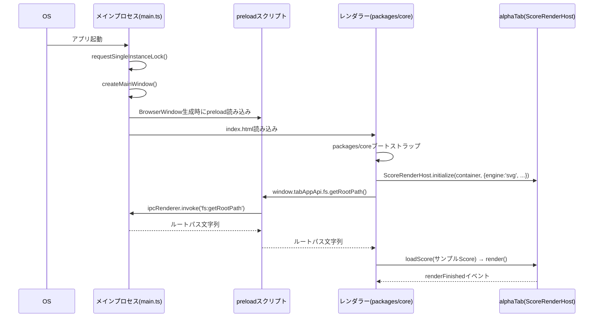

# 詳細設計書：Webコア基盤構築

- **対応作業パッケージ**：要件定義書9章「Webコア基盤構築」（相対サイズM）、実施順序1（[[../basic_design/13_design_decision_points.md#3]]B11）
- **ブランチ名**：`feature/web-core-foundation`
- **前提とする基本設計書**：[[../basic_design/01_architecture.md]]、[[../basic_design/09_nonfunctional.md]]、[[../basic_design/15_development_process.md]]。永続化の本格実装（自動保存・スキーマバージョニング等）は次パッケージ「データモデル・永続化」の範囲であり、本書ではその土台となる低レベルfs I/Oのみを扱う。
- **本書の位置づけ**：[[../basic_design/15_development_process.md#1.2]]に基づく詳細設計書。基本設計（責務・契約レベル）を受けて、クラス構成・主要メソッドシグネチャ・起動シーケンスを実装着手前に確定する。

---

## 1. 目的・スコープ

このパッケージは以降の全作業パッケージが乗る土台であり、次の4点を確立する。

1. pnpmモノレポの実体化（[[../basic_design/01_architecture.md#3]]AD-5の具体化）
2. alphaTabライブラリの統合（レンダリングのみ。編集APIは持たないためコマンド層からの利用方法を含めて基盤を用意する程度に留め、実際の編集操作は「タブ譜編集コア」パッケージで実装する）
3. Electron雛形（main/preload/renderer3プロセス構成、セキュリティ既定値、起動シーケンス）
4. ファイルシステムへの低レベル読み書き（`FileSystemAdapter`の最小実装：フォルダ配下の読み込み・書き込み・一覧取得のみ。自動保存・アトミック書き込みの完全な作法・複数バックエンド切替UIは次パッケージ以降）

**スコープ外**（他パッケージが担当）：Song/Part/Bar等の構造化データモデル（→データモデル・永続化）、コマンド層・Undo/Redo（→タブ譜編集コア）、実際の譜面編集操作（→タブ譜編集コア）、再生（→再生エンジン統合）、画面群のUI実装（→画面群・ナビゲーション。本パッケージでは空の1画面のみ用意する）。

## 2. モノレポ構成（AD-5の具体化）

```
tab-app/
├─ pnpm-workspace.yaml
├─ .nvmrc
├─ tsconfig.base.json
├─ .eslintrc.cjs
├─ packages/
│  ├─ core/
│  │  ├─ package.json
│  │  ├─ src/
│  │  │  ├─ ui/            （空、画面群パッケージで実装）
│  │  │  ├─ editing/        （空、タブ譜編集コアパッケージで実装）
│  │  │  ├─ playback/        （空、再生エンジン統合パッケージで実装）
│  │  │  ├─ domain/          （空、データモデル・永続化パッケージで実装）
│  │  │  ├─ export/          （空、Phase 2で実装）
│  │  │  ├─ errors/          （空、エラー/ログ基盤パッケージで実装）
│  │  │  ├─ rendering/       ★本パッケージで実装：alphaTab統合ラッパー
│  │  │  └─ platform/        ★本パッケージで実装：PlatformAdapter I/F定義＋FileSystemAdapterの最小実装契約
│  │  └─ tsconfig.json
│  └─ shared-types/
│     └─ src/index.ts        ★本パッケージで実装：IPC契約の型、PlatformAdapter系の型
├─ apps/
│  ├─ desktop/
│  │  ├─ src/main/           ★本パッケージで実装：Electronメインプロセス
│  │  ├─ src/preload/        ★本パッケージで実装：contextBridge
│  │  └─ src/renderer/       ★本パッケージで実装：packages/coreをホストする最小シェル画面
│  └─ mobile/                （空、Phase 3）
└─ tools/                    （空、次パッケージ以降で開発用サンプルデータ生成スクリプトを追加）
```

`packages/core`から`electron`・`expo-*`への直接import を禁止するESLintルール（8節）は本パッケージで導入し、以降全パッケージに適用され続ける。

## 3. パッケージ／モジュール構成とクラス責務

### 3.1 `packages/core/src/rendering`（新設）

alphaTabの初期化・レンダリング呼び出しを1箇所に集約し、他モジュール（将来の編集サービス・再生サービス）がalphaTabの生API（`AlphaTabApi`）に直接依存しないようにするファサード。[[../basic_design/13_design_decision_points.md#2]]A1・A2の調査結果（自前再描画方式・SVGエンジン採用）を反映する。

| クラス/モジュール | 責務 | 主要メソッド | 備考 |
|---|---|---|---|
| `ScoreRenderHost` | alphaTabの`AlphaTabApi`インスタンスを1つ保持し、初期化・破棄・再描画要求の唯一の窓口になる | `initialize(container: HTMLElement, options: RenderHostOptions): void`／`loadScore(score: unknown): void`／`render(trackIndices?: number[]): void`／`dispose(): void` | `render()`が[[../basic_design/13_design_decision_points.md#2]]A1で確認した`AlphaTabApi.renderScore()`相当を内部で呼ぶ。編集コマンド層（次々パッケージ）は本クラス経由でのみ再描画を要求する |
| `RenderHostOptions`（型） | 初期化オプション | フィールド：`engine: 'svg'`（固定。A2の結果によりSVG採用を確定）、`fontAssetsBasePath: string`、`soundFontAssetsBasePath: string`（本パッケージでは未使用、再生パッケージ向けに先行定義） | 値はコード上の定数ではなく本クラスの引数として渡す（環境差異吸収のため） |
| `RenderHostEvents`（型） | `ScoreRenderHost`が発火するイベント名の列挙 | `'renderStarted' \| 'renderFinished' \| 'renderError'` | UI層（画面群パッケージ）がローディング表示等に利用する契約のみ本パッケージで確定し、実消費は画面群パッケージで行う |

**例外・エラー時の挙動**：`initialize()`はコンテナ要素が未マウントの場合に例外を投げる。`loadScore()`は不正なScoreオブジェクト（alphaTabのパースが失敗するもの）を渡された場合、内部で捕捉し`renderError`イベントとして通知する（例外を外部に投げない。エラー基盤パッケージの`NotificationCenter`が未実装のため、本パッケージでは`console.error`相当の暫定ログ出力＋イベント発火に留め、エラー基盤パッケージ完了後に`NotificationCenter`への連携に置き換える）。

### 3.2 `packages/core/src/platform`（新設）

[[../basic_design/01_architecture.md#3]]AD-3のPlatformAdapter群のうち、本パッケージでは`FileSystemAdapter`の最小契約のみを確定する。他3種（AudioSession/Window/UpdateCheck）のインターフェース定義は該当パッケージ（再生エンジン統合／画面群・ナビゲーション／将来Phase）で追加する。

| インターフェース | 責務 | 主要メソッド | 例外・エラー時の挙動 |
|---|---|---|---|
| `FileSystemAdapter`（最小版） | 設定されたストレージルート配下でのバイナリ/テキストファイルの読み書きとディレクトリ一覧取得のみを提供する。Song単位のアトミック書き込み（一時ファイル→リネーム）・自動保存デバウンス・ゴミ箱操作は次パッケージで本インターフェースを拡張する | `readFile(relativePath: string): Promise<Uint8Array>`／`writeFile(relativePath: string, data: Uint8Array): Promise<void>`／`listDirectory(relativePath: string): Promise<DirEntry[]>`／`ensureDirectory(relativePath: string): Promise<void>`／`getRootPath(): string` | 存在しないパスの`readFile`は`FileNotFoundError`（本パッケージで定義する軽量エラークラス）を投げる。書き込み失敗（権限等）は`FileWriteError`を投げ、呼び出し元（次パッケージのアトミック書き込みロジック）がリトライ判断を行う。本パッケージ自体はリトライしない |
| `DirEntry`（型） | ディレクトリ一覧の1要素 | フィールド：`name: string`、`isDirectory: boolean`、`sizeBytes: number`、`modifiedAt: string`（ISO8601） | - |

**保存先ルートの扱い**：本パッケージ時点ではローカルフォルダ固定（例：OSのユーザーデータフォルダ配下）とし、iCloud Drive/Google Driveの選択・切替UIと設定永続化は「データモデル・永続化」パッケージで実装する（[[../basic_design/06_file_io_persistence.md]]）。`getRootPath()`が返す値を設定から差し替え可能にする拡張点だけを本パッケージで確保する。

### 3.3 `apps/desktop/src/main`（Electronメインプロセス）

| モジュール | 責務 | 主要関数/メソッド |
|---|---|---|
| `main.ts`（エントリポイント） | Electronアプリのライフサイクル管理、`BrowserWindow`生成、単一インスタンスロックの取得 | `app.whenReady().then(createMainWindow)`／`app.requestSingleInstanceLock()`（複数曲・複数ウィンドウの本格対応は画面群パッケージ。本パッケージでは「同一プロセスの二重起動を防止する」until範囲に限定） |
| `createMainWindow(): BrowserWindow` | `contextIsolation: true`／`nodeIntegration: false`でメインウィンドウを生成し、preloadスクリプトを指定する | 引数なし、`BrowserWindow`を返す |
| `ElectronFileSystemAdapter`（`FileSystemAdapter`実装） | Node.js `fs/promises`を用いて3.2節のインターフェースを実装する | 各メソッドは`fs.readFile`/`fs.writeFile`/`fs.readdir`/`fs.mkdir`をラップし、Node固有のエラー（`ENOENT`等）を3.2節のエラークラスに変換する |
| IPCハンドラ登録 | `ipcMain.handle('fs:readFile', ...)`等、4節のIPC契約に対応するハンドラを`ElectronFileSystemAdapter`へ委譲する | チャンネル名は4.1節の契約表に従う |

### 3.4 `apps/desktop/src/preload`

| モジュール | 責務 |
|---|---|
| `preload.ts` | `contextBridge.exposeInMainWorld('tabAppApi', {...})`で、4.1節のIPC契約に対応する型安全なラッパー関数のみをレンダラーに公開する。Node.js APIやElectronモジュールそのものは一切公開しない |

### 3.5 `apps/desktop/src/renderer`

本パッケージでは画面群パッケージの前段として、`packages/core`をマウントするだけの最小シェルを用意する（曲一覧・編集画面等の実UIは画面群パッケージで実装）。具体的には、単一のコンテナ要素に対して3.1節の`ScoreRenderHost`を初期化し、alphaTab同梱のサンプルデータ（またはalphaTexの簡単な文字列）を1つ描画できることを確認できる状態までを完了条件とする（8節DoD参照）。

## 4. IPC契約（`shared-types`で型定義）

### 4.1 チャンネルと対応関係

| チャンネル名 | 方向 | 対応するAdapterメソッド | ペイロード概要 |
|---|---|---|---|
| `fs:readFile` | renderer→main（invoke） | `FileSystemAdapter.readFile` | `{ relativePath: string }` → `Uint8Array` |
| `fs:writeFile` | renderer→main（invoke） | `FileSystemAdapter.writeFile` | `{ relativePath: string, data: Uint8Array }` → `void` |
| `fs:listDirectory` | renderer→main（invoke） | `FileSystemAdapter.listDirectory` | `{ relativePath: string }` → `DirEntry[]` |
| `fs:ensureDirectory` | renderer→main（invoke） | `FileSystemAdapter.ensureDirectory` | `{ relativePath: string }` → `void` |
| `fs:getRootPath` | renderer→main（invoke） | `FileSystemAdapter.getRootPath` | なし → `string` |

すべて`ipcRenderer.invoke`/`ipcMain.handle`（Promiseベース）で統一し、`send`/`on`の一方向イベント形式は本パッケージでは使用しない（エラー基盤パッケージで導入予定のクラッシュ通知等、双方向イベントが必要になった時点で追加する）。

### 4.2 型定義の置き場所

`packages/shared-types/src/index.ts`に、上記チャンネルのリクエスト/レスポンス型と`DirEntry`型を定義し、`apps/desktop`（main/preload/renderer）・`packages/core`の三者から共有する。`packages/core`は`shared-types`にのみ依存してよく、`electron`パッケージ自体には依存しない（レイヤー依存規則の遵守）。

## 5. 起動シーケンス



## 6. ビルド・Lint・型チェック設定

| 項目 | 方針 |
|---|---|
| TypeScript | `tsconfig.base.json`で`strict: true`を全パッケージ共通設定とする（[[../basic_design/01_architecture.md#3]]AD-4）。`packages/core`は`any`使用をESLintで禁止（`@typescript-eslint/no-explicit-any: error`） |
| ESLintレイヤー依存規則 | `import/no-restricted-paths`で`packages/core/**`から`electron`・`expo-*`・`apps/desktop/**`・`apps/mobile/**`への importをエラーにする。本パッケージで設定ファイルを作成し、以降のパッケージはこれに従うだけでよい |
| ビルドツール | Vite（`apps/desktop`のrenderer向け）＋`tsc`（`packages/*`のライブラリビルド）。Electronのmain/preloadは`vite-plugin-electron`または`tsup`でのビルドを採用し、開発時のホットリロードを確保する |
| Node.jsバージョン固定 | `.nvmrc`にLTSバージョンを明記（本パッケージ着手時点の最新LTS） |
| alphaTabアセット配置 | alphaTab本体が要求するBravura等のフォントアセット・（本パッケージでは音声は扱わないためSoundFontは配置のみ行い読み込みはしない）を`apps/desktop`のビルド成果物に同梱し、`file://`または`app://`スキームでの読み込みに対応させる（要件5.1「外部CDN禁止」）。具体的な配置パスは`RenderHostOptions.fontAssetsBasePath`に渡す値として本パッケージ実装時に確定する |

## 7. このパッケージで解決する設計分岐点

- [[../basic_design/13_design_decision_points.md#2]]A1・A2は基本設計フェーズ末（2026-09-01）の文書調査で解消済み（自前再描画方式・SVGエンジン採用）。本パッケージはその結果を`ScoreRenderHost`として具体化する。
- **新規の実装レベル分岐点**：alphaTabのアセット（フォント・将来のSoundFont）をElectronでどう配置するかは基本設計で未言及だったため、本パッケージで「ビルド成果物に同梱し、レンダラーから相対パスで参照する」方式に確定する（6節）。将来のExpo版（Phase 3）でも同様にアプリバンドルへの同梱で対応できる見込みで、疎結合方針と矛盾しない。

## 8. 完了基準（Definition of Done、[[../basic_design/15_development_process.md#7]]対応）

| # | 基準 | 本パッケージでの具体的な確認内容 |
|---|---|---|
| 1 | 基本設計の記載内容を満たしている | [[../basic_design/01_architecture.md]]のレイヤー構成・AD-1〜AD-5、[[../basic_design/09_nonfunctional.md#1]]の起動シーケンス方針との整合を確認 |
| 2 | 本詳細設計書が実装と整合している | 3〜6節のクラス構成・IPC契約が実装と一致していること |
| 3 | 単体テスト・結合テスト | `ElectronFileSystemAdapter`のエラー変換ロジック（C0/C1）、`ScoreRenderHost`のオプション検証ロジック（C0/C1）を単体テスト。IPC経由の`fs:*`往復を結合テストで確認 |
| 4 | セルフレビュー | **2026-09-03修正**：[[../basic_design/15_development_process.md#6]]は2026-09-02にセルフレビュー対象を「L/XLサイズのみ」から「サイズ問わず全件」へ改訂済みであり、本行の「Mサイズのため対象外」という記載は旧方針のまま取り残されていた（[[../review/design_review_2026-09-03.md]]A-2）。新方針のもとで対象パッケージとして扱い、レイヤー依存規則の逸脱がないかはESLint実行で機械的に確認する |
| 5 | 手動シナリオ確認 | アプリを起動し、レンダラー内にalphaTabのサンプル譜面（またはalphaTexの簡単な文字列）がSVGで描画されることを目視確認する |
| 6 | `main`へマージ済みで起動可能 | Electronアプリが`npm run dev`相当のコマンドで起動し、上記5を満たす状態 |

## 9. 次パッケージへの申し送り

- 「データモデル・永続化」パッケージは、本パッケージの`FileSystemAdapter`最小契約（3.2節）を拡張し、アトミック書き込み（一時ファイル→リネーム）・自動保存デバウンス・保存先バックエンド切替（ローカル/iCloud Drive/Google Drive）・ゴミ箱操作を追加する。既存メソッドのシグネチャ変更は避け、追加メソッドで対応することを原則とする。
- 「エラー・警告基盤」パッケージ完了後、3.1節`ScoreRenderHost`の暫定エラーログ出力を`NotificationCenter`経由に置き換える（本書3.1節に記載の通り）。
- alphaTabの編集時の「安全な変更操作の切り分け」（[[../basic_design/13_design_decision_points.md#2]]A1の残課題）は、本パッケージでは扱わず「タブ譜編集コア」パッケージの詳細設計に持ち越す。
