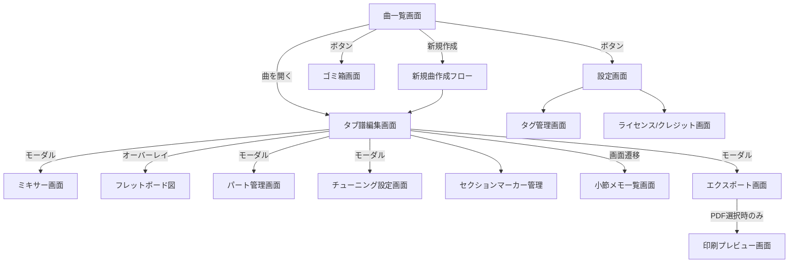

# RiFF-LiNE — 耳コピ用タブ譜作成アプリ 要件定義書

- **作成日**：2026-08-27（初版）／同日 改訂
- **ステータス**：ドラフト（未決事項あり、継続ヒアリング中。2026-08-30 基本設計フェーズのヒアリングにより一部変更・確定。10章参照）
- **開発者/利用者**：本人（個人利用アプリ）／開発にはClaude Codeを活用予定

---

## 1. 背景・目的

ギターの耳コピ・目コピ作業を効率化するため、タブ譜を作成・再生できるアプリを個人開発する。既存の据置き耳コピツールとは異なり、Apple Musicなど他の音楽アプリで参照音源を流しながら、同時にアプリ上でタブ譜を作成・確認できることを重視する。当初はiPhoneアプリ単体として構想したが、将来のマルチデバイス対応を見据え、PC版を先行開発してからiPhone版を追加するマルチプラットフォーム構成で進める（3章・6章参照）。

## 2. 想定利用シーン

- （PC版）ブラウザや別アプリで原曲を再生しながら、聞き取った音をその場でタブ譜に起こしていく。PCはOS標準で複数アプリの音声が同時に鳴らせるため、背景音楽との共存は特別な対応なしに実現される
- （iPhone版）Apple Music等で原曲を再生しながら、聞き取った音をその場でタブ譜に起こしていく
- 作成したタブ譜を、リアルな楽器音で複数パート合奏再生し、耳コピの答え合わせをする
- 曲の一部（フレーズ単位）をループ再生しながら、その場で修正を加えつつ細部（チョーキングの幅、パームミュートの範囲等）を追い込む

## 3. スコープ

**方針転換（重要）**：当初iPhoneアプリ単体として計画していたが、「将来のマルチデバイス対応」を前提としたマルチプラットフォーム構成に変更。プラットフォーム非依存な「Webコア」を先に構築し、PC版（Electron）を先行開発、Webコアが磨かれた段階でiPhone版（Expo＋WebView）を追加する2段階展開とする（詳細は6章・9章）。**PC版は開発順序として先行するだけであり、iPhone版のための使い捨ての踏み台ではない**。作った後も実際に使い続ける本格プロダクトとして、フル機能で作り込む（3.1節参照）。

### 3.1 スコープ内（In Scope・MVP＝PC版）
- タブ譜のステップ入力編集（音程・リズム・奏法記号・タイ/スラー区別）
- 複数パート（トラック、エレキギター/ベース）の合奏再生・パート別ソロ再生・区間ループ再生（ループ中の編集含む）
- 弦本数・チューニング（カスタムプリセット保存含む）・カポの自由設定
- undo/redo（セッション内。メモリ予算に配慮した実務上十分な深さを確保する設計に変更、**2026-08-30時点は「セッション内無制限」としていたが2026-09-03に変更、詳細は10章参照**）、範囲選択でのコピー＆ペースト（別パートへの貼り付け含む）
- 自動保存
- メトロノーム・カウントイン・タップテンポ
- PDF / alphaTex / MIDI形式での書き出し
- 完全オフライン動作
- 保存先はローカル／iCloud Drive／Google Driveから設定で選択可能（Windows版の各同期クライアント経由、追加コストなしでマルチデバイス同期の土台とする。**2026-08-30変更：当初は「iCloud Driveへの直接読み書き」に固定としていたが、基本設計フェーズのヒアリングにより複数バックエンドから選択・併用できる方針に変更。詳細は10章**）

### 3.2 iPhone版で追加対応（Webコアは共通、ラッパー層のみ追加）
- バックグラウンド音楽アプリとの同時再生（音声mix、AVAudioSession設定はiPhone版ラッパー固有の実装）

### 3.3 バージョンアップ対応（v2以降）
- ドラム/パーカッションパート対応（ドラム譜表記）
- アコースティックギター等、エレキ/ベース以外の音色

### 3.4 将来対応（Phase候補）
- 既存Guitar Pro / MusicXMLファイルの読み込み
- 外部音源ファイルの取込・再生速度変更・区間リピート（参照音源そのものの加工機能）
- 外部DAWとのリアルタイムMIDI連携（曲の再生に合わせてMIDIノート情報を外部出力し、DAW側のトラック・音源を鳴らす。アプリ自体をVSTプラグイン化するのではなく、MIDI出力による疎結合な連携を想定。詳細は基本設計書`10_extensibility_future.md`10節参照。**2026-08-31追加**）

### 3.5 完全にスコープ外
- **ピッチ検出による自動採譜（音を聞かせたら自動でタブ化する機能）**：0次要件に含まれないため明示的に除外。将来欲しくなった場合は別途要件定義が必要

## 4. 機能要件

### 4.1 タブ譜編集

| 項目 | 内容 |
|---|---|
| 入力方式 | ステップ入力（音価パレットで長さ選択→カーソル位置に配置→自動で右へ進む） |
| フレット入力 | 常用域(0〜12程度)はクイック選択バー、それ以上・厳密入力は同UIから展開するテンキーのハイブリッド |
| 和音入力 | 同一カーソル位置で複数弦をタップして重ね入力 |
| 重複配置チェック | 同一弦・同一タイミングへの複数音配置はバリデーションで自動防止／エラー表示 |
| 記譜スタイル | 正式なリズム記譜（付点・タイを含む） |
| 音価 | 32分音符・3連符等の連符にも対応 |
| 休符 | 音を置かない＝暗黙的な休符を基本としつつ、必要に応じ明示的な休符編集も可能なハイブリッド |
| タイ／スラー | 別々の記号として区別して入力 |
| 奏法記号 | チョーキング／スライド／ハンマリング・プリング／パームミュート／ビブラート／ハーモニクス（自然・人工・ピンチ）／タッピング・スラップ・ポップ を含めフル対応（MVPから） |
| アーティキュレーション記号 | アクセント・スタッカート等の基本記号にも対応 |
| 奏法記号の確定方式 | 自動候補表示＋長押しでの手動補正のハイブリッド |
| コードネーム表示 | 和音の上に"Am7"等のコード名を表示。配置した音からの自動検出提案＋手動修正のハイブリッド。コードダイアグラム（指板図）は不要、テキスト表示のみ |
| リピート記号／セクションマーカー | 繰り返し記号、イントロ/Aメロ/サビ等のセクション分けに対応。曲構造の管理に使用 |
| セクションループ再生 | セクションマーカーと連動し、「サビだけ」等を指定したループ再生に対応（4.3の区間ループの拡張） |
| 小節メモ／注釈 | 特定の小節にテキストメモを残せる（例：「ここ怪しい、要確認」等、耳コピ中の気づきを記録） |
| カポ表示規則 | 譜面は運指（as played）表示を基本とし、実音への変換は再生時のみ反映する |
| 拍子・テンポ | 曲の途中での変更に対応 |
| テンポ入力 | 数値直接入力＋タップテンポのハイブリッド |
| 小節操作 | 小節の挿入・削除に対応（曲構成を後から変更可能） |
| 曲の規模 | フル尺（100小節超）に対応 |
| 表示ビュー | 「数小節フォーカスビュー（編集向け）」「全体スクロールビュー（確認向け）」を切替可能。編集時は1パートずつ表示、確認・合奏再生時は全パートを縦に並べた「スコア表示」モードも用意 |
| 記譜形式 | タブ譜のみを表示（五線譜との併記は行わない） |
| 編集操作 | undo/redoはセッション中保持（メモリ予算に配慮した実務上十分な深さを確保する設計。**2026-09-03変更、旧: セッション中無制限、10章参照**）、範囲選択でのコピー＆ペースト（別パートへの貼り付け含む）必須 |
| カポ | カポ位置を指定し、表示・再生ピッチに反映 |
| チューニングプリセット | よく使うチューニングをカスタムプリセットとして保存・呼び出し可能。定番プリセット（レギュラー／ドロップD／半音下げ等）を標準搭載し、ユーザー独自のプリセット追加にも対応 |
| エクスポートファイル名 | 自動生成（曲名＋日付等）した値をプレースホルダーとして表示し、編集可能にする |
| メトロノーム／カウントイン | 入力時のクリック音、再生開始前のカウントイン、両方必要。**具体的な音色・拍数は2026-08-30基本設計フェーズで確定（10章参照）** |
| 保存方式 | 自動保存（編集したら即座に保存） |

### 4.2 パート（トラック）管理

- 1曲内で複数パート（ギター、ベース等）を保持し、**合奏として同時再生**する
- 想定最大3〜4パート（バンド編成）。**注記**：5.3節の上限「8パート程度」は典型的な利用シーンを超えた場合に備えたシステム上のキャパシティ上限であり、想定利用シーン自体は引き続き3〜4パート程度である（両者は矛盾ではなく別の観点の数値、レビュー所見B-3への回答）
- 曲の途中でもパートの追加／削除／並べ替え／音色変更を自由に行える
- チューニングはパートごとに個別設定：弦ごとの自由な音高指定＋弦本数も可変（6弦／7弦／ベース4・5弦等）
- 音色：MVPは**エレキギター・ベースの2種類**。アコースティックギター等その他の音色はバージョンアップ対応
- パートごとの音量・パン（左右定位）調整が必要（ソロ／ミュートとは別に細かいバランス調整）
- ドラム／パーカッションパートは**v2以降で対応**。v1の時点からパート種別を抽象化して設計し、将来ドラム表記を追加してもデータモデルの作り直しが不要な拡張性を持たせる

### 4.3 再生機能

- 全パート合奏再生（サンプル音源によるリアルな楽器音）
- 区間ループ再生（**ループ再生中に同時にノート追加・修正できる**必要あり）
- パート別ソロ再生（特定パートのみを鳴らす）
- 減速再生（テンポを落として確認用に再生）
- 再生中カーソルの自動追従スクロール
- バックグラウンド音楽アプリ（Apple Music等）と音声を混在させて同時再生（**iPhone版のみ**の対応事項。PC版はOS標準で複数アプリの音声が同時に鳴らせるため対応不要、3.2節参照）
- **専用ミキサー画面**：全パートの音量／パン／ソロ／ミュートを一覧で操作できる画面を用意

### 4.4 ファイル管理・入出力

- ローカル保存（自動保存、新規作成・一覧・削除等の基本管理）
- 書き出し形式：PDF／alphaTex形式（内部データそのまま）／MIDI
- 読み込み：現時点では自作データのみ。Guitar Pro／MusicXML読み込みは将来対応（Phase 3候補）

### 4.5 UI／操作要件【iPhone版仕様】

> **重要な注記**：本節（4.5）と次節（4.6 画面構成・ナビゲーション）は、当初iPhoneアプリ単体として要件定義を進めていた時期に、タッチ操作を前提として詳細化したものです。後に「PC版を先行開発する」方針へ転換しましたが（3章参照）、本節の内容はタッチ操作前提（親指操作を意識した下部ツールバー、スワイプダウンでのモーダル操作、ボトムシート、ピンチズーム等）のままのため、**PC版（Phase 1のMVP）にはそのまま適用できません**。本節はiPhone版（Phase 3）着手時の仕様として引き続き有効ですが、**PC版のマウス／キーボードUIは別途、本節とは独立して仕様化する必要があります**（7章の未決事項に追加）。**→ 2026-08-30の基本設計フェーズで解決済み（基本設計書`03_screens_ui_pc.md`）。10章参照**

| 項目 | 内容 |
|---|---|
| 画面の向き | 両対応（縦横回転で切替） |
| ズーム範囲 | 全曲俯瞰〜1音符単位の超拡大まで対応（具体的な閾値はPhase 0〜1で技術的に微調整） |
| ノート移動・削除 | 複数手段に対応（ドラッグで移動、タップ/長押しで削除、専用の消しゴムモードも用意）、UI上に明示的なボタン/ヒントとして提示 |
| 範囲選択（コピペ用） | 「選択モード」トグル方式。開始位置→終了位置をタップして範囲をハイライト→コンテキストツールバーで コピー/切り取り/削除→貼り付け先（別パートも可）にカーソル移動して貼り付け |
| Undo/Redo操作 | 画面上の明示的ボタンのみ（内部はコマンド層として独立実装し、将来ジェスチャー対応を追加しやすくしておく） |
| パート切替UI | ドロップダウン／リストから選択 |
| 曲一覧画面 | 並べ替え（作成日／更新日／曲名等）、サムネイル表示（冒頭数小節プレビュー）に対応。検索・タグ絞り込みUIは今後対応（タグ付け自体のデータ構造は先行して用意） |
| 共有機能 | エクスポート済みファイル（PDF等）を他者と共有可能に（PC版：エクスプローラー/メール添付等のOS標準手段、iPhone版：AirDrop/メール添付等のiOS標準共有シート）。**前提**：耳コピしたタブ譜は他者の楽曲の転写であるため、著作権上の配慮として、共有は少数の知人へのシェア程度の私的な範囲に留めることを前提とする（不特定多数への公開・再配布を想定した機能は設けない） |
| 曲の複製機能 | 不要と回答。ファイルコピーのみで実現できるため設計上の制約はなく、後から追加容易 |
| 新規曲作成フロー | 最初に全パート構成（パート数・楽器・チューニング）を決めてから編集開始 |
| ダークモード | 不要（ライトモードのみ）。ただし配色はテーマトークン化して実装し、将来追加を容易にしておく |
| アプリロック | 不要（パスコード/Face ID等）。ただし認証層を分離しておき、将来追加を容易にしておく |
| 通知機能 | 不要（練習リマインダー等） |
| タグ付け・カテゴリ分け | 必要（アーティスト別等で整理したい）。1曲に複数タグ付与可能。データ構造は用意し、検索・絞り込みUIは今後対応 |
| パート数上限 | 明確な上限を設ける（8パート程度を想定） |
| Undo/Redo対象範囲 | 全パートを横断する一つの操作履歴として扱う |
| 印刷 | アプリ内に専用のプレビュー・印刷画面を用意（iOS標準共有シートに任せない）。実際の印刷実行はOS標準のプリントダイアログ（プリンタ選択等）を呼び出す |
| PDF出力レイアウト | 用紙サイズはA4のみ。ヘッダー・フッターに曲名・ページ番号等を表示する（段組みの考え方は下記の共通原則に従う） |
| フレットボード図 | ネック上の押弦位置を視覚的に表示する機能を用意 |
| 保存先 | ~~アプリ専用領域（iCloud経由の同期領域含む）に固定。ユーザーによる任意フォルダ選択（PC版：エクスプローラー、iPhone版：Files app）は不要~~ → **【2026-08-30 基本設計フェーズで変更】** ローカル／iCloud Drive／Google Driveから設定画面で選択・変更可能とし、複数ミラー先の併用にも対応する（詳細は基本設計書`06_file_io_persistence.md`、本書10章参照） |
| ミキサー画面の操作項目 | 音量／パン／ソロ／ミュートのみで十分（EQ・リバーブ等のエフェクトは不要） |
| エラー・警告メッセージ | 重要度別に4段階で表示方式を分ける：**Info**＝自動消滅する軽量トースト、**Warning**＝やや目立つトースト＋アイコン(操作継続可)、**Error**＝その場でブロック＋該当箇所を赤くハイライト(モーダルなし)、**Critical**＝確認必須のモーダルダイアログ |
| 設定画面 | デフォルトチューニング/音色、メトロノーム音量・音色、譜面のデフォルトズームレベル、カウントインの長さ、タップテンポの感度、パート別デフォルト音量、タグ管理、アプリ情報、保存先・ミラー先の設定。**【2026-08-30 基本設計フェーズで最終確定】**（12項目の最終リストは基本設計書`03_screens_ui_pc.md`10章参照、本書10章参照） |
| フレット数上限 | 24フレットまで対応 |
| 弦表示順序 | 1弦(高音弦)を上、6弦等(低音弦)を下に表示（業界標準に準拠） |
| 範囲選択の対象範囲 | 単一パート内のみ（複数パートをまたいだ選択は対象外） |
| メトロノーム拍子強調 | 1拍目を強調する音にする |
| パート追加時のチューニング | 既存パートのチューニングをコピーする選択肢を用意 |
| 入力時の視覚的フィードバック | 必要（配置した音符が一瞬ハイライトする等、音以外のフィードバックも用意） |
| 誤削除対策 | ゴミ箱機能を用意（一定期間は復元可能とする） |
| 小節メモ | テキストのみ対応（音声メモは不要） |
| 曲一覧の一括操作 | 不要（1曲ずつの操作で十分） |
| 譜面のパート別色分け表示 | **【2026-08-30 基本設計フェーズで決定】** 必要。スコア表示モードで各パートを識別色で着色する（詳細は基本設計書`02_data_model.md`・`03_screens_ui_pc.md`） |
| 初回起動時のチュートリアル | **【2026-08-30 基本設計フェーズで決定】** 簡易なものを用意する（曲一覧画面上の簡易コーチマーク型オーバーレイ、詳細は基本設計書`03_screens_ui_pc.md`） |

**設計原則（横断的・その0／最上位方針）**：単一の操作方法に絞り込むのではなく、複数の操作パターンに対応することを優先する（例：フレット入力のクイック選択バー+テンキー、奏法記号確定の自動候補+長押し補正、モーダルの閉じ方のスワイプ+ボタン、表示ビューのフォーカス/全体/スコアの切替等）。ただし複数対応によって実装コストが単純に倍化する場合は、片方を「主経路」・もう片方を「補正/エスケープハッチ」とする設計に落とし込み、コスト増を抑える。

**設計原則（横断的）**：本文書内で「不要」と判定された機能は、その全てについて例外なく、将来の追加を妨げない設計（疎結合なコマンド層、テーマのトークン化、認証層の分離、配布パイプラインの疎結合化等）を徹底する。個別列挙はしない（列挙リストは更新漏れの温床になるため）。該当する「不要」判定は本文書の各表内に個別に記載されている（例：曲の複製機能、Undo-Redoのジェスチャー対応、ダークモード、アプリロック、通知機能、移調機能、曲のステータス管理、別解釈候補の管理、曲一覧の一括操作、システムトレイ常駐、コード署名、自動アップデートのサーバー配信方式、依存ライブラリの定期脆弱性スキャン、等。これらは網羅例であり本文書中の「不要」表記全てが対象）。

**設計原則（横断的・その2）**：第三者ライブラリ・アセット（alphaTab、SoundFont等）を利用する際は、都度ライセンス条項を確認し遵守する。必要に応じてアプリ内にクレジット表示画面を設ける。この原則は今後新たに採用するライブラリ・アセットにも同様に適用する。

### 4.6 画面構成・ナビゲーション【iPhone版仕様】

**画面インベントリ**

| # | 画面 | 種別 |
|---|---|---|
| 1 | 曲一覧画面 | ルート画面 |
| 2 | 新規曲作成フロー | 画面（曲一覧から遷移） |
| 3 | タブ譜編集画面 | メイン画面 |
| 4 | ミキサー画面 | モーダル（編集画面から） |
| 5 | フレットボード図 | オーバーレイ（編集画面上、必要時のみ表示） |
| 6 | パート管理画面 | モーダル（編集画面から） |
| 7 | チューニング設定画面 | モーダル（編集画面から） |
| 8 | セクションマーカー | 編集画面上に直接インライン表示・操作（モーダル不要） |
| 9 | 小節メモ一覧画面 | 画面（編集画面から遷移、タップで該当小節へジャンプ） |
| 10 | エクスポート画面 | モーダル（編集画面から） |
| 11 | 印刷プレビュー画面 | エクスポートでPDFを選んだ場合のみ遷移 |
| 12 | 設定画面 | 画面（曲一覧から遷移） |
| 13 | タグ管理画面 | 画面（設定画面から遷移） |
| 14 | ゴミ箱画面 | 画面（曲一覧から遷移） |
| 15 | ライセンス／クレジット画面 | 画面（設定画面から遷移） |

**ナビゲーション構造**：曲一覧画面をルートとし、各画面へはボタン遷移でアクセスする（常時表示のタブバーは持たない）。

**モーダルパネルの操作**：スワイプダウン＋明示的な閉じるボタンの両方に対応する。

**タブ譜編集画面のツールバー配置**：音価パレット／奏法記号／フレット入力等の操作系ツールバーは画面下部にまとめる（親指操作を意識したレイアウト）。全要素は同時に収まらないため、「入力」「奏法」「再生」等のカテゴリ別タブ切替方式とする。

**モーダルパネルのサイズ**：内容の重さで使い分ける。ミキサー／パート管理／チューニング設定など素早く調整して閉じる系はボトムシート形式、エクスポート／印刷プレビューなどプレビューや複数ステップを含む系は全画面モーダルとする。

**曲一覧画面のレイアウト**：グリッド表示／リスト表示を設定画面で切替可能にする（固定しない）。

**譜面の段組み（共通原則）**：1段あたりに表示する小節数は固定せず、画面幅／用紙幅に応じて自動調整するレイアウトとする。この原則は編集画面（フォーカスビュー／全体スクロールビュー）、スコア表示、PDF出力を含む**全ての譜面表示箇所で共通**とする（alphaTabの標準レイアウト挙動に準拠する想定）。



## 5. 非機能要件

### 5.1 可用性・オフライン・拡張性

| 項目 | 内容 | ステータス |
|---|---|---|
| オフライン動作 | **必須**。通信なしで完全動作すること。Webコア（alphaTab本体・SoundFont含む）は全てアプリにローカル同梱し、外部CDN読み込みは不可とする | 確定 |
| 対応端末幅 | MVPはPC版（自分のWindows機1台）が前提。iPhone版はPhase 3で追加（3章参照）。保存先は**ローカル／iCloud Drive／Google Driveから設定で選択可能**（2026-08-30変更、旧方針は「iCloud Drive固定」）とし、選んだ先に応じてPC版はNode.js fsでフォルダ直接アクセス、iPhone版はiCloud Ubiquity Container API等を使用する。開発側のサーバーコストゼロのままマルチデバイス同期の土台を見込める設計としておく | 方針確定（2026-08-30改訂） |
| 拡張性 | パート種別の抽象化（将来のドラム対応）、ストレージ層の複数バックエンド対応を見込んだ設計など、将来の拡張を阻害しない設計とする | 確定（設計原則） |

### 5.2 パフォーマンス（具体的閾値）

| 項目 | 目標値 |
|---|---|
| アプリ起動時間 | 3秒以内 |
| ノート入力の反応速度 | タップから音／画面反映まで100ms以内 |
| 譜面スクロール・ズームの描画 | 30fps以上を維持 |
| 再生開始レイテンシ | 再生ボタン押下から発音まで200ms以内 |
| 自動保存の頻度 | 数秒間隔でまとめて保存するデバウンス方式 |
| 100小節超の曲での動作 | 上記の各閾値を大曲でも維持すること（Phase 1後半で負荷テスト実施、リスク#5） |

### 5.3 キャパシティ上限

| 項目 | 上限値 |
|---|---|
| 保存できる曲数 | 明確な上限を設ける（1000曲程度を想定。**2026-09-03確定**：他の上限値（小節数・タグ数・パート数）と同様、上限到達時は新規作成自体を拒否するハードキャップとする。詳細は10章） |
| 1曲あたりの小節数 | 2048小節 |
| タグの総数 | 明確な上限を設ける（50個程度を想定） |
| 小節メモの文字数 | 短め（100文字程度）の上限を設ける（**2026-09-03確定**：上限到達後も入力自体は継続できるが、実際に保存される内容は先頭100文字までに切り詰める。詳細は10章） |
| パート数 | 8パート程度（4.2節の通り、想定利用シーンの3〜4パートとは別のシステム上限） |
| フレット数 | 24フレット |

### 5.4 信頼性・セキュリティ

| 項目 | 内容 |
|---|---|
| クラッシュ対応 | Webコアのレンダリング部分（PC版：Electronのレンダラープロセス、iPhone版：WebView）がクラッシュ・フリーズした場合は自動検知して再読み込みし、直前の自動保存内容から復元する |
| データ保護 | 自動保存＋ゴミ箱機能（誤削除からの復元）で基本的なデータ消失リスクに対応。機種変更時の本格的な復元方針は、選択した保存先（ローカル／iCloud Drive／Google Drive、必要に応じ複数ミラー先）の同期により副次的に解決される見込み。本格的な世代管理バックアップは不要と2026-08-30に判断（10章）。**2026-09-03追記**：これとは別に、実装内部の安全ネットとして端末ローカル限定の保存直前1世代バックアップを追加したが、これはユーザー向けの世代管理バックアップ機能ではなく本判断を覆すものではない（詳細は基本設計書`06_file_io_persistence.md`12節） |
| データ暗号化 | 不要（OS標準のファイル保護機構で十分。クラウド同期データも同様） |
| アプリロック | 不要（パスコード/Face ID等）。ただし認証層を分離しておき、将来追加を容易にしておく |
| ログ・デバッグ情報 | 端末内にデバッグログ・クラッシュ情報を残し、後から確認できるようにする。**2026-09-03確定**：閲覧方法は設定画面からOS標準のエクスプローラーでログフォルダを開く方式のままとし、アプリ内の専用ログビューア画面は設けない（個人開発規模に対して過剰なため） |

### 5.5 互換性・保守性・移植性

| 項目 | 内容 |
|---|---|
| 対応iOSバージョン | 最新の1〜2世代前まで（例：iOS 17以降） |
| 対応Windowsバージョン | 最新の1〜2世代前まで（例：Windows 10以降） |
| PC版メモリ使用量 | Electron採用前提で、アイドル時150MB以内・通常編集時400MB以内・大曲（2048小節）編集時600MB以内を目標（**いずれも1編集ウィンドウあたりの目安値。複数ウィンドウを同時に開いた場合はウィンドウ数に比例して増加する、10章参照**） |
| バッテリー消費（iPhone版） | 特別な省電力対応は不要（通常アプリ相応でよい） |
| データスキーマ変更時の方針 | 後方互換性を壊さない設計（新フィールドは常にオプショナルにする等）を基本方針とし、万が一大きな変更が必要になった場合は自動マイグレーションスクリプトで対応する |
| **保守性・移植性** | 疎結合設計を徹底する。Webコア（編集エンジン・データモデル操作）はできる限り**プラットフォーム非依存**に実装し、PC版（Electron）／iPhone版（Expo＋WebView）はファイルI/Oやオーディオセッション制御等の**薄いラッパー層**に留める（詳細は6章） |
| テスト方針 | データモデル・Undo/Redo等の主要ロジックは自動テスト化。ユーザビリティ面はAI（Claude Code）や人間による手動操作テストを交える |
| ローカライズ | 日本語のみ対応 |
| アクセシビリティ | VoiceOver等への対応は不要（個人利用のため） |

### 5.6 開発・コスト制約・将来の収益化

| 項目 | 内容 |
|---|---|
| 開発体制・ペース | 一人開発、Macは非保有、隙間時間でコツコツ進める。Claude Codeを活用して開発速度を補う |
| コスト方針 | 可能な限り無料枠内。Apple Developer Program（年$99）のみ必須コストとして許容 |
| コード署名 | 現時点では導入しない（Windows SmartScreen警告は許容）。ただし将来導入したくなった場合に対応可能な設計（配布・ビルドパイプラインを疎結合に保つ）にしておく |
| 自動アップデート | 全自動（無確認でのサイレント更新）である必要はない。現時点ではサーバーへ問い合わせる設計にはしないが、更新チェック機構を抽象化しておき、将来「チェック→ユーザー確認→適用」のようなサーバー配信方式に差し替え可能にしておく |
| 将来の収益化 | **【2026-08-30 基本設計フェーズで決定】** 買い切り（一括購入）モデルを採用する（サブスクリプション・投げ銭は不採用）。PC版も将来的に有料化したい意向があるため、PC版・iPhone版の両方を対象に設計を見据える。具体的な決済連携・ライセンス確認方式（PC版のライセンスキー方式か販売プラットフォーム経由か等）はPhase 3以降、収益化に着手する段階で確定する（詳細は基本設計書`10_extensibility_future.md`9節、本書10章参照）。alphaTab（MPL-2.0）・同梱SoundFont（Apache-2.0由来と推定）はいずれも商用利用可能な見込み（8章リスク#2参照、Phase 0で最終確認）。iPhone版で収益化する場合はApp Store正式配布（審査あり）が別途必要になる点に留意 |
| データ書き込みの堅牢性 | 自動保存は一時ファイルへの書き込み後にリネームするアトミック書き込み方式とし、保存中のクラッシュ・強制終了によるデータ破損を防ぐ |
| Undo/Redo履歴の永続化 | セッション限定とする（アプリを閉じたら履歴はクリアされる。曲データ自体は自動保存で保護される） |
| 複数ウィンドウ（PC版） | 複数の曲を同時に別ウィンドウで開けるようにする（見比べ用途）。ただし同一の曲を二重に開くことは禁止し、既に開いている場合は該当ウィンドウを前面化する |
| 右クリックメニュー（PC版） | コピー／削除等のコンテキストメニューに対応する |
| ウィンドウサイズ（PC版） | 範囲を決めたリサイズに対応する（最小800×600程度、最大は特に上限を設けずモニタサイズに応じて拡大可能とする想定） |
| キーボードショートカット（PC版） | 標準的なOSの慣習（Ctrl+Z/Y、Ctrl+C/V等）に対応する |
| 高解像度ディスプレイ | 特別な対応は行わない（Electron標準の挙動に任せる） |
| システムトレイ常駐 | 不要（ウィンドウを閉じたらアプリも完全終了） |
| ファイル関連付け | OS標準のファイル関連付けに対応し、エクスポートしたファイルをダブルクリックで開けるようにする |
| バージョニング | セマンティックバージョニング（x.y.z形式）を採用する |
| アンインストール時のデータ扱い | 保存済みの曲データ（プロジェクトファイル）はアンインストール後も端末に残す |
| 依存ライブラリの脆弱性対応 | 定期的なスキャンは行わず、問題が判明した都度対応する |

## 6. システム構成（改訂版：マルチプラットフォーム構成）

**基本方針**：プラットフォーム非依存の「Webコア」を中心に据え、PC版・iPhone版はそれぞれ薄いネイティブシェルで包む。

```
[Webコア（HTML/JS/CSS、プラットフォーム非依存）]
  ├─ alphaTab (JS/MPL-2.0) — 譜面レンダリング・編集UI・合奏再生・SoundFont2シンセ
  ├─ データモデル（曲/パート/小節/ノート/タグ/メモ、構造化データ）
  ├─ 全画面UI（曲一覧・編集画面・ミキサー・パート管理・エクスポート等）
  └─ Undo/Redo・バリデーション等のロジック層
         │
         ├──────────────────────┬──────────────────────────┐
         ▼                      ▼                            
[Electronラッパー（PC版・MVP）]   [Expo+WebViewラッパー（iPhone版・後続フェーズ）]
  ├─ Node.js fs APIで              ├─ WebView（file://でローカル同梱アセット読込）
  │  設定された保存先フォルダ       ├─ expo-audio で AVAudioSession 設定 (mixWithOthers)
  │  （ローカル/iCloud/GDrive等）  ├─ EAS Build（クラウド）でビルド、Mac不要
  │  へ直接読み書き                 └─ TestFlight配布（90日失効に注意、7章参照）
  └─ Windows上でビルド・実行可能
     （Mac不要）
```

**プラットフォーム間の役割分担**：
- Webコア：譜面編集・記譜・合奏再生・データモデルなど、要件のほぼ全てを担う（両プラットフォーム共通）
- PC版ラッパー：ファイルI/O（設定された保存先フォルダへの直接読み書き。2026-08-30変更、旧: iCloud Drive固定）のみ。要件④（背景音楽との共存）はOS標準で満たされるため対応不要
- iPhone版ラッパー：ファイルI/O（iCloud Ubiquity Container等）に加え、**要件④のためのAVAudioSession設定**が必須の追加要素

**開発順序**：PC版（Electron）を先行開発し、Webコアの大部分をここで作り込む。iPhone版は磨かれたWebコアにExpoラッパーを被せる形で追加するため、両プラットフォームでのUIロジック二重実装を避けられる。

**PC版シェルにElectronを採用した理由**：軽量な代替としてTauri（OS標準WebViewを使い回すためメモリ使用量が大幅に少ない）も検討したが、以下の理由からElectronを選択した。
- エコシステムの厚み・実績（VS Code、Slack、Discord等での実運用実績）
- Claude Codeとの相性（バックエンドがNode.js/JSであり、Rust製のTauriバックエンドより開発支援を受けやすい）
- OS標準WebView（Tauri）はOSバージョンによって挙動・機能に差が出うるのに対し、Electronは自前のChromiumを同梱するため描画・機能が安定する
- メモリ使用量が重くなる点は認識した上で、5.5節の目標値（アイドル時150MB以内等）を代償として受け入れる判断とした

alphaTabがレンダリング・多弦チューニング・奏法記号・拍子/テンポ変更・カポ・合奏再生を標準機能でカバーするため、自作範囲は主にエディタUIとデータモデル、各ラッパー層の統合部分に絞られる。

## 7. 未決事項・継続ヒアリング項目

> **2026-08-30更新**：基本設計フェーズのヒアリングにより、以下のうち9項目が解決済み。詳細は10章、および基本設計書`12_traceability.md`を参照。

- [x] ~~【最優先】PC版のUI／操作仕様が未定義~~ → **解決**（基本設計書`03_screens_ui_pc.md`で新規策定）
- [x] ~~データバックアップ／機種変更時の復元方針の詳細~~ → **解決**（保存先の複数バックエンド対応＋ミラー機能で対応、追加の世代管理バックアップは不要と判断。10章）
- [ ] iCloud Driveフォルダ連携の技術的な実現可否（Windows版Node.js fsアクセスの安定性、8章リスク#6）→ Google Driveも検証対象に追加。実機検証はPhase 1前半で引き続き実施予定
- [x] ~~エクスポート形式ごとの優先順位（PDF/alphaTex/MIDIのどれから着手するか）~~ → **解決**（優先順位を付けず3形式並行実装、10章）
- [x] ~~メトロノーム音・カウントインの具体的な音色/拍数設定~~ → **解決**（複数音色プリセット＋現在拍子の1小節分デフォルトカウントインと決定、10章）
- [x] ~~譜面のパート別色分け表示の要否~~ → **解決**（必要と決定、10章）
- [x] ~~iPad／Apple Pencil対応を将来見据えておくか~~ → **解決**（見据えておくと決定、10章）
- [x] ~~初回起動時のチュートリアル／操作説明の要否~~ → **解決**（簡易なものを用意すると決定、10章）
- [x] ~~設定画面の最終的な項目リスト確定~~ → **解決**（基本設計書`03_screens_ui_pc.md`の12項目リストで最終確定、10章）
- [x] ~~収益化を具体的に進める場合のApp Store配布可否・審査対応方針~~ → **解決**（買い切りモデルを採用、具体的な実装はPhase 3以降に確定、10章）

## 8. リスク一覧

| # | リスク内容 | 影響 | 対応方針 |
|---|---|---|---|
| 1 | WebView（iPhone版）内の音声がExpo側で設定したAVAudioSession(mixWithOthers)を継承するか未検証 | 要件④（バックグラウンド音楽アプリとの共存）が根本から成立しない可能性 | iPhone版着手時（Phase 3）に最優先でスパイク検証 |
| 2 | alphaTab同梱デフォルトSoundFont(SONiVOX)のギター/ベース音質は未確認だが、ライセンスは調査済み：alphaTab本体はMPL-2.0（商用利用・商用ソフトへの組み込み可、自社コードのOSS化は不要）、同梱SoundFontはApache License 2.0由来のAndroid標準サウンドセットである可能性が高い（商用利用可）。Phase 0でalphaTabリポジトリのライセンスファイルを直接確認して最終確定させる | 音質面：「リアルな楽器音」要件を満たせない可能性／ライセンス面：ほぼ解消見込み | Phase 0で音質確認＋ライセンスファイルの直接確認。不足時は代替SoundFont調達 |
| 3 | Electronアプリのメモリ使用量が目標値（5.5節）に収まるか未検証 | パフォーマンス非機能要件に抵触する可能性 | Phase 0〜1で早期に実測、超過時は軽量化対策を検討 |
| 4 | PDF／alphaTexへのエクスポートAPIがalphaTab自体にあるか未確認 | 書き出し機能の実装方式・工数に影響 | Phase 2着手前に技術調査（**2026-08-30：PDF生成方式自体はElectron `printToPDF()`第一選択に確定済み。未確認事項はalphaTexエクスポートAPIの有無のみに縮小、基本設計書`07_export_print.md`参照**） |
| 5 | 2048小節規模の曲でのWebコア内レンダリング・編集パフォーマンス | 大曲でUXが劣化する可能性 | Phase 1後半で負荷テスト実施 |
| 6 | Windows版iCloud Drive・Google Drive for DesktopフォルダへのNode.js fsアクセスの安定性未検証（2026-08-30：検証対象をGoogle Driveにも拡大） | マルチデバイス同期の前提が崩れる可能性 | Phase 1前半で軽く検証 |
| 7 | ループ再生中の同時編集（リアルタイム性）の実装難度未検証 | UXの快適さに影響 | Phase 1でプロトタイプ検証 |
| 8 | Webコアのプラットフォーム非依存性が実際に保てるか（PC版開発中にElectron依存のコードが紛れ込むリスク） | iPhone版展開時の手戻りリスク | 定期的なアーキテクチャレビューで疎結合を維持 |
| 9（2026-08-30追加） | 保存先にクラウド同期フォルダを選び、将来iPhone版と併用した場合のマルチデバイス同時編集競合が未検討 | 同期クライアント側の競合コピー発生等でデータ整合性が乱れる可能性 | 個人利用・単一ライター前提のためPhase 1では対応不要と判断。Phase 3のiPhone版具体化時に再検討 |
| 10（2026-08-31追加） | Windows環境にはmacOSのIAC Driverに相当する仮想MIDIポートがOS標準で存在しないため、外部DAWとのリアルタイムMIDI連携（3.4節・Phase 6）には別途仮想MIDIドライバ（loopMIDI等）のユーザー側インストールが前提になる可能性が高い | Phase 6の実現性・ユーザー側セットアップの手間に影響 | Phase 6着手時（v2以降）に技術検証。基本設計書`13_design_decision_points.md`A7参照 |

## 9. 作業パッケージ分解と見積もり（改訂版：PC版先行・マルチプラットフォーム）

**前提**：「隙間時間の開発＋Claude Code活用」という体制のため、時間換算（◯時間／◯週間）の見積もりは根拠が薄く、誤った精度感を与える方が有害と判断。代わりに**作業パッケージ単位の相対サイズ（S／M／L／XL）**で整理する。PC版（Electron）を先行開発し、Webコアを磨いた後にiPhone版を追加する2段階構成。

### Phase 0：技術検証（スパイク）

| # | 検証項目 | 目的 |
|---|---|---|
| 1 | alphaTab同梱SoundFontの音質・ライセンス確認 | 「リアルな楽器音」要件の充足確認 |
| 2 | Electronのメモリ使用量の実測 | 5.5節の目標値との乖離確認 |
| 3 | alphaTexエクスポートAPIの有無調査（PDF生成方式は`printToPDF()`に確定済み） | Phase 2の実装方針を左右 |
| 4 | Windows版iCloud Drive・Google Drive for DesktopフォルダへのNode.js fsアクセス確認 | マルチデバイス同期の前提確認 |

### Phase 1（MVP＝PC版）：作業パッケージ分解

| 作業パッケージ | 主な内容 | 相対サイズ |
|---|---|---|
| **PC版UI仕様策定** | 4.5/4.6節（iPhone版仕様）を参考にしつつ、マウス/キーボード操作に適した独自のUI仕様（メニューバー、レイアウト、インタラクションパターン）を新たに定義する。**他の作業パッケージの前提となるため最優先着手**（2026-08-30時点で基本設計は完了、実装フェーズへ引き継ぎ） | **M** |
| Webコア基盤構築 | HTML/JS/CSS環境、alphaTab統合、Electron雛形、Node.js fsでの保存先（ローカル/iCloud Drive/Google Drive）読み書き | **M** |
| データモデル・永続化 | 曲／パート／小節／ノート／タグ／メモの構造化データモデル、自動保存、ゴミ箱、スキーマバージョン管理、保存先切替・ミラー機能 | **M** |
| タブ譜編集コア | ステップ入力、フレット入力（ハイブリッドUI）、和音、音価／休符／タイ／スラー、奏法記号フルセット、アーティキュレーション、コードネーム（自動＋手動）、小節挿入削除、範囲選択・コピペ、Undo/Redo（全パート横断、メモリ予算に基づく実務上十分な深さ） | **XL**（最大の作業量） |
| パート・チューニング管理 | パート追加／削除／並替（上限8）、可変弦数チューニング、カポ、プリセット管理（定番＋カスタム）、パート識別色 | **M** |
| 再生エンジン統合 | 合奏再生、区間／セクションループ（同時編集含む）、ソロ、減速再生、メトロノーム／カウントイン／タップテンポ、カーソル追従 | **L** |
| 画面群・ナビゲーション | 曲一覧、新規作成フロー、ミキサー、フレットボード図、パート管理／チューニング、小節メモ一覧、設定、タグ管理、ライセンス画面、初回オンボーディング（具体的なUI表現は基本設計書`03_screens_ui_pc.md`に従う） | **L** |
| 表示モード | フォーカス／全体／スコア表示切替、段組み自動調整、ズーム（全曲俯瞰〜1音符単位） | **M** |
| エラー・警告基盤 | 4段階（Info/Warning/Error/Critical）の表示方式実装 | **S** |
| ログ基盤 | 容量上限10MBのローテーションログ（クラッシュログも同一クォータで管理）、デバッグ情報の端末内保存 | **S** |
| 自動テスト基盤 | 主要ロジックの単体テスト | **S**（継続的に積み増し） |
| 開発用サンプルデータ | 全奏法記号・複数パート・大曲等を含む開発/テスト用フィクスチャデータの用意（ユーザー向けの同梱サンプルではなく開発効率化目的） | **S** |

### Phase 2：エクスポート・印刷（PC版）

| 作業パッケージ | 内容 | 相対サイズ |
|---|---|---|
| 書き出し機能 | PDF（Electron `printToPDF()`）／alphaTex／MIDI（MIDIは自前実装、3形式を並行実装） | **M** |
| 印刷プレビュー | 専用プレビュー画面、A4段組み自動調整、ヘッダー/フッター | **M** |

### Phase 3：iPhone版展開

| 作業パッケージ | 内容 | 相対サイズ |
|---|---|---|
| Expo＋WebViewラッパー構築 | Webコアの移植、EAS Build設定、TestFlight配布 | **M**（Webコアが再利用できるため基盤構築単体よりは小さい） |
| AVAudioSession対応 | mixWithOthers設定、リスク#1の解消 | **M**（検証結果次第で増減） |
| iOS向けUI調整 | タッチ操作最適化、画面サイズ対応、iPad対応を見据えた余地確保 | **M** |
| 収益化対応（買い切り課金） | App Store経由の買い切り課金（StoreKit）実装、審査対応 | **M**（収益化に着手する場合。10章参照） |

### Phase 4：外部ファイル読み込み
Guitar Pro／MusicXML読み込み対応（ドラッグ&ドロップでのファイル読み込みを含む） — **M**

### Phase 5：外部音源加工
外部音源ファイル取込＋再生速度変更＋区間リピート — **M〜L**（新規の音声処理領域のため不確実性が高い）

### Phase 6：外部DAWとのリアルタイムMIDI連携（新規追加：2026-08-31）
曲の再生に合わせてMIDIノート情報をリアルタイムに外部出力し、外部DAW側のトラック・VST音源を鳴らせるようにする（アプリ自体をVSTプラグイン化するのではなく、MIDI出力による疎結合な連携を想定）。既存のMIDIエクスポート機能（Phase 2、ファイル書き出し）とは別に、再生と同期したストリーミング出力を新規に追加する。仮想MIDIポートの用意はOS側・ユーザー側の準備に依存する（8章リスク#10参照） — **M**

### v2以降
ドラム／パーカッションパート対応（表記体系が別のため**L**想定）、追加音色、本格的なマルチデバイス同期機能、PC版収益化対応（ライセンスキー方式等の実装、10章参照）

### 規模の内訳
Phase 1には「タブ譜編集コア」「再生エンジン」「画面群」の3パッケージがL〜XL規模で含まれる。PC版先行というアーキテクチャ変更により「基盤構築」の相対サイズはL→Mに縮小したが、Phase 1全体のボリューム自体はヒアリングを通じて確定した機能要件の総量に対応しており、変わっていない。

## 10. 基本設計フェーズでの要件変更履歴（2026-08-30〜）

要件定義書をもとに基本設計（`basic_design/00_overview.md`〜`15_development_process.md`）を策定する過程で、以下の要件変更・確定・追加が発生した。詳細な経緯と設計上の対応は`basic_design/12_traceability.md`および`basic_design/13_design_decision_points.md`を参照。

| # | 変更内容 | 変更前 | 変更後 |
|---|---|---|---|
| 1 | 保存先の方式（4.5節・5.1節） | iCloud Driveへの保存に固定、任意フォルダ選択は不要 | ローカル／iCloud Drive／Google Driveから設定画面で選択・変更可能。複数ミラー先の併用にも対応（実現可否パターンは`basic_design/06_file_io_persistence.md`参照） |
| 2 | データバックアップ方針（7章未決事項#2） | 未決 | 上記の複数バックエンド対応＋自動保存＋ゴミ箱で十分とし、追加の世代管理バックアップ（日次スナップショット等）は不要と確定 |
| 3 | エクスポート形式の優先順位（7章未決事項#4） | 未決 | PDF／alphaTex／MIDIの3形式を優先順位を付けず並行実装 |
| 4 | 譜面のパート別色分け表示（7章未決事項） | 未決（複数回未回答） | 必要。スコア表示モードでパートごとに識別色を付ける |
| 5 | iPad／Apple Pencil対応（7章未決事項） | 未決（複数回未回答） | 将来を見据えた設計にしておく（Phase 3以降で具体化、Phase 1〜3の設計はこれを阻害しない） |
| 6 | 初回起動時のチュートリアル（7章未決事項） | 未決（複数回未回答） | 簡易なものを用意する（曲一覧画面上の簡易オーバーレイ） |
| 7（新規リスク） | マルチデバイス同時編集競合 | 未検討 | 個人利用・単一ライター前提でPhase 1は対応不要と判断。Phase 3で再検討（8章リスク#9として追加） |
| 8 | メトロノーム音・カウントインの具体値（7章未決事項#5） | 未決（仕組みのみ確定） | 複数音色プリセットを設定から選択可能（最低生音系1種＋電子音系1種、1拍目は高音でアクセント）。カウントインは現在拍子の1小節分をデフォルトとし、設定で倍率変更可能（`basic_design/05_playback_audio.md`） |
| 9 | 設定画面の最終項目リスト（7章未決事項#9） | 暫定案あり・未確定 | `basic_design/03_screens_ui_pc.md`の12項目リストで最終確定 |
| 10 | 将来の収益化方針（7章未決事項#10、5.6節） | 未決 | 買い切り（一括購入）モデルを採用。PC版・iPhone版の両方を対象とし、具体的な決済連携・ライセンス確認方式はPhase 3以降で確定（`basic_design/10_extensibility_future.md`9節） |
| 11（2026-08-31追加） | 将来対応（Phase候補）への新規追加（3.4節） | （新規） | 外部DAWとのリアルタイムMIDI連携を将来のPhase候補（Phase 6）として追加。アプリ自体をVSTプラグイン化するのではなく、Web MIDI APIによるMIDI出力でDAW側の音源を鳴らす方式を想定（8章リスク#10、`basic_design/10_extensibility_future.md`10節、`basic_design/13_design_decision_points.md`A7） |
| 12（2026-09-03追加） | Undo/Redo履歴の保持方針（3.1節・4.1節） | セッション内無制限 | 実装着手前の新しい視点でのレビューで、「無制限」の看板がメモリ管理上の設計原則（各コマンドは差分のみ保持）と実質的に緊張関係にあることが判明したことを受け、本人と協議のうえ変更。セッション内で、1編集ウィンドウあたりメモリ予算目安80MBに基づく実務上十分な上限を設ける。直近200件は予算超過でも必ず保持し、通常編集では上限を意識させない設計とする。上限到達により履歴の一部が破棄された場合はセッション中に一度だけ通知する（`basic_design/04_editing_core.md`8.2節、`basic_design/13_design_decision_points.md`C11） |
| 13（2026-09-03追加） | 保存できる曲数の上限到達時の挙動（5.3節） | 未規定（90%到達時の予告Warningのみ） | 小節数・パート数・タグ数と同様、1000件到達時は新規作成自体を拒否するハードキャップとする（`SONG-002`、Error）。90%到達時の予告Warning（`SONG-001`）は変更なし（`basic_design/13_design_decision_points.md`C12） |
| 14（2026-09-03追加） | 小節メモ文字数上限（100文字）超過時の挙動（5.3節） | 未規定（「入力継続は可、上限で打ち切り」の記載が一義的に読めなかった） | 入力自体はブロックしないが、保存される内容は先頭100文字までに切り詰める（`EDIT-004`、Warningのまま。`basic_design/13_design_decision_points.md`C13） |
